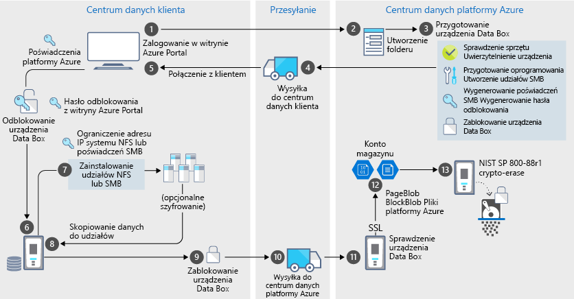

# Zabezpieczenia i ochrona danych w usłudze Azure Data Box

Data Box to bezpieczne rozwiązanie do ochrony danych, które gwarantuje, że wyłącznie upoważnione podmioty będą mogły uzyskać dostęp do danych, zmodyfikować je lub usunąć. W tym artykule opisano funkcje zabezpieczeń usługi Azure Data Box, które pomagają chronić poszczególne składniki rozwiązania Data Box i przechowywane w nich dane. 

[!INCLUDE [GDPR-related guidance](../../includes/gdpr-intro-sentence.md)]

## Przepływ danych za pośrednictwem składników

Rozwiązanie Microsoft Azure Data Box obejmuje cztery główne składniki, które wzajemnie ze sobą współdziałają:

- **Usługa Azure Data Box hostowana na platformie Azure** — usługa do zarządzania, umożliwiająca zamówienie urządzenia, skonfigurowanie go oraz śledzenie realizacji zamówienia.
- **Urządzenie Data Box** — urządzenie do transferu dostarczane w celu zaimportowania danych lokalnych na platformę Azure. 
- **Klienci/hosty, do których podłączane jest urządzenie** — klienci w infrastrukturze lokalnej, do których podłącza się urządzenie Data Box i które zawierają dane wymagające ochrony.
- **Magazyn w chmurze** — lokalizacja w chmurze platformy Azure, w której są przechowywane dane. Zazwyczaj jest to konto magazynu połączone z utworzonym zasobem usługi Azure Data Box.

Poniższy diagram przedstawia przepływ danych z infrastruktury lokalnej na platformę Azure za pośrednictwem rozwiązania Azure Data Box.

Dane przepływają przez to rozwiązanie, zdarzenia są rejestrowane i są generowane dzienniki. Aby uzyskać więcej informacji, przejdź do [śledzenie i rejestrowanie zdarzeń dla usługi Azure Data Box](data-box-logs.md).

## Funkcje zabezpieczeń

Data Box to bezpieczne rozwiązanie do ochrony danych, które gwarantuje, że wyłącznie upoważnione podmioty będą mogły uzyskać dostęp do danych, zmodyfikować je lub usunąć. Zabezpieczenia rozwiązania obejmują zabezpieczenia urządzenia i powiązanej usługi, zapewniające bezpieczeństwo przechowywanych danych. 

### Ochrona urządzenia Data Box

Urządzenie Data Box jest chronione przez następujące funkcje:

- Wytrzymała obudowa urządzenia odporna na wstrząsy, negatywny wpływ transportu i warunki otoczenia. 
- Plomby umożliwiające wykrycie manipulacji, do których mogło dojść w czasie transportu.
- Wykrywanie naruszeń sprzętu i oprogramowania, które uniemożliwiają dalsze operacje związane z urządzeniem.
- Uruchamia się tylko oprogramowanie urządzenia Data Box.
- Urządzenie uruchamia się w stanie zablokowanym.
- Dostęp do urządzenia jest możliwy po podaniu hasła odblokowania urządzenia.
- Poświadczenia dostępu umożliwiające kopiowanie danych do i z urządzenia. Wszystkie dostęp do **poświadczenia urządzenia** strony w usłudze Azure portal są rejestrowane w [dzienników aktywności](data-box-logs.md#query-activity-logs-during-setup).

### Ochrona danych na urządzeniu Data Box

Dane przesyłane do i z rozwiązania Data Box są chronione przez następujące funkcje:

- 256-bitowe szyfrowanie AES magazynowanych danych.
- W przypadku transmitowanych danych można używać zaszyfrowanych protokołów.
- Bezpieczne usunięcie danych z urządzenia po zakończeniu przekazywania danych na platformę Azure. Dane są usuwane zgodnie z normą NIST 800-88r1. Zdarzenie wymazywania danych jest rejestrowane w [kolejność historii](data-box-logs.md#download-order-history).

### Ochrona usługi Data Box

Usługa Data Box jest chroniona przez następujące funkcje.

- Aby uzyskać dostęp do usługi Data Box, organizacja musi mieć subskrypcję platformy Azure obejmującą usługę Data Box. Subskrypcja określa funkcje, do których masz dostęp w witrynie Azure Portal.
- Ponieważ usługa Data Box jest hostowana na platformie Azure, chronią ją funkcje zabezpieczeń platformy Azure. Aby uzyskać więcej informacji na temat funkcji zabezpieczeń platformy Microsoft Azure, zobacz [Centrum zaufania Microsoft Azure](https://www.microsoft.com/TrustCenter/Security/default.aspx).
- Dostęp do zamówienie urządzenia Data Box można sterować za pośrednictwem używanie ról kontroli dostępu opartej na rolach (RBAC). Aby uzyskać więcej informacji, zobacz [Konfigurowanie kontroli dostępu dla zamówienie urządzenia Data Box](data-box-logs.md#set-up-access-control-on-the-order)
- W usłudze Data Box jest przechowywane hasło odblokowania służące do odblokowania urządzenia w usłudze.
- W usłudze Data Box są przechowywane szczegóły zamówienia i jego stan. Te informacje są usuwane po usunięciu zamówienia.

## Zarządzanie danymi osobowymi

W usłudze Azure Data Box dane osobowe są zbierane i wyświetlane w następujących kluczowych przypadkach:

- **Ustawienia powiadomień** — podczas tworzenia zamówienia w ustawieniach powiadomień są wprowadzane adresy e-mail użytkowników. Te informacje są widoczne dla administratora. Te informacje są usuwane z usługi, gdy zadanie zmieni stan na końcowy lub gdy zamówienie zostanie usunięte.

- **Szczegóły zamówienia** — po utworzeniu zamówienia na platformie Azure zostaną zapisane dane kontaktowe użytkowników, adres wysyłki, adres e-mail. Zapisane informacje obejmują:

  - Nazwa kontaktu
  - Numer telefonu
  - Poczta e-mail
  - Adres
  - Miasto
  - Kod pocztowy
  - Stan
  - Kraj/Województwo/Region
  - Numer konta operatora
  - Numer śledzenia dostawy

    Szczegóły zamówienia są usuwane z usługi Data Box po zakończeniu zadania lub usunięciu zamówienia.

- **Adres wysyłkowy** — po złożeniu zamówienia usługa Data Box przekazuje adres wysyłkowy operatorom zewnętrznym, na przykład firmie UPS lub DHL. 

Aby uzyskać więcej informacji, zapoznaj się z Zasadami ochrony prywatności firmy Microsoft w [Centrum zaufania](https://www.microsoft.com/trustcenter).

## Dokumentacja wytycznych dotyczących zabezpieczeń

W usłudze Data Box są zaimplementowane następujące wytyczne dotyczące zabezpieczeń: 

|Wytyczna   |Opis   |
|---------|---------|
|[IEC 60529 IP52](https://www.iec.ch/)    | Dotyczy ochrony przed wodą i pyłem         |
|[ISTA 2A](https://ista.org/docs/2Aoverview.pdf)     | Dotyczy odporności na niekorzystne warunki podczas transportu          |
|[NIST SP 800-147](https://nvlpubs.nist.gov/nistpubs/Legacy/SP/nistspecialpublication800-147.pdf)      | Dotyczy bezpiecznej aktualizacji oprogramowania układowego         |
|[FIPS 140-2 Level 2](https://csrc.nist.gov/csrc/media/publications/fips/140/2/final/documents/fips1402.pdf)      | Dotyczy ochrony danych         |
|[NIST SP 800-88r1](https://nvlpubs.nist.gov/nistpubs/SpecialPublications/NIST.SP.800-88r1.pdf)      | Dotyczy oczyszczania danych         |

## Kolejne kroki

- Zapoznaj się z [wymaganiami rozwiązania Data Box](data-box-system-requirements.md).
- Poznaj [ograniczenia usługi Data Box](data-box-limits.md).
- Szybko wdróż usługę [Azure Data Box](data-box-quickstart-portal.md) w witrynie Azure Portal.
