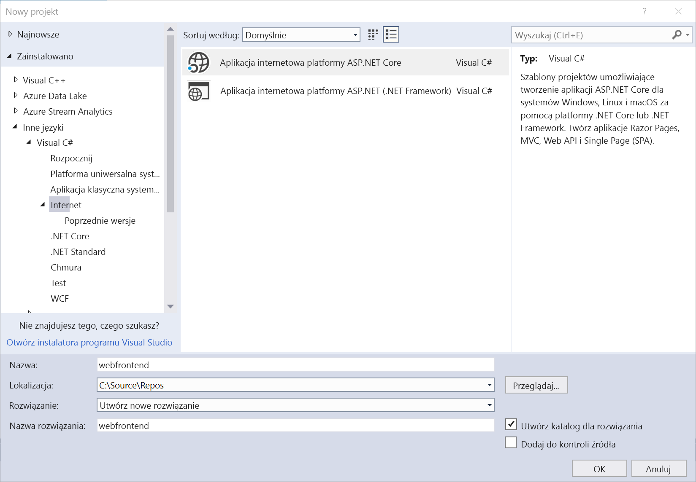
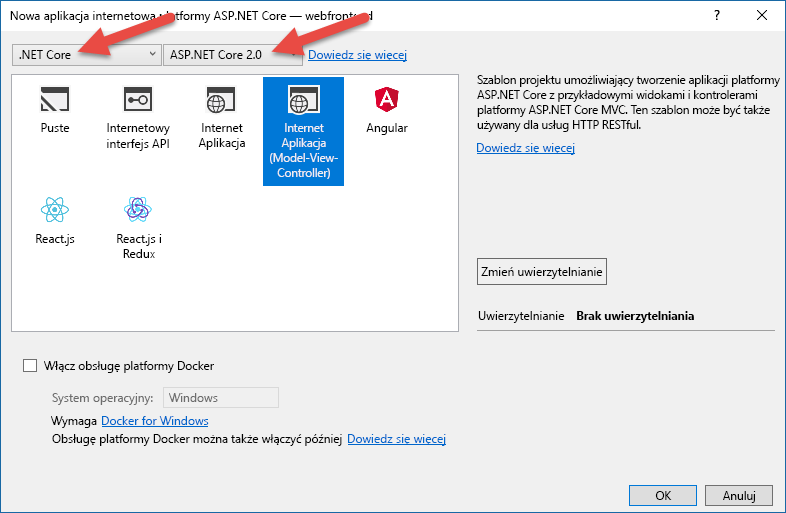
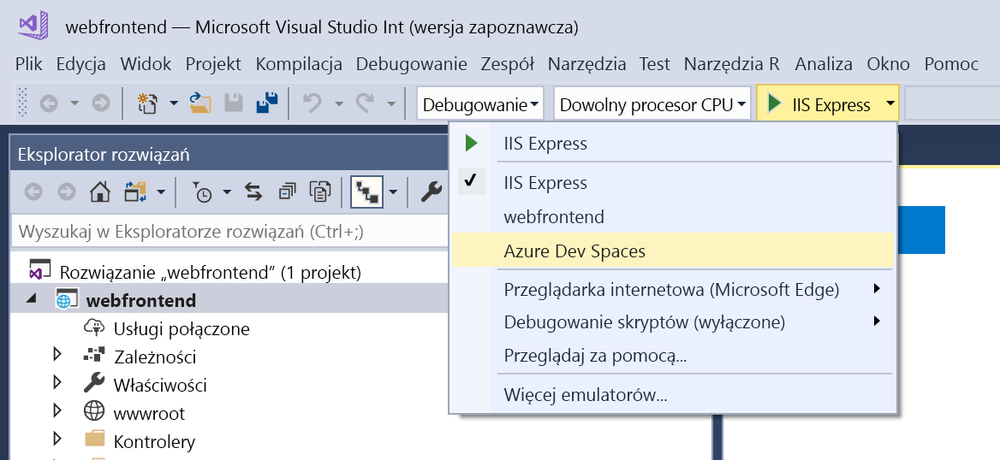
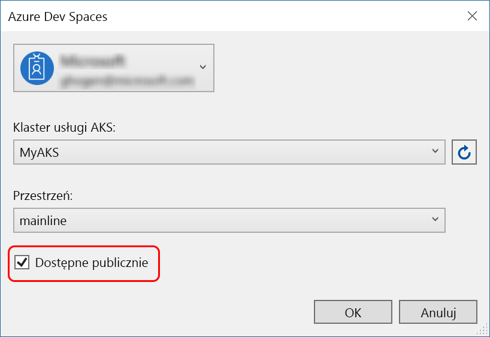
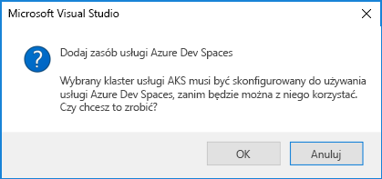
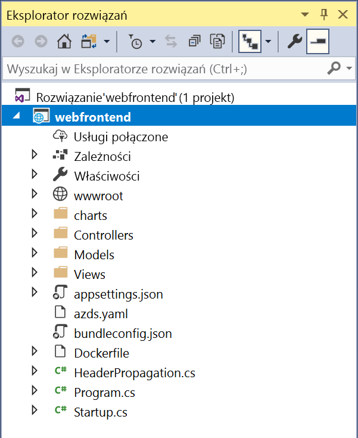

# Rozpoczęcie pracy w usłudze Azure Dev Spaces za pomocą platformy .NET Core i programu Visual Studio

Ten przewodnik zawiera informacje na temat wykonywania następujących czynności:

- Konfigurowanie usługi Azure Dev Spaces za pomocą zarządzanego klastra Kubernetes na platformie Azure.
- Iteracyjne tworzenie kodu w kontenerach przy użyciu programu Visual Studio.
- Niezależne tworzenie dwóch oddzielnych usług i wywoływanie innej usługi przy użyciu funkcji odnajdywania usług DNS w środowisku Kubernetes.
- Efektywne tworzenie i testowanie kodu w środowisku zespołu.

> [!Note]
> **Pobierz zapoznaniu się z** w dowolnym momencie wyświetlić [Rozwiązywanie problemów](troubleshooting.md) sekcji.

## Tworzenie klastra Kubernetes obsługującego usługę Azure Dev Spaces

1. Zaloguj się do witryny Azure Portal pod adresem https://portal.azure.com.
1. Wybierz pozycję **Utwórz zasób** > wyszukaj pozycję **Kubernetes** > wybierz pozycję **Kubernetes Service** > **Utwórz**.

   Wykonanie poniższych kroków w każdej pozycji *klastra Kubernetes tworzenie* formularza i sprawdź wybranej [region obsługuje usługi Azure Dev miejsca do magazynowania](https://docs.microsoft.com/azure/dev-spaces/#a-rapid,-iterative-kubernetes-development-experience-for-teams).

   - **Szczegóły projektu**: Wybierz subskrypcję platformy Azure i grupę nowych lub istniejących zasobów platformy Azure.
   - **SZCZEGÓŁY KLASTRA**: wprowadź nazwę, region, wersję i prefiks nazwy DNS dla klastra AKS.
   - **SKALA**: wybierz rozmiar maszyny wirtualnej dla węzłów agenta AKS i liczbę węzłów. Jeśli rozpoczynasz pracę z usługą Azure Dev Spaces, jeden węzeł jest wystarczający, aby zapoznać się z wszystkimi funkcjami. Liczbę węzłów można łatwo dostosować w dowolnym momencie po wdrożeniu klastra. Pamiętaj, że rozmiaru maszyny wirtualnej nie można zmienić po utworzeniu klastra usługi AKS. Jednak w razie potrzeby skalowania w górę po wdrożeniu klastra usługi AKS możesz łatwo utworzyć nowy klaster usługi AKS z większymi maszynami wirtualnymi i przeprowadzić ponowne wdrożenie na tym większym klastrze za pomocą usługi Dev Spaces.

   

   Wybierz opcję **Dalej: uwierzytelnianie** po zakończeniu.

1. Wybierz żądane ustawienie kontroli dostępu na podstawie ról (RBAC, role-based access control). Usługa Azure Dev Spaces obsługuje klastry z włączoną lub wyłączoną kontrolą RBAC.

    

1. Wybierz pozycje **Przegląd + utwórz**, a następnie po zakończeniu wybierz pozycję **Utwórz**.

## Pobieranie narzędzi Visual Studio
1. Zainstaluj najnowszą wersję programu [Visual Studio 2017](https://www.visualstudio.com/vs/).
1. Przy otwartym instalatorze programu Visual Studio upewnij się, że wybrano następujące obciążenie:
    * Tworzenie aplikacji na platformie ASP.NET i aplikacji internetowych
1. Instalacja narzędzi [Visual Studio Tools for Kubernetes](https://aka.ms/get-azds-visualstudio)

## Tworzenie aplikacji internetowej uruchomionej w kontenerze

W tej sekcji możesz utworzyć aplikację sieci web platformy ASP.NET Core i Uzyskaj będzie działać w kontenerze w usłudze Kubernetes.

### Tworzenie aplikacji internetowej platformy ASP.NET

W programie Visual Studio 2017 utwórz nowy projekt. Obecnie projekt musi być **aplikacją internetową ASP.NET Core**. Nazwij projekt „**webfrontend**”.

Wybierz szablon **Aplikacja internetowa (Model-View-Controller)** i upewnij się, że na dwóch listach rozwijanych w górnej części okna dialogowego zostały wybrane pozycje **.NET Core** i **ASP.NET Core 2.0**. Kliknij przycisk **OK**, aby utworzyć projekt.

### Włączanie usługi Dev Spaces dla klastra usługi AKS

Po otwarciu utworzonego przed chwilą projektu wybierz usługę **Azure Dev Spaces** z listy rozwijanej ustawień uruchamiania, jak pokazano poniżej.

W wyświetlonym następnie oknie dialogowym upewnij się, że logujesz się przy użyciu odpowiedniego konta, a następnie wybierz istniejący klaster Kubernetes.

Na liście rozwijanej **Miejsce** zostaw na razie ustawienie domyślne `default`. Później dowiesz się więcej na temat tej opcji. Zaznacz pole wyboru **Publicznie dostępne**, aby aplikacja internetowa była dostępna za pośrednictwem publicznego punktu końcowego. To ustawienie nie jest wymagane, ale przyda się do zademonstrowania pewnych pojęć w dalszej części tego przewodnika. Nie przejmuj się — w każdym przypadku będzie można debugować witrynę internetową przy użyciu programu Visual Studio.

Kliknij przycisk **OK**, aby wybrać lub utworzyć klaster.

Jeśli wybierzesz klaster, który nie został aktywowany do pracy z usługą Azure Dev Spaces, zobaczysz komunikat z pytaniem, czy chcesz go skonfigurować.

Wybierz **OK**.

> [!IMPORTANT]
> Proces konfiguracji usługi Azure Dev Spaces spowoduje usunięcie przestrzeni nazw `azds` w klastrze, jeśli taka istnieje.

 W celu wykonania tej czynności zostanie uruchomione zadanie w tle. Ukończenie procedury zajmie kilka minut. Aby zobaczyć, czy zadanie jest w toku, umieść kursor myszy na ikonie **Zadania w tle** w lewym dolnym rogu paska stanu, jak pokazano na poniższej ilustracji.

> [!Note]
> Dopóki obszar deweloperski nie zostanie pomyślnie utworzony, nie można debugować aplikacji.

### Przyglądanie się plikom dodanym do projektu
Czekając na utworzenie obszaru deweloperskiego, przyjrzyj się plikom, które zostały dodane do projektu po wybraniu opcji korzystania z obszaru deweloperskiego.

Najpierw zobaczysz, że został dodany folder o nazwie `charts`, a w tym folderze został utworzony szkielet [planu narzędzia Helm](https://docs.helm.sh) dla Twojej aplikacji. Te pliki służą do wdrażania aplikacji w obszarze deweloperskim.

Zobaczysz, że został dodany plik o nazwie `Dockerfile`. Ten plik zawiera informacje potrzebne do spakowania aplikacji w standardowym formacie Docker.

Ponadto zobaczysz plik o nazwie `azds.yaml`, zawierający konfigurację w czasie programowania, która jest wymagana przez obszar deweloperski.

## Debugowanie kontenera w środowisku Kubernetes
Po pomyślnym utworzeniu obszaru deweloperskiego możesz debugować aplikację. Ustaw punkt przerwania w kodzie, na przykład w wierszu 20 pliku `HomeController.cs`, w którym jest ustawiona zmienna `Message`. Naciśnij klawisz **F5**, aby rozpocząć debugowanie. 

Program Visual Studio będzie komunikować się z obszarem deweloperskim w celu skompilowania i wdrożenia aplikacji, a następnie otworzy przeglądarkę z uruchomioną aplikacją internetową. Może się wydawać, że kontener działa lokalnie, ale faktycznie jest on uruchamiany w obszarze deweloperskim na platformie Azure. Przyczyną utworzenia adresu hosta lokalnego jest utworzenie przez usługę Azure Dev Spaces tymczasowego tunelu SSH w kontenerze uruchomionym w usłudze AKS.

Kliknij link **Informacje** w górnej części strony, aby wyzwolić punkt przerwania. Masz pełny dostęp do informacji debugowania, takich jak stos wywołań, zmienne lokalne, informacje o wyjątkach itd., zupełnie jakby kod był wykonywany lokalnie.

## Iteracyjne programowanie kodu

Usługa Azure Dev Spaces umożliwia nie tylko uruchamianie kodu w środowisku Kubernetes — pozwala też szybko i wielokrotnie wyświetlać efekt zmian wprowadzonych w kodzie w środowisku Kubernetes w chmurze.

### Aktualizowanie pliku zawartości
1. Znajdź plik `./Views/Home/Index.cshtml` i zmień kod HTML. Na przykład zmień wiersz 70 z `<h2>Application uses</h2>` na `<h2>Hello k8s in Azure!</h2>`
1. Zapisz plik.
1. Otwórz przeglądarkę i odśwież stronę. Na stronie powinien być widoczny zaktualizowany kod HTML.

Co się stało? Modyfikacje plików zawartości, takich jak HTML i CSS, nie wymagają ponownej kompilacji w aplikacji internetowej .NET Core. Z tego względu aktywna sesja F5 automatycznie synchronizuje wszystkie zmodyfikowane pliki zawartości z uruchomionym kontenerem w usłudze AKS, co umożliwia błyskawiczny podgląd zmian zawartości.

### Aktualizowanie pliku kodu
Aktualizacja plików kodu wymaga nieco więcej pracy, ponieważ trzeba ponownie skompilować aplikację .NET Core i utworzyć zaktualizowane pliki binarne aplikacji.

1. Zatrzymaj debuger w programie Visual Studio.
1. Otwórz plik kodu o nazwie `Controllers/HomeController.cs` i zmień komunikat wyświetlany na stronie Informacje: `ViewData["Message"] = "Your application description page.";`
1. Zapisz plik.
1. Naciśnij klawisz **F5**, aby ponownie uruchomić debugowanie. 

Zamiast ponownego kompilowania i wdrażania nowego obrazu kontenera przy każdej zmianie kodu, co często zajmuje dużo czasu, usługa Azure Dev Spaces przyrostowo ponownie kompiluje kod w istniejącym kontenerze, co przyspiesza działanie pętli edytowania/debugowania.

Odśwież aplikację internetową w przeglądarce, a następnie otwórz stronę Informacje. Twój komunikat powinien zostać wyświetlony w interfejsie użytkownika.

## Kolejne kroki

> [!div class="nextstepaction"]
> [Dowiedz się więcej o opracowywaniu dla wielu usług](multi-service-netcore-visualstudio.md)
