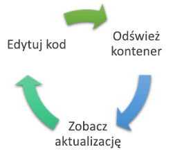

# <a name="create-a-kubernetes-dev-space-visual-studio-code-and-nodejs-with-azure-dev-spaces"></a>Create a Kubernetes dev space: Visual Studio Code and Node.js with Azure Dev Spaces

Niniejszy przewodnik zawiera informacje na temat wykonywania następujących czynności:

- Tworzenie środowiska Kubernetes na platformie Azure zoptymalizowanego pod kątem programowania — _przestrzeń deweloperów_.
- Iteracyjne tworzenie kodu w kontenerach przy użyciu programu VS Code i wiersza polecenia.
- Efektywne tworzenie i testowanie kodu w środowisku zespołu.

> [!Note]
> **If you get stuck** at any time, see the [Troubleshooting](troubleshooting.md) section.

## <a name="install-the-azure-cli"></a>Zainstaluj interfejs wiersza polecenia platformy Azure
Usługa Azure Dev Spaces wymaga minimalnej konfiguracji komputera lokalnego. Większość ustawień obszaru deweloperskiego jest przechowywana w chmurze i udostępniana innym użytkownikom. Zacznij od pobrania i uruchomienia [interfejsu wiersza polecenia platformy Azure](/cli/azure/install-azure-cli?view=azure-cli-latest).

### <a name="sign-in-to-azure-cli"></a>Logowanie do interfejsu wiersza polecenia platformy Azure
Zaloguj się do platformy Azure. W oknie terminala wpisz następujące polecenie:

```cmd
az login
```

> [!Note]
> Jeśli nie masz subskrypcji platformy Azure, możesz utworzyć [bezpłatne konto](https://azure.microsoft.com/free).

#### <a name="if-you-have-multiple-azure-subscriptions"></a>Jeśli masz wiele subskrypcji platformy Azure...
Możesz wyświetlić swoje subskrypcje, uruchamiając polecenie: 

```cmd
az account list
```
Znajdź subskrypcję, która w danych wyjściowych JSON ma wartość `isDefault: true`.
Jeśli nie jest to subskrypcja, której chcesz użyć, możesz zmienić subskrypcję domyślną:

```cmd
az account set --subscription <subscription ID>
```

## <a name="create-a-kubernetes-cluster-enabled-for-azure-dev-spaces"></a>Tworzenie klastra Kubernetes obsługującego usługę Azure Dev Spaces

At the command prompt, create the resource group in a [region that supports Azure Dev Spaces][supported-regions].

```cmd
az group create --name MyResourceGroup --location <region>
```

Utwórz klaster Kubernetes za pomocą następującego polecenia:

```cmd
az aks create -g MyResourceGroup -n MyAKS --location <region> --disable-rbac --generate-ssh-keys
```

Utworzenie klastra trwa kilka minut.

### <a name="configure-your-aks-cluster-to-use-azure-dev-spaces"></a>Konfigurowanie klastra usługi AKS do korzystania z usługi Azure Dev Spaces

Wpisz następujące polecenie interfejsu wiersza polecenia platformy Azure, podając grupę zasobów, która zawiera klaster usługi AKS, oraz nazwę klastra usługi AKS. Polecenie konfiguruje na klastrze obsługę usługi Azure Dev Spaces.

   ```cmd
   az aks use-dev-spaces -g MyResourceGroup -n MyAKS
   ```

> [!IMPORTANT]
> Proces konfiguracji usługi Azure Dev Spaces spowoduje usunięcie przestrzeni nazw `azds` w klastrze, jeśli taka istnieje.

## <a name="get-kubernetes-debugging-for-vs-code"></a>Uzyskiwanie debugowania rozwiązania Kubernetes dla programu VS Code
Rozbudowane funkcje, takie jak debugowanie rozwiązania Kubernetes, są dostępne dla deweloperów platformy .NET Core i środowiska Node.js korzystających z programu VS Code.

1. Jeśli nie masz programu [VS Code](https://code.visualstudio.com/Download), zainstaluj go.
1. Pobierz i zainstaluj [rozszerzenie usługi Azure Dev Spaces dla programu VS](https://marketplace.visualstudio.com/items?itemName=azuredevspaces.azds). Kliknij pozycję Zainstaluj najpierw na stronie rozszerzenia w witrynie Marketplace, a następnie w programie VS Code. 

## <a name="create-a-nodejs-container-in-kubernetes"></a>Tworzenie kontenera Node.js w środowisku Kubernetes

W tej sekcji utworzysz aplikację internetową Node.js i uruchomisz ją w kontenerze w środowisku Kubernetes.

### <a name="create-a-nodejs-web-app"></a>Tworzenie aplikacji internetowej Node.js
Aby pobrać kod, w serwisie GitHub otwórz stronę https://github.com/Azure/dev-spaces i wybierz pozycję **Clone or Download** (Sklonuj lub pobierz). Repozytorium GitHub zostanie pobrane do środowiska lokalnego. Kod używany w tym przewodniku znajduje się w lokalizacji `samples/nodejs/getting-started/webfrontend`.

## <a name="prepare-code-for-docker-and-kubernetes-development"></a>Przygotowanie kodu do opracowywania dla platform Docker i Kubernetes
W tej chwili masz podstawową aplikację internetową, która działa lokalnie. Teraz konteneryzujesz ją, tworząc zasoby, które definiują kontener aplikacji i sposób jego wdrażania na platformie Kubernetes. To zadanie łatwo wykonać za pomocą usługi Azure Dev Spaces: 

1. Uruchom program VS Code i otwórz folder `webfrontend`. (Możesz zignorować wszystkie domyślne monity o dodanie zasobów debugowania lub przywrócenie projektu).
1. Otwórz zintegrowany terminal w programie VS Code (przy użyciu menu **Widok > Zintegrowany terminal**).
1. Uruchom następujące polecenie (upewnij się, że bieżący folder to **webfrontend**):

    ```cmd
    azds prep --public
    ```

Polecenie `azds prep` interfejsu wiersza polecenia platformy Azure generuje zasoby platformy Docker i Kubernetes z ustawieniami domyślnymi:
* Plik `./Dockerfile` opisuje obraz kontenera aplikacji oraz sposób kompilowania kodu źródłowego i uruchamiania go w kontenerze.
* [Pakiet Helm](https://docs.helm.sh) w folderze `./charts/webfrontend` opisuje, jak wdrożyć kontener na platformie Kubernetes.

Na razie nie trzeba rozumieć pełnej zawartości tych plików. Warto jednak wspomnieć, że **te same zasoby konfiguracji jako kodu platformy Kubernetes i Docker mogą być używane od etapu opracowywania po etap produkcyjny, co zapewnia większą spójność w różnych środowiskach.**
 
Polecenie `prep` generuje również plik o nazwie `./azds.yaml`. Jest to plik konfiguracji usługi Azure Dev Spaces. Uzupełnia on artefakty platformy Docker i Kubernetes o dodatkową konfigurację zapewniającą środowisko programowania przyrostowego na platformie Azure.

## <a name="build-and-run-code-in-kubernetes"></a>Kompilowanie i uruchamianie kodu na platformie Kubernetes
Teraz uruchomimy nasz kod! W oknie terminalu uruchom to polecenie z **głównego folderu kodu**, WebFrontEnd:

```cmd
azds up
```

Śledź dane wyjściowe polecenia — wraz z postępem zauważysz kilka rzeczy:
- Kod źródłowy jest synchronizowany z przestrzenią deweloperów na platformie Azure.
- Obraz kontenera jest tworzony na platformie Azure, zgodnie z tym, co określają elementy zawartości aparatu Docker w folderze kodu.
- Tworzone są obiekty Kubernetes, które wykorzystują obraz kontenera, zgodnie z tym, co określa plan narzędzia Helm w folderze kodu.
- Wyświetlane są informacje o punktach końcowych kontenera. W tym przypadku spodziewamy się publicznego adresu URL HTTP.
- Zakładając, że powyższe etapy zakończą się powodzeniem, podczas uruchamiania kontenera powinny być widoczne dane wyjściowe `stdout` (i `stderr`).

> [!Note]
> Te kroki będą trwać dłużej podczas pierwszego uruchomienia polecenia `up`, ale kolejne uruchomienia powinny być szybsze.

### <a name="test-the-web-app"></a>Testowanie aplikacji internetowej
Przeskanuj dane wyjściowe konsoli w poszukiwaniu informacji o publicznym adresie URL, który został utworzony za pomocą polecenia `up`. Będzie on mieć postać: 

```
(pending registration) Service 'webfrontend' port 'http' will be available at <url>
Service 'webfrontend' port 'http' is available at http://webfrontend.1234567890abcdef1234.eus.azds.io/
Service 'webfrontend' port 80 (TCP) is available at 'http://localhost:<port>'
```

Identify the public URL for the service in the output from the `up` command. It ends in `.azds.io`. In the above example, the public URL is `http://webfrontend.1234567890abcdef1234.eus.azds.io/`.

To see your web app, open the public URL in a browser. Also, notice `stdout` and `stderr` output is streamed to the *azds trace* terminal window as you interact with your web app. You'll also see tracking information for HTTP requests as they go through the system. This makes it easier for you to track complex multi-service calls during development. The instrumentation added by Dev Spaces provides this request tracking.

> [!Note]
> In addition to the public URL, you can use the alternative `http://localhost:<portnumber>` URL that is displayed in the console output. If you use the localhost URL, it may seem like the container is running locally, but actually it is running in Azure. Azure Dev Spaces uses Kubernetes *port-forward* functionality to map the localhost port to the container running in AKS. This facilitates interacting with the service from your local machine.

### <a name="update-a-content-file"></a>Aktualizowanie pliku zawartości
Usługa Azure Dev Spaces umożliwia nie tylko uruchamianie kodu w środowisku Kubernetes — pozwala też szybko i wielokrotnie wyświetlać efekt zmian wprowadzonych w kodzie w środowisku Kubernetes w chmurze.

1. Znajdź plik `./public/index.html` i zmień kod HTML. For example, change the page's background color to a shade of blue [on line 15](https://github.com/Azure/dev-spaces/blob/master/samples/nodejs/getting-started/webfrontend/public/index.html#L15):

    ```html
    <body style="background-color: #95B9C7; margin-left:10px; margin-right:10px;">
    ```

1. Zapisz plik. Po chwili w oknie terminalu pojawi się komunikat informujący o tym, że plik w uruchomionym kontenerze został zaktualizowany.
1. Przejdź do przeglądarki i odśwież stronę. Powinna być widoczna zmiana koloru.

Co się stało? Modyfikacje plików zawartości, takich jak HTML i CSS, nie wymagają ponownego uruchomienia procesu Node.js. Z tego względu aktywne polecenie `azds up` automatycznie synchronizuje wszystkie zmodyfikowane pliki zawartości bezpośrednio z uruchomionym kontenerem na platformie Azure, co umożliwia szybki podgląd zmian zawartości.

### <a name="test-from-a-mobile-device"></a>Testowanie na urządzeniu przenośnym
Otwórz aplikację internetową na urządzeniu przenośnym, używając publicznego adresu URL dla aplikacji webfrontend. Możesz skopiować i wysłać adres URL z komputera stacjonarnego na urządzenie, aby nie wprowadzać długiego adresu. Gdy aplikacja internetowa zostanie załadowana na urządzeniu przenośnym, zauważysz, że interfejs użytkownika nie jest wyświetlany poprawnie na ekranie małego urządzenia.

Aby rozwiązać ten problem, dodaj metatag `viewport`:
1. Otwórz plik `./public/index.html`
1. Add a `viewport` meta tag in the existing `head` element that starts [on line 6](https://github.com/Azure/dev-spaces/blob/master/samples/nodejs/getting-started/webfrontend/public/index.html#L6):

    ```html
    <head>
        <!-- Add this line -->
        <meta name="viewport" content="width=device-width, initial-scale=1">
    </head>
    ```

1. Zapisz plik.
1. Odśwież przeglądarkę na urządzeniu. Teraz aplikacja internetowa powinna być wyświetlana poprawnie. 

Ten przykład pokazuje, że niektóre problemy występują dopiero podczas testów na urządzeniach, dla których jest przeznaczona aplikacja. Usługa Azure Dev Spaces pozwala szybko modyfikować kod i weryfikować zmiany na urządzeniach docelowych.

### <a name="update-a-code-file"></a>Aktualizowanie pliku kodu
Aktualizacja plików kodu po stronie serwera wymaga nieco więcej pracy, ponieważ aplikacja Node.js musi zostać uruchomiona ponownie.

1. W oknie terminalu naciśnij klawisze `Ctrl+C`, aby zatrzymać polecenie `azds up`.
1. Otwórz plik kodu o nazwie `server.js` i zmodyfikuj komunikat powitalny usługi: 

    ```javascript
    res.send('Hello from webfrontend running in Azure!');
    ```

3. Zapisz plik.
1. Uruchom polecenie `azds up` w oknie terminalu. 

Spowoduje to ponowne skompilowanie obrazu kontenera i ponowne wdrożenie planu narzędzia Helm. Załaduj ponownie stronę przeglądarki, aby zobaczyć efekt zmian w kodzie.

Oprócz tego dostępna jest jeszcze *szybsza metoda* opracowywania kodu. Omówimy ją w następnej sekcji. 

## <a name="debug-a-container-in-kubernetes"></a>Debugowanie kontenera w środowisku Kubernetes

W tej sekcji użyjesz programu VS Code do bezpośredniego debugowania naszego kontenera uruchomionego na platformie Azure. Ponadto dowiesz się, jak uzyskać szybszą pętlę edycji, uruchamiania i testowania.



> [!Note]
> **Jeśli utkniesz** w dowolnym momencie, zobacz sekcję [Rozwiązywanie problemów](troubleshooting.md) lub prześlij komentarz na tej stronie.

### <a name="initialize-debug-assets-with-the-vs-code-extension"></a>Inicjowanie zasobów debugowania za pomocą rozszerzenia programu VS Code
Najpierw musisz skonfigurować projekt kodu, aby program VS Code komunikował się z naszą przestrzenią deweloperów na platformie Azure. Rozszerzenie programu VS Code dla usługi Azure Dev Spaces udostępnia polecenie pomocnika w celu ustawienia konfiguracji debugowania. 

Otwórz okno **Paleta poleceń** (za pomocą menu **Widok | Paleta poleceń**) i przy użyciu autouzupełniania wpisz i wybierz to polecenie: `Azure Dev Spaces: Prepare configuration files for Azure Dev Spaces`. 

Spowoduje to dodanie konfiguracji debugowania dla usługi Azure Dev Spaces w obszarze folderu `.vscode`. Nie należy mylić tego polecenia z poleceniem `azds prep`, które umożliwia skonfigurowanie projektu na potrzeby wdrożenia.


### <a name="select-the-azds-debug-configuration"></a>Wybieranie konfiguracji debugowania w rozwiązaniu AZDS
1. Aby otworzyć widok debugowania, kliknij ikonę debugowania na **pasku działań** w bocznej części programu VS Code.
1. Wybierz pozycję **Launch Program (AZDS)** (Uruchom program [AZDS]) jako aktywną konfigurację debugowania.


> [!Note]
> Jeśli na palecie poleceń nie widać żadnych poleceń usługi Azure Dev Spaces, upewnij się, że masz [zainstalowane rozszerzenie VS Code dla usługi Azure Dev Spaces](get-started-nodejs.md#get-kubernetes-debugging-for-vs-code).

### <a name="debug-the-container-in-kubernetes"></a>Debugowanie kontenera w środowisku Kubernetes
Po naciśnięciu klawisza **F5** możesz debugować kod w środowisku Kubernetes.

Podobnie jak w przypadku polecenia `up` po rozpoczęciu debugowania kod jest synchronizowany ze środowiskiem deweloperskim, a kontener jest kompilowany i wdrażany w środowisku Kubernetes. Tym razem debuger jest dołączany do zdalnego kontenera.

> [!Tip]
> The VS Code status bar will turn orange, indicating that the debugger is attached. It will also display a clickable URL, which you can use to quickly open your site.


Set a breakpoint in a server-side code file, for example within the `app.get('/api'...` on [line 13 of `server.js`](https://github.com/Azure/dev-spaces/blob/master/samples/nodejs/getting-started/webfrontend/server.js#L13). 

    ```javascript
    app.get('/api', function (req, res) {
        res.send('Hello from webfrontend');
    });
    ```

Refresh the browser page, or press the *Say It Again* button, and you should hit the breakpoint and be able to step through code.

Masz pełny dostęp do informacji debugowania, takich jak stos wywołań, zmienne lokalne, informacje o wyjątkach itd., zupełnie jakby kod był wykonywany lokalnie.

### <a name="edit-code-and-refresh-the-debug-session"></a>Edytowanie kodu i odświeżanie sesji debugowania
With the debugger active, make a code edit; for example, modify the hello message on [line 13 of `server.js`](https://github.com/Azure/dev-spaces/blob/master/samples/nodejs/getting-started/webfrontend/server.js#L13) again:

```javascript
app.get('/api', function (req, res) {
    res.send('**** Hello from webfrontend running in Azure! ****');
});
```

Save the file, and in the **Debug actions pane**, click the **Restart** button. 


Zamiast ponownego kompilowania i wdrażania nowego obrazu kontenera przy każdej zmianie kodu, co często zajmuje dużo czasu, usługa Azure Dev Spaces ponownie uruchamia proces Node.js między sesjami debugowania, co przyspiesza działanie pętli edytowania/debugowania.

Odśwież aplikację internetową w przeglądarce lub naciśnij przycisk *Say It Again* (Ponów). Twój komunikat powinien zostać wyświetlony w interfejsie użytkownika.

### <a name="use-nodemon-to-develop-even-faster"></a>Jeszcze szybsze programowanie przy użyciu narzędzia NodeMon
*Nodemon* jest popularnym narzędziem, używanym przez deweloperów do szybkiego tworzenia aplikacji w środowisku Node.js. Zamiast ręcznie ponownie uruchamiać proces Node po każdej zmianie kodu po stronie serwera deweloperzy często tak konfigurują projekt Node, aby narzędzie *nodemon* monitorowało zmiany plików i automatycznie ponownie uruchamiało proces serwera. W tym stylu pracy deweloper tylko odświeża przeglądarkę po wprowadzeniu zmiany w kodzie.

Rozwiązanie Azure Dev Spaces pozwala korzystać z wielu przepływów pracy tworzenia oprogramowania używanych w środowisku lokalnym. Aby to zilustrować, przykładowy projekt `webfrontend` skonfigurowano pod kątem używania narzędzia *nodemon* (jest ono skonfigurowane jako zależność programistyczna w pliku `package.json`).

Spróbuj wykonać następujące kroki:
1. Zatrzymaj działanie debugera VS Code.
1. Kliknij ikonę debugowania na **pasku działań** w bocznej części programu VS Code. 
1. Wybierz pozycję **Attach (AZDS)** (Dołącz [AZDS]) jako aktywną konfigurację debugowania.
1. Naciśnij klawisz F5.

W tej konfiguracji kontener uruchamia narzędzie *nodemon*. Po zmianie kodu po stronie serwera narzędzie *nodemon* automatycznie ponownie uruchamia proces Node, tak samo jak podczas programowania w środowisku lokalnym. 
1. Ponownie zmień komunikat powitalny w pliku `server.js` i zapisz ten plik.
1. Odśwież przeglądarkę lub kliknij przycisk *Say It Again* (Ponów), aby zobaczyć efekt wprowadzonych zmian.

**Umiesz już korzystać z metody szybkiego wprowadzania zmian w kodzie i debugowania bezpośrednio w środowisku Kubernetes.** Następnie zobaczysz, jak utworzyć i wywołać drugi kontener.

## <a name="next-steps"></a>Następne kroki

> [!div class="nextstepaction"]
> [Dowiedz się więcej o opracowywaniu dla wielu usług](multi-service-nodejs.md)


[supported-regions]: about.md#supported-regions-and-configurations