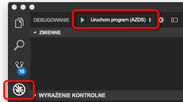

# <a name="how-azure-dev-spaces-works-and-is-configured"></a>Jak Azure Dev miejsca do magazynowania działa i jest skonfigurowany

Tworzenie aplikacji platformy Kubernetes, może być trudne. Potrzebne pliki konfiguracji platformy Docker i Kubernetes. Należy ustalić sposób przetestować aplikację lokalnie i korzystać z innych usług zależnych. Może być konieczne do obsługi tworzenia i testowania na jednocześnie wiele usług, a zespół deweloperów.

Usługa Azure Dev spacje ułatwia programowanie, wdrażanie i debugowanie aplikacji platformy Kubernetes bezpośrednio w usłudze Azure Kubernetes Service (AKS). Usługa Azure Dev spacje umożliwia także zespół, aby udostępniać miejsce deweloperów. Udostępnianie miejsca dev w zespole umożliwia poszczególnych członków zespołu do programowania w izolacji bez konieczności replikowanie lub makiety zależności lub innych aplikacji w klastrze.

Usługa Azure Dev do magazynowania tworzy i używa pliku konfiguracji umożliwiająca wdrażanie, uruchamianie i debugowanie aplikacji platformy Kubernetes w usłudze AKS. Ten plik konfiguracji znajduje się kod aplikacji i mogą być dodawane do systemu kontroli wersji.

W tym artykule opisano procesy tego moc usługi Azure Dev miejsca do magazynowania i jak te procesy są konfigurowane w pliku konfiguracji usługi Azure Dev miejsca do magazynowania. Aby uzyskać szybko Azure Dev miejsca do magazynowania i zobaczyć, jak to w praktyce, wykonaj jedną z przewodników Szybki Start:

* [Java za pomocą interfejsu wiersza polecenia i programu Visual Studio Code](quickstart-java.md)
* [.NET core za pomocą interfejsu wiersza polecenia i programu Visual Studio Code](quickstart-netcore.md)
* [.NET core z programem Visual Studio](quickstart-netcore-visualstudio.md)
* [Node.js przy użyciu interfejsu wiersza polecenia i programu Visual Studio Code](quickstart-nodejs.md)

## <a name="how-azure-dev-spaces-works"></a>Sposób działania usługi Azure Dev miejsca do magazynowania

Azure Dev spacje ma dwa różne składniki, wchodzących w interakcję z: kontroler i narzędzi po stronie klienta.


Kontroler wykonuje następujące czynności:

* Zarządza dev miejsca tworzenia i wyboru.
* Instaluje narzędzia Helm aplikacji i tworzy obiekty usługi Kubernetes.
* Tworzy obraz kontenera aplikacji.
* Wdraża aplikację w usłudze AKS.
* Wykonuje kompilacje przyrostowe i ponownym uruchomieniu po zmianie kodu źródłowego.
* Zarządza dzienniki i ślady protokołu HTTP.
* Przekazuje stdout i stderr narzędzi po stronie klienta.
* Umożliwia członkom zespołu tworzenie pochodzące z obszaru dev nadrzędny podrzędny dev miejsca do magazynowania.
* Służy do konfigurowania routingu dla aplikacji w ramach spację, a także przez nadrzędne i podrzędne miejsca do magazynowania.

Kontroler znajduje się poza usługi AKS. Dyski zachowanie i komunikacji między narzędzia po stronie klienta i klastrem AKS. Kontroler jest włączona, przy użyciu wiersza polecenia platformy Azure, podczas przygotowywania klastrowi na korzystanie z usługi Azure Dev miejsca do magazynowania. Gdy jest włączone, można korzystać z niego przy użyciu narzędzia po stronie klienta.

Narzędzia klienta umożliwia użytkownikowi:
* Generowanie pliku Dockerfile i pakietu Narzędzia Helm i pliku konfiguracji usługi Azure Dev miejsca do magazynowania dla aplikacji.
* Utworzyć nadrzędne i podrzędne dev miejsca do magazynowania.
* Poinformuj kontrolera, aby skompilować i uruchomić aplikację.

Gdy aplikacja jest uruchomiona, klienta również narzędzia:
* Odbiera i wyświetla stdout i stderr z aplikacji uruchomionej w usłudze AKS.
* Używa [do przodu portu](https://kubernetes.io/docs/tasks/access-application-cluster/port-forward-access-application-cluster/) Aby zezwolić na dostęp do aplikacji przy użyciu protokołu http w sieci web:\//localhost.
* Dołącza debuger do uruchomionej aplikacji w usłudze AKS.
* Synchronizacje źródła kodu, Twój obszar deweloperów po wykryciu zmiany dla kompilacje przyrostowe, pozwalając na szybkie iteracji.

Możesz użyć klienta narzędzia z wiersza polecenia jako część `azds` polecenia. Można również użyć klienta narzędzi za pomocą:

* Za pomocą programu Visual Studio Code [rozszerzenia usługi Azure Dev miejsca do magazynowania](https://marketplace.visualstudio.com/items?itemName=azuredevspaces.azds).
* Program Visual Studio z [Visual Studio Tools dla platformy Kubernetes](https://aka.ms/get-vsk8stools).

Poniżej przedstawiono podstawowy przepływ do konfigurowania i korzystania z usługi Azure Dev miejsca do magazynowania:
1. Przygotuj klastra usługi AKS do usługi Azure Dev miejsca do magazynowania
1. Przygotowywanie kodu do uruchomienia na Azure Dev miejsca do magazynowania
1. Uruchamianie kodu w miejscu do deweloperów
1. Debugowanie kodu w miejscu do deweloperów
1. Udostępniać miejsce dev

Omówimy więcej szczegółów dotyczących działania usługi Azure Dev miejsca do magazynowania w każdym z poniższych sekcjach.

## <a name="prepare-your-aks-cluster"></a>Przygotuj klastra usługi AKS

Trwa przygotowywanie klastra usługi AKS obejmuje:
* Weryfikowanie usługi AKS klastra znajduje się w regionie [obsługiwane przez usługi Azure Dev miejsca do magazynowania][supported-regions].
* Weryfikowanie, są uruchomione usługi Kubernetes 1.10.3 lub nowszej.
* Włączanie usługi Azure Dev miejsca do magazynowania w sieci za pomocą klastra `az aks use-dev-spaces`

Aby uzyskać więcej informacji o tym, jak utworzyć i skonfigurować klaster AKS dla usługi Azure Dev miejsca do magazynowania zobacz jeden z uzyskiwaniem przewodniki z wprowadzeniem:
* [Wprowadzenie do usługi Azure Dev miejsca do magazynowania przy użyciu języka Java](get-started-java.md)
* [Wprowadzenie do usługi Azure Dev miejsca do magazynowania przy użyciu platformy .NET Core i Visual Studio](get-started-netcore-visualstudio.md)
* [Wprowadzenie do usługi Azure Dev miejsca do magazynowania za pomocą programu .NET Core](get-started-netcore.md)
* [Wprowadzenie do usługi Azure Dev miejsca do magazynowania przy użyciu środowiska Node.js](get-started-nodejs.md)

Po włączeniu usługi Azure Dev miejsca do magazynowania w klastrze AKS instaluje kontrolera dla klastra. Kontroler jest oddzielne zasoby platformy Azure poza klastrem i wykonuje następujące czynności, aby zasoby w klastrze:

* Tworzy lub wyznacza przestrzeni nazw Kubernetes do użycia jako miejsce deweloperów.
* Usuwa wszystkie przestrzeni nazw Kubernetes o nazwie *azds*, jeśli istnieje, a utworzony zostaje nowy indeks.
* Wdraża konfigurację elementu webhook Kubernetes.
* Służy do wdrażania serwera dopuszczenie elementu webhook.
    

Używa tej samej nazwy głównej usługi, które można wykonywać wywołań usług do innych składników usługi Azure Dev miejsca do magazynowania korzysta z klastra usługi AKS.


Aby można było używać usługi Azure Dev miejsca do magazynowania, musi istnieć co najmniej jedną spację deweloperów. Azure Dev do magazynowania używa przestrzeni nazw Kubernetes, w ramach klastra usługi AKS dla deweloperów miejsca do magazynowania. Po zainstalowaniu kontrolera monituje o utworzenie nowej przestrzeni nazw Kubernetes lub wybierz istniejącą przestrzenią nazw do użycia jako pierwszą przestrzeń deweloperów. Gdy przestrzeni nazw jest wyznaczony jako miejsce dev, dodaje kontroler *azds.io/space=true* etykietę do tego obszaru nazw do identyfikowania jej jako przestrzeni deweloperów. Miejsce początkowe dev utworzyć albo wyznaczenie jest domyślnie zaznaczona, po przygotowaniu klastra. Po wybraniu miejsca jest używany przez usługi Azure Dev miejsca do magazynowania do tworzenia nowych obciążeń.

Domyślnie kontrolera tworzy miejsce na deweloperów o nazwie *domyślne* przez uaktualnienie istniejącego *domyślne* przestrzeni nazw Kubernetes. Narzędzia po stronie klienta służy do tworzenia nowych deweloperów spacje i Usuń istniejące spacje deweloperów. Ze względu na ograniczenia w usłudze Kubernetes *domyślne* miejsca deweloperów nie można go usunąć. Kontroler spowoduje również usunięcie o nazwie wszelkie istniejące przestrzenie nazw Kubernetes *azds* w celu uniknięcia konfliktów z `azds` polecenia używane przez narzędzia po stronie klienta.

Serwer dopuszczenie elementu webhook platformy Kubernetes jest używany do wstrzyknięcie zasobników z trzy kontenery podczas wdrażania do Instrumentacji: kontener devspaces proxy, kontener devspaces proxy inicjowania i kontener devspaces kompilacji. **Wszystkie trzy te kontenery Uruchom z dostępem do katalogu głównego w klastrze AKS.** Również używają tej samej nazwy głównej usługi, które można wykonywać wywołań usług do innych składników usługi Azure Dev miejsca do magazynowania korzysta z klastra usługi AKS.


Kontener devspaces proxy jest kontenerem przyczepki, która obsługuje cały ruch TCP do i z kontenera aplikacji i pomaga wykonywać routingu. Kontener devspaces proxy zmienia trasę wiadomości HTTP, jeśli używane są niektóre miejsca do magazynowania. Na przykład może to pomóc trasy wiadomości HTTP między aplikacjami w obszarach nadrzędnymi i podrzędnymi. Cały ruch protokołu HTTP przechodzą przez devspaces-proxy w niezmienionej postaci. Kontener devspaces proxy także rejestruje wszystkie przychodzące i wychodzące komunikaty HTTP i wysyła je do klienta narzędzi jako ślady. Ślady te można wyświetlić przez dewelopera, aby sprawdzić sposób działania aplikacji.

Kontener devspaces proxy inicjowania jest [kontenera init](https://kubernetes.io/docs/concepts/workloads/pods/init-containers/) dodająca dodatkowych reguł routingu na podstawie hierarchii miejsca do kontenera aplikacji. Dodaje reguły routingu, aktualizując kontenera aplikacji */etc/resolv.conf* plików i iptables konfiguracji przed rozpoczęciem. Aktualizacje */etc/resolv.conf* umożliwiający rozpoznawanie nazw DNS, usług w nadrzędnej miejsca do magazynowania. Aktualizacje konfiguracji iptables upewnij się, cały ruch TCP w i poza kontener aplikacji są kierowane do serwera proxy devspaces. Wszystkie aktualizacje z devspaces proxy inicjowania się zdarzyć, oprócz reguł, które dodaje Kubernetes.

Kontener devspaces kompilacji jest kontenerem init i kod źródłowy projektu i gniazda platformy Docker zainstalowany. Kod źródłowy projektu i dostęp do platformy Docker umożliwia kontener aplikacji, która ma zostać utworzony bezpośrednio przez zasobnik.

> [!NOTE]
> Usługa Azure Dev spacje używa tego samego węzła do tworzenia aplikacji kontenera i uruchom go. W wyniku Azure Dev miejsca do magazynowania nie jest konieczne rejestr kontenerów zewnętrznych do tworzenia i uruchamiania aplikacji.

Serwer dopuszczenie elementu webhook platformy Kubernetes nasłuchuje nowych zasobników, który jest tworzony w klastrze AKS. W przypadku wdrażania dowolnego obszaru nazw, z którym następnie *azds.io/space=true* etykiety, którym następnie go wprowadza z kontenerami dodatkowe. Kontener devspaces kompilacji są wstrzykiwane tylko, jeśli uruchamiania kontenera aplikacji przy użyciu narzędzia po stronie klienta.

Po przygotowaniu klastra usługi AKS, można użyć narzędzia po stronie klienta do przygotowywania i uruchamiania kodu w obszarze deweloperów.

## <a name="prepare-your-code"></a>Przygotuj swój kod

Aby można było uruchomić aplikację w obszarze dev, musi być kontenerowych nimi, a następnie należy zdefiniować, jak powinny być wdrażane na platformy Kubernetes. Konteneryzowanie aplikacji, potrzebujesz pliku Dockerfile. Aby określić, jak aplikacja jest wdrażana w usłudze Kubernetes, potrzebujesz [narzędzia Helm](https://docs.helm.sh/). Aby pomóc w tworzeniu pliku Dockerfile i Helm wykresu dla aplikacji, narzędzia po stronie klienta, udostępniają `prep` polecenia:

```cmd
azds prep --public
```

`prep` Polecenia odczyta pliki w projekcie i spróbuj utworzyć wykres pliku Dockerfile i Helm do uruchamiania Twojej aplikacji w usłudze Kubernetes. Obecnie `prep` polecenie spowoduje wygenerowanie pliku Dockerfile i Helm wykres z następującymi językami:

* Java
* Node.js
* .NET Core

Możesz *musi* Uruchom `prep` polecenie z katalogu, który zawiera kod źródłowy. Uruchamianie `prep` polecenie z katalogu poprawny umożliwia określenie języka i utworzenie odpowiedniego pliku Dockerfile do konteneryzowanie aplikacji za pomocą narzędzi po stronie klienta. Można również uruchomić `prep` polecenie z katalogu, który zawiera *pom.xml* plików dla projektów języka Java.

Jeśli uruchamiasz `prep` polecenie z katalogu, który nie zawiera kodu źródłowego, narzędzia po stronie klienta nie zostanie wygenerowany plik Dockerfile. Będą również wyświetlane powiedzenie błąd: *Nie można wygenerować pliku Dockerfile ze względu na nieobsługiwany język*. Ten błąd występuje także w przypadku narzędzia po stronie klienta nie rozpoznaje tego typu projektu.

Po uruchomieniu `prep` polecenia, masz możliwość określenia `--public` flagi. Ta flaga informuje kontrolera w celu tworzenia dostępne za pośrednictwem Internetu punktu końcowego dla tej usługi. Jeśli ta flaga nie jest określony, usługa jest dostępna tylko w ramach klastra lub za pomocą tunelu localhost utworzone przez narzędzia po stronie klienta. Można włączyć lub wyłączyć to zachowanie po uruchomieniu `prep` polecenia, aktualizując wygenerowanego wykresu Helm.

`prep` Poleceń nie spowoduje zastąpienie wszelkich istniejących plików Dockerfile lub narzędzia Helm wykresów zdefiniowane w projekcie. Jeśli istniejący plik Dockerfile lub narzędzia Helm wykres używa tej samej konwencji nazewnictwa jako pliki generowane przez `prep` polecenia `prep` polecenia zostanie pominięta, generowanie tych plików. W przeciwnym razie `prep` polecenie spowoduje wygenerowanie własnego pliku Dockerfile lub narzędzia Helm wykresu wzdłuż krawędzi istniejących plików.

`prep` Polecenie spowoduje również wygenerowanie `azds.yaml` pliku w folderze głównym projektu. Usługa Azure Dev do magazynowania używa tego pliku do kompilacji, instalowanie, konfigurowanie i uruchamianie aplikacji. Ten plik konfiguracji zawiera listę lokalizacji pliku Dockerfile i Helm wykresu, a także w ten sposób dodatkowych czynności konfiguracyjnych na podstawie tych artefaktów.

Oto przykładowy plik azds.yaml utworzone za pomocą [platformy .NET Core przykładowej aplikacji](https://github.com/Azure/dev-spaces/tree/master/samples/dotnetcore/getting-started/webfrontend):

```yaml
kind: helm-release
apiVersion: 1.1
build:
  context: .
  dockerfile: Dockerfile
install:
  chart: charts/webfrontend
  values:
  - values.dev.yaml?
  - secrets.dev.yaml?
  set:
    replicaCount: 1
    image:
      repository: webfrontend
      tag: $(tag)
      pullPolicy: Never
    ingress:
      annotations:
        kubernetes.io/ingress.class: traefik-azds
      hosts:
        # This expands to [space.s.][rootSpace.]webfrontend.<random suffix>.<region>.azds.io
        # Customize the public URL by changing the 'webfrontend' text between the $(rootSpacePrefix) and $(hostSuffix) tokens
        # For more information see https://aka.ms/devspaces/routing
        - $(spacePrefix)$(rootSpacePrefix)webfrontend$(hostSuffix)
configurations:
  develop:
    build:
      dockerfile: Dockerfile.develop
      useGitIgnore: true
      args:
        BUILD_CONFIGURATION: ${BUILD_CONFIGURATION:-Debug}
    container:
      sync:
      - "**/Pages/**"
      - "**/Views/**"
      - "**/wwwroot/**"
      - "!**/*.{sln,csproj}"
      command: [dotnet, run, --no-restore, --no-build, --no-launch-profile, -c, "${BUILD_CONFIGURATION:-Debug}"]
      iterate:
        processesToKill: [dotnet, vsdbg]
        buildCommands:
        - [dotnet, build, --no-restore, -c, "${BUILD_CONFIGURATION:-Debug}"]
```

`azds.yaml` Pliku wygenerowanego przez `prep` polecenia powinny działać prawidłowo dla scenariusz tworzenia prostego, pojedynczego projektu. Jeśli projekt określonych umożliwiło zwiększenie złożoności, może być konieczne zaktualizować ten plik po uruchomieniu `prep` polecenia. Na przykład projekt może wymagać pewnych dostosowań do kompilacji lub uruchom proces oparty na rozwoju lub debugowania musi. Również może mieć wiele aplikacji w projekcie, które wymagają wielu procesów kompilacji lub zawartości różne kompilacje.

## <a name="run-your-code"></a>Uruchamianie kodu

Aby uruchomić kod w miejscu do tworzenia, wystawiania `up` polecenia w tym samym katalogu co Twoje `azds.yaml` pliku:

```cmd
azds up
```

`up` Polecenia przekazuje pliki źródłowe aplikacji i innych artefaktów, wymagane do skompilowania i uruchomienia projektu do obszaru deweloperów. W tym miejscu, kontrolera, w obszarze deweloperów:

1. Tworzy obiekty usługi Kubernetes, aby wdrożyć aplikację.
1. Tworzy kontener dla aplikacji.
1. Wdraża aplikację do obszaru deweloperów.
1. Tworzy publicznie dostępne nazwy DNS dla punktu końcowego usługi aplikacji, jeśli skonfigurowane.
1. Używa *do przodu portu* zapewniać dostęp do swojej aplikacji punktu końcowego za pomocą http://localhost.
1. Przekazuje stdout i stderr narzędzi po stronie klienta.


### <a name="starting-a-service"></a>Uruchamianie usługi

Po uruchomieniu usługi w obszarze dev narzędzi po stronie klienta i kontroler współpraca synchronizować plików źródłowych, Tworzenie kontenera i obiekty usługi Kubernetes i uruchom aplikację.

Na bardziej szczegółowym poziomie, Oto co dzieje się po uruchomieniu `azds up`:

1. Pliki są synchronizowane z komputera użytkownika usługi Azure file storage, który jest unikatowy dla użytkownika klastra AKS. Kod źródłowy, narzędzia Helm i pliki konfiguracji są przekazywane. Szczegółowe informacje na temat procesu synchronizacji są dostępne w następnej sekcji.
1. Kontroler tworzy żądanie rozpoczęcia nowej sesji. To żądanie zawiera kilka właściwości, w tym Unikatowy identyfikator, nazwę obszaru, ścieżkę do kodu źródłowego i flagi debugowania.
1. Zastępuje kontrolera *$(tag)* symbol zastępczy w wykresu Helm Unikatowy identyfikator sesji i instaluje narzędzia Helm wykresu dla Twojej usługi. Dodanie odwołania do Unikatowy identyfikator sesji do wykresu Helm umożliwia kontenera wdrożony do klastra usługi AKS dla tej określonej sesji, aby powiązać z powrotem żądanie sesji i skojarzonych informacji.
1. Podczas instalacji wykresu Helm serwera dopuszczenie elementu webhook platformy Kubernetes dodaje dodatkowe kontenery do zasobnika aplikacji do Instrumentacji i dostęp do kodu źródłowego projektu. Serwer proxy devspaces i kontenery devspaces proxy inicjowania są dodawane do śledzenia protokołu HTTP i routing miejsca. Kontener devspaces kompilacji jest dodawany do udostępnienia zasobnik wystąpienie platformy Docker i kod źródłowy projektu do tworzenia aplikacji kontenera.
1. Podczas uruchamiania aplikacji pod kontener devspaces kompilacji i devspaces proxy inicjowania kontenera są używane do tworzenia kontenera aplikacji. Kontener aplikacji i kontenerów devspaces proxy są następnie uruchamiane.
1. Po uruchomieniu kontenera aplikacji, funkcje po stronie klienta używa rozwiązania Kubernetes *do przodu portu* funkcji, co zapewnia dostęp do aplikacji ze HTTP za pośrednictwem http://localhost. Ta przekierowania portów komputera deweloperskiego łączy się z usługą w obszarze deweloperów.
1. Gdy wszystkie kontenery w zasobnik zostały uruchomione, usługa jest uruchomiona. W tym momencie do przesyłania strumieniowego ślady protokołu HTTP, stdout i stderr rozpoczyna się funkcje po stronie klienta. Te informacje są wyświetlane przez funkcje po stronie klienta dla deweloperów.

### <a name="updating-a-running-service"></a>Aktualizowanie uruchomionej usługi

Po uruchomieniu usługi Azure Dev miejsca do magazynowania ma możliwość aktualizacji tej usługi, jeśli jakiekolwiek pliki źródłowe projektu zmiany. Dev miejsca do magazynowania obsługuje również aktualizowanie usługi inaczej w zależności od typu pliku, który został zmieniony. Istnieją trzy sposoby tworzenia miejsca do magazynowania można zaktualizować uruchomionej usługi:

* Aktualizowanie bezpośrednio w pliku
* Ponowne tworzenie i ponowne uruchomienie procesu aplikacji w kontenerze uruchomionej aplikacji
* Ponownego tworzenia i wdrażania aplikacji kontenera


Niektórych plików projektów, które są statyczne elementy zawartości, takich jak html, css i pliki cshtml można aktualizować bezpośrednio w kontenerze aplikacji bez konieczności ponownego uruchamiania niczego. Jeśli zmieni się zawartości statycznej, nowy plik jest synchronizowane miejsca deweloperów i następnie używane przez działający kontener.

Zmiany do plików, takich jak kod źródłowy i pliki konfiguracyjne aplikacji mogą być stosowane przez ponowne uruchomienie procesu aplikacji w ramach uruchomionego kontenera. Gdy pliki te są synchronizowane, proces aplikacji jest uruchomiony ponownie w ciągu działającego kontenera *devhostagent* procesu. Podczas początkowego tworzenia kontenera aplikacji, kontrolera zastępuje polecenia uruchamiania aplikacji przy użyciu innego procesu o nazwie *devhostagent*. Rzeczywisty proces aplikacji jest następnie uruchamiany jako proces podrzędny w obszarze *devhostagent*, a jej dane wyjściowe w potoku się przy użyciu *devhostagent*danych wyjściowych. *Devhostagent* proces jest również częścią tworzenia miejsca do magazynowania i mogą wykonywać polecenia w kontenerze uruchomiona w imieniu Dev miejsca do magazynowania. Podczas ponownego uruchomienia, *devhostagent*:

* Zatrzymuje bieżący proces i skojarzone z aplikacją
* Ponownie kompiluje aplikację
* Powoduje ponowne uruchomienie procesu lub skojarzone z aplikacją

Sposób *devhostagent* wykonuje poprzednie kroki jest skonfigurowana w `azds.yaml` pliku konfiguracji. Ta konfiguracja jest szczegółowo opisane w dalszej części tego tematu.

Aktualizacje plików projektu, takich jak pliki Dockerfile, pliki csproj lub dowolną część wykresu Helm wymagają aplikacji kontenera należy odbudować i ponownego wdrażania. Po zsynchronizowaniu jeden z tych plików do obszaru dev, uruchamia kontroler [uaktualnianie narzędzia helm](https://helm.sh/docs/helm/#helm-upgrade) polecenia kontenera aplikacji jest ponownie skompilowany i ponownego wdrażania.

### <a name="file-synchronization"></a>Synchronizacja plików

Przy pierwszym uruchomieniu aplikacji w obszarze dev zostaną przekazane pliki źródłowe wszystkich aplikacji. Gdy aplikacja jest uruchomiona i w nowszych ponownego uruchomienia tylko zmienione pliki zostaną przekazane. Dwa pliki są używane do zapewnienia koordynacji tego procesu: plik po stronie klienta i plik po stronie kontrolera.

Plik po stronie klienta są przechowywane w katalogu tymczasowym i nosi nazwę na podstawie skrótu katalogu projektu, który działa w Dev miejsca do magazynowania. Na przykład na Windows użytkownik ma plik *Users\USERNAME\AppData\Local\Temp\1234567890abcdef1234567890abcdef1234567890abcdef1234567890abcdef.synclog* dla Twojego projektu. W systemie Linux, plik po stronie klienta jest przechowywany w *tmp* katalogu. W systemie macOS można znaleźć katalogu, uruchamiając `echo $TMPDIR` polecenia.

Ten plik jest w formacie JSON i zawiera:

* Wpis dla każdego pliku projektu, który jest zsynchronizowany z miejsca dev
* Identyfikator synchronizacji
* Sygnatura czasowa ostatniej operacji synchronizacji

Każdy wpis w pliku projektu zawiera ścieżkę do pliku i jego sygnatury czasowej.

Plik po stronie kontrolera jest przechowywany w klastrze AKS. Zawiera ona identyfikator synchronizacji i sygnatura czasowa ostatniej synchronizacji.

Synchronizacja występuje, gdy sygnatury czasowe synchronizacji nie są zgodne po stronie klienta i pliki po stronie kontrolera. Podczas synchronizacji narzędzia po stronie klienta iteruje wpisy pliku w pliku po stronie klienta. Jeśli po synchronizacji znacznik czasu: sygnatura czasowa pliku, ten plik jest synchronizowana z usługą miejsca deweloperów. Po zakończeniu synchronizacji sygnatury czasowe synchronizacji zostaną zaktualizowane na pliki po stronie klienta i kontrolera.

Wszystkie pliki projektu są synchronizowane, jeśli nie ma pliku po stronie klienta. To zachowanie umożliwia wymusza pełną synchronizację przez usunięcie pliku po stronie klienta.

### <a name="how-routing-works"></a>Jak działa routing

Miejsce na deweloperów bazuje na usłudze AKS i używa tych samych [pojęcia związane z siecią](../aks/concepts-network.md). Usługa Azure Dev do magazynowania ma również scentralizowanego *ingressmanager* usługi i wdraża swój własny kontroler ruch przychodzący do klastra usługi AKS. *Ingressmanager* usługi monitorów AKS klastrów przy użyciu standardowego miejsca do magazynowania i rozszerzają kontrolera transferu danych przychodzących usługi Azure Dev miejsca do magazynowania w klastrze za pomocą obiektów transferu danych przychodzących dla routingu do zasobników aplikacji. Dodaje kontener devspaces proxy w każdym pod `azds-route-as` nagłówek HTTP dla ruchu HTTP do obszaru dev na podstawie adresu URL. Na przykład żądania na adres URL *http://azureuser.s.default.serviceA.fedcba09...azds.io* otrzymamy nagłówek HTTP o `azds-route-as: azureuser`. Kontener devspaces proxy nie spowoduje to dodanie `azds-route-as` nagłówka, jeśli jest już obecna.

Gdy żądanie HTTP do usługi z spoza klastra, żądanie jest przesyłany do kontrolera danych przychodzących. Kontroler danych przychodzących kieruje żądania bezpośrednio do zasobnika odpowiednie, na podstawie jego obiektów transferu danych przychodzących i reguł. Kontener devspaces proxy w zasobnik odbiera żądanie, dodaje `azds-route-as` nagłówka, oparte na adres URL, a następnie przekierowuje żądanie do kontenera aplikacji.

Gdy żądania HTTP do usługi z innej usługi w klastrze, najpierw przechodzi przez wywołującego usługi serwera proxy devspaces kontenera. Kontener devspaces proxy patrzy na żądania HTTP i sprawdzenia `azds-route-as` nagłówka. Oparte na nagłówek, kontener devspaces proxy będzie wyglądać adres IP usługi skojarzona wartość nagłówka. Jeśli adres IP zostanie znaleziony, kontener devspaces proxy zmienia trasę żądania na adres IP. Jeśli adres IP nie zostanie znaleziony, kontener devspaces proxy kieruje żądanie do tego kontenera aplikacji.

Na przykład aplikacje *serviceA* i *serviceB* są wdrażane do miejsca dev nadrzędny o nazwie *domyślne*. *serviceA* opiera się na *serviceB* i sprawia, że wywołania HTTP. Użytkownik platformy Azure tworzy miejsce dev podrzędnych, na podstawie *domyślne* noszącej *azureuser*. Użytkownika usługi Azure wdraża też własne wersję *serviceA* do ich obszaru podrzędnych. Po wysłaniu żądania do *http://azureuser.s.default.serviceA.fedcba09...azds.io* :


1. Kontroler danych przychodzących odwołuje się do adresu IP zasobnika skojarzone z adresem URL, czyli *serviceA.azureuser*.
1. Kontroler danych przychodzących wyszukuje adres IP zasobnika użytkownika usługi Azure dev przestrzeni i kieruje żądanie do *serviceA.azureuser* zasobników.
1. Serwer proxy devspaces kontenera w *serviceA.azureuser* zasobnika odbiera żądanie i dodaje `azds-route-as: azureuser` jako nagłówka HTTP.
1. Kontener devspaces proxy w *serviceA.azureuser* zasobnika kieruje żądanie do *serviceA* aplikacji kontenera w *serviceA.azureuser* zasobników.
1. *ServiceA* w *serviceA.azureuser* zasobnika wywołuje *serviceB*. *ServiceA* aplikacji również zawiera kod, aby zachować istniejącą `azds-route-as` nagłówka, w tym przypadku jest `azds-route-as: azureuser`.
1. Kontener devspaces proxy w *serviceA.azureuser* zasobnika odbiera żądanie i wyszukuje IP *serviceB* na podstawie wartości z `azds-route-as` nagłówka.
1. Serwer proxy devspaces kontenera w *serviceA.azureuser* zasobnika nie znajdzie adres IP dla *serviceB.azureuser*.
1. Serwer proxy devspaces kontenera w *serviceA.azureuser* zasobnika wyszukuje adres IP dla *serviceB* w przestrzeni adresowej nadrzędnego, który jest *serviceB.default*.
1. Kontener devspaces proxy w *serviceA.azureuser* zasobnika znajduje się adres IP dla *serviceB.default* i kieruje żądanie do *serviceB.default* zasobników.
1. Serwer proxy devspaces kontenera w *serviceB.default* zasobnika odbiera żądanie i kieruje żądanie do *serviceB* aplikacji kontenera w *serviceB.default*zasobników.
1. *ServiceB* w *serviceB.default* zasobnika zwraca odpowiedź do *serviceA.azureuser* zasobników.
1. Serwer proxy devspaces kontenera w *serviceA.azureuser* zasobnika odbiera odpowiedź oraz kieruje odpowiedzi na *serviceA* aplikacji kontenera w *serviceA.azureuser* zasobników.
1. *ServiceA* aplikacja odbiera odpowiedź, a następnie zwraca jego własnej odpowiedzi.
1. Kontener devspaces proxy w *serviceA.azureuser* zasobnika odbiera odpowiedź od *serviceA* kontener aplikacji i przekierowuje odpowiedź do oryginalnego obiektu wywołującego poza klastrem.

Cały pozostały ruch TCP, który nie jest HTTP przechodzą przez kontrolera danych przychodzących i serwera proxy devspaces kontenerów w niezmienionej postaci.

### <a name="how-running-your-code-is-configured"></a>W jaki sposób uruchamiania kodu jest skonfigurowana

Używa usługi Azure Dev spacje `azds.yaml` plik, aby zainstalować i skonfigurować usługę. Zastosowań kontrolera `install` właściwość `azds.yaml` plik, aby zainstalować wykresu Helm i utworzyć obiekty usługi Kubernetes:

```yaml
...
install:
  chart: charts/webfrontend
  values:
  - values.dev.yaml?
  - secrets.dev.yaml?
  set:
    replicaCount: 1
    image:
      repository: webfrontend
      tag: $(tag)
      pullPolicy: Never
    ingress:
      annotations:
        kubernetes.io/ingress.class: traefik-azds
      hosts:
      # This expands to [space.s.][rootSpace.]webfrontend.<random suffix>.<region>.azds.io
      # Customize the public URL by changing the 'webfrontend' text between the $(rootSpacePrefix) and $(hostSuffix) tokens
      # For more information see https://aka.ms/devspaces/routing
      - $(spacePrefix)$(rootSpacePrefix)webfrontend$(hostSuffix)
...
```

Domyślnie `prep` polecenie spowoduje wygenerowanie wykresu Helm. Ustawia również *install.chart* właściwości do katalogu wykresu Helm. Jeśli chcesz używać wykresu Helm w innej lokalizacji, możesz zaktualizować tę właściwość, aby użyć tej lokalizacji.

Podczas instalowania wykresów rozwiązania Helm, Azure Dev miejsca do magazynowania umożliwia zastąpienie wartości na wykresie narzędzia Helm. Wartości domyślne dla wykresu Helm znajdują się w `charts/APP_NAME/values.yaml`.

Za pomocą *install.values* właściwości, możesz wyświetlić listę jednego lub więcej plików, które określają wartości ma zostać zastąpiony w wykresu Helm. Na przykład miało nazwę hosta lub bazy danych konfiguracji, szczególnie podczas uruchamiania aplikacji w miejscu do deweloperów, można użyć tej funkcji zastąpienie. Można również dodać *?* na końcu wszystkich nazw plików, aby ustawić go jako opcjonalne.

*Install.set* Właściwość pozwala na skonfigurowanie co najmniej jednej wartości, które mają być zastąpione w wykresu Helm. Wszelkie wartości skonfigurowanych w *install.set* spowoduje zastąpienie wartości skonfigurowanych w pliku wymienionego w *install.values*. Właściwości w obszarze *install.set* są zależne od wartości na wykresie narzędzia Helm i może różnić się w zależności od wygenerowanego wykresu Helm.

W powyższym przykładzie *install.set.replicaCount* właściwość zawiera informacje kontrolera, ile wystąpień aplikację do uruchamiania w obszarze deweloperów. Zależnie od scenariusza można zwiększyć tę wartość, ale jej wpływ na dołączanie debugera do zasobnika Twojej aplikacji. Aby uzyskać więcej informacji, zobacz [artykule dotyczącym rozwiązywania problemów](troubleshooting.md).

W wygenerowanym wykresu Helm obraz kontenera jest ustawiona na *{{. VALUES.Image.Repository}} :{{. VALUES.Image.tag}}* . `azds.yaml` Plik definiuje *install.set.image.tag* właściwość jako *$(tag)* domyślnie używany jako wartość pozycji *{{. VALUES.Image.tag}}* . Ustawiając *install.set.image.tag* właściwości w ten sposób umożliwia obrazu kontenera dla swojej aplikacji, które ma zostać oznaczony w odrębnych sposób podczas uruchamiania usługi Azure Dev miejsca do magazynowania. W tym konkretnym przypadku obraz, który jest oznaczony jako  *\<wartość image.repository >: $(tag)* . Należy użyć *$(tag)* zmiennej jako wartości *install.set.image.tag* w kolejności dla miejsca do magazynowania Dev rozpoznaje i odszukaj kontener w klastrze AKS.

W powyższym przykładzie `azds.yaml` definiuje *install.set.ingress.hosts*. *Install.set.ingress.hosts* właściwość definiuje format nazwy hosta, dla publicznych punktów końcowych. Ta właściwość używa również *$(spacePrefix)* , *$(rootSpacePrefix)* , i *$(hostSuffix)* , które są dostarczone przez kontroler. 

*$(SpacePrefix)* jest nazwą obszaru dev podrzędne mają postać *SPACENAME.s*. *$(RootSpacePrefix)* to nazwa miejsca nadrzędnej. Na przykład jeśli *azureuser* to miejsce podrzędnych z *domyślne*, wartość *$(rootSpacePrefix)* jest *domyślne* i wartość *$(spacePrefix)* jest *azureuser.s*. Jeśli miejsce nie jest spacją podrzędnych *$(spacePrefix)* jest pusta. Na przykład jeśli *domyślne* miejsca nie ma nadrzędnego miejsca, wartość *$(rootSpacePrefix)* jest *domyślne* i wartość *$(spacePrefix)* jest pusta. *$(HostSuffix)* jest sufiks DNS, wskazujący na kontroler danych przychodzących miejsca do magazynowania deweloperów platformy Azure, działającego w klastrze AKS. Ten sufiks DNS odpowiada wpis DNS symbol wieloznaczny, na przykład  *\*. RANDOM_VALUE.eus.azds.IO*, który został utworzony, gdy kontroler Azure Dev miejsca do magazynowania została dodana do klastra usługi AKS.

W powyższych `azds.yaml` pliku, ale można też aktualizować *install.set.ingress.hosts* Aby zmienić nazwę hosta aplikacji. Na przykład, jeśli chce się Uprość nazwę hosta aplikacji *$(spacePrefix)$(rootSpacePrefix)webfrontend$(hostSuffix)* do *$(spacePrefix)$(rootSpacePrefix)web$(hostSuffix)* .

Aby utworzyć kontener dla aplikacji, używa kontrolera poniżej sekcji `azds.yaml` pliku konfiguracji:

```yaml
build:
  context: .
  dockerfile: Dockerfile
...
configurations:
  develop:
    build:
      dockerfile: Dockerfile.develop
      useGitIgnore: true
      args:
        BUILD_CONFIGURATION: ${BUILD_CONFIGURATION:-Debug}
...
```

Kontroler używa pliku Dockerfile, aby skompilować i uruchomić aplikację.

*Build.context* katalogu, gdzie istnieją pliki Dockerfile listy właściwości. *Build.dockerfile* właściwość definiuje nazwę pliku Dockerfile do tworzenia wersję produkcyjną aplikacji. *Configurations.develop.build.dockerfile* właściwość konfiguruje nazwę pliku Dockerfile wersji rozwoju aplikacji.

Mających różne pliki Dockerfile dla deweloperskich i produkcyjnych umożliwia włączanie pewnych elementów podczas projektowania i wyłączanie te elementy w przypadku wdrożeń produkcyjnych. Na przykład, aby umożliwić debugowanie lub pełniejsze rejestrowanie podczas projektowania i disable w środowisku produkcyjnym. Można również zaktualizować te właściwości, czy Twoje pliki Dockerfile są nazwane w różny sposób w innej lokalizacji.

Aby ułatwić Ci błyskawiczne tworzenie iteracji podczas tworzenia, miejsca do magazynowania Azure Dev synchronizowanie zmian z lokalnego projektu i zaktualizować przyrostowo aplikacji. Poniżej sekcji `azds.yaml` plik konfiguracji jest używany do konfigurowania synchronizacji i aktualizowania:

```yaml
...
configurations:
  develop:
    ...
    container:
      sync:
      - "**/Pages/**"
      - "**/Views/**"
      - "**/wwwroot/**"
      - "!**/*.{sln,csproj}"
      command: [dotnet, run, --no-restore, --no-build, --no-launch-profile, -c, "${BUILD_CONFIGURATION:-Debug}"]
      iterate:
        processesToKill: [dotnet, vsdbg]
        buildCommands:
        - [dotnet, build, --no-restore, -c, "${BUILD_CONFIGURATION:-Debug}"]
...
```

Pliki i katalogi, które mają być synchronizowane zmiany są wymienione w *configurations.develop.container.sync* właściwości. Po uruchomieniu tych katalogów są synchronizowane początkowo `up` polecenia, a także po wykryciu zmiany. W przypadku dodatkowym lub innym katalogi które mają być synchronizowane z usługą obszaru deweloperów, można zmienić tej właściwości.

*Configurations.develop.container.iterate.buildCommands* właściwość określa, jak utworzyć aplikację w przypadku rozwoju. *Configurations.develop.container.command* właściwość zapewnia polecenia do uruchamiania aplikacji w scenariuszu rozwoju. Można zaktualizować tych właściwości, jeśli istnieją dodatkowe flagi kompilacji lub środowisko uruchomieniowe lub parametry, których chcesz użyć podczas programowania.

*Configurations.develop.container.iterate.processesToKill* Wyświetla listę procesów można skasować, aby zatrzymać aplikację. Możesz zaktualizować tę właściwość, jeśli chcesz zmienić zachowanie ponownego uruchamiania aplikacji podczas programowania. Na przykład, jeśli zaktualizowano *configurations.develop.container.iterate.buildCommands* lub *configurations.develop.container.command* właściwości, aby zmienić sposób powstała aplikacja lub pracę, może być konieczne zmiany, jakie procesy zostały zatrzymane.

Podczas przygotowywania kodzie przy użyciu `azds prep` polecenia, masz możliwość dodawania `--public` flagi. Dodawanie `--public` flagi tworzy publicznie dostępny adres URL aplikacji. Jeśli pominiesz tę flagę, aplikacja jest dostępny tylko w ramach klastra lub za pomocą tunelu localhost. Po uruchomieniu `azds prep` polecenia, możesz zmienić to ustawienie, modyfikując *ingress.enabled* właściwość `charts/APPNAME/values.yaml`:

```yaml
ingress:
  enabled: true
```

## <a name="debug-your-code"></a>Debugowanie kodu

W przypadku aplikacji Java, .NET i Node.js można debugować aplikacji uruchamiającej bezpośrednio w obszarze deweloperów przy użyciu programu Visual Studio Code lub Visual Studio. Visual Studio Code i Visual Studio zapewnia narzędzia, aby nawiązać połączenie z obszaru dev, uruchamiają twoją aplikację i dołączyć debuger. Po uruchomieniu `azds prep`, można otworzyć projektu w programie Visual Studio Code lub Visual Studio. Visual Studio Code lub Visual Studio wygeneruje własnych plików konfiguracyjnych łączenia, które są oddzielne od uruchamiania `azds prep`. Z w ramach programu Visual Studio Code lub Visual Studio, można ustawić punkty przerwania i uruchamiają twoją aplikację do obszaru deweloperów.



Po uruchomieniu aplikacji za pomocą programu Visual Studio Code lub Visual Studio do debugowania, obsługę uruchamiania i łączenia przestrzeni dev w taki sam sposób, jak działa `azds up`. Narzędzia po stronie klienta w programie Visual Studio Code i Visual Studio oferują również dodatkowy parametr przy użyciu określonych informacji dotyczących debugowania. Parametr zawiera nazwy obrazu debugera, lokalizacja debugera w obrazie debugera i lokalizacji docelowej w kontenerze aplikacji do zainstalowania folder debugera.

Obraz debugera jest ustalany automatycznie narzędzia po stronie klienta. Używa metody podobnej do komentarzowi użytemu w pliku Dockerfile i wygenerować planu Helm, podczas uruchamiania `azds prep`. Po debuger jest zainstalowany w aplikacji, obrazów, jest uruchamiane przy użyciu `azds exec`.

## <a name="sharing-a-dev-space"></a>Udostępnianie miejsca dev

Podczas pracy z zespołem, możesz [udostępniać miejsce dev dla całego zespołu](how-to/share-dev-spaces.md) i utworzyć pochodnej dev miejsca do magazynowania. Miejsce deweloperów może służyć przez dowolną osobę z dostępem współautora do grupy zasobów miejsca deweloperów.

Można również utworzyć nowe miejsce deweloperów, który pochodzi z innej przestrzeni deweloperów. Po utworzeniu spację pochodnej dev *azds.io/nadrzędnym + spacja = NADRZĘDNĄ przestrzeń nazwy* etykieta zostanie dodany do miejsca dev pochodne w przestrzeni nazw. Ponadto wszystkie aplikacje z obszaru dev nadrzędnego są udostępniane miejsce pochodnej deweloperów. Jeśli wdrożono zaktualizowaną wersję aplikacji do obszaru pochodnej dev, będzie istniało tylko w przestrzeni pochodnej deweloperów i miejsca dev nadrzędnego pozostanie bez zmian. Może mieć co najwyżej z trzech poziomów pochodnych dev miejsca do magazynowania lub *pokolenia* miejsca do magazynowania.

Miejsce pochodnej dev również w sposób inteligentny będzie kierować żądania między własne aplikacje i aplikacje, udostępnione od jego elementu nadrzędnego. Routing polega na próby skierować żądania do aplikacji w obszarze pochodnej deweloperów i powracanie do aplikacji udostępnionej z obszaru dev nadrzędnej. Routing powróci do udostępnionej aplikacji, w obszarze pokolenia Jeśli aplikacja nie znajduje się w obszarze nadrzędnej.

Na przykład:
* Miejsce dev *domyślne* aplikacjami *serviceA* i *serviceB* .
* Miejsce dev *azureuser* jest tworzony na podstawie *domyślne*.
* Zaktualizowana wersja *serviceA* wdrożono *azureuser*.

Korzystając z *azureuser*, wszystkie żądania do *serviceA* będą kierowane do zaktualizowanej wersji w *azureuser*. Żądanie *serviceB* próbują używać najpierw kierowanie do *azureuser* wersję *serviceB*. Ponieważ nie istnieje, będą kierowane do *domyślne* wersję *serviceB*. Jeśli *azureuser* wersję *serviceA* zostanie usunięty, wszystkie żądania do *serviceA* powróci do przy użyciu *domyślne* wersję *serviceA*.

## <a name="next-steps"></a>Następne kroki

Aby rozpocząć pracę, przy użyciu usługi Azure Dev miejsca do magazynowania, zobacz następujące Przewodniki Szybki Start:

* [Java za pomocą interfejsu wiersza polecenia i programu Visual Studio Code](quickstart-java.md)
* [.NET core za pomocą interfejsu wiersza polecenia i programu Visual Studio Code](quickstart-netcore.md)
* [.NET core z programem Visual Studio](quickstart-netcore-visualstudio.md)
* [Node.js przy użyciu interfejsu wiersza polecenia i programu Visual Studio Code](quickstart-nodejs.md)

Aby rozpocząć projektowanie zespołowe, zobacz następujące artykuły z poradami:

* [Programowanie zespołowe — Java za pomocą interfejsu wiersza polecenia i programu Visual Studio Code](team-development-java.md)
* [Programowanie zespołowe — .NET Core za pomocą interfejsu wiersza polecenia i programu Visual Studio Code](team-development-netcore.md)
* [Programowanie zespołowe — .NET Core z programem Visual Studio](team-development-netcore-visualstudio.md)
* [Programowanie zespołowe — Node.js przy użyciu interfejsu wiersza polecenia i programu Visual Studio Code](team-development-nodejs.md)


[supported-regions]: about.md#supported-regions-and-configurations
