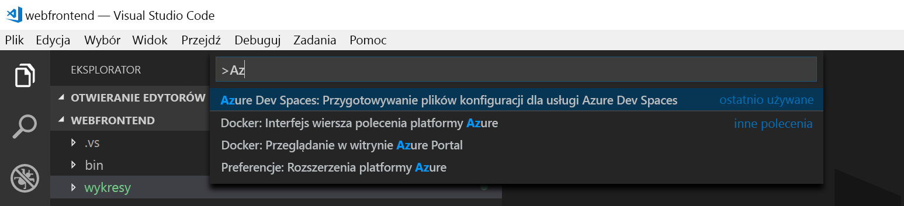

# <a name="quickstart-develop-with-java-on-kubernetes-using-azure-dev-spaces"></a>Szybki start: Programowanie za pomocą języka Java na platformie Kubernetes przy użyciu usługi Azure Dev miejsca do magazynowania

Ten przewodnik zawiera informacje na temat wykonywania następujących czynności:

- Konfigurowanie usługi Azure Dev Spaces za pomocą zarządzanego klastra Kubernetes na platformie Azure.
- Iteracyjne tworzenie kodu w kontenerów za pomocą programu Visual Studio Code i wiersza polecenia.
- Debugowanie kodu w obszarze dev z programu Visual Studio Code.


## <a name="prerequisites"></a>Wymagania wstępne

- Subskrypcja platformy Azure. Jeśli nie masz, możesz utworzyć [bezpłatne konto](https://azure.microsoft.com/free).
- [Visual Studio Code](https://code.visualstudio.com/download).
- [Miejsca do magazynowania Azure Dev](https://marketplace.visualstudio.com/items?itemName=azuredevspaces.azds) i [debugera języka Java dla usługi Azure Dev miejsca do magazynowania](https://marketplace.visualstudio.com/items?itemName=vscjava.vscode-java-debugger-azds) rozszerzeń programu Visual Studio Code.
- [Zainstalowany interfejs wiersza polecenia platformy Azure](/cli/azure/install-azure-cli?view=azure-cli-latest).
- [Narzędzia maven, zainstalować i skonfigurować](https://maven.apache.org).

## <a name="create-an-azure-kubernetes-service-cluster"></a>Utwórz klaster Azure Kubernetes Service

Musisz utworzyć klaster usługi AKS w [obsługiwany region][supported-regions]. Poniższe polecenia Utwórz grupę zasobów o nazwie *MyResourceGroup* i klaster AKS, o nazwie *MyAKS*.

```cmd
az group create --name MyResourceGroup --location eastus
az aks create -g MyResourceGroup -n MyAKS --location eastus --node-vm-size Standard_DS2_v2 --node-count 1 --disable-rbac --generate-ssh-keys
```

## <a name="enable-azure-dev-spaces-on-your-aks-cluster"></a>Włączanie usługi Azure Dev miejsca do magazynowania w klastrze usługi AKS

Użyj `use-dev-spaces` polecenie, aby włączyć Dev miejsca do magazynowania w klastrze usługi AKS i postępuj zgodnie z monitami. Poniższe polecenie powoduje włączenie tworzenia miejsca do magazynowania na *MyAKS* klastra w systemie *MyResourceGroup* grupy i tworzy *domyślne* dev miejsca.

```cmd
$ az aks use-dev-spaces -g MyResourceGroup -n MyAKS

'An Azure Dev Spaces Controller' will be created that targets resource 'MyAKS' in resource group 'MyResourceGroup'. Continue? (y/N): y

Creating and selecting Azure Dev Spaces Controller 'MyAKS' in resource group 'MyResourceGroup' that targets resource 'MyAKS' in resource group 'MyResourceGroup'...2m 24s

Select a dev space or Kubernetes namespace to use as a dev space.
 [1] default
Type a number or a new name: 1

Kubernetes namespace 'default' will be configured as a dev space. This will enable Azure Dev Spaces instrumentation for new workloads in the namespace. Continue? (Y/n): Y

Configuring and selecting dev space 'default'...3s

Managed Kubernetes cluster 'MyAKS' in resource group 'MyResourceGroup' is ready for development in dev space 'default'. Type `azds prep` to prepare a source directory for use with Azure Dev Spaces and `azds up` to run.
```

## <a name="get-sample-application-code"></a>Pobierz przykładowy kod aplikacji

W tym artykule używasz [miejsca do magazynowania Azure Dev Przykładowa aplikacja](https://github.com/Azure/dev-spaces) celu pokazanie sposobu używania usługi Azure Dev miejsca do magazynowania.

Klonowanie aplikacji z usługi GitHub i przejdź do *dev-miejsca do magazynowania/przykłady/java/pobieranie pracę/webfrontend* katalogu:

```cmd
git clone https://github.com/Azure/dev-spaces
cd dev-spaces/samples/java/getting-started/webfrontend
```

## <a name="prepare-the-application"></a>Przygotowywanie aplikacji

Generuj zasoby wykresu platformy Docker i Helm do uruchamiania aplikacji przy użyciu rozwiązania Kubernetes `azds prep` polecenia:

```cmd
azds prep --public
```

Należy uruchomić `prep` polecenia *dev-miejsca do magazynowania/przykłady/java/pobieranie pracę/webfrontend* katalogu można prawidłowo wygenerować zasoby wykresu platformy Docker i narzędzia Helm.

## <a name="build-and-run-code-in-kubernetes"></a>Kompilowanie i uruchamianie kodu na platformie Kubernetes

Kompilowanie i uruchamianie kodu w usłudze AKS za pomocą `azds up` polecenia:

```cmd
$ azds up
Using dev space 'default' with target 'MyAKS'
Synchronizing files...3s
Installing Helm chart...8s
Waiting for container image build...28s
Building container image...
Step 1/8 : FROM maven:3.5-jdk-8-slim
Step 2/8 : EXPOSE 8080
Step 3/8 : WORKDIR /usr/src/app
Step 4/8 : COPY pom.xml ./
Step 5/8 : RUN /usr/local/bin/mvn-entrypoint.sh     mvn package -Dmaven.test.skip=true -Dcheckstyle.skip=true -Dmaven.javadoc.skip=true --fail-never
Step 6/8 : COPY . .
Step 7/8 : RUN mvn package -Dmaven.test.skip=true -Dcheckstyle.skip=true -Dmaven.javadoc.skip=true
Step 8/8 : ENTRYPOINT ["java","-jar","target/webfrontend-0.1.0.jar"]
Built container image in 37s
Waiting for container...57s
Service 'webfrontend' port 'http' is available at http://webfrontend.1234567890abcdef1234.eus.azds.io/
Service 'webfrontend' port 80 (http) is available at http://localhost:54256
...
```

Możesz zobaczyć usługi uruchomione przez otwarcie publicznego adresu URL, który jest wyświetlany w danych wyjściowych `azds up` polecenia. W tym przykładzie jest publiczny adres URL *http://webfrontend.1234567890abcdef1234.eus.azds.io/* .

Jeśli użytkownik zaprzestanie `azds up` polecenie, używając *Ctrl + c*, usługa będzie w dalszym ciągu uruchamiać w usłudze AKS i publiczny adres URL, pozostaną dostępne.

## <a name="update-code"></a>Aktualizowanie kodu

Aby wdrożyć zaktualizowaną wersję usługi, zaktualizuj dowolny plik w projekcie i ponownie uruchom `azds up` polecenia. Na przykład:

1. Jeśli `azds up` jest nadal uruchomione, naciśnij klawisz *Ctrl + c*.
1. Aktualizacja [wiersz 19 w `src/main/java/com/ms/sample/webfrontend/Application.java` ](https://github.com/Azure/dev-spaces/blob/master/samples/java/getting-started/webfrontend/src/main/java/com/ms/sample/webfrontend/Application.java#L19) do:
    
    ```java
    return "Hello from webfrontend in Azure!";
    ```

1. Zapisz zmiany.
1. Uruchom ponownie `azds up` polecenia:

    ```cmd
    $ azds up
    Using dev space 'default' with target 'MyAKS'
    Synchronizing files...1s
    Installing Helm chart...3s
    Waiting for container image build...
    ...    
    ```

1. Przejdź do usługi uruchomione i obserwować zmiany.
1. Naciśnij klawisz *Ctrl + c* przestanie `azds up` polecenia.

## <a name="enable-visual-studio-code-to-debug-in-kubernetes"></a>Włączanie programu Visual Studio Code do debugowania w usłudze Kubernetes

Otwórz program Visual Studio Code, kliknij *pliku* następnie *Otwórz...* , przejdź do *dev-miejsca do magazynowania/przykłady/java/pobieranie pracę/webfrontend* katalogu, a następnie kliknij przycisk *Otwórz*.

Masz teraz *webfrontend* otwarty projekt w programie Visual Studio Code, która jest w tej samej usługi została uruchomiona przy użyciu `azds up` polecenia. Aby debugować tej usługi w usłudze AKS za pomocą programu Visual Studio Code, w przeciwieństwie do używania `azds up` bezpośrednio, należy przygotować ten projekt do używania programu Visual Studio Code do komunikowania się z obszaru deweloperów.

Aby otworzyć paletę poleceń w programie Visual Studio Code kliknij pozycję *widoku* następnie *paletę poleceń*. Rozpocznij wpisywanie ciągu `Azure Dev Spaces` i kliknij pozycję `Azure Dev Spaces: Prepare configuration files for Azure Dev Spaces`.



Visual Studio Code monit również skonfigurować obrazy podstawowe i ujawnionych portów, wybierz `Azul Zulu OpenJDK for Azure (Free LTS)` na podstawowy obraz i `8080` dla ujawnionych portów.


To polecenie przygotowuje projektu do uruchamiania w obszarach deweloperów platformy Azure bezpośrednio z poziomu programu Visual Studio Code. Polecenie to generuje także *.vscode* katalog debugowania konfiguracji w katalogu głównym projektu.

## <a name="build-and-run-code-in-kubernetes-from-visual-studio"></a>Kompilowanie i uruchamianie kodu w rozwiązaniu Kubernetes za pomocą programu Visual Studio

Kliknij pozycję *debugowania* ikonę po lewej stronie i kliknij przycisk *Uruchom Program Java (AZDS, Distributed File System)* u góry.


To polecenie kompiluje i uruchamia usługę w obszarach deweloperów platformy Azure, w trybie debugowania. *Terminalu* u dołu okna przedstawia dane wyjściowe kompilacji i adresów URL usługi systemem Azure Dev miejsca do magazynowania. *Konsoli debugowania* zawiera dane wyjściowe dziennika.

> [!Note]
> Jeśli nie widzisz żadnych poleceń usługi Azure Dev miejsca do magazynowania w *paletę poleceń*, upewnij się, że zainstalowano [rozszerzenie programu Visual Studio Code dla usługi Azure Dev miejsca do magazynowania](https://marketplace.visualstudio.com/items?itemName=azuredevspaces.azds). Sprawdź także, możesz otworzyć *dev-miejsca do magazynowania/przykłady/java/pobieranie pracę/webfrontend* katalogu w programie Visual Studio Code.

Kliknij przycisk *debugowania* następnie *Zatrzymaj debugowanie* zatrzymanie debugera.

## <a name="setting-and-using-breakpoints-for-debugging"></a>Ustawianie i używanie punktów przerwania do debugowania

Uruchom usługę, podczas debugowania przy użyciu trybu *Uruchom Program Java (AZDS, Distributed File System)* .

Przejdź z powrotem do *Explorer* widoku, klikając *widoku* następnie *Explorer*. Otwórz `src/main/java/com/ms/sample/webfrontend/Application.java` i kliknij przycisk gdzieś w wierszu 19 tam umieścić kursor. Aby ustawić punkt przerwania trafień *F9* lub kliknij przycisk *debugowania* następnie *Przełącz punkt przerwania*.

Otwórz swoją usługę w przeglądarce i zwróć uwagę, że jest wyświetlany żaden komunikat. Wróć do programu Visual Studio Code i sprawdź, czy jest wyróżniony wiersz 19. Punkt przerwania, gdy ustawiasz została wstrzymana usługi w wierszu 19. Aby wznowić działanie usługi, trafienia *F5* lub kliknij przycisk *debugowania* następnie *Kontynuuj*. Wróć do przeglądarki i zwróć uwagę, że teraz jest wyświetlany komunikat.

Podczas uruchamiania usługi w usłudze Kubernetes załączonym debuggerze, masz pełny dostęp do debugowania informacje, takie jak stos wywołań, zmienne lokalne i informacje o wyjątku.

Usuń punkt przerwania, umieszczając kursor w wierszu 19 `src/main/java/com/ms/sample/webfrontend/Application.java` TAB i naciśnięcie klawisza *F9*.

## <a name="update-code-from-visual-studio-code"></a>Aktualizowanie kodu z programu Visual Studio Code

Gdy usługa jest uruchomiona w trybie debugowania, zaktualizuj wiersz 19 w `src/main/java/com/ms/sample/webfrontend/Application.java`. Na przykład:
```java
return "Hello from webfrontend in Azure while debugging!";
```

Zapisz plik. Kliknij przycisk *debugowania* następnie *Uruchom ponownie debugowanie* lub *narzędzi debugowania*, kliknij przycisk *Uruchom ponownie debugowanie* przycisku.


Otwórz swoją usługę w przeglądarce i zwróć uwagę, że zaktualizowano wiadomość jest wyświetlana.

Zamiast ponownego kompilowania lub wdrażania nowy obraz kontenera każdorazowo edycji kodu zostaną wprowadzone, miejsca do magazynowania Azure Dev przyrostowo następuje rekompilacja kodu w ramach istniejącego kontenera, aby zapewnić szybsze pętli Edycja i debugowanie.

## <a name="clean-up-your-azure-resources"></a>Oczyszczanie zasobów platformy Azure

```cmd
az group delete --name MyResourceGroup --yes --no-wait
```

## <a name="next-steps"></a>Kolejne kroki

Dowiedz się, jak usługi Azure Dev miejsca do magazynowania ułatwia tworzenie bardziej złożonych aplikacji w wielu kontenerach i jak można uprościć programowanie zespołowe przy pracy z różnymi wersjami lub gałęzi kodu w różnych miejsc do magazynowania.

> [!div class="nextstepaction"]
> [Working with multiple containers and team development (Praca z wieloma kontenerami i programowanie zespołowe)](multi-service-java.md)


[supported-regions]: about.md#supported-regions-and-configurations