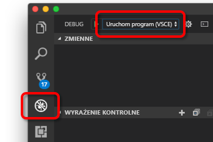

# <a name="quickstart-debug-and-iterate-with-visual-studio-code-and-nodejs-on-kubernetes-using-azure-dev-spaces"></a>Szybki Start: debugowanie i iteracja przy użyciu Visual Studio Code i środowiska Node. js w systemie Kubernetes przy użyciu Azure Dev Spaces

W tym przewodniku dowiesz się, jak:

- Skonfiguruj Azure Dev Spaces z zarządzanym klastrem Kubernetes na platformie Azure.
- Iteracyjnie opracowuj kod w kontenerach przy użyciu Visual Studio Code.
- Debuguj kod w obszarze deweloperskim z Visual Studio Code.

Azure Dev Spaces umożliwia również debugowanie i iterację przy użyciu:
- [Java i Visual Studio Code](quickstart-java.md)
- [.NET Core i Visual Studio Code](quickstart-netcore.md)
- [.NET Core i Visual Studio](quickstart-netcore-visualstudio.md)

## <a name="prerequisites"></a>Wymagania wstępne

- Subskrypcja platformy Azure. Jeśli nie masz subskrypcji platformy Azure, możesz utworzyć [bezpłatne konto](https://azure.microsoft.com/free).
- [Visual Studio Code zainstalowane](https://code.visualstudio.com/download).
- [Azure dev Spaces](https://marketplace.visualstudio.com/items?itemName=azuredevspaces.azds) rozszerzenie Visual Studio Code zainstalowane.
- [Zainstalowano interfejs wiersza polecenia platformy Azure](/cli/azure/install-azure-cli?view=azure-cli-latest).

## <a name="create-an-azure-kubernetes-service-cluster"></a>Tworzenie klastra usługi Azure Kubernetes Service

Należy utworzyć klaster AKS w [obsługiwanym regionie][supported-regions]. Poniższe polecenia tworzą grupę zasobów o nazwie Moja *zasobów* i klaster AKS o nazwie *MyAKS*.

```cmd
az group create --name MyResourceGroup --location eastus
az aks create -g MyResourceGroup -n MyAKS --location eastus --disable-rbac --generate-ssh-keys
```

## <a name="enable-azure-dev-spaces-on-your-aks-cluster"></a>Włączanie Azure Dev Spaces w klastrze AKS

Użyj `use-dev-spaces` polecenia, aby włączyć miejsca deweloperskie w klastrze AKS i postępuj zgodnie z monitami. Poniższe polecenie włącza miejsca deweloperskie w klastrze *MyAKS* w grupie Grupa *zasobów* i tworzy *domyślny* obszar dev.

> [!NOTE]
> Polecenie `use-dev-spaces` zainstaluje również interfejs wiersza polecenia Azure Dev Spaces, jeśli nie został jeszcze zainstalowany. Nie można zainstalować interfejsu wiersza polecenia Azure Dev Spaces w Azure Cloud Shell.

```cmd
$ az aks use-dev-spaces -g MyResourceGroup -n MyAKS

'An Azure Dev Spaces Controller' will be created that targets resource 'MyAKS' in resource group 'MyResourceGroup'. Continue? (y/N): y

Creating and selecting Azure Dev Spaces Controller 'MyAKS' in resource group 'MyResourceGroup' that targets resource 'MyAKS' in resource group 'MyResourceGroup'...2m 24s

Select a dev space or Kubernetes namespace to use as a dev space.
 [1] default
Type a number or a new name: 1

Kubernetes namespace 'default' will be configured as a dev space. This will enable Azure Dev Spaces instrumentation for new workloads in the namespace. Continue? (Y/n): Y

Configuring and selecting dev space 'default'...3s

Managed Kubernetes cluster 'MyAKS' in resource group 'MyResourceGroup' is ready for development in dev space 'default'. Type `azds prep` to prepare a source directory for use with Azure Dev Spaces and `azds up` to run.
```

## <a name="get-sample-application-code"></a>Pobierz przykładowy kod aplikacji

W tym artykule użyto [Azure dev Spaces przykładowej aplikacji](https://github.com/Azure/dev-spaces) do zademonstrowania przy użyciu Azure dev Spaces.

Sklonuj aplikację z usługi GitHub.

```cmd
git clone https://github.com/Azure/dev-spaces
```

## <a name="prepare-the-sample-application-in-visual-studio-code"></a>Przygotuj przykładową aplikację w Visual Studio Code

Otwórz Visual Studio Code, kliknij *plik* , a następnie *Otwórz...* , przejdź do katalogu *dev-Spaces/Samples/NodeJS/Data-Start/webfronton* , a następnie kliknij przycisk *Otwórz*.

Masz teraz otwarty projekt *webfrontonu* w Visual Studio Code. Aby uruchomić aplikację w obszarze dev, wygeneruj zasoby wykresu Docker i Helm przy użyciu rozszerzenia Azure Dev Spaces w palecie poleceń.

Aby otworzyć paletę poleceń w Visual Studio Code, kliknij przycisk *Widok* i *paleta poleceń*. Zacznij pisać `Azure Dev Spaces` i kliknij przycisk `Azure Dev Spaces: Prepare configuration files for Azure Dev Spaces`.


Gdy Visual Studio Code również zostanie wyświetlony komunikat z prośbą o skonfigurowanie publicznego punktu końcowego, wybierz `Yes`, aby włączyć publiczny punkt końcowy.


To polecenie przygotowuje projekt do uruchomienia w Azure Dev Spaces przez wygenerowanie wykresu pliku dockerfile i Helm. Generuje również katalog *. programu vscode* z konfiguracją debugowania w katalogu głównym projektu.

## <a name="build-and-run-code-in-kubernetes-from-visual-studio-code"></a>Kompiluj i uruchamiaj kod w Kubernetes z Visual Studio Code

Kliknij ikonę *debugowania* po lewej stronie, a następnie kliknij pozycję *Uruchom serwer (AZDS)* u góry.



To polecenie kompiluje i uruchamia usługę w Azure Dev Spaces. W oknie *terminalu* u dołu są wyświetlane dane wyjściowe kompilacji i adresy URL dla usługi uruchomionej Azure dev Spaces. W *konsoli debugowania* są wyświetlane dane wyjściowe dziennika.

> [!Note]
> Jeśli nie widzisz żadnych poleceń Azure Dev Spaces w *palecie poleceń*, upewnij się, że zainstalowano [rozszerzenie Visual Studio Code dla Azure dev Spaces](https://marketplace.visualstudio.com/items?itemName=azuredevspaces.azds). Sprawdź również, czy otwarto katalog *dev-Spaces/Samples/NodeJS/Start-Started/webfronton* w Visual Studio Code.

Możesz zobaczyć, że usługa jest uruchomiona, otwierając publiczny adres URL.

Kliknij pozycję *Debuguj* , a następnie *Zatrzymaj debugowanie* , aby zatrzymać debuger.

## <a name="update-code"></a>Aktualizuj kod

Aby wdrożyć zaktualizowaną wersję usługi, możesz zaktualizować dowolny plik w projekcie i ponownie uruchomić *serwer uruchamiania*. Na przykład:

1. Jeśli aplikacja jest nadal uruchomiona, kliknij pozycję *Debuguj* , a następnie *Zatrzymaj debugowanie* , aby ją zatrzymać.
1. Zaktualizuj [wiersz 13 w `server.js`](https://github.com/Azure/dev-spaces/blob/master/samples/nodejs/getting-started/webfrontend/server.js#L13) do:
    
    ```javascript
        res.send('Hello from webfrontend in Azure');
    ```

1. Zapisz zmiany.
1. Uruchom ponownie *serwer uruchamiania*.
1. Przejdź do działającej usługi i obserwuj wprowadzone zmiany.
1. Kliknij pozycję *Debuguj* , a następnie *Zatrzymaj debugowanie* , aby zatrzymać aplikację.

## <a name="setting-and-using-breakpoints-for-debugging"></a>Ustawianie i używanie punktów przerwania do debugowania

Uruchom usługę przy użyciu *serwera uruchamiania (AZDS)* .

Przejdź z powrotem do widoku *Eksploratora* , klikając przycisk *Wyświetl* , a następnie *Eksploratora*. Otwórz `server.js` i kliknij gdziekolwiek w wierszu 13, aby umieścić w nim kursor. Aby ustawić punkt przerwania, naciśnij klawisz *F9* lub kliknij pozycję *Debuguj* , a następnie *Przełącz punkt przerwania*.

Otwórz usługę w przeglądarce i zwróć uwagę, że komunikat nie jest wyświetlany. Wróć do Visual Studio Code i wiersz 13 został wyróżniony. Ustawiony punkt przerwania został wstrzymany usługi w wierszu 13. Aby wznowić działanie usługi, naciśnij klawisz *F5* lub kliknij pozycję *Debuguj* i *Kontynuuj*. Wróć do przeglądarki i Zauważ, że komunikat jest teraz wyświetlany.

Podczas uruchamiania usługi w Kubernetes z dołączonym debugerem masz pełny dostęp do informacji debugowania, takich jak stos wywołań, zmienne lokalne i informacje o wyjątku.

Usuń punkt przerwania, umieszczając kursor w wierszu 13 w `server.js` i naciskając klawisz *F9*.

Kliknij pozycję *Debuguj* , a następnie *Zatrzymaj debugowanie* , aby zatrzymać debuger.

## <a name="update-code-from-visual-studio-code"></a>Aktualizuj kod z Visual Studio Code

Zmień tryb debugowania w celu *dołączenia do serwera (AZDS)* i uruchom usługę:


To polecenie kompiluje i uruchamia usługę w Azure Dev Spaces. Uruchamia również proces [nodemon](https://nodemon.io) w kontenerze usługi i dołącza do niego vs Code. Proces *nodemon* umożliwia automatyczne ponowne uruchamianie po wprowadzeniu zmian w kodzie źródłowym, co umożliwia szybsze tworzenie pętli wewnętrznej podobnej do programowania na komputerze lokalnym.

Po uruchomieniu usługi przejdź do niej przy użyciu przeglądarki i skontaktuj się z nią.

Gdy usługa jest uruchomiona, Wróć do VS Code i zaktualizuj wiersz 13 w `server.js`. Na przykład:
```javascript
    res.send('Hello from webfrontend in Azure while debugging!');
```

Zapisz plik i wróć do usługi w przeglądarce. Skontaktuj się z usługą i zwróć uwagę na to, że zaktualizowana wiadomość zostanie wyświetlona.

Podczas działania programu *nodemon*proces węzła jest automatycznie uruchamiany ponownie zaraz po wykryciu wszelkich zmian w kodzie. Ten proces automatycznego ponownego uruchamiania jest podobny do środowiska edycji i ponownego uruchamiania usługi na komputerze lokalnym, co zapewnia środowisko programistyczne w pętli wewnętrznej.

## <a name="clean-up-your-azure-resources"></a>Czyszczenie zasobów platformy Azure

```cmd
az group delete --name MyResourceGroup --yes --no-wait
```

## <a name="next-steps"></a>Następne kroki

Dowiedz się, jak Azure Dev Spaces ułatwiają tworzenie bardziej złożonych aplikacji w wielu kontenerach i jak można uprościć programowanie do współpracy, pracując z różnymi wersjami lub gałęziami kodu w różnych miejscach.

> [!div class="nextstepaction"]
> [Praca z wieloma kontenerami i programowaniem zespołu](multi-service-nodejs.md)


[supported-regions]: about.md#supported-regions-and-configurations
