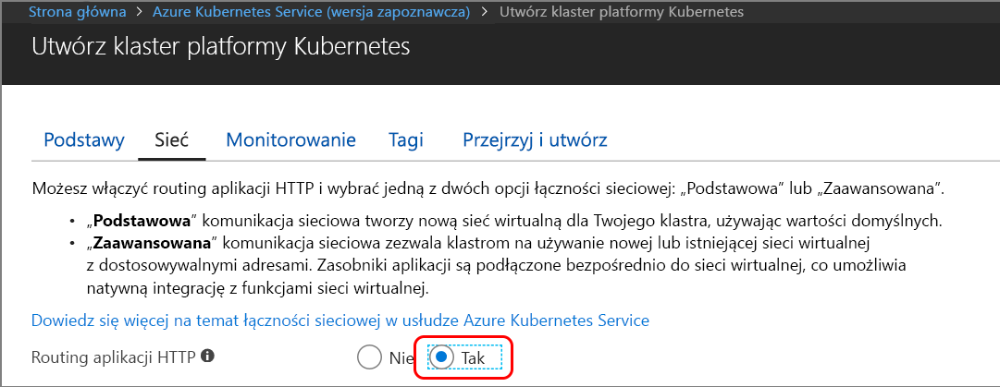
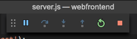

# <a name="quickstart-create-a-kubernetes-dev-space-with-azure-dev-spaces-nodejs"></a>Szybki start: tworzenie obszaru deweloperskiego Kubernetes za pomocą usługi Azure Dev Spaces (Node.js)

Ten przewodnik zawiera informacje na temat wykonywania następujących czynności:

- Konfigurowanie usługi Azure Dev Spaces za pomocą zarządzanego klastra Kubernetes na platformie Azure.
- Iteracyjne tworzenie kodu w kontenerach przy użyciu programu VS Code i wiersza polecenia.
- Debugowanie kodu działającego w klastrze.

> [!Note]
> **Jeśli utkniesz** w dowolnym momencie, zobacz sekcję [Rozwiązywanie problemów](troubleshooting.md) lub prześlij komentarz na tej stronie. Możesz również spróbować wykonać instrukcje z bardziej szczegółowego [samouczka](get-started-nodejs.md).

## <a name="prerequisites"></a>Wymagania wstępne

- Subskrypcja platformy Azure. Jeśli nie masz subskrypcji platformy Azure, możesz utworzyć [bezpłatne konto](https://azure.microsoft.com/free).
- [Klaster Kubernetes](https://ms.portal.azure.com/#create/microsoft.aks) z uruchomioną platformą Kubernetes 1.9.6 lub nowszą w regionach EastUS, CentralUS, WestUS2, WestEurope, CanadaCentral lub CanadaEast z włączonym **routingiem aplikacji protokołu HTTP**.

  

- Narzędzie Visual Studio Code, które można pobrać [tutaj](https://code.visualstudio.com/download).

## <a name="set-up-azure-dev-spaces"></a>Konfigurowanie usługi Azure Dev Spaces

Wiersz polecenia platformy Azure i rozszerzenie usługi Azure Dev Spaces można instalować i uruchamiać na komputerach z systemem Windows, Mac lub Linux. W przypadku systemu Linux obsługiwane są następujące dystrybucje: Ubuntu (18.04, 16.04 i 14.04), Debian 8 i 9, RHEL 7, Fedora 26 i nowsze wersje, CentOS 7, openSUSE 42.2 oraz SLES 12.

Wykonaj następujące kroki, aby skonfigurować usługę Azure Dev Spaces:

1. Zainstaluj [interfejs wiersza polecenia platformy Azure](/cli/azure/install-azure-cli?view=azure-cli-latest) (w wersji 2.0.43 lub nowszej).
1. Skonfiguruj usługę Dev Spaces na klastrze AKS:`az aks use-dev-spaces -g MyResourceGroup -n MyAKS`
1. Pobierz [rozszerzenie usługi Azure Dev Spaces](https://marketplace.visualstudio.com/items?itemName=azuredevspaces.azds) dla programu VS Code. Kliknij pozycję Zainstaluj najpierw na stronie rozszerzenia w witrynie Marketplace, a następnie w programie VS Code.

## <a name="build-and-run-code-in-kubernetes"></a>Kompilowanie i uruchamianie kodu na platformie Kubernetes

1. Pobierz przykładowy kod z usługi GitHub: [https://github.com/Azure/dev-spaces](https://github.com/Azure/dev-spaces) 
1. Zmień katalog na folder webfrontend: `cd dev-spaces/samples/nodejs/getting-started/webfrontend`
1. Generuj zasoby programu Docker i wykresu Helm: `azds prep --public`
1. Skompiluj i uruchom kod w środowisku AKS. W oknie terminala z poziomu **folderu webfrontend** uruchom to polecenie: `azds up`
1. Przeskanuj dane wyjściowe konsoli w poszukiwaniu informacji o adresie URL, który został utworzony za pomocą polecenia `up`. Będzie on mieć postać: 

   `Service 'webfrontend' port 'http' is available at <url>` 

   Otwórz ten adres URL w oknie przeglądarki — aplikacja internetowa powinna zostać załadowana. Podczas wykonywania kontenera dane wyjściowe `stdout` i `stderr` są przesyłane strumieniowo do okna terminalu.
   
   > [!Note]
   > Przy pierwszym uruchomieniu przygotowanie publicznego serwera DNS może potrwać kilka minut. Jeśli publiczny adres URL nie zostanie rozpoznany, możesz użyć alternatywnego adresu URL http://localhost:<portnumber>, który jest wyświetlany w danych wyjściowych konsoli. Jeśli używasz adresu URL hosta lokalnego, może się wydawać, że kontener działa lokalnie, ale faktycznie jest on uruchamiany w usłudze AKS. Dla Twojej wygody i ułatwienia interakcji z usługą z komputera lokalnego usługa Azure Dev Spaces tworzy tymczasowy tunel SSH do kontenera uruchomionego na platformie Azure. Później, gdy rekord DNS będzie gotowy, możesz wrócić i wypróbować publiczny adres URL.

### <a name="update-a-content-file"></a>Aktualizowanie pliku zawartości
Usługa Azure Dev Spaces umożliwia nie tylko uruchamianie kodu w środowisku Kubernetes — pozwala też szybko i wielokrotnie wyświetlać efekt zmian wprowadzonych w kodzie w środowisku Kubernetes w chmurze.

1. Znajdź plik `./public/index.html` i zmień kod HTML. Na przykład zmień kolor tła strony na odcień koloru niebieskiego:

    ```html
    <body style="background-color: #95B9C7; margin-left:10px; margin-right:10px;">
    ```

1. Zapisz plik. Po chwili w oknie terminalu pojawi się komunikat informujący o tym, że plik w uruchomionym kontenerze został zaktualizowany.
1. Przejdź do przeglądarki i odśwież stronę. Powinna być widoczna zmiana koloru.

Co się stało? Modyfikacje plików zawartości, takich jak HTML i CSS, nie wymagają ponownego uruchomienia procesu Node.js. Z tego względu aktywne polecenie `azds up` automatycznie synchronizuje wszystkie zmodyfikowane pliki zawartości bezpośrednio z uruchomionym kontenerem na platformie Azure, co umożliwia szybki podgląd zmian zawartości.

### <a name="test-from-a-mobile-device"></a>Testowanie na urządzeniu przenośnym
Otwórz aplikację internetową na urządzeniu przenośnym, używając publicznego adresu URL dla aplikacji webfrontend. Możesz skopiować i wysłać adres URL z komputera stacjonarnego na urządzenie, aby nie wprowadzać długiego adresu. Gdy aplikacja internetowa zostanie załadowana na urządzeniu przenośnym, zauważysz, że interfejs użytkownika nie jest wyświetlany poprawnie na ekranie małego urządzenia.

Aby rozwiązać ten problem, dodaj metatag `viewport`:
1. Otwórz plik `./public/index.html`
1. Dodaj metatag `viewport` do istniejącego elementu `head`:

    ```html
    <head>
        <!-- Add this line -->
        <meta name="viewport" content="width=device-width, initial-scale=1">
    </head>
    ```

1. Zapisz plik.
1. Odśwież przeglądarkę na urządzeniu. Teraz aplikacja internetowa powinna być wyświetlana poprawnie. 

Jak widać, niektóre problemy występują dopiero podczas testów na urządzeniach, dla których jest przeznaczona aplikacja. Usługa Azure Dev Spaces pozwala szybko modyfikować kod i weryfikować zmiany na urządzeniach docelowych.

### <a name="update-a-code-file"></a>Aktualizowanie pliku kodu
Aktualizacja plików kodu po stronie serwera wymaga nieco więcej pracy, ponieważ aplikacja Node.js musi zostać uruchomiona ponownie.

1. W oknie terminalu naciśnij klawisze `Ctrl+C`, aby zatrzymać polecenie `azds up`.
1. Otwórz plik kodu o nazwie `server.js` i zmodyfikuj komunikat powitalny usługi: 

    ```javascript
    res.send('Hello from webfrontend running in Azure!');
    ```

3. Zapisz plik.
1. Uruchom polecenie `azds up` w oknie terminalu. 

Spowoduje to ponowne skompilowanie obrazu kontenera i ponowne wdrożenie planu narzędzia Helm. Załaduj ponownie stronę przeglądarki, aby zobaczyć efekt zmian w kodzie.

Oprócz tego dostępna jest jeszcze *szybsza metoda* opracowywania kodu. Omówimy ją w następnej sekcji. 

## <a name="debug-a-container-in-kubernetes"></a>Debugowanie kontenera w środowisku Kubernetes

W tej sekcji użyjesz programu VS Code do bezpośredniego debugowania naszego kontenera uruchomionego na platformie Azure. Ponadto dowiesz się, jak uzyskać szybszą pętlę edycji, uruchamiania i testowania.


### <a name="initialize-debug-assets-with-the-vs-code-extension"></a>Inicjowanie zasobów debugowania za pomocą rozszerzenia programu VS Code
Najpierw musisz skonfigurować projekt kodu, aby program VS Code komunikował się z naszą przestrzenią deweloperów na platformie Azure. Rozszerzenie programu VS Code dla usługi Azure Dev Spaces udostępnia polecenie pomocnika w celu ustawienia konfiguracji debugowania. 

Otwórz okno **Paleta poleceń** (za pomocą menu **Widok | Paleta poleceń**) i przy użyciu autouzupełniania wpisz i wybierz to polecenie: `Azure Dev Spaces: Prepare configuration files for Azure Dev Spaces`.

Spowoduje to dodanie konfiguracji debugowania dla usługi Azure Dev Spaces w obszarze folderu `.vscode`.


### <a name="select-the-azds-debug-configuration"></a>Wybieranie konfiguracji debugowania w rozwiązaniu AZDS
1. Aby otworzyć widok debugowania, kliknij ikonę debugowania na **pasku działań** w bocznej części programu VS Code.
1. Wybierz pozycję **Launch Program (AZDS)** (Uruchom program [AZDS]) jako aktywną konfigurację debugowania.


> [!Note]
> Jeśli na palecie poleceń nie widać żadnych poleceń usługi Azure Dev Spaces, upewnij się, że masz zainstalowane rozszerzenie VS Code dla usługi Azure Dev Spaces.

### <a name="debug-the-container-in-kubernetes"></a>Debugowanie kontenera w środowisku Kubernetes
Po naciśnięciu klawisza **F5** możesz debugować kod w środowisku Kubernetes.

Podobnie jak w przypadku polecenia `up` po rozpoczęciu debugowania kod jest synchronizowany z obszarem deweloperskim, a kontener jest kompilowany i wdrażany w środowisku Kubernetes. Tym razem debuger jest dołączany do zdalnego kontenera.

> [!Tip]
> Na pasku stanu programu VS Code będzie wyświetlany adres URL, który można kliknąć.

Ustaw punkt przerwania w pliku kodu po stronie serwera, na przykład w obrębie wywołania `app.get('/api'...` w pliku `server.js`. Odśwież stronę przeglądarki lub naciśnij przycisk „Say It Again” (Ponów). Powinno nastąpić zatrzymanie w punkcie przerwania, co umożliwia krokowe wykonywanie kodu.

Masz pełny dostęp do informacji debugowania, takich jak stos wywołań, zmienne lokalne, informacje o wyjątkach itd., zupełnie jakby kod był wykonywany lokalnie.

### <a name="edit-code-and-refresh-the-debug-session"></a>Edytowanie kodu i odświeżanie sesji debugowania
Przy aktywnym debugerze wprowadź zmianę w kodzie, na przykład ponownie zmodyfikuj komunikat powitalny:

```javascript
app.get('/api', function (req, res) {
    res.send('**** Hello from webfrontend running in Azure! ****');
});
```

Zapisz plik i w okienku **Debug actions** (Akcje debugowania) kliknij przycisk **Refresh** (Odśwież). 



Zamiast ponownego kompilowania i wdrażania nowego obrazu kontenera przy każdej zmianie kodu, co często zajmuje dużo czasu, usługa Azure Dev Spaces ponownie uruchamia proces Node.js między sesjami debugowania, co przyspiesza działanie pętli edytowania/debugowania.

Odśwież aplikację internetową w przeglądarce lub naciśnij przycisk *Say It Again* (Ponów). Twój komunikat powinien zostać wyświetlony w interfejsie użytkownika.

### <a name="use-nodemon-to-develop-even-faster"></a>Jeszcze szybsze programowanie przy użyciu narzędzia NodeMon

Przykładowy `webfrontend` projekt został skonfigurowany do używania [nodemon](https://nodemon.io/), popularnego narzędzia do przyspieszania tworzenia środowiska Node.js, które jest w pełni zgodne z usługą Azure Dev Spaces.

Spróbuj wykonać następujące kroki:
1. Zatrzymaj działanie debugera VS Code.
1. Kliknij ikonę debugowania na **pasku działań** w bocznej części programu VS Code. 
1. Wybierz pozycję **Attach (AZDS)** (Dołącz [AZDS]) jako aktywną konfigurację debugowania.
1. Naciśnij klawisz F5.

W tej konfiguracji kontener uruchamia narzędzie *nodemon*. Po zmianie kodu po stronie serwera narzędzie *nodemon* automatycznie ponownie uruchamia proces Node, tak samo jak podczas programowania w środowisku lokalnym. 
1. Ponownie zmień komunikat powitalny w pliku `server.js` i zapisz ten plik.
1. Odśwież przeglądarkę lub kliknij przycisk *Say It Again* (Ponów), aby zobaczyć efekt wprowadzonych zmian.

**Umiesz już korzystać z metody szybkiego wprowadzania zmian w kodzie i debugowania bezpośrednio w środowisku Kubernetes.**

## <a name="next-steps"></a>Następne kroki

> [!div class="nextstepaction"]
> [Working with multiple containers and team development (Praca z wieloma kontenerami i programowanie zespołowe)](team-development-nodejs.md)
