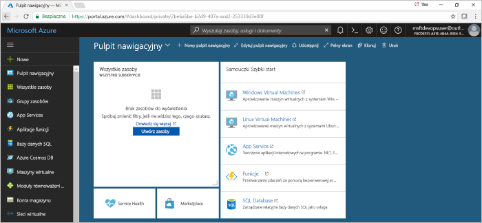

#  Szybki Start: Tworzenie potoku ciągłej integracji/ciągłego wdrażania w Azure Pipelines dla środowiska Node. js z Azure DevOps Projects

Azure DevOps Projects przedstawia uproszczone środowisko tworzenia zasobów platformy Azure i konfiguruje potok ciągłej integracji (CI) i ciągłe dostarczanie (CD) dla aplikacji node. js w programie Azure Pipelines.  

Jeśli nie masz subskrypcji platformy Azure, możesz skorzystać z jednej bezpłatnej [Visual Studio Dev Essentials](https://visualstudio.microsoft.com/dev-essentials/).

## Zaloguj się do Azure Portal

DevOps Projects tworzy potok ciągłej integracji/ciągłego wdrażania w programie Azure Pipelines. Możesz utworzyć nową organizację usługi Azure DevOps lub użyć istniejącej organizacji. DevOps Projects również tworzy zasoby platformy Azure w ramach wybranej subskrypcji platformy Azure.

1. Zaloguj się do [Microsoft Azure Portal](https://portal.azure.com).

1. W lewym okienku wybierz pozycję **Utwórz zasób**, a następnie wyszukaj **DevOps projects**. 

    

## Wybierz przykładową aplikację i usługę platformy Azure

1. Wybierz przykładową aplikację Node. js.  
    Przykłady dla środowiska Node. js obejmują wybór kilku platform aplikacji.

1. Domyślną platformą przykładową jest Express. js. Pozostaw ustawienie domyślne, a następnie wybierz przycisk **dalej**.  
    **Aplikacja sieci Web w systemie Windows** jest domyślnym miejscem docelowym wdrożenia.  Wybrana wcześniej struktura aplikacji określa typ docelowego wdrożenia usługi platformy Azure dostępnego tutaj.  

2. Pozostaw domyślną usługę, a następnie wybierz pozycję **dalej**.
 
## Konfigurowanie usługi Azure DevOps i subskrypcji platformy Azure 

1. Utwórz nową organizację usługi Azure DevOps lub wybierz istniejącą organizację. 

    a. Wprowadź nazwę dla projektu.

    b. Wybierz swoją subskrypcję i lokalizację platformy Azure, wprowadź nazwę aplikacji, a następnie wybierz pozycję **gotowe**.  
    Po kilku minutach DevOps Projects pulpit nawigacyjny zostanie wyświetlony w Azure Portal. Przykładowa aplikacja jest skonfigurowana w repozytorium w organizacji usługi Azure DevOps, a aplikacja jest wdrażana na platformie Azure. Ten pulpit nawigacyjny zapewnia wgląd w repozytorium kodu, potok ciągłej integracji/ciągłego wdrażania oraz aplikację na platformie Azure.
     
3. Wybierz pozycję **Przeglądaj** , aby wyświetlić uruchomioną aplikację.

     
    
DevOps Projects automatycznie skonfigurować wyzwalacz tworzenia i zwalniania elementu konfiguracji.  Teraz możesz przystąpić do współpracy z zespołem w aplikacji node. js z procesem ciągłej integracji/ciągłego wdrażania, który automatycznie wdraża najnowszą pracę w witrynie sieci Web.

## Zatwierdzanie zmian kodu i wykonywanie ciągłej integracji/ciągłego wdrażania

DevOps Projects tworzy repozytorium Git w usłudze Azure Repos lub GitHub. Wykonaj następujące kroki, aby wyświetlić repozytorium i wprowadzić zmiany w kodzie aplikacji.

1. Z lewej strony pulpitu nawigacyjnego DevOps Projects wybierz link do gałęzi głównej.  
To łącze powoduje otwarcie widoku nowo utworzonego repozytorium git.

1. Aby wyświetlić adres URL klonowania repozytorium, wybierz pozycję **Klonuj** w prawym górnym rogu przeglądarki.   
    Repozytorium git można sklonować w ulubionym środowisku IDE. W następnych kilku krokach można użyć przeglądarki sieci Web, aby wprowadzić zmiany w kodzie i zatwierdzić je bezpośrednio w gałęzi głównej.

1. Po lewej stronie przeglądarki przejdź do pliku **views/index. Pug** .

1. Wybierz pozycję **Edytuj**, a następnie wprowadź zmiany do nagłówka H2.  
    Na przykład wprowadź od razu rozpocząć **pracę z Azure DevOps projects** lub wprowadź inne zmiany.

1. Wybierz pozycję **Zatwierdź**, a następnie Zapisz zmiany.

1. W przeglądarce przejdź do pulpitu nawigacyjnego DevOps Projects.   
Teraz powinna zostać wyświetlona kompilacja w toku. Wprowadzone zmiany są automatycznie kompilowane i wdrażane za pośrednictwem potoku ciągłej integracji/ciągłego dostarczania.

## Badanie potoku CI/CD platformy Azure

W poprzednim kroku DevOps Projects automatycznie skonfigurować pełny potok ciągłej integracji/ciągłego dostarczania. Przejrzyj i Dostosuj potok zgodnie z wymaganiami. Wykonaj następujące kroki, aby zaznajomić się z potokami kompilacji i wydania.

1. W górnej części pulpitu nawigacyjnego DevOps Projects wybierz pozycję **potoki kompilacji**.  
To łącze powoduje otwarcie karty przeglądarki i potoku kompilacji dla nowego projektu.

1. Wskaż pole **stan** , a następnie wybierz przycisk wielokropka (...).  
    Ta akcja powoduje otwarcie menu, w którym można rozpocząć kilka działań, takich jak kolejkowanie nowej kompilacji, wstrzymywanie kompilacji i edytowanie potoku kompilacji.

1. Wybierz pozycję **Edytuj**.

1. W tym okienku można przejrzeć różne zadania dla potoku kompilacji.  
Kompilacja wykonuje różne zadania, takie jak pobieranie źródeł z repozytorium git, przywracanie zależności i publikowanie danych wyjściowych, które są używane do wdrożeń.

1. W górnej części potoku kompilacji wybierz nazwę potoku kompilacji.

1. Zmień nazwę potoku kompilacji na coś bardziej opisowego, wybierz pozycję **zapisz & kolejkę**, a następnie wybierz pozycję **Zapisz**.

1. W obszarze Nazwa potoku kompilacji wybierz pozycję **historia**.   
W okienku **historia** zobaczysz dziennik inspekcji ostatnich zmian dla kompilacji.  Azure Pipelines śledzi wszelkie zmiany wprowadzone w potoku kompilacji i umożliwia porównanie wersji.

1. Wybierz pozycję **wyzwalacze**.   
 DevOps Projects automatycznie utworzył wyzwalacz CI i każde zatwierdzenie w repozytorium uruchamia nową kompilację.  Opcjonalnie możesz dołączać lub wykluczać gałęzie z procesu CI elementu konfiguracji.

1. Wybierz pozycję **przechowywanie**.   
W zależności od scenariusza można określić zasady, aby zachować lub usunąć określoną liczbę kompilacji.

1. Wybierz pozycję **kompilacja i wydanie**, a następnie wybierz pozycję **wersje**.  
 DevOps Projects tworzy potok wydania do zarządzania wdrożeniami na platformie Azure.

1. Po lewej stronie wybierz wielokropek (...) obok potoku wydania, a następnie wybierz pozycję **Edytuj**.  
Potok wydania definiuje proces wydania.

12. W obszarze **artefakty**wybierz pozycję **Usuń**.  
    Potok kompilacji, który został sprawdzony w poprzednich krokach, generuje dane wyjściowe używane dla artefaktu. 

1. Obok ikony **upuszczania** wybierz **wyzwalacz ciągłego wdrażania**.  
Ten potok wersji ma włączony wyzwalacz CD, który uruchamia wdrożenie za każdym razem, gdy jest dostępny nowy artefakt kompilacji. Opcjonalnie można wyłączyć wyzwalacz, aby wdrożenia wymagały ręcznego wykonania. 

1. Po lewej stronie wybierz pozycję **zadania**.   
Zadania są działaniami wykonywanymi przez proces wdrażania. W tym przykładzie utworzono zadanie do wdrożenia w Azure App Service.

1. Po prawej stronie wybierz pozycję **Wyświetl wersje**.  
Ten widok przedstawia historię wersji.

1. Wybierz wielokropek (...) obok jednej z wersji, a następnie wybierz pozycję **Otwórz**.  
Istnieje kilka menu do eksplorowania, takich jak podsumowanie wydania, skojarzone elementy robocze i testy.

1. Wybierz pozycję **zatwierdzenia**.   
Ten widok przedstawia zatwierdzenia kodu, które są skojarzone z określonym wdrożeniem.

1. Wybierz pozycję **dzienniki**.  
Dzienniki zawierają przydatne informacje o procesie wdrażania. Mogą być wyświetlane zarówno podczas wdrażania, jak i po nim.

## Czyszczenie zasobów

Możesz usunąć Azure App Service i inne powiązane zasoby, które zostały utworzone, gdy nie są już potrzebne. Użyj funkcji **usuwania** na pulpicie nawigacyjnym DevOps Projects.

## Następne kroki

Po skonfigurowaniu procesu ciągłej integracji/ciągłego tworzenia potoków kompilacji i wydania zostały utworzone automatycznie. Można modyfikować te potoki kompilacji i wydań, aby zaspokoić potrzeby zespołu. Aby dowiedzieć się więcej na temat potoku ciągłej integracji/ciągłego wdrażania, zobacz:

> [!div class="nextstepaction"]
> [Dostosuj proces CD](https://docs.microsoft.com/azure/devops/pipelines/release/define-multistage-release-process?view=vsts)

## Wideo

> [!VIDEO https://www.youtube.com/embed/3etwjubReJs]
