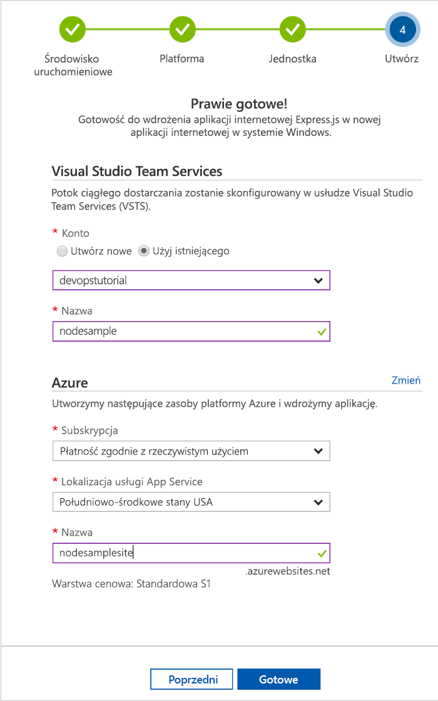

# Tworzenie potoku ciągłej integracji/ciągłego wdrażania dla środowiska Node.js w projekcie DevOps platformy Azure

Projekt DevOps platformy Azure to prosty sposób na utworzenie zasobów platformy Azure i skonfigurowanie potoku ciągłej integracji/ciągłego wdrażania dla aplikacji środowiska Node.js w usłudze Visual Studio Team Services (VSTS) — rozwiązaniu DevOps firmy Microsoft dla platformy Azure.  

Jeśli nie masz subskrypcji platformy Azure, możesz uzyskać ją bezpłatnie za pośrednictwem programu [Visual Studio Dev Essentials](https://visualstudio.microsoft.com/dev-essentials/).

## Logowanie się do witryny Azure Portal

Projekt DevOps platformy Azure tworzy potok ciągłej integracji/ciągłego wdrażania w usłudze VSTS.  Możesz utworzyć **nowe konto usługi VSTS** bezpłatnie lub użyć **istniejącego konta**.  Projekt DevOps tworzy również **zasoby platformy Azure** w wybranej przez użytkownika **subskrypcji platformy Azure**.

1. Zaloguj się do witryny [Microsoft Azure Portal](https://portal.azure.com).

1. Wybierz ikonę **Utwórz zasób** na pasku nawigacyjnym po lewej stronie, a następnie wyszukaj hasło **Projekt DevOps**.  Wybierz pozycję **Utwórz**.

    

## Wybieranie przykładowej aplikacji i usługi platformy Azure

1. Wybierz przykładową aplikację środowiska **Node.js**.  Przykłady środowiska Node.js obejmują kilka struktur aplikacji do wyboru.

1. Domyślna struktura przykładowej aplikacji to struktura **Express.js**. Pozostaw ustawienie domyślne, a następnie wybierz pozycję **Dalej**.  

1. Domyślnym celem wdrożenia jest funkcja **Web App on Windows**.  Struktura aplikacji wybrana w poprzednich krokach decyduje o dostępnym w tym miejscu typie celu wdrożenia usługi platformy Azure.  Pozostaw domyślną usługę, a następnie wybierz pozycję **Dalej**.
 
## Konfigurowanie usługi VSTS i subskrypcji platformy Azure 

1. Utwórz **nowe** konto usługi VSTS lub wybierz **istniejące** konto.  Wybierz **nazwę** projektu usługi VSTS.  Wybierz swoją **subskrypcję platformy Azure**, **lokalizację** i **nazwę** aplikacji.  Gdy wszystko będzie gotowe, wybierz pozycję **Gotowe**.

    

1. W ciągu kilku minut w witrynie Azure Portal zostanie załadowany **pulpit nawigacyjny projektu**.  Aplikacja przykładowa zostanie skonfigurowana w repozytorium na koncie usługi VSTS, skompilowana i wdrożona na platformie Azure.  Ten pulpit nawigacyjny zapewnia wgląd do **repozytorium kodu**, **potoku ciągłej integracji/ciągłego wdrażania usługi VSTS** i **aplikacji na platformie Azure**.  Po prawej stronie pulpitu nawigacyjnego wybierz pozycję **Przeglądaj**, aby wyświetlić uruchomioną aplikację.

     
    
Projekt DevOps platformy Azure automatycznie konfiguruje wyzwalacz kompilacji i wydania ciągłej integracji.  Możesz teraz rozpocząć pracę w zespole nad aplikacją Node.js w ramach procesu ciągłej integracji/ciągłego wdrażania, który umożliwia automatyczne wdrożenie najnowszej wersji w witrynie internetowej.

## Zatwierdzanie zmian kodu i wykonywanie ciągłej integracji/ciągłego wdrażania

Projekt DevOps platformy Azure utworzył repozytorium Git na Twoim koncie usługi VSTS lub GitHub.  Wykonaj poniższe kroki, aby wyświetlić to repozytorium i wprowadzić zmiany w kodzie aplikacji.

1. Z lewej strony pulpitu nawigacyjnego projektu DevOps wybierz link dla gałęzi **master**.  Ten link otwiera widok nowo utworzonego repozytorium Git.

1. Aby wyświetlić adres URL klonowania repozytorium, wybierz pozycję **Klonuj** w prawym górnym rogu przeglądarki. Możesz sklonować repozytorium Git w wybranym środowisku IDE.  W kolejnych kilku krokach użyjesz przeglądarki internetowej, aby dokonać zmian w kodzie i zatwierdzić je bezpośrednio w gałęzi master.

1. Przejdź do pliku **views/index.pug** z lewej strony okna przeglądarki.

1. Wybierz pozycję **Edytuj** i wprowadź zmianę w nagłówku h2.  Wpisz na przykład hasło **Zaczynamy pracę z projektem DevOps platformy Azure** lub wprowadź inną zmianę.

1. Wybierz polecenie **Zatwierdź**, a następnie zapisz zmiany.

1. W przeglądarce przejdź do **pulpitu nawigacyjnego projektu DevOps platformy Azure**.  W tym momencie powinna być widoczna trwająca kompilacja.  Wprowadzone zmiany są automatycznie kompilowane i wdrażane za pośrednictwem potoku ciągłej integracji/ciągłego wdrażania usługi VSTS.

## Przeglądanie potoku ciągłej integracji/ciągłego wdrażania w usłudze VSTS

Projekt DevOps platformy Azure automatycznie konfiguruje pełny potok ciągłej integracji/ciągłego wdrażania usługi VSTS na koncie usługi VSTS.  Możesz przeglądać i dostosowywać potok według potrzeb.  Wykonaj poniższe kroki, aby zapoznać się z definicjami kompilacji i wydania w usłudze VSTS.

1. Wybierz pozycję **Potoki kompilacji** w **górnej części** pulpitu nawigacyjnego projektu DevOps platformy Azure.  Ten link otwiera kartę przeglądarki i definicję kompilacji usługi VSTS dla nowego projektu.

1. Przesuń wskaźnik myszy na prawo od definicji kompilacji, obok pola **Stan**. Wybierz symbol **wielokropka**, który się pojawi.  Ta czynność spowoduje otwarcie menu, w którym możesz uruchomić kilka działań, takich jak dodawanie nowych kompilacji do kolejki, wstrzymywanie kompilacji i edytowanie definicji kompilacji.

1. Wybierz pozycję **Edit** (Edytuj).

1. Z poziomu tego widoku **zapoznaj się z różnymi zadaniami** w definicji kompilacji.  W ramach kompilacji są wykonywane różne zadania, takie jak pobieranie źródeł z repozytorium Git, przywracanie zależności i publikowanie danych wyjściowych używanych do wdrożenia.

1. W górnej części definicji kompilacji wybierz **nazwę definicji kompilacji**.

1. Zmień **nazwę** definicji kompilacji na bardziej opisową.  Wybierz pozycję **Zapisz i dodaj do kolejki**, a następnie wybierz pozycję **Zapisz**.

1. W obszarze nazwy definicji kompilacji wybierz pozycję **Historia**.  Zostanie wyświetlony dziennik inspekcji ostatnio wprowadzonych zmian w kompilacji.  Usługa VSTS śledzi wszystkie zmiany wprowadzone w definicji kompilacji i pozwala na porównanie wersji.

1. Wybierz pozycję **Wyzwalacze**.  Projekt DevOps platformy Azure automatycznie utworzył wyzwalacz ciągłej integracji, a każde zatwierdzenie w repozytorium uruchamia nową kompilację.  Opcjonalnie możesz zdecydować się dołączyć gałęzie do procesu ciągłej integracji lub je wykluczyć.

1. Wybierz pozycję **Przechowywanie**.  W zależności od scenariusza możesz określić zasady przechowywania lub usuwania pewnej liczby kompilacji.

1. Wybierz pozycję **Kompilacja i wydanie**, a następnie wybierz pozycję **Wydania**.  Projekt DevOps platformy Azure utworzył definicję wydania usługi VSTS w celu zarządzania wdrożeniami na platformie Azure.

1. Po lewej stronie okna przeglądarki wybierz symbol **wielokropka** obok definicji wydania, następnie wybierz pozycję **Edytuj**.

1. Definicja wydania zawiera **potok**, który definiuje proces tworzenia wydania.  W obszarze **Artefakty** wybierz polecenie **Porzuć**.  Definicja kompilacji przedstawiona w poprzednich krokach generuje dane wyjściowe używane na potrzeby artefaktu. 

1. Z prawej strony ikony **Porzuć** wybierz pozycję **Wyzwalacz ciągłego wdrażania**.  Ta definicja wydania ma włączony wyzwalacz ciągłego wdrażania, który przeprowadza wdrożenie za każdym razem, gdy dostępny jest nowy artefakt kompilacji.  Opcjonalnie możesz wyłączyć wyzwalacz. Wtedy wdrożenia będą wymagać ręcznego wykonania. 

1. Po lewej stronie okna przeglądarki wybierz pozycję **Zadania**.  Zadania to czynności wykonywane w procesie wdrażania.  W tym przykładzie zostało utworzone zadanie w celu wdrożenia w usłudze **Azure App Service**.

1. Po prawej stronie okna przeglądarki wybierz pozycję **Wyświetl wersje**.  Ten widok przedstawia historię wersji.

1. Wybierz symbol **wielokropka** obok jednej z wersji i wybierz polecenie **Otwórz**.  W tym widoku jest kilka menu, z którymi możesz się zapoznać, na przykład podsumowanie wersji, skojarzone elementy robocze i testy.

1. Wybierz pozycję **Zatwierdzenia**.  Ten widok przedstawia zatwierdzenia kodu skojarzone z konkretnym wdrożeniem. 

1. Wybierz pozycję **Dzienniki**.  Dzienniki zawierają przydatne informacje na temat procesu wdrażania.  Mogą być wyświetlane zarówno podczas wdrożeń, jak i po nich.

## Oczyszczanie zasobów

Jeśli usługa Azure App Service nie jest już potrzebna, możesz ją usunąć wraz z powiązanymi zasobami utworzonymi w tym przewodniku Szybki start, korzystając z funkcji **Usuń** na pulpicie nawigacyjnym projektu DevOps platformy Azure.

## Następne kroki

Podczas pracy z tym przewodnikiem Szybki start skonfigurowano proces ciągłej integracji/ciągłego wdrażania oraz utworzono automatycznie definicję kompilacji i wydania w projekcie usługi VSTS. Możesz zmodyfikować definicje kompilacji i wydania, aby dopasować je do potrzeb swojego zespołu. Aby dowiedzieć się więcej, zapoznaj się z samouczkiem:

> [!div class="nextstepaction"]
> [Dostosowywanie procesu ciągłego wdrażania](https://docs.microsoft.com/vsts/pipelines/release/define-multistage-release-process?view=vsts)

## Filmy wideo

> [!VIDEO https://www.youtube.com/embed/3etwjubReJs]
