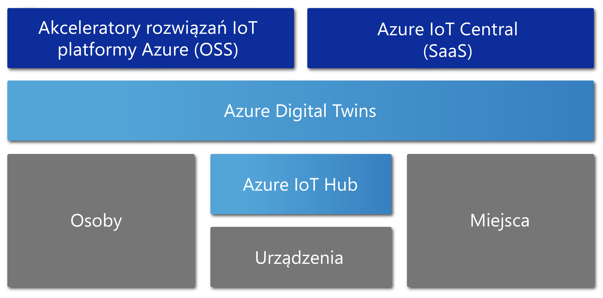

# Omówienie usługi Azure Digital Twins

Azure Digital bliźniaczych reprezentacji w wersji zapoznawczej to usługa Azure IoT, która tworzy kompleksowe modele środowiska fizycznego. Umożliwia ona tworzenie grafów analizy przestrzennej do modelowania relacji i interakcji między osobami, obszarami i urządzeniami.

Usługa Azure Digital Twins pozwala na wykonywanie zapytań o dane z obszaru fizycznego, zamiast z wielu różnorodnych czujników. Ta usługa pomaga w konstruowaniu środowisk wielokrotnego użytku o wysokim stopniu skalowalności, rozpoznających przestrzeń, które łączą dane przesyłane strumieniowo z cyfrowego i fizycznego świata. Twoje aplikacje są rozszerzone o te wyjątkowo dobrze dobrane funkcje kontekstowe. 

Usługa Azure Digital bliźniaczych reprezentacji ma zastosowanie do wszystkich typów środowisk, takich jak magazyny, biura, szkoły, szpitale i banki. Można jej używać nawet w przypadku stadionów, fabryk, parkingów, parków, sieci inteligentnych i miast. Poniżej przedstawiono kilka scenariuszy, w których usługa Azure Digital bliźniaczych reprezentacji może być przydatna:

- Przewidywanie potrzeb związanych z konserwacją w fabryce.
- Analizowanie wymagań energetycznych w czasie rzeczywistym dla sieci elektrycznej.
- Optymalizowanie użycia dostępnej przestrzeni w biurze.
- Śledzenie dziennych temperatur w kilku województwach.
- Monitorowanie złożonych ścieżek dronów.
- Identyfikowanie pojazdów autonomicznych.
- Analizowanie poziomów zajętości budynku.
- Znajdowanie najbardziej zajętej kasy w sklepie.

Każdy rzeczywisty scenariusz biznesowy to prawdopodobnie odpowiednie wystąpienie cyfrowe można zainicjować za pomocą usługi Azure Digital bliźniaczych reprezentacji.

W poniższym klipie wideo bardziej szczegółowo omówiono usługę Azure Digital Twins.

> [!VIDEO https://www.youtube.com/embed/TvN_NxpgyzQ]

## Najważniejsze możliwości

Usługa Azure Digital Twins oferuje następujące kluczowe możliwości.

### Wykres analizy przestrzennej

[*Graf analizy przestrzennej*](./concepts-objectmodel-spatialgraph.md#spatial-intelligence-graph) lub inaczej *graf przestrzenny* jest wirtualną reprezentacją środowiska fizycznego. Umożliwia on modelowanie relacji między osobami, miejscami i urządzeniami.

Wyobraź sobie inteligentną aplikację narzędziową, która obejmuje kilka mierników użycia energii elektrycznej rozmieszczonych na pewnym obszarze. Firma zapewniająca inteligentne usługi komunalne musi precyzyjnie monitorować i przewidywać użycie energii elektrycznej oraz rozliczenia. Każde urządzenie i czujnik musi być modelowany za pomocą kontekstu dotyczącego lokalizacji i klienta, który będzie rozliczany. Graf analizy przestrzennej umożliwia modelowanie złożonych relacji tego rodzaju.

### Cyfrowe modele obiektów bliźniaczych

[Cyfrowe modele obiektów bliźniaczych](./concepts-objectmodel-spatialgraph.md#digital-twins-object-models) to wstępnie zdefiniowane protokoły urządzeń i schematy danych. Są one dostosowane do wymagań specyficznych dla danego obszaru, które przyspieszają i upraszczają tworzenie rozwiązań.

Na przykład aplikacja pokojowa może korzystać ze wstępnie zdefiniowanych typów miejsca, takich jak kampus, budynek, piętro i pokój.

### Wiele dzierżaw i dzierżawy zagnieżdżone

Możesz tworzyć rozwiązania, które są bezpiecznie skalowane i które mogą być używane w wielu dzierżawach. Możesz również tworzyć wiele poddzierżaw, z których można korzystać i do których można uzyskiwać dostęp w izolowany i bezpieczny sposób.

Na przykład aplikację wykorzystania przestrzeni można skonfigurować tak, aby izolowała dane dzierżawy od danych innych dzierżaw w jednym budynku. Może ona też łączyć dane jednej dzierżawy z wieloma budynkami.

### Zaawansowane możliwości obliczeniowe

[Funkcje zdefiniowane przez użytkownika](./concepts-user-defined-functions.md) umożliwiają definiowanie i uruchamianie niestandardowych funkcji względem przychodzących [danych urządzenia](./concepts-device-ingress.md) w celu wysyłania sygnałów do wstępnie zdefiniowanych punktów końcowych. Ta zaawansowana możliwość usprawnia dostosowywanie i automatyzację zadań urządzenia.

Na przykład inteligentna aplikacja rolnicza mogłaby zawierać funkcję zdefiniowaną przez użytkownika do oceniania odczytów czujnika wilgotności gleby oraz prognozy pogody. Następnie mogła by wysyłać sygnały dotyczące potrzeb nawodnienia.

### Wbudowana kontrola dostępu

Funkcje zarządzania dostępem i tożsamościami, takie jak [kontrola dostępu oparta na rolach](./security-role-based-access-control.md) i [usługa Azure Active Directory](./security-authenticating-apis.md), umożliwiają bezpieczne kontrolowanie dostępu osób i urządzeń.

Na przykład aplikację do zarządzania obiektami można skonfigurować tak, aby umożliwić osobom zajmującym pomieszczenie ustawianie temperatury w określonym zakresie. Natomiast menedżerom obiektów można umożliwić ustawianie temperatury w dowolnym pomieszczeniu na dowolną wartość.

### Ekosystem

Wystąpienie usługi Azure Digital Twins można połączyć z wieloma zaawansowanymi usługami platformy Azure. Są to między innymi usługi Azure Stream Analytics, Azure AI i Azure Storage. Należą do nich też usługi Azure Maps, Microsoft Mixed Reality, Dynamics 365 lub Office 365.

Na przykład inteligentna aplikacja dla biurowca mogłaby używać usługi Azure Digital Twins do reprezentowania zespołów i urządzeń znajdujących się na wielu piętrach. Podczas gdy urządzenia przesyłałyby strumieniowo dane na żywo do aprowizowanego wystąpienia usługi Digital Twins, usługa Stream Analytics mogłaby przetwarzać te dane, aby dostarczać kluczowe szczegółowe informacje umożliwiające podjęcie działań. Następnie dane te są zapisywane w usłudze Azure Storage i konwertowane na format pliku możliwy do udostępnienia. Plik jest dystrybuowany w całej organizacji przy użyciu usługi Office 365.

## Rozwiązania, które korzystają z zalet usługi Azure Digital Twins

Usługa Azure Digital Twins przydaje się do reprezentowania świata fizycznego i jego wielu relacji. Upraszcza ona modelowanie IoT, przetwarzanie danych, obsługę zdarzeń i śledzenie urządzeń. Warto rozważyć chociaż kilka z poniższych scenariuszy obejmujących różnorodne branże. Skorzystałyby one na jej zastosowaniu:

* Pokazywanie firmie zajmującej się zarządzaniem nieruchomościami poziomów zajętości pomieszczeń w czasie w celu zgromadzenia wniosków dotyczących najlepszych sposobów konfiguracji budynku biurowego.
* Wyzwalanie biletów zleceń służbowych dla aplikacji mobilnej. Umożliwia to wzywanie ochrony, planowanie pracy dozorców i innych usług w centrum handlowym lub w obiekcie sportowym.
* Pokazywanie osobie pracującej w danym budynku, które pomieszczenia w tym budynku są zajęte w czasie rzeczywistym. Następnie ułatwienie tej osobie zarezerwowania przestrzeni roboczych odpowiadających jej potrzebom.
* Śledzenie, gdzie znajdują się zasoby w przestrzeni.
* Optymalizowanie ładowania pojazdów elektrycznych przez modelowanie preferencji użytkowników i ograniczeń sieci elektrycznej.

## Usługa Azure Digital Twins w kontekście innych usług IoT

Usługa Azure Digital Twins używa usługi Azure IoT Hub w celu łączenia urządzeń IoT i czujników, które na bieżąco aktualizują dane ze świata fizycznego. Na poniższym diagramie pokazano, jak usługa Azure Digital Twins odnosi się do innych usług Azure IoT.

Aby uzyskać więcej informacji na temat IoT, Przeczytaj [technologie i rozwiązania Azure IoT](../iot-fundamentals/iot-services-and-technologies.md).

## Następne kroki

Przejdź do krótkiego pokazu poświęconego usłudze Azure Digital Twins:

>[!div class="nextstepaction"]
>[Szybki start: wyszukiwanie dostępnych pomieszczeń przy użyciu usługi Azure Digital Twins](./quickstart-view-occupancy-dotnet.md)

Przyjrzyj się bliżej aplikacji do zarządzania obiektami, korzystającej z usługi Azure Digital Twins:

>[!div class="nextstepaction"]
>[Samouczek: wdrażanie usługi Azure Digital Twins i konfigurowanie wykresu przestrzennego](./tutorial-facilities-setup.md)

Zapoznaj się z kluczowymi pojęciami usługi Azure Digital Twins:

>[!div class="nextstepaction"]
>[Czym są modele obiektów i grafy analizy przestrzennej w usłudze Digital Twins](./concepts-objectmodel-spatialgraph.md)