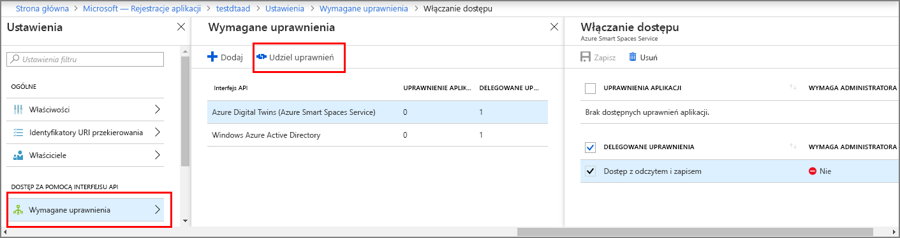

# <a name="how-to-configure-postman-for-azure-digital-twins"></a>Konfigurowanie narzędzia Postman bliźniaki cyfrowych platformy Azure

W tym artykule opisano sposób konfigurowania klienta REST narzędzia Postman do interakcji z i przetestować cyfrowego Twins zarządzania interfejsów API usługi Azure. W szczególności opisano:

* jak skonfigurować aplikację usługi Azure Active Directory, aby korzystać z tego przepływu przyznawanie niejawne protokołu OAuth 2.0.
* Jak wysyłać żądania HTTP żadnego wpływu na token do interfejsów API zarządzania za pomocą klienta REST narzędzia Postman.
* Jak wysyłać wieloczęściowej wiadomości żądania POST do interfejsów API zarządzania przy użyciu narzędzia Postman.

## <a name="postman-summary"></a>Podsumowanie narzędzia postman

Rozpocznij pracę w reprezentacji urządzeń cyfrowych platformy Azure przy użyciu narzędzia klienta REST takiego jak [Postman](https://www.getpostman.com/) przygotowanie lokalnego środowiska testowego. Klient narzędzia Postman ułatwia szybkie tworzenie złożonych żądań HTTP. Pobierz klasycznej wersji klienta programu Postman, przechodząc do [www.getpostman.com/apps](https://www.getpostman.com/apps).

[Postman](https://www.getpostman.com/) REST testuje narzędzia, która lokalizuje kluczowych funkcjach żądania HTTP do przydatne pulpitu i na podstawie wtyczki graficznego interfejsu użytkownika.

Za pomocą klienta programu Postman deweloperzy rozwiązań można określić rodzaj żądania HTTP (*WPIS*, *UZYSKAĆ*, *aktualizacji*, *PATCH*i  *Usuń*), punkt końcowy interfejsu API w celu wywołania i korzystania z protokołu SSL. Postman obsługuje również dodawanie nagłówków żądań HTTP, parametry, dane formularza i treści.

## <a name="configure-azure-active-directory-to-use-the-oauth-20-implicit-grant-flow"></a>Konfigurowanie usługi Azure Active Directory, aby korzystać z tego przepływu przyznawanie niejawne protokołu OAuth 2.0

Konfigurowanie aplikacji usługi Azure Active Directory, aby korzystać z tego przepływu przyznawanie niejawne protokołu OAuth 2.0.

1. Postępuj zgodnie z instrukcjami w [ten przewodnik Szybki Start](https://docs.microsoft.com/azure/active-directory/develop/quickstart-v1-integrate-apps-with-azure-ad) do tworzenia aplikacji usługi Azure AD typu natywnego. Lub możesz ponownie użyć istniejącej rejestracji aplikacji natywnej.

1. W obszarze **wymagane uprawnienia**, wybierz opcję **Dodaj** i wprowadź **Twins cyfrowego Azure** w obszarze **dostępu Dodaj interfejs API**. Jeśli wyszukiwanie nie znajdzie interfejsu API, zamiast tego wyszukaj frazę **Azure Smart Spaces**. Następnie wybierz **Udziel uprawnień > delegowane uprawnienia** i **gotowe**.

    [](../../includes/media/digital-twins-permissions/aad-app-req-permissions.png#lightbox)

1. Wybierz **manifestu** otworzyć manifest aplikacji dla aplikacji. Ustaw *oauth2AllowImplicitFlow* do `true`.

    [](media/how-to-configure-postman/implicit-flow.png#lightbox)

1. Konfigurowanie **adres URL odpowiedzi** do `https://www.getpostman.com/oauth2/callback`.

    [](media/how-to-configure-postman/reply-url.png#lightbox)

1. Skopiuj i Zachowaj **identyfikator aplikacji** aplikacji usługi Azure Active Directory. Jest używany w kolejnych krokach.

## <a name="obtain-an-oauth-20-token"></a>Uzyskiwanie tokenu OAuth 2.0

Następnie instalowanie i Konfigurowanie narzędzia Postman w celu uzyskania tokenu usługi Azure Active Directory. Później dokonać uwierzytelnionego żądania HTTP przy użyciu tokenu uzyskano reprezentacji urządzeń cyfrowych platformy Azure:

1. Przejdź do [www.getpostman.com](https://www.getpostman.com/) pobrać aplikację.
1. Upewnij się, że Twoje **adres URL autoryzacji** jest poprawna. Powinno zająć format:

    ```plaintext
    https://login.microsoftonline.com/YOUR_AZURE_TENANT.onmicrosoft.com/oauth2/authorize?resource=0b07f429-9f4b-4714-9392-cc5e8e80c8b0
    ```

    | Name (Nazwa)  | Zamień na | Przykład |
    |---------|---------|---------|
    | YOUR_AZURE_TENANT | Nazwa dzierżawy lub organizacji | `microsoft` |

1. Wybierz **autoryzacji** zaznacz **OAuth 2.0**, a następnie wybierz pozycję **uzyskać nowy Token dostępu**.

    | Pole  | Wartość |
    |---------|---------|
    | Typ udzielania | `Implicit` |
    | Adres URL wywołania zwrotnego | `https://www.getpostman.com/oauth2/callback` |
    | Adres URL uwierzytelniania | Użyj **adres URL autoryzacji** z kroku 2 |
    | Identyfikator klienta | Użyj **identyfikator aplikacji** aplikacji usługi Azure Active Directory, który został utworzony lub zmodyfikowany w poprzedniej sekcji |
    | Scope | Pozostaw puste |
    | Stan | Pozostaw puste |
    | Uwierzytelnianie klienta | `Send as Basic Auth header` |

1. Klient powinien pojawiają się jako:

    [](media/how-to-configure-postman/postman-oauth-token.png#lightbox)

1. Wybierz **wysłania żądania tokenu**.

    >[!TIP]
    >Jeśli zostanie wyświetlony komunikat o błędzie "Nie można ukończyć OAuth 2", spróbuj wykonać następujące czynności:
    > * Narzędzia Postman, zamknij i otwórz go ponownie i spróbuj ponownie.
  
1. Przewiń w dół i wybierz **użycia tokenu**.

<div id="multi"></div>

## <a name="make-a-multipart-post-request"></a>Wieloczęściowy żądania POST

Po wykonaniu poprzednich kroków, konfigurowanie programu Postman nawiązać uwierzytelnionego wieloczęściowego żądanie HTTP POST:

1. W obszarze **nagłówka** kartę, należy dodać klucz nagłówka żądania HTTP **Content-Type** wartością `multipart/mixed`.

   [](media/how-to-configure-postman/content-type.png#lightbox)

1. Serializowanie danych innych niż tekst w plikach. Dane JSON zostaną zapisane w formacie JSON.
1. W obszarze **treści** kartę, należy dodać każdy plik, przypisując **klucz** nazwę, wybierając `file` lub `text`.
1. Następnie zaznacz każdy plik za pomocą **wybierz plik** przycisku.

   [](media/how-to-configure-postman/form-body.png#lightbox)

   >[!NOTE]
   > * Klient narzędzia Postman nie wymaga posiadania ręcznie przypisanymi fragmentów wieloczęściowej wiadomości **Content-Type** lub **Content-Disposition**.
   > * Nie trzeba określić te nagłówki dla każdej części.
   > * Musisz wybrać `multipart/mixed` lub inną odpowiednią **Content-Type** dla całego żądania.

1. Na koniec wybierz **wysyłania** Aby przesłać żądanie HTTP POST wieloczęściową.

## <a name="next-steps"></a>Kolejne kroki

- Aby dowiedzieć się o interfejsy API umożliwiające zarządzanie cyfrowego bliźniaczych reprezentacji i sposobu ich używania, przeczytaj [jak używać interfejsów API zarządzania Twins cyfrowego Azure](how-to-navigate-apis.md).

- Użyj wieloczęściowego żądania [Dodaj obiekty BLOB Azure cyfrowego bliźniaczych reprezentacji jednostek](./how-to-add-blobs.md).

- Aby dowiedzieć się więcej o uwierzytelnianiu przy użyciu interfejsów API Management, przeczytaj [Uwierzytelnij za pomocą interfejsów API](./security-authenticating-apis.md).