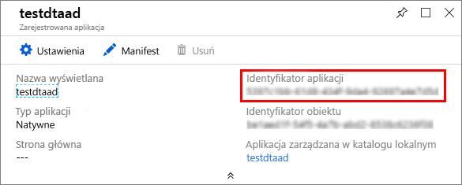

# <a name="how-to-configure-postman-for-azure-digital-twins"></a>Jak skonfigurować usługę Poster dla usługi bliźniaczych reprezentacji Digital

W tym artykule opisano sposób konfigurowania klienta REST programu post na potrzeby współdziałania z interfejsami API zarządzania usługą Azure Digital bliźniaczych reprezentacji oraz ich testowania. W szczegółach opisano:

* Jak skonfigurować aplikację Azure Active Directory tak, aby korzystała z niejawnego przepływu uwierzytelniania OAuth 2,0.
* Jak używać klienta REST programu post do tworzenia żądań HTTP z tokenami do interfejsów API zarządzania.
* Jak za pomocą programu Ogłoś utworzyć wieloczęściowe żądania POST do interfejsów API zarządzania.

## <a name="postman-summary"></a>Podsumowanie ogłoszeń

Zacznij korzystać z usługi Azure Digital bliźniaczych reprezentacji, używając narzędzia klienta REST, takiego jak program do [publikowania](https://www.getpostman.com/) w celu przygotowania lokalnego środowiska testowania. Klient programu Poster pomaga szybko utworzyć złożone żądania HTTP. Pobierz wersję Desktop klienta programu Poster, przechodząc do [www.getpostman.com/apps](https://www.getpostman.com/apps).

[Poster](https://www.getpostman.com/) to narzędzie do testowania REST, które lokalizuje kluczowe funkcje żądania HTTP w UŻYTECZNym interfejsie użytkownika opartym na komputerach stacjonarnych i wtyczkach.

Za pośrednictwem klienta programu Poster deweloperzy rozwiązań mogą określić rodzaj żądania HTTP (*post*, *Get*, *Update*, *patch*i *delete*), punkt końcowy interfejsu API do wywołania i użycie protokołu SSL. Program pocztowy obsługuje także Dodawanie nagłówków żądań HTTP, parametrów, formularzy i danych oraz treści.

## <a name="configure-azure-active-directory-to-use-the-oauth-20-implicit-grant-flow"></a>Konfigurowanie Azure Active Directory do użycia niejawnego przepływu uwierzytelniania OAuth 2,0

Skonfiguruj aplikację Azure Active Directory tak, aby korzystała z niejawnego przepływu uwierzytelniania OAuth 2,0.

1. Otwórz okienko **uprawnień interfejsu API** dla rejestracji aplikacji. Wybierz przycisk **Dodaj uprawnienie** . W okienku **uprawnienia żądania interfejsu API** wybierz pozycję **interfejsy API Moja organizacja używa** karty, a następnie wyszukaj:
    
    1. `Azure Digital Twins`. Wybierz interfejs API **Digital bliźniaczych reprezentacji platformy Azure** .

        [Interfejs API wyszukiwania ](../../includes/media/digital-twins-permissions/aad-aap-search-api-dt.png#lightbox)

    1. Możesz też wyszukać `Azure Smart Spaces Service`. Wybierz interfejs API **usługi Azure Smart Spaces** .

        [Interfejs API wyszukiwania ](../../includes/media/digital-twins-permissions/aad-app-search-api.png#lightbox)

    > [!IMPORTANT]
    > Nazwa i identyfikator interfejsu API usługi Azure AD, który będzie wyświetlany, zależy od dzierżawcy:
    > * Przeszukaj `Azure Digital Twins`.
    > * Inne konta Microsoft powinny szukać `Azure Smart Spaces Service`.

1. Wybrany interfejs API jest wyświetlany jako **usługa Azure Digital bliźniaczych reprezentacji** w tym samym okienku **uprawnień interfejsu API żądania** . Wybierz listę rozwijaną **Odczyt (1)** , a następnie wybierz pole wyboru **Odczyt. zapis** . Wybierz przycisk **Dodaj uprawnienia** .

    [](../../includes/media/digital-twins-permissions/aad-app-req-permissions.png#lightbox)

1. W zależności od ustawień organizacji może być konieczne wykonanie dodatkowych czynności w celu udzielenia administratorowi dostępu do tego interfejsu API. Aby uzyskać więcej informacji, skontaktuj się z administratorem. Po zatwierdzeniu dostępu administratora kolumna **wymagana zgoda administratora** w okienku **uprawnienia interfejsu API** będzie wyglądać podobnie do poniższego dla interfejsów API:

    [](../../includes/media/digital-twins-permissions/aad-app-admin-consent.png#lightbox)

1. Skonfiguruj drugi **Identyfikator URI przekierowania** do `https://www.getpostman.com/oauth2/callback`.

    [](media/how-to-configure-postman/authentication-redirect-uri.png#lightbox)

1. Aby upewnić się, że [aplikacja jest zarejestrowana jako **Klient publiczny**](https://docs.microsoft.com/azure/active-directory/develop/scenario-desktop-app-registration), Otwórz okienko **uwierzytelnianie** dla rejestracji aplikacji i przewiń w dół w tym okienku. W sekcji **domyślny typ klienta** wybierz pozycję **tak** dla **aplikacji Traktuj jako klient publiczny**i naciśnij przycisk **Zapisz**.

    Sprawdź **tokeny dostępu** , aby włączyć ustawienie **Oauth2AllowImplicitFlow** w pliku manifest. JSON.

    [](../../includes/media/digital-twins-permissions/aad-public-client.png#lightbox)

1. Skopiuj i Zachowaj **Identyfikator aplikacji** Azure Active Directory aplikacji. Jest on używany w kolejnych krokach.

   [Identyfikator aplikacji Azure Active Directory ](../../includes/media//digital-twins-permissions/aad-app-reg-app-id.png#lightbox)


## <a name="obtain-an-oauth-20-token"></a>Uzyskaj token OAuth 2,0

[!INCLUDE [digital-twins-management-api](../../includes/digital-twins-management-api.md)]

Skonfiguruj i skonfiguruj aplikację do ogłaszania w celu uzyskania tokenu Azure Active Directory. Następnie należy wykonać uwierzytelnione żądanie HTTP na platformie Azure Digital bliźniaczych reprezentacji przy użyciu uzyskanego tokenu:

1. Przejdź do [www.getpostman.com](https://www.getpostman.com/) , aby pobrać aplikację.
1. Sprawdź, czy **adres URL autoryzacji** jest poprawny. Powinien on mieć format:

    ```plaintext
    https://login.microsoftonline.com/YOUR_AZURE_TENANT.onmicrosoft.com/oauth2/authorize?resource=0b07f429-9f4b-4714-9392-cc5e8e80c8b0
    ```

    | Nazwa  | Zamień na | Przykład |
    |---------|---------|---------|
    | YOUR_AZURE_TENANT | Nazwa dzierżawy lub organizacji | `microsoft` |

1. Wybierz kartę **autoryzacja** , wybierz pozycję **OAuth 2,0**, a następnie wybierz pozycję **Pobierz nowy token dostępu**.

    | Pole  | Wartość |
    |---------|---------|
    | Typ udzielenia | `Implicit` |
    | Adres URL wywołania zwrotnego | `https://www.getpostman.com/oauth2/callback` |
    | Adres URL uwierzytelniania | Użyj **adresu URL autoryzacji** z **kroku 2** |
    | Identyfikator klienta | Użyj **identyfikatora aplikacji** dla aplikacji Azure Active Directory, która została utworzona lub ponownie użyta w poprzedniej sekcji |
    | Zakres | Pozostaw puste |
    | Stan | Pozostaw puste |
    | Uwierzytelnianie klienta | `Send as Basic Auth header` |

1. Klient powinien teraz wyglądać następująco:

    [przykład ](media/how-to-configure-postman/configure-postman-oauth-token.png#lightbox)

1. Wybierz pozycję **Request Token** (Zażądaj tokenu).
  
1. Przewiń w dół i wybierz pozycję **Użyj tokenu**.

## <a name="make-a-multipart-post-request"></a>Utwórz wieloczęściowe żądanie POST

Po wykonaniu powyższych kroków Skonfiguruj program do ogłaszania w celu wypróbowania uwierzytelnionego żądania protokołu HTTP wieloczęściowego:

1. Na karcie **nagłówki** Dodaj **Typ zawartości** klucz nagłówka żądania HTTP z wartością `multipart/mixed`.

   [](media/how-to-configure-postman/configure-postman-content-type.png#lightbox)

1. Serializacja danych nietekstowych w plikach. Dane JSON zostałyby zapisane jako plik JSON.
1. Na karcie **treść** wybierz pozycję `form-data`. 
1. Dodaj każdy plik, przypisując nazwę **klucza** , wybierając pozycję `File`.
1. Następnie zaznacz każdy plik za pomocą przycisku **Wybierz plik** .

   [przykład treści formularza klienta w programie ](media/how-to-configure-postman/configure-postman-form-body.png#lightbox)

   >[!NOTE]
   > * Klient programu Poster nie wymaga, aby fragmenty wieloczęściowe miały ręcznie przypisane **elementy Content-Type** i **Content-Dyspozycja**.
   > * Nie trzeba określać tych nagłówków dla każdej części.
   > * Musisz wybrać `multipart/mixed` lub inny odpowiedni **Typ zawartości** dla całego żądania.

1. Na koniec wybierz pozycję **Wyślij** , aby przesłać wieloczęściowe żądanie HTTP POST. Kod stanu `200` lub `201` wskazuje pomyślne żądanie. Odpowiedni komunikat odpowiedzi pojawi się w interfejsie klienta.

## <a name="next-steps"></a>Następne kroki

- Aby dowiedzieć się więcej o interfejsach API usługi Digital bliźniaczych reprezentacji Management i sposobach ich użycia, przeczytaj artykuł [jak korzystać z interfejsów API zarządzania usługą Azure Digital bliźniaczych reprezentacji](how-to-navigate-apis.md).

- Użyj wieloczęściowych żądań, aby [dodać obiekty blob do jednostek usługi Azure Digital bliźniaczych reprezentacji](./how-to-add-blobs.md).

- Aby dowiedzieć się więcej o uwierzytelnianiu za pomocą interfejsów API zarządzania, przeczytaj artykuł [uwierzytelnianie za pomocą interfejsów API](./security-authenticating-apis.md).
