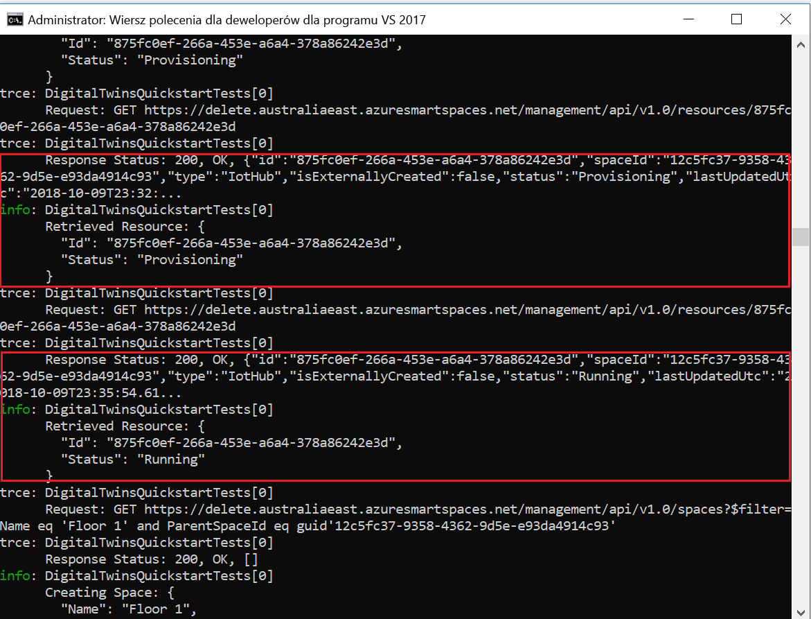
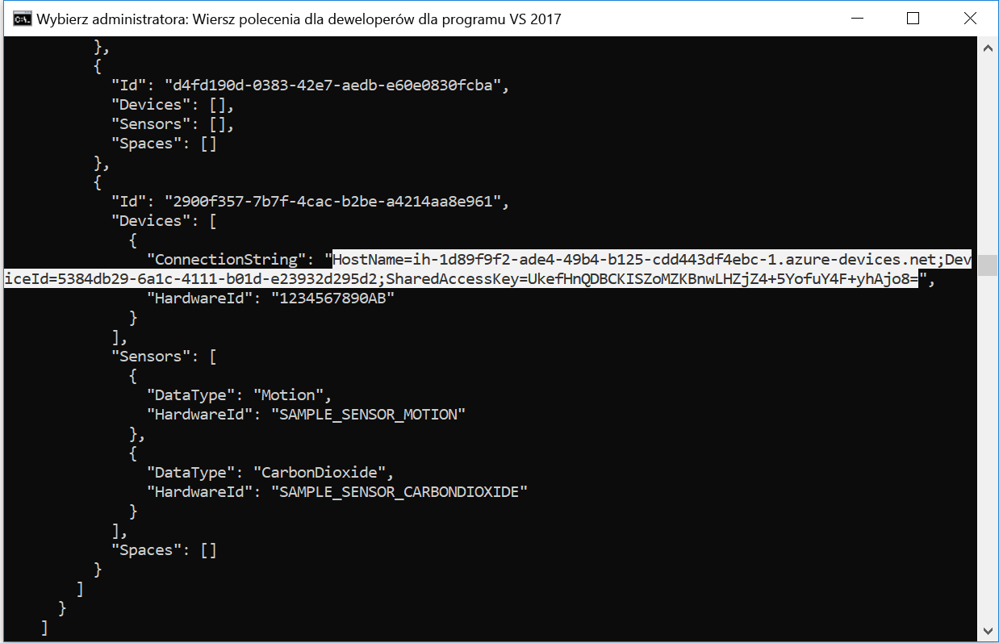
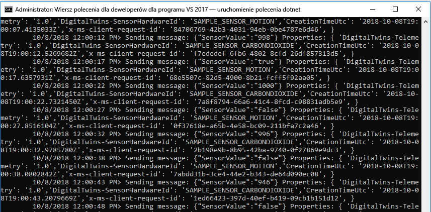
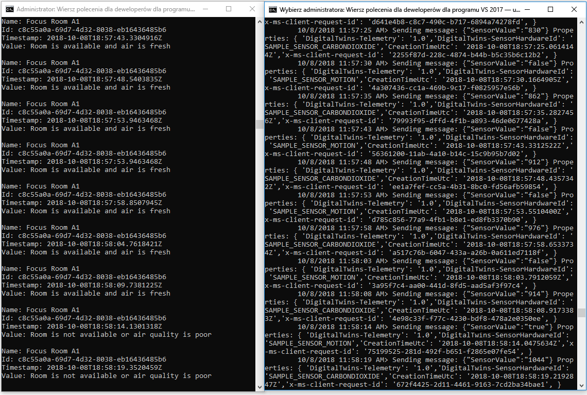

# <a name="quickstart-find-available-rooms-by-using-azure-digital-twins"></a>Szybki start: Wyszukiwanie dostępnych pomieszczeń przy użyciu usługi Azure Digital Twins

Usługa Azure Digital Twins umożliwia odtworzenie cyfrowego obrazu środowiska fizycznego. Mając taki obraz, możesz otrzymywać powiadomienia o zdarzeniach w tym środowisku i dostosować sposoby reagowania na nie.

W tym przewodniku Szybki start używana jest [para przykładów dla platformy .NET](https://github.com/Azure-Samples/digital-twins-samples-csharp) umożliwiających przekształcenie wymyślonego biurowca do postaci cyfrowej. W przewodniku pokazano, jak znaleźć dostępne pomieszczenia w budynku. Za pomocą usługi Digital Twins możesz skojarzyć ze swoim środowiskiem wiele czujników. Możesz również ustalić, czy jakość powietrza w tym pomieszczeniu jest optymalna, korzystając z symulowanego czujnika dwutlenku węgla. Jedna z przykładowych aplikacji generuje losowe dane czujnika, które ułatwiają wizualizację tego scenariusza.

Poniższy klip wideo zawiera podsumowanie konfiguracji przewodnika Szybki start:

>[!VIDEO https://www.youtube.com/embed/1izK266tbMI]

## <a name="prerequisites"></a>Wymagania wstępne

1. Jeśli nie masz jeszcze konta platformy Azure, przed rozpoczęciem utwórz [bezpłatne konto](https://azure.microsoft.com/free/?WT.mc_id=A261C142F).

1. Dwie aplikacje konsolowe uruchamiane w tym przewodniku Szybki start zostały napisane w języku C#. Na komputerze deweloperskim zainstaluj [zestaw .NET Core SDK w wersji 2.1.403 lub nowszej](https://www.microsoft.com/net/download). Jeśli masz zainstalowany zestaw .NET Core SDK, możesz sprawdzić bieżącą wersję języka C# na komputerze deweloperskim. W wierszu polecenia uruchom polecenie `dotnet --version`.

1. Pobierz [przykładowy projekt języka C#](https://github.com/Azure-Samples/digital-twins-samples-csharp/archive/master.zip). Wyodrębnij archiwum digital-twins-samples-csharp-master.zip.

## <a name="create-a-digital-twins-instance"></a>Tworzenie wystąpienia usługi Digital Twins

Utwórz nowe wystąpienie usługi Digital Twins w [portalu](https://portal.azure.com), wykonując kroki opisane w tej sekcji.

[!INCLUDE [create-digital-twins-portal](../../includes/digital-twins-create-portal.md)]

## <a name="set-permissions-for-your-app"></a>Ustawianie uprawnień dla aplikacji

Czynności opisane w tej sekcji pozwalają zarejestrować aplikację przykładową w usłudze Azure Active Directory (Azure AD) w celu umożliwienia tej aplikacji dostępu do wystąpienia usługi Digital Twins. Jeśli już masz zarejestrowaną aplikację usługi Azure AD, możesz wykorzystać ją jako przykład. Upewnij się, że została ona skonfigurowana zgodnie z opisem w tej sekcji.

[!INCLUDE [digital-twins-permissions](../../includes/digital-twins-permissions.md)]

## <a name="build-application"></a>Kompilowanie aplikacji

Skompiluj aplikację dotyczącą zajętości pomieszczeń, wykonując poniższe kroki.

1. Otwórz wiersz polecenia. Przejdź do folderu, w którym zostały wyodrębnione pliki `digital-twins-samples-csharp-master.zip`.
1. Uruchom polecenie `cd occupancy-quickstart/src`.
1. Uruchom polecenie `dotnet restore`.
1. Edytuj plik [appSettings.json](https://github.com/Azure-Samples/digital-twins-samples-csharp/blob/master/occupancy-quickstart/src/appSettings.json), aby zaktualizować następujące zmienne:
    - **ClientId**: wprowadź identyfikator aplikacji zarejestrowanej w usłudze Azure AD, który został zanotowany w poprzedniej sekcji.
    - **Tenant**: wprowadź identyfikator katalogu dzierżawy usługi Azure AD, który również został zanotowany w poprzedniej sekcji.
    - **BaseUrl**: adres URL interfejsu API zarządzania dla wystąpienia usługi Digital Twins, który ma format `https://yourDigitalTwinsName.yourLocation.azuresmartspaces.net/management/api/v1.0/`. Zamień symbole zastępcze w tym adresie URL na wartości odpowiadające Twojemu wystąpieniu z poprzedniej sekcji.

## <a name="provision-graph"></a>Aprowizowanie wykresu

Ten krok obejmuje aprowizację wykresu przestrzennego usługi Digital Twins o następujące elementy:

- Kilka obszarów.
- Jedno urządzenie.
- Dwa czujniki.
- Funkcja niestandardowa.
- Przypisanie jednej roli.

Wykres przestrzenny zostanie zaaprowizowany przy użyciu pliku [provisionSample.yaml](https://github.com/Azure-Samples/digital-twins-samples-csharp/blob/master/occupancy-quickstart/src/actions/provisionSample.yaml).

1. Uruchom polecenie `dotnet run ProvisionSample`.

    >[!NOTE]
    >Używamy narzędzia interfejsu wiersza polecenia platformy Azure logowania do urządzenia, aby uwierzytelnić użytkownika w usłudze Azure AD. Użytkownik musi wprowadzić podany kod, aby przeprowadzić uwierzytelnienie przy użyciu strony [logowania firmy Microsoft](https://microsoft.com/devicelogin). Po wprowadzeniu kodu wykonaj kroki w celu uwierzytelnienia. Uwierzytelnienie użytkownika wymaga uruchomienia narzędzia.

    >[!TIP]
    > Jeśli podczas wykonywania tego kroku pojawi się komunikat o błędzie `EXIT: Unexpected error: The input is not a valid Base-64 string ...`, upewnij się, że zmienne zostały skopiowane poprawnie

1. Aprowizowanie może potrwać kilka minut. W ramach wystąpienia usługi Digital Twins aprowizowane jest również centrum IoT Hub. Działanie pętli kończy się, gdy stan centrum IoT Hub ma wartość `Running`.

    [](media/quickstart-view-occupancy-dotnet/digital-twins-provision-sample1.png#lightbox)

1. Na koniec wykonywania skopiuj wartość parametru `ConnectionString` urządzenia — będzie ona potrzebna w przykładzie symulatora urządzenia. Skopiuj tylko ciąg wyróżniony na poniższym rysunku.

    [](media/quickstart-view-occupancy-dotnet/digital-twins-provision-sample.png#lightbox)

    >[!TIP]
    > Wykres przestrzenny można wyświetlać i modyfikować przy użyciu narzędzia [Azure Digital Twins Graph Viewer](https://github.com/Azure/azure-digital-twins-graph-viewer).

## <a name="send-sensor-data"></a>Wysyłanie danych z czujników

Wykonaj poniższe kroki, aby skompilować i uruchomić aplikację symulatora czujników.

1. Otwórz nowy wiersz polecenia. Przejdź do pobranego projektu znajdującego się w folderze digital-twins-samples-csharp-master.
1. Uruchom polecenie `cd device-connectivity`.
1. Uruchom polecenie `dotnet restore`.
1. Zmodyfikuj plik [appsettings.json](https://github.com/Azure-Samples/digital-twins-samples-csharp/blob/master/device-connectivity/appsettings.json), aby zaktualizować wartość **DeviceConnectionString** za pomocą wartości `ConnectionString` skopiowanej powyżej.
1. Uruchom polecenie `dotnet run`, aby rozpocząć wysyłanie danych z czujników. Na poniższej ilustracji przedstawiono wysyłanie danych do usługi Digital Twins.

     [](media/quickstart-view-occupancy-dotnet/digital-twins-device-connectivity.png#lightbox)

1. Pozostaw ten symulator uruchomiony, aby jego wyniki były widoczne obok wyników uzyskanych po wykonaniu kolejnego kroku. To okno zawiera dane symulowanych czujników wysyłane do usługi Digital Twins. Następny krok obejmuje wysyłanie zapytania w czasie rzeczywistym, które umożliwia znalezienie dostępnych pomieszczeń ze świeżym powietrzem.

    >[!TIP]
    > Jeśli podczas wykonywania tego kroku pojawi się komunikat o błędzie `EXIT: Unexpected error: The input is not a valid Base-64 string ...`, upewnij się, że wartość `DeviceConnectionString` została skopiowana poprawnie

## <a name="find-available-spaces-with-fresh-air"></a>Znajdowanie dostępnych obszarów ze świeżym powietrzem

W przykładzie są symulowane losowe wartości z dwóch czujników. Są to czujnik ruchu i czujnik dwutlenku węgla. Dostępne obszary ze świeżym powietrzem są zdefiniowane w naszym przykładzie przez brak obecności w pomieszczeniu. Ponadto poziom dwutlenku węgla musi być niższy niż 1000 ppm. Jeśli ten warunek nie jest spełniony, to pomieszczenie nie jest dostępne lub jakość powietrza jest niska.

1. Otwórz wiersz polecenia używany do wykonania wcześniejszego kroku aprowizacji.
1. Uruchom polecenie `dotnet run GetAvailableAndFreshSpaces`.
1. Umieść ten wiersz polecenia obok wiersza polecenia danych czujnika i przyjrzyj się im.

    Jeden wiersz polecenia wysyła symulowane dane ruchu i dwutlenku węgla do usługi Digital Twins co pięć sekund. Drugie polecenie odczytuje wykres w czasie rzeczywistym, aby znaleźć dostępne pomieszczenia ze świeżym powietrzem na podstawie symulowanych danych losowych. Polecenie to wyświetla jeden z tych warunków niemal w czasie rzeczywistym na podstawie ostatnio wysłanych danych czujników:
   - Dostępne pomieszczenia ze świeżym powietrzem.
   - Zajęte pomieszczenie lub niska jakość powietrza w pomieszczeniu.

     [](media/quickstart-view-occupancy-dotnet/digital-twins-get-available.png#lightbox)

Aby lepiej zrozumieć działanie kroków i wywoływanie interfejsów API w tym przewodniku Szybki start, otwórz program [Visual Studio Code](https://code.visualstudio.com/Download) z projektem obszaru roboczego kodu znajdującym się w pliku digital-twins-samples-csharp. Użyj następującego polecenia:

```plaintext
<path>\occupancy-quickstart\src>code ..\..\digital-twins-samples.code-workspace
```

Samouczki zawierają szczegóły dotyczące kodu. Samouczki te przedstawiają modyfikowanie danych konfiguracji i zawierają informacje na temat wywoływanych interfejsów API. Aby uzyskać więcej informacji na temat interfejsów API zarządzania, przejdź do strony struktury Swagger usługi Digital Twins:

```plaintext
https://YOUR_INSTANCE_NAME.YOUR_LOCATION.azuresmartspaces.net/management/swagger
```

| Name | Zamień na |
| --- | --- |
| YOUR_INSTANCE_NAME | Nazwa używanego wystąpienia usługi Digital Twins |
| YOUR_LOCATION | Region serwera, w którym jest hostowane używane wystąpienie |

Dla wygody możesz też otworzyć witrynę [Digital Twins Swagger](https://docs.westcentralus.azuresmartspaces.net/management/swagger).

## <a name="clean-up-resources"></a>Oczyszczanie zasobów

W samouczkach szczegółowo omówiono następujące zagadnienia:

- Tworzenie aplikacji dla menedżerów budynków umożliwiającej zwiększenie wydajności zajmowania pomieszczeń.
- Efektywniejsze zarządzanie budynkiem.

Jeśli planujesz kontynuować pracę z samouczkami, nie usuwaj zasobów utworzonych w tym przewodniku Szybki start. W przeciwnym razie usuń wszystkie zasoby utworzone w tym przewodniku Szybki start.

1. Usuń folder, który został utworzony podczas pobierania przykładowego repozytorium.
1. W menu po lewej stronie w witrynie [Azure Portal](https://portal.azure.com) wybierz pozycję **Wszystkie zasoby**. Następnie wybierz zasób usługi Digital Twins. U góry okienka **Wszystkie zasoby** wybierz polecenie **Usuń**.

    > [!TIP]
    > Jeśli podczas usuwania wystąpienia usługi Digital Twins wystąpił problem, została wdrożona aktualizacja usługi zawierająca poprawkę. Ponów próbę usunięcia wystąpienia.

## <a name="next-steps"></a>Następne kroki

W tym przewodniku Szybki start przedstawiono prosty scenariusz obejmujący znajdowanie pomieszczeń z dobrymi warunkami do pracy. Aby zapoznać się ze szczegółową analizą tego scenariusza, przejdź do następującego samouczka:

>[!div class="nextstepaction"]
>[Samouczek: wdrażanie usługi Azure Digital Twins i konfigurowanie wykresu przestrzennego](tutorial-facilities-setup.md)
