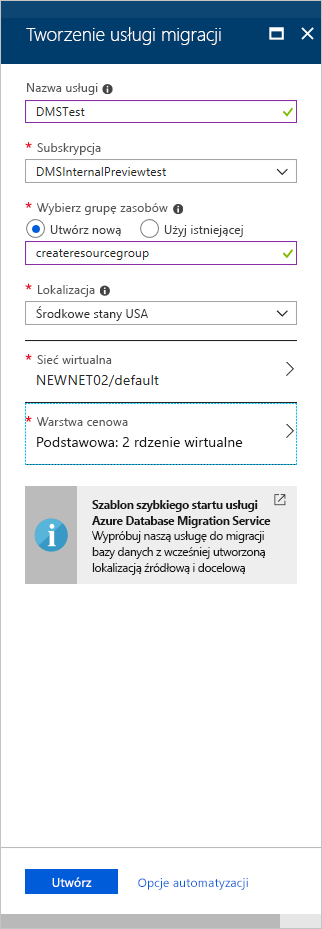
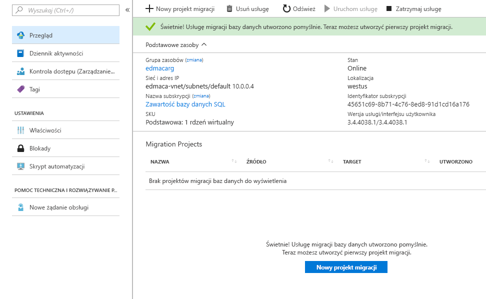

# Szybki start: tworzenie wystąpienia usługi Azure Database Migration Service przy użyciu witryny Azure Portal

W tym przewodniku Szybki start można użyć witryny Azure Portal, aby utworzyć wystąpienie usługi migracji bazy danych platformy Azure.  Po utworzeniu usługi można jej użyć do migracji danych z programu SQL Server lokalnie do bazy danych SQL SQL Database.

Jeśli nie masz subskrypcji platformy Azure, utwórz [bezpłatne](https://azure.microsoft.com/free/) konto przed rozpoczęciem.

## Logowanie się do witryny Azure Portal

Otwórz przeglądarkę internetową, przejdź do witryny [Microsoft Azure Portal](https://portal.azure.com/), a następnie wprowadź swoje poświadczenia, aby zalogować się w portalu.

Widok domyślny to pulpit nawigacyjny usług.

## Rejestrowanie dostawcy zasobów

Przed utworzeniem pierwszego wystąpienia usługi Database Migration Service zarejestruj dostawcę zasobów Microsoft.DataMigration.

1. W witrynie Azure Portal wybierz pozycję **Wszystkie usługi**, a następnie wybierz pozycję **Subskrypcje**.

2. Wybierz subskrypcję, w której chcesz utworzyć wystąpienie usługi migracji bazy danych platformy Azure, a następnie wybierz pozycję **Dostawcy zasobów**.

3. Wyszukaj migrację, a następnie po prawej stronie **microsoft.DataMigration**, wybierz pozycję **Zarejestruj**.

    

## Tworzenie wystąpienia usługi

1. Wybierz +**Utwórz zasób,** aby utworzyć wystąpienie usługi migracji bazy danych platformy Azure.

2. Wyszukaj w witrynie Marketplace hasło „migration”, wybierz pozycję **Azure Database Migration Service**, a następnie na ekranie **Azure Database Migration Service** wybierz pozycję **Utwórz**.

3. Na ekranie **Tworzenie usługi migracji**:

    - Wybierz **nazwę usługi,** która jest zapadawająca zapamiętające i unikatowa, aby zidentyfikować wystąpienie usługi migracji bazy danych platformy Azure.
    - Wybierz **subskrypcję** platformy Azure, w której chcesz utworzyć wystąpienie.
    - Wybierz istniejącą **grupę zasobów** lub utwórz nową.
    - Wybierz pozycję **Lokalizacja** położoną najbliżej Twojego serwera źródłowego lub docelowego.
    - Wybierz istniejącą **sieć wirtualną** lub utwórz jedną.

        Sieć wirtualna zapewnia usługę migracji bazy danych platformy Azure z dostępem do źródłowej bazy danych i środowiska docelowego.

        Aby uzyskać więcej informacji na temat tworzenia sieci wirtualnej w witrynie Azure portal, zobacz artykuł [Tworzenie sieci wirtualnej przy użyciu portalu Azure.](https://aka.ms/vnet)

    - Wybierz opcję Podstawowa: 1 rdzeń wirtualny dla pozycji **Warstwa cenowa**.

        

4. Wybierz **pozycję Utwórz**.

    Po kilku chwilach twoje wystąpienie usługi migracji bazy danych platformy Azure jest tworzony i gotowy do użycia. Usługa migracji bazy danych Platformy Azure jest wyświetlana w sposób pokazany na poniższej ilustracji:

    

## Oczyszczanie zasobów

Możesz wyczyścić zasoby utworzone w tym przewodniku Szybki start, usuwając [grupę zasobów platformy Azure](../azure-resource-manager/management/overview.md). Aby usunąć grupę zasobów, przejdź do utworzonego wystąpienia usługi Azure Database Migration Service. Wybierz nazwę w obszarze **Grupa zasobów**, a następnie wybierz pozycję **Usuń grupę zasobów**. Ta akcja spowoduje usunięcie wszystkich zasobów w grupie zasobów, a także usunięcie samej grupy.

## Następne kroki

> [!div class="nextstepaction"]
> [Migrowanie lokalnego programu SQL Server do usługi Azure SQL Database](tutorial-sql-server-to-azure-sql.md)