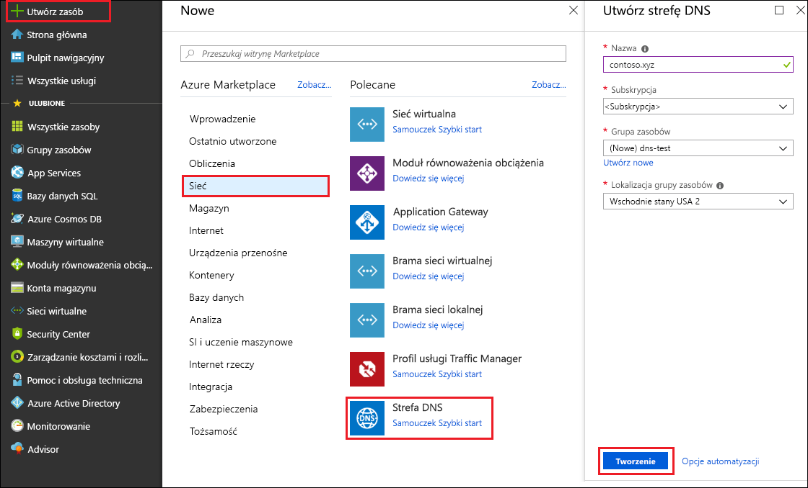
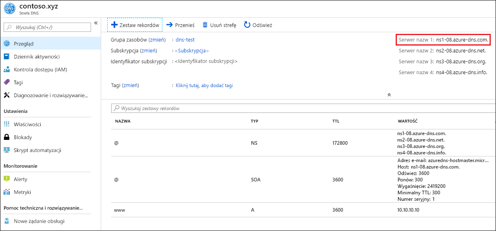

# <a name="quickstart-create-an-azure-dns-zone-and-record-using-the-azure-portal"></a>Szybki Start: Tworzenie strefy Azure DNS i rekordu przy użyciu Azure Portal

Możesz skonfigurować usługę Azure DNS do rozpoznawania nazw hostów w domenie publicznej. Jeśli na przykład nazwa domeny *contoso. xyz* została zakupiona z rejestratora nazw domen, można skonfigurować Azure DNS, aby hostować domenę *contoso. xyz* i rozpoznać *www. contoso. xyz* na adres IP serwera sieci Web lub aplikacji sieci Web.

Podczas pracy z tym przewodnikiem Szybki start utworzysz domenę testową, a następnie rekord adresu powodujący rozpoznawanie nazwy *www* jako adresu IP *10.10.10.10*.

>[!IMPORTANT]
>Wszystkie nazwy i adresy IP w tym przewodniku Szybki start są przykładowe i nie reprezentują rzeczywistych scenariuszy.

<!---
You can also perform these steps using [Azure PowerShell](dns-getstarted-powershell.md) or the cross-platform [Azure CLI](dns-getstarted-cli.md).
--->

Jeśli nie masz subskrypcji platformy Azure, przed rozpoczęciem utwórz [bezpłatne konto](https://azure.microsoft.com/free/?WT.mc_id=A261C142F).

W przypadku wszystkich kroków wykonywanych w portalu należy się zalogować do [witryny Azure Portal](https://portal.azure.com).

## <a name="create-a-dns-zone"></a>Tworzenie strefy DNS

Strefa DNS zawiera wpisy DNS dla domeny. Aby rozpocząć hostowanie domeny w usłudze Azure DNS, należy utworzyć strefę DNS dla tej nazwy domeny. 

**Aby utworzyć strefę DNS:**

1. W lewym górnym rogu wybierz pozycję **Utwórz zasób**, a następnie **Sieć** i **Strefa DNS**.

1. Na stronie **Tworzenie strefy DNS** wpisz lub wybierz następujące wartości:

   - **Nazwa**: wpisz *contoso.xyz* dla przykładu w tym przewodniku Szybki start. Nazwa strefy DNS może być dowolną wartością, która nie jest już skonfigurowana na serwerach usługi Azure DNS. W rzeczywistym scenariuszu tą wartością byłaby domena kupiona u rejestratora nazw domen.
   - **Grupa zasobów**: wybierz pozycję **Utwórz nową**, wprowadź nazwę *zasobu*i wybierz **przycisk OK**. Nazwa grupy zasobów musi być unikatowa w ramach subskrypcji platformy Azure. 

1. Wybierz pozycję **Utwórz**.

   

Tworzenie strefy może potrwać kilka minut.

## <a name="create-a-dns-record"></a>Tworzenie rekordu DNS

Wpisy, czyli rekordy, DNS tworzy się dla domeny w strefie DNS. Utwórz nowy rekordu adresu, czyli rekord „A”, aby umożliwić rozpoznawanie nazwy hosta jako adresu IPv4.

**Aby utworzyć rekord „A”:**

1. W Azure Portal w obszarze **wszystkie zasoby**Otwórz strefę DNS **contoso. xyz** w **grupie zasobów zasobu** . Wartość *contoso.xyz* można wpisać w polu **Filtruj według nazwy**, aby łatwiej znaleźć strefę.

1. W górnej części strony **Strefa DNS** wybierz pozycję **+ Zestaw rekordów**.

1. Na stronie **Dodawanie zestawu rekordów** wpisz lub wybierz następujące wartości:

   - **Nazwa**: wpisz wartość *www*. Nazwa rekordu to nazwa hosta, która ma być rozpoznawana jako określony adres IP.
   - **Typ**: Wybierz **A**. Rekordy "A" są najczęściej używane, ale istnieją inne typy rekordów dla serwerów poczty ("MX"), adresów IP w wersji 6 ("AAAA") itd. 
   - **Czas wygaśnięcia**: wpisz wartość *1*. *Czas wygaśnięcia* żądania DNS określa, jak długo serwery i klienci DNS mogą buforować odpowiedź.
   - **Jednostka czasu wygaśnięcia**: wybierz opcję **Godziny**. Jest to jednostka czasu dla wartości **Czas wygaśnięcia**. 
   - **Adres IP**: dla tego przykładu przewodnika Szybki start wpisz *10.10.10.10*. Ta wartość to adres IP rozpoznawany w przypadku nazwy rekordu. W rzeczywistym scenariuszu byłby to na przykład publiczny adres IP serwera internetowego.

Ponieważ ten przewodnik Szybki Start jest tylko do celów szybkiego testowania, nie ma potrzeby konfigurowania serwerów nazw Azure DNS w rejestratorze nazw domen. W przypadku rzeczywistej domeny produkcyjnej wszyscy użytkownicy Internetu mogą rozpoznać nazwę hosta w celu nawiązania połączenia z serwerem lub aplikacją sieci Web. Odwiedzisz rejestratora nazw domen, aby zastąpić rekordy serwera nazw serwerami nazw usługi Azure DNS. Aby uzyskać więcej informacji, zobacz [Samouczek: hostowanie własnej domeny w usłudze Azure DNS](dns-delegate-domain-azure-dns.md#delegate-the-domain).

## <a name="test-the-name-resolution"></a>Testowanie rozpoznawania nazw

Po utworzeniu testowej strefy DNS z rekordem „A” możesz przetestować rozpoznawanie nazw za pomocą narzędzia o nazwie *nslookup*. 

**Aby przetestować rozpoznawanie nazw DNS:**

1. W Azure Portal w obszarze **wszystkie zasoby**Otwórz strefę DNS **contoso. xyz** w **grupie zasobów zasobu** . Wartość *contoso.xyz* można wpisać w polu **Filtruj według nazwy**, aby łatwiej znaleźć strefę.

1. Skopiuj jedną z nazw serwerów nazw z listy serwerów nazw na stronie **Przegląd**. 

   

1. Otwórz wiersz polecenia i uruchom następujące polecenie:

   ```
   nslookup www.contoso.xyz <name server name>
   ```

   Przykład:

   ```
   nslookup www.contoso.xyz ns1-08.azure-dns.com.
   ```

   Powinna zostać wyświetlona treść podobna do tej na następującym ekranie:

   

Nazwa hosta **www\.contoso. xyz** jest rozpoznawana jako **10.10.10.10**, tak jak została skonfigurowana. Taki wynik potwierdza, że rozpoznawanie nazw działa poprawnie. 

## <a name="clean-up-resources"></a>Oczyszczanie zasobów

Gdy zasoby utworzone w tym przewodniku Szybki Start nie są już potrzebne, usuń je, usuwając **grupę zasobów.** Otwórz grupę **zasobów zasobu** i wybierz pozycję **Usuń grupę zasobów**.

## <a name="next-steps"></a>Następne kroki

> [!div class="nextstepaction"]
> [Create DNS records for a web app in a custom domain (Tworzenie rekordów DNS aplikacji internetowej w domenie niestandardowej)](./dns-web-sites-custom-domain.md)