# <a name="quickstart-route-blob-storage-events-to-web-endpoint-with-the-azure-portal"></a>Szybki Start: kierowanie zdarzeń magazynu obiektów BLOB do punktu końcowego sieci Web za pomocą Azure Portal

Azure Event Grid to usługa obsługi zdarzeń dla chmury. W tym artykule użyjesz witryny Azure Portal do utworzenia konta usługi Blob Storage, subskrybowania zdarzeń dla tego magazynu obiektów blob oraz wyzwalania zdarzenia w celu wyświetlenia wyników. Zazwyczaj użytkownik wysyła zdarzenia do punktu końcowego, w którym następuje przetwarzanie danych zdarzenia i są wykonywane akcje. Jednak aby uprościć ten artykuł, zdarzenia zostaną wysłane do aplikacji internetowej, która zbiera i wyświetla komunikaty.

[!INCLUDE [quickstarts-free-trial-note.md](../../includes/quickstarts-free-trial-note.md)]

Po zakończeniu przekonasz się, że dane zdarzenia zostały wysłane do aplikacji internetowej.

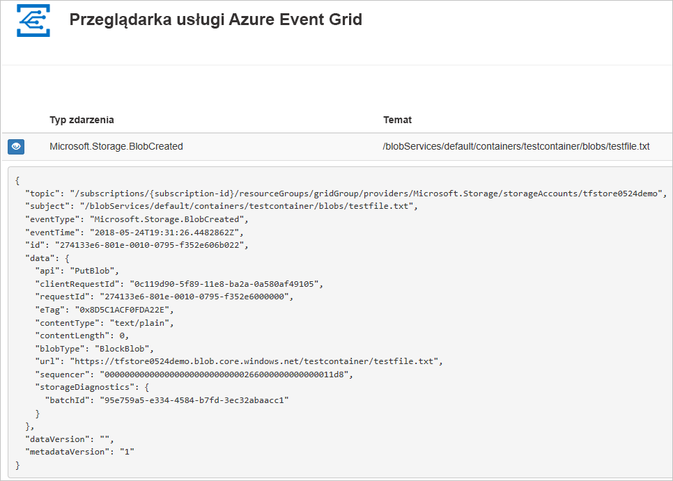

## <a name="create-a-storage-account"></a>Tworzenie konta magazynu

1. Zaloguj się w [portalu Azure](https://portal.azure.com/).

1. Aby utworzyć magazyn Blob Storage, wybierz pozycję **Utwórz zasób**. 

   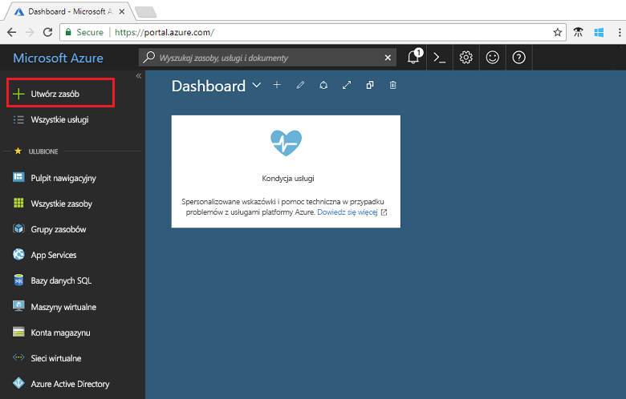

1. Wybierz pozycję **Storage**, aby filtrować według dostępnych opcji, a następnie wybierz pozycję **Konta usługi Storage — Blob, File, Table, Queue**.

   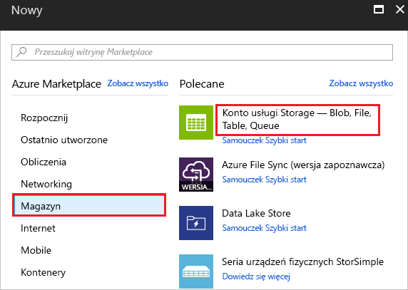

1. Aby zasubskrybować zdarzenia, należy utworzyć konto usługi Storage ogólnego przeznaczenia w wersji 2 lub konto usługi Blob Storage. Aby uzyskać więcej informacji, zobacz temat [Tworzenie konta](../storage/common/storage-quickstart-create-account.md).

   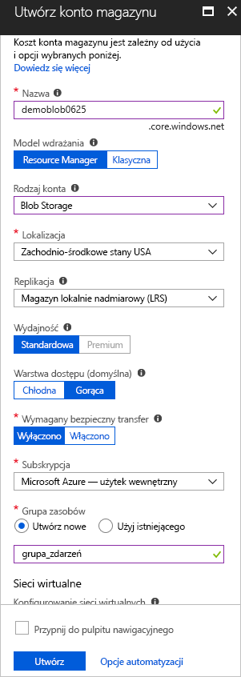

## <a name="create-a-message-endpoint"></a>Tworzenie punktu końcowego komunikatów

Przed zasubskrybowaniem zdarzeń w ramach usługi Blob Storage utwórzmy punkt końcowy dla komunikatów o zdarzeniach. Zazwyczaj w punkcie końcowym akcje są wykonywane na podstawie danych zdarzenia. Aby uprościć ten przewodnik Szybki Start, wdrożysz [wstępnie zbudowaną aplikację sieci Web](https://github.com/Azure-Samples/azure-event-grid-viewer), która będzie wyświetlać komunikaty o zdarzeniach. Wdrożone rozwiązanie zawiera plan usługi App Service, aplikację internetową usługi App Service i kod źródłowy z repozytorium GitHub.

1. Wybierz pozycję **Wdróż na platformie Azure** w celu wdrożenia rozwiązania w subskrypcji. W witrynie Azure Portal podaj wartości parametrów.

   <a href="https://portal.azure.com/#create/Microsoft.Template/uri/https%3A%2F%2Fraw.githubusercontent.com%2FAzure-Samples%2Fazure-event-grid-viewer%2Fmaster%2Fazuredeploy.json" target="_blank"></a>

1. Wdrożenie może potrwać kilka minut. Po pomyślnym wdrożeniu należy wyświetlić aplikację sieci Web i upewnić się, że jest uruchomiona. W przeglądarce sieci Web przejdź do: `https://<your-site-name>.azurewebsites.net`

1. Zobaczysz witrynę, w której nie opublikowano jeszcze żadnych zdarzeń.

   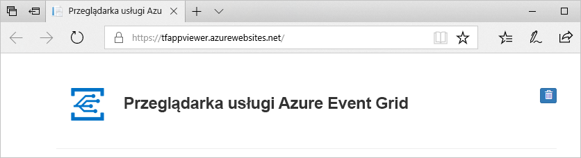

[!INCLUDE [event-grid-register-provider-portal.md](../../includes/event-grid-register-provider-portal.md)]

## <a name="subscribe-to-the-blob-storage"></a>Subskrybowanie usługi Blob Storage

Subskrybowanie tematu ma poinformować usługę Event Grid o tym, które zdarzenia chcesz śledzić i gdzie mają być one wysyłane.

1. W portalu wybierz magazyn obiektów blob, a następnie wybierz pozycję **Zdarzenia**.

   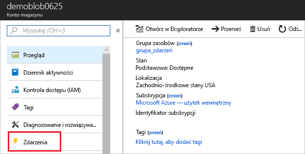

1. W celu wysłania zdarzeń do aplikacji przeglądarki użyj elementu webhook w punkcie końcowym. Wybierz kolejno pozycje **Więcej opcji** i **Element webhook**.

   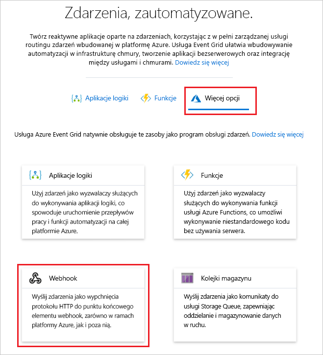

1. Subskrypcja zdarzeń jest wstępnie wypełniana wartościami magazynu Blob Storage. Dla punktu końcowego elementu webhook podaj adres URL aplikacji internetowej i dodaj element `api/updates` do adresu URL strony głównej. Nadaj swojej subskrypcji nazwę. Po zakończeniu wybierz pozycję **Utwórz**.

   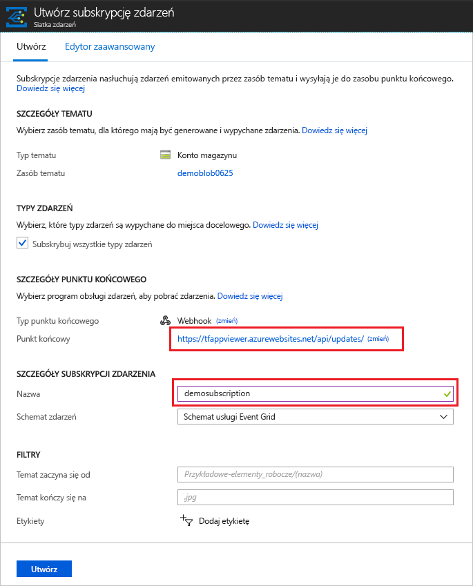

1. Wyświetl aplikację sieci Web ponownie i zwróć uwagę, że zdarzenie sprawdzania poprawności subskrypcji zostało do niej wysłane. Wybierz ikonę oka, aby rozwinąć dane zdarzenia. Usługa Event Grid wysyła zdarzenie weryfikacji, aby w punkcie końcowym mogło nastąpić sprawdzenie, czy dane zdarzenia mają być odbierane. Aplikacja internetowa zawiera kod do sprawdzania poprawności subskrypcji.

   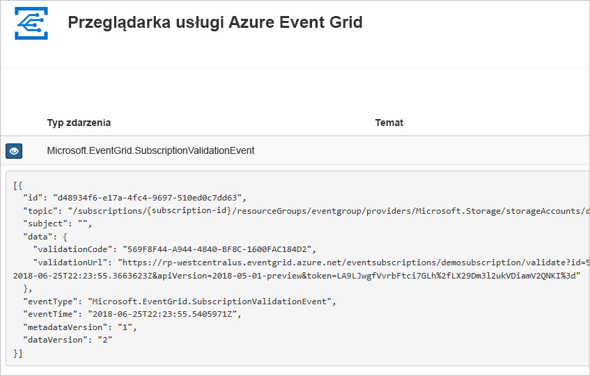

Teraz wyzwólmy zdarzenie, aby zobaczyć, jak usługa Event Grid dystrybuuje komunikat do punktu końcowego.

## <a name="send-an-event-to-your-endpoint"></a>Wysyłanie zdarzenia do punktu końcowego

Zdarzenie magazynu Blob Storage jest wyzwalane przez przekazanie pliku. Plik nie wymaga żadnej określonej zawartości. W artykule założono, że masz plik o nazwie testfile.txt, ale możesz użyć dowolnego pliku.

1. W obszarze magazynu Blob Storage wybierz pozycję **Obiekty blob**.

   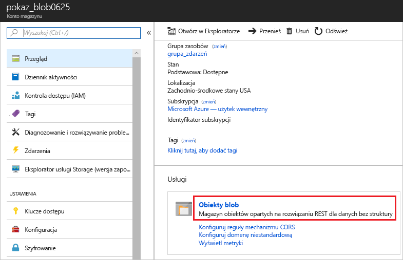

1. Wybierz pozycję **+ Kontener**. Nadaj kontenerowi nazwę i użyj dowolnego poziomu dostępu.

   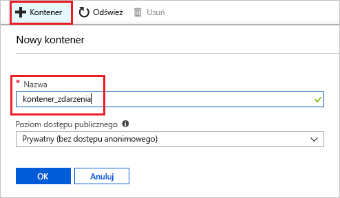

1. Wybierz nowy kontener.

   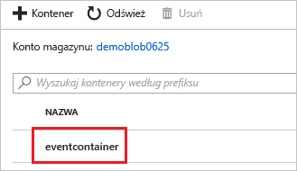

1. Aby przekazać plik, wybierz pozycję **Przekaż**.

   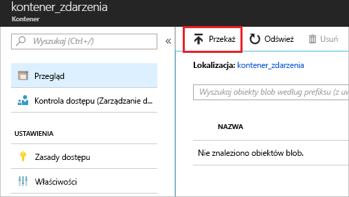

1. Przejdź do pliku testowego i przekaż go.

1. Zdarzenie zostało wyzwolone, a usługa Event Grid wysłała komunikat do punktu końcowego skonfigurowanego podczas subskrybowania. Komunikat jest w formacie JSON i zawiera tablicę z co najmniej jednym zdarzeniem. W poniższym przykładzie komunikat JSON zawiera tablicę z jednym zdarzeniem. Wyświetl aplikację internetową i zwróć uwagę, że otrzymano zdarzenie utworzone przez obiekt blob. 

   ```json
   [{
    "topic": "/subscriptions/{subscription-id}/resourceGroups/eventgroup/providers/Microsoft.Storage/storageAccounts/demoblob0625",
    "subject": "/blobServices/default/containers/eventcontainer/blobs/testfile.txt",
    "eventType": "Microsoft.Storage.BlobCreated",
    "eventTime": "2018-06-25T22:50:41.1823131Z",
    "id": "89a2f9da-c01e-00bb-13d6-0c599506e4e3",
    "data": {
      "api": "PutBlockList",
      "clientRequestId": "41341a9b-e977-4a91-9000-c64125039047",
      "requestId": "89a2f9da-c01e-00bb-13d6-0c5995000000",
      "eTag": "0x8D5DAEE13C8F9ED",
      "contentType": "text/plain",
      "contentLength": 4,
      "blobType": "BlockBlob",
      "url": "https://demoblob0625.blob.core.windows.net/eventcontainer/testfile.txt",
      "sequencer": "00000000000000000000000000001C24000000000004712b",
      "storageDiagnostics": {
        "batchId": "ef633252-32fd-464b-8f5a-0d10d68885e6"
      }
    },
    "dataVersion": "",
    "metadataVersion": "1"
   }]
   ```

## <a name="clean-up-resources"></a>Oczyszczanie zasobów

Jeśli zamierzasz kontynuować pracę z tym zdarzeniem, nie usuwaj zasobów utworzonych w tym artykule. W przeciwnym razie usuń zasoby utworzone w ramach tego artykułu.

Wybierz grupę zasobów, a następnie wybierz pozycję **Usuń grupę zasobów**.

## <a name="next-steps"></a>Następne kroki

Wiesz już, jak tworzyć tematy niestandardowe i subskrypcje zdarzeń. Dowiedz się więcej na temat tego, co może Ci ułatwić usługa Event Grid:

- [Event Grid — informacje](overview.md)
- [Kierowanie zdarzeń usługi Blob Storage do niestandardowego internetowego punktu końcowego](../storage/blobs/storage-blob-event-quickstart.md?toc=%2fazure%2fevent-grid%2ftoc.json)
- [Monitorowanie zmian maszyn wirtualnych za pomocą usług Azure Event Grid i Logic Apps](monitor-virtual-machine-changes-event-grid-logic-app.md)
- [Przesyłanie strumieniowe danych Big Data do magazynu danych](event-grid-event-hubs-integration.md)
