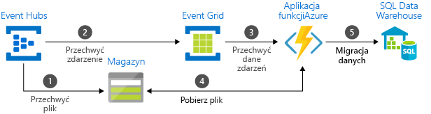

# Wybór usługi do obsługi wiadomości na platformie Azure — Event Grid, Event Hubs i Service Bus

Platforma Azure oferuje 3 usługi, które pomagają dostarczać komunikaty o zdarzeniach w obrębie rozwiązania. Te usługi to:

* [Event Grid](/azure/event-grid/)
* [Event Hubs](/azure/event-hubs/)
* [Service Bus](/azure/service-bus-messaging/)

Mimo iż pod niektórymi względami są one do siebie podobne, każdą z tych usług zaprojektowano z myślą o konkretnych scenariuszach. W tym artykule opisano różnice między tymi usługami w celu ułatwienia wyboru odpowiedniej usługi dla aplikacji. W wielu przypadkach usługi obsługi komunikatów uzupełniają się wzajemnie i można ich używać razem.

## Zdarzenia a usługi obsługi komunikatów

Należy pamiętać o istotnej różnicy między usługami dostarczającymi zdarzenie a usługami dostarczającymi komunikat.

### Wydarzenie

Zdarzenie to lekkie powiadomienie z informacją o zmianie stanu lub warunku. Wydawca zdarzenia nie ma żadnych oczekiwań dotyczących sposobu obsługi zdarzenia. Odbiorca zdarzenia decyduje o tym, co zrobić z powiadomieniem. Zdarzenia mogą być odrębnymi jednostkami lub częścią serii.

Zdarzenia odrębne zgłaszają zmianę stanu i umożliwiają wykonanie akcji. Aby wykonać kolejny krok, odbiorca musi tylko wiedzieć, że coś się wydarzyło. Dane zdarzenia zawierają informacje o tym, co się stało, ale nie zawierają danych, które wyzwoliły zdarzenie. Na przykład zdarzenie powiadamia odbiorców, że utworzono plik. Może ono zawierać ogólne informacje o pliku, ale nie zawiera samego pliku. Zdarzenia odrębne doskonale sprawdzają się w rozwiązaniach [bez serwera](http://azure.com/serverless) wymagających skalowania.

Zdarzenia w serii zgłaszają warunek i nadają się do analizy. Zdarzenia są uporządkowane według czasu i powiązane. Odbiorca potrzebuje sekwencyjnej serii zdarzeń, aby móc przeanalizować, co się zdarzyło.

### Komunikat

Komunikat to nieprzetworzone dane utworzone przez usługę, które mają zostać użyte lub przechowane w innej lokalizacji. Komunikat zawiera dane, które spowodowały wyzwolenie potoku komunikatów. Wydawca komunikatu ma oczekiwanie dotyczące sposobu obsługi komunikatu przez odbiorcę. Pomiędzy obiema stronami obowiązuje kontrakt. Na przykład wydawca wysyła komunikat z nieprzetworzonymi danymi i oczekuje, że odbiorca utworzy plik na podstawie tych danych i wyśle odpowiedź po zakończeniu pracy.

## Porównanie usług

| Usługa | Przeznaczenie | Typ | Kiedy stosować |
| ------- | ------- | ---- | ----------- |
| Event Grid | Programowanie reaktywne | Dystrybucja zdarzeń (odrębne) | Reagowanie na zmiany stanu |
| Event Hubs | Potok danych big data | Przesyłanie strumieniowe zdarzeń (serie) | Przesyłanie strumieniowe rozproszonych danych i telemetrii |
| Service Bus | Obsługa komunikatów o wysokiej wartości w przedsiębiorstwie | Komunikat | Przetwarzanie zamówień i transakcje finansowe |

### Event Grid

Usługa Event Grid to płyta montażowa obsługi zdarzeń umożliwiająca sterowane zdarzeniami programowanie reaktywne. Używa modelu publikuj-subskrybuj. Wydawcy emitują zdarzenia, ale nie mają żadnych oczekiwań dotyczących tego, które zdarzenia zostaną obsłużone. Subskrybenci decydują, które zdarzenia chcą obsłużyć.

Usługa Event Grid jest ściśle zintegrowana z usługami platformy Azure i można ją zintegrować z usługami innych firm. Upraszcza ona używanie zdarzeń i obniża koszty przez wyeliminowanie potrzeby ciągłego sondowania. Usługa Event Grid skutecznie i niezawodnie kieruje zdarzenia z platformy Azure i zasobów spoza platformy Azure. Dystrybuuje zdarzenia do punktów końcowych zarejestrowanych subskrybentów. Komunikat zdarzenia zawiera informacje potrzebne do zareagowania na zmiany w usługach i aplikacjach. Usługa Event Grid nie jest potokiem danych i nie dostarcza rzeczywistego obiektu, który został zaktualizowany.

Usługa Event Grid obejmuje obsługę utraconych komunikatów dla zdarzeń, które nie są dostarczane do punktu końcowego.

Ma następujące cechy:

* dynamiczna skalowalność
* niski koszt
* praca bezserwerowa
* co najmniej jednokrotne dostarczanie

### Event Hubs

Usługa Azure Event Hubs to potok danych big data. Ułatwia przechwytywanie, przechowywanie i ponowne odtwarzanie danych telemetrycznych i danych strumienia zdarzeń. Dane mogą pochodzić z wielu równoczesnych źródeł. Usługa Event Hubs umożliwia udostępnianie danych telemetrycznych i danych zdarzeń różnym infrastrukturom przetwarzania strumieni oraz usługom analizy. Jest dostępna jako strumienie danych albo partie powiązanych zdarzeń. Ta usługa zapewnia pojedyncze rozwiązanie umożliwiające szybkie pobieranie danych na potrzeby przetwarzania w czasie rzeczywistym oraz powtarzane ponowne odtwarzanie przechowywanych nieprzetworzonych danych. Może przechwycić dane przesyłane strumieniowo do pliku na potrzeby przetwarzania i analizy.

Ma następujące cechy:

* małe opóźnienie
* możliwość odbieranie i przetwarzania milionów zdarzeń na sekundę
* co najmniej jednokrotne dostarczanie

### Service Bus

Usługa Service Bus jest przeznaczona dla tradycyjnych aplikacji dla przedsiębiorstw. Te aplikacje dla przedsiębiorstw wymagają obsługi transakcji, zamawiania, wykrywania duplikatów oraz natychmiastowej spójności. Usługa Service Bus umożliwia aplikacjom natywnym dla chmury zapewnianie niezawodnego zarządzania zmianami stanu dla procesów biznesowych. Usługi Azure Service Bus należy użyć w przypadku obsługi komunikatów o wysokiej wartości, które nie mogą być utracone ani zduplikowane. Usługa Service Bus ułatwia także bardzo bezpieczną komunikację między hybrydowymi rozwiązaniami w chmurze oraz może połączyć istniejące systemy lokalne z rozwiązaniami w chmurze.

Usługa Service Bus jest systemem komunikatów obsługiwanych przez brokera. W niezawodny sposób przechowuje komunikaty w „brokerze” (np. w kolejce) do momentu, w którym strona odbierająca będzie gotowa do odebrania komunikatów.

Ma następujące cechy:

* niezawodne asynchroniczne dostarczanie komunikatów (komunikaty w przedsiębiorstwie jako usługa) wymagające sondowania
* zaawansowane funkcje obsługi wiadomości, takie jak FIFO, tworzenie partii / sesje, transakcje, obsługa utraconych komunikatów, kontrola czasowa, routing i filtrowanie oraz wykrywanie duplikatów
* co najmniej jednokrotne dostarczanie
* opcjonalne dostarczanie w określonej kolejności

## Jednoczesne używanie usług

W niektórych przypadkach usług można używać obok siebie w celu spełniania unikatowych ról. Na przykład witryna handlu elektronicznego może przetwarzać zamówienia za pomocą usługi Service Bus, przechwytywać dane telemetryczne za pomocą usługi Event Hubs i odpowiadać na zdarzenia takie jak wysłanie produktu za pomocą usługi Event Grid.

W innych przypadkach można je połączyć ze sobą w celu utworzenia potoku zdarzeń i danych. Usługa Event Grid służy wtedy do reagowania na zdarzenia w innych usługach. Aby zapoznać się z przykładem migrowania danych do magazynu danych za pomocą usług Event Grid i Event Hubs, zobacz [Przesyłanie strumieniowe danych big data do magazynu danych](event-grid-event-hubs-integration.md). Na poniższej ilustracji przedstawiono przepływ pracy przesyłania strumieniowego danych.

## Następne kroki

* Aby uzyskać więcej informacji na temat usług obsługi komunikatów platformy Azure, zobacz wpis w blogu [Events, Data Points, and Messages - Choosing the right Azure messaging service for your data](https://azure.microsoft.com/blog/events-data-points-and-messages-choosing-the-right-azure-messaging-service-for-your-data/) (Zdarzenia, punkty danych i komunikaty — wybieranie odpowiedniej usługi obsługi komunikatów platformy Azure dla Twoich danych).
* Aby zapoznać się z wprowadzeniem do usługi Event Grid, zobacz [Wprowadzenie do usługi Azure Event Grid](overview.md).
* Aby rozpocząć pracę z usługą Event Grid, zobacz [Tworzenie i kierowanie zdarzeń niestandardowych za pomocą usługi Azure Event Grid](custom-event-quickstart.md).
* Aby rozpocząć pracę z usługą Event Hubs, zobacz [Tworzenie przestrzeni nazw usługi Event Hubs i centrum zdarzeń za pomocą witryny Azure Portal](../event-hubs/event-hubs-create.md).
* Aby rozpocząć pracę z usługą Service Bus, zobacz [Tworzenie przestrzeni nazw usługi Service Bus za pomocą witryny Azure Portal](../service-bus-messaging/service-bus-create-namespace-portal.md).
