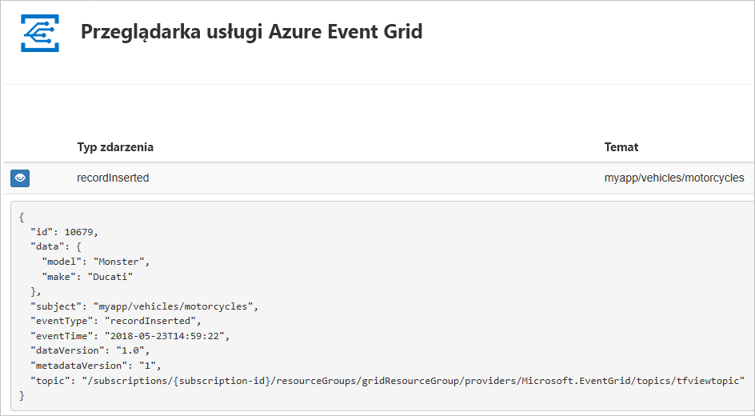
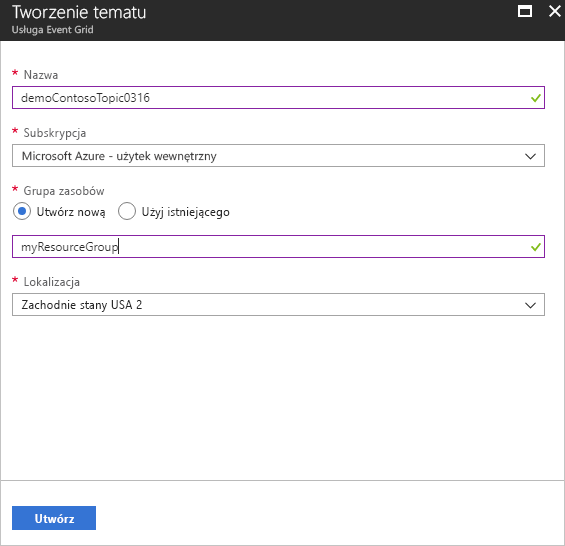
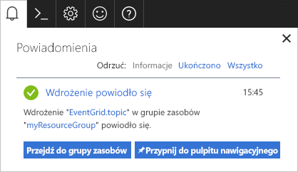
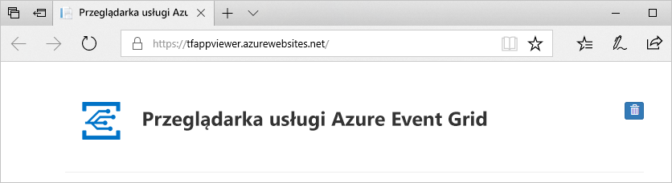
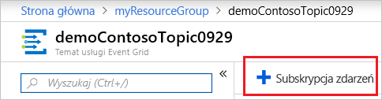
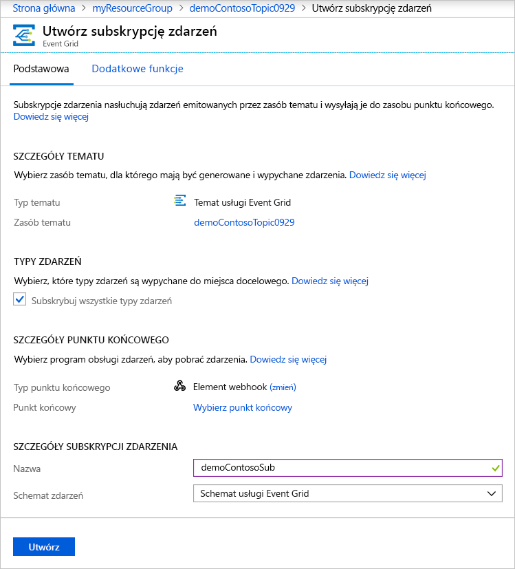
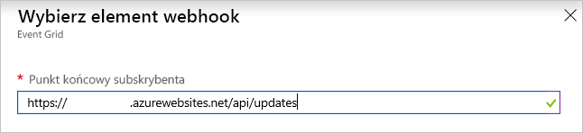
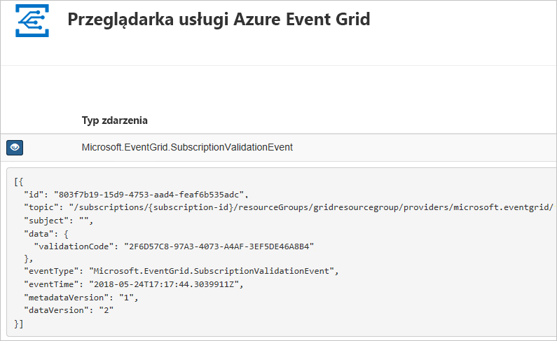

# <a name="quickstart-route-custom-events-to-web-endpoint-with-the-azure-portal-and-event-grid"></a>Szybki start: kierowanie zdarzeń niestandardowych do punktu końcowego sieci Web za pomocą portalu Azure i siatki zdarzeń

Azure Event Grid to usługa obsługi zdarzeń dla chmury. W tym artykule omówiono użycie witryny Azure Portal w celu utworzenia tematu niestandardowego, zasubskrybowania go i wyzwolenia zdarzenia pozwalającego na wyświetlenie wyniku. Zazwyczaj użytkownik wysyła zdarzenia do punktu końcowego, w którym następuje przetwarzanie danych zdarzenia i są wykonywane akcje. Jednak aby uprościć ten artykuł, zdarzenia zostaną wysłane do aplikacji internetowej, która zbiera i wyświetla komunikaty.

Po zakończeniu przekonasz się, że dane zdarzenia zostały wysłane do aplikacji internetowej.



[!INCLUDE [updated-for-az](../../includes/updated-for-az.md)]

[!INCLUDE [quickstarts-free-trial-note.md](../../includes/quickstarts-free-trial-note.md)]

[!INCLUDE [event-grid-register-provider-portal.md](../../includes/event-grid-register-provider-portal.md)]

## <a name="create-a-custom-topic"></a>Tworzenie tematu niestandardowego

Temat usługi Event Grid udostępnia zdefiniowany przez użytkownika punkt końcowy, w którym publikowane są zdarzenia. 

1. Zaloguj się do [witryny Azure portal](https://portal.azure.com/).
2. Wybierz **pozycję Wszystkie usługi** w menu nawigacyjnym po lewej stronie, wyszukaj pozycję **Siatka zdarzeń**i wybierz pozycję Tematy siatki **zdarzeń**. 

    
3. Na stronie **Tematy siatki zdarzeń** wybierz pozycję + **Dodaj** na pasku narzędzi. 

    
4. Na stronie **Tworzenie tematu** wykonaj następujące czynności:
    1. Podaj unikatową **nazwę** tematu niestandardowego. Nazwa tematu musi być unikatowa, ponieważ jest reprezentowana przez wpis DNS. Nie należy używać nazwy widocznej na obrazie. Zamiast tego utwórz własną nazwę — musi mieć od 3 do 50 znaków i może zawierać wyłącznie wartości a–z, A–Z, 0–9 i „-”.
    2. Wybierz swoją **subskrypcję** platformy Azure.
    3. Wybierz istniejącą grupę zasobów lub wybierz **pozycję Utwórz nowy**i wprowadź **nazwę** **grupy zasobów**.
    4. Wybierz **lokalizację** dla tematu siatki zdarzeń.
    5. Zachowaj domyślny **schemat siatki zdarzeń** dla pola Schemat **zdarzeń.** 

       
    6. Wybierz **pozycję Utwórz**. 
5. Po utworzeniu tematu niestandardowego zostanie wyświetlone powiadomienie z informacją o powodzeniu. Wybierz **pozycję Przejdź do grupy zasobów**. 

   
6. Na stronie **Grupa zasobów** wybierz temat siatki zdarzeń. 

   
7. Zostanie wyświetlona strona **Temat siatki zdarzeń** dla siatki zdarzeń. Zachowaj otwartą stronę. Można go użyć w dalszej części przewodnika Szybki start. 

    

## <a name="create-a-message-endpoint"></a>Tworzenie punktu końcowego komunikatów
Przed utworzeniem subskrypcji dla tematu niestandardowego utwórz punkt końcowy dla komunikatu o zdarzeniu. Zazwyczaj w punkcie końcowym akcje są wykonywane na podstawie danych zdarzenia. Aby uprościć ten przewodnik Szybki Start, wdrożysz [wstępnie zbudowaną aplikację sieci Web](https://github.com/Azure-Samples/azure-event-grid-viewer), która będzie wyświetlać komunikaty o zdarzeniach. Wdrożone rozwiązanie zawiera plan usługi App Service, aplikację internetową usługi App Service i kod źródłowy z repozytorium GitHub.

1. Na stronie artykułu wybierz pozycję **Wdrażanie na platformie Azure,** aby wdrożyć rozwiązanie w ramach subskrypcji. W witrynie Azure Portal podaj wartości parametrów.

   <a href="https://portal.azure.com/#create/Microsoft.Template/uri/https%3A%2F%2Fraw.githubusercontent.com%2FAzure-Samples%2Fazure-event-grid-viewer%2Fmaster%2Fazuredeploy.json" target="_blank"></a>
1. Wdrożenie może potrwać kilka minut. Po pomyślnym wdrożeniu należy wyświetlić aplikację sieci Web i upewnić się, że jest uruchomiona. W przeglądarce sieci Web przejdź do: `https://<your-site-name>.azurewebsites.net`
1. Zobaczysz witrynę, w której nie opublikowano jeszcze żadnych zdarzeń.

   

## <a name="subscribe-to-custom-topic"></a>Subskrybowanie do tematu niestandardowego

Zasubskrybowanie tematu pozwala poinformować usługę Event Grid o tym, które zdarzenia chcesz śledzić i gdzie mają być one wysyłane.

1. Teraz na stronie **Temat siatki zdarzeń** dla tematu niestandardowego wybierz + **Subskrypcja zdarzeń** na pasku narzędzi.

   
2. Na stronie **Tworzenie subskrypcji zdarzeń** wykonaj następujące czynności:
    1. Wprowadź **nazwę** subskrypcji zdarzenia.
    3. Wybierz **pozycję Web Hook** dla typu punktu **końcowego**. 
    4. Wybierz **pozycję Wybierz punkt końcowy**. 

       
    5. Dla punktu końcowego elementu webhook podaj adres URL aplikacji internetowej i dodaj element `api/updates` do adresu URL strony głównej. Wybierz pozycję **Potwierdź wybór**.

       
    6. Na stronie **Utwórz subskrypcję zdarzeń** wybierz pozycję **Utwórz**.

3. Wyświetl aplikację sieci Web ponownie i zwróć uwagę, że zdarzenie sprawdzania poprawności subskrypcji zostało do niej wysłane. Wybierz ikonę oka, aby rozwinąć dane zdarzenia. Usługa Event Grid wysyła zdarzenie weryfikacji, aby w punkcie końcowym mogło nastąpić sprawdzenie, czy dane zdarzenia mają być odbierane. Aplikacja internetowa zawiera kod do sprawdzania poprawności subskrypcji.

    

## <a name="send-an-event-to-your-topic"></a>Wysyłanie zdarzenia do tematu

Teraz wyzwólmy zdarzenie, aby zobaczyć, jak usługa Event Grid dystrybuuje komunikat do punktu końcowego. Możesz wysłać zdarzenie testowe do niestandardowego tematu za pomocą interfejsu wiersza polecenia platformy Azure lub programu PowerShell. Zwykle dane zdarzenia są wysyłane przez aplikację lub usługę platformy Azure.

W pierwszym przykładzie użyto interfejsu wiersza polecenia platformy Azure. Pobierany jest adres URL i klucz dla tematu niestandardowego oraz przykładowe dane zdarzenia. Użyj nazwy tematu niestandardowego dla wartości `<topic name>`. Tworzy ona przykładowe dane zdarzenia. Element `data` danych JSON to ładunek zdarzenia. W tym polu można umieścić dowolną poprawnie sformułowaną zawartość JSON. Można też używać pola tematu do zaawansowanego routingu i filtrowania. CURL to narzędzie, które wysyła żądania HTTP.


### <a name="azure-cli"></a>Interfejs wiersza polecenia platformy Azure
1. W witrynie Azure portal wybierz pozycję **Cloud Shell**. Wybierz **bash** w lewym górnym rogu okna Powłoki chmury. 

    
1. Uruchom następujące polecenie, aby uzyskać **punkt końcowy** dla tematu: Po skopiowaniu i wklejeniu polecenia należy zaktualizować **nazwę tematu** i **nazwę grupy zasobów** przed uruchomieniem polecenia. 

    ```azurecli
    endpoint=$(az eventgrid topic show --name <topic name> -g <resource group name> --query "endpoint" --output tsv)
    ```
2. Uruchom następujące polecenie, aby uzyskać **klucz** dla tematu niestandardowego: Po skopiowaniu i wklejeniu polecenia należy zaktualizować **nazwę tematu** i nazwę **grupy zasobów** przed uruchomieniem polecenia. 

    ```azurecli
    key=$(az eventgrid topic key list --name <topic name> -g <resource group name> --query "key1" --output tsv)
    ```
3. Skopiuj następującą instrukcję z definicją zdarzenia i naciśnij klawisz **ENTER**. 

    ```json
    event='[ {"id": "'"$RANDOM"'", "eventType": "recordInserted", "subject": "myapp/vehicles/motorcycles", "eventTime": "'`date +%Y-%m-%dT%H:%M:%S%z`'", "data":{ "make": "Ducati", "model": "Monster"},"dataVersion": "1.0"} ]'
    ```
4. Uruchom następujące polecenie **Curl,** aby zaksięgować zdarzenie:

    ```
    curl -X POST -H "aeg-sas-key: $key" -d "$event" $endpoint
    ```

### <a name="azure-powershell"></a>Azure PowerShell
Drugi przykład obejmuje wykonanie podobnych kroków przy użyciu programu PowerShell.

1. W witrynie Azure **Cloud Shell** portal wybierz cloud `https://shell.azure.com/`shell (alternatywnie przejdź do ). Wybierz program **PowerShell** w lewym górnym rogu okna Powłoki chmury. Zobacz przykładowy obraz okna **powłoki chmury** w sekcji interfejsu wiersza polecenia platformy Azure.
2. Ustaw następujące zmienne. Po skopiowaniu i wklejeniu każdego polecenia należy zaktualizować **nazwę tematu** i **nazwę grupy zasobów** przed uruchomieniem polecenia:

    ```powershell
    $resourceGroupName = <resource group name>
    $topicName = <topic name>
    ```
3. Uruchom następujące polecenia, aby uzyskać **punkt końcowy** i **klucze** dla tematu:

    ```powershell
    $endpoint = (Get-AzEventGridTopic -ResourceGroupName $resourceGroupName -Name $topicName).Endpoint
    $keys = Get-AzEventGridTopicKey -ResourceGroupName $resourceGroupName -Name $topicName
    ```
4. Przygotuj wydarzenie. Skopiuj i uruchom instrukcje w oknie Powłoka chmury. 

    ```powershell
    $eventID = Get-Random 99999

    #Date format should be SortableDateTimePattern (ISO 8601)
    $eventDate = Get-Date -Format s

    #Construct body using Hashtable
    $htbody = @{
        id= $eventID
        eventType="recordInserted"
        subject="myapp/vehicles/motorcycles"
        eventTime= $eventDate   
        data= @{
            make="Ducati"
            model="Monster"
        }
        dataVersion="1.0"
    }
    
    #Use ConvertTo-Json to convert event body from Hashtable to JSON Object
    #Append square brackets to the converted JSON payload since they are expected in the event's JSON payload syntax
    $body = "["+(ConvertTo-Json $htbody)+"]"
    ```
5. Użyj polecenia cmdlet **Invoke-WebRequest,** aby wysłać zdarzenie. 

    ```powershell
    Invoke-WebRequest -Uri $endpoint -Method POST -Body $body -Headers @{"aeg-sas-key" = $keys.Key1}
    ```

### <a name="verify-in-the-event-grid-viewer"></a>Sprawdź w Podglądzie siatki zdarzeń
Zdarzenie zostało wyzwolone, a usługa Event Grid wysłała komunikat do punktu końcowego skonfigurowanego podczas subskrybowania. Wyświetl aplikację sieci Web, aby wyświetlić właśnie wysłane zdarzenie.

```json
{
  "id": "974",
  "eventType": "recordInserted",
  "subject": "myapp/vehicles/motorcycles",
  "eventTime": "2019-03-28T01:11:59+00:00",
  "data": {
    "make": "Ducati",
    "model": "Monster"
  },
  "dataVersion": "1.0",
  "metadataVersion": "1",
  "topic": "/subscriptions/11111111-1111-1111-1111-111111111111/resourceGroups/myegridrg/providers/Microsoft.EventGrid/topics/myegridtopic"
}
```

## <a name="clean-up-resources"></a>Oczyszczanie zasobów
Jeśli zamierzasz kontynuować pracę z tym zdarzeniem, nie usuwaj zasobów utworzonych w tym artykule. W przeciwnym razie usuń zasoby utworzone w ramach tego artykułu.

1. Wybierz **pozycję Grupy zasobów** w menu po lewej stronie. Jeśli nie widzisz go w menu po lewej stronie, wybierz **polecenie Wszystkie usługi** w menu po lewej stronie i wybierz pozycję Grupy **zasobów**. 
2. Wybierz grupę zasobów, aby uruchomić stronę **Grupa zasobów.** 
3. Wybierz **pozycję Usuń grupę zasobów** na pasku narzędzi. 
4. Potwierdź usunięcie, wprowadzając nazwę grupy zasobów, a następnie wybierz pozycję **Usuń**. 

    

    Inna grupa zasobów widoczna na obrazie została utworzona i użyta przez okno Powłoka chmury. Usuń go, jeśli nie planujesz później korzystać z okna Powłoki chmury. 

## <a name="next-steps"></a>Następne kroki

Wiesz już, jak tworzyć tematy niestandardowe i subskrypcje zdarzeń. Dowiedz się więcej na temat tego, co może Ci ułatwić usługa Event Grid:

- [Event Grid — informacje](overview.md)
- [Kierowanie zdarzeń usługi Blob Storage do niestandardowego internetowego punktu końcowego](../storage/blobs/storage-blob-event-quickstart.md?toc=%2fazure%2fevent-grid%2ftoc.json)
- [Monitorowanie zmian maszyn wirtualnych za pomocą usług Azure Event Grid i Logic Apps](monitor-virtual-machine-changes-event-grid-logic-app.md)
- [Przesyłanie strumieniowe danych Big Data do magazynu danych](event-grid-event-hubs-integration.md)
