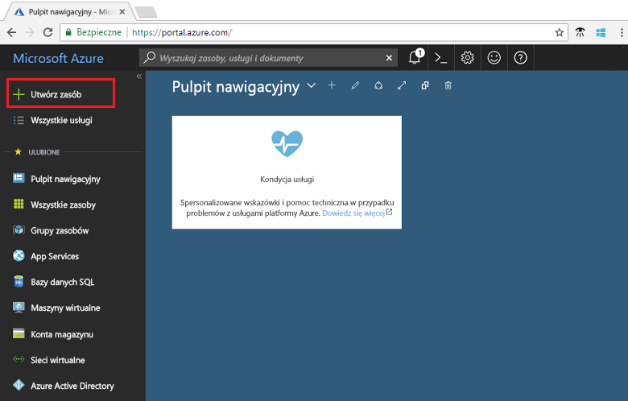
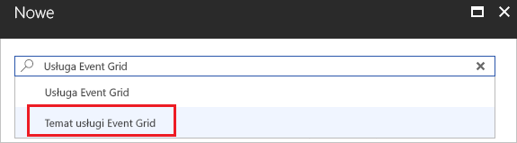
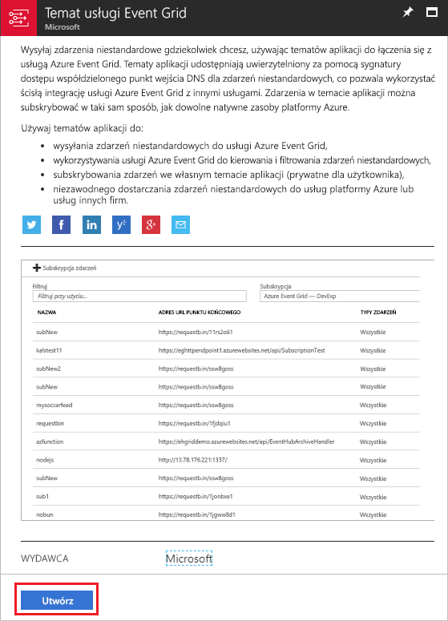
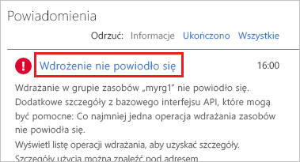
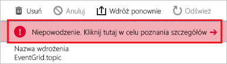
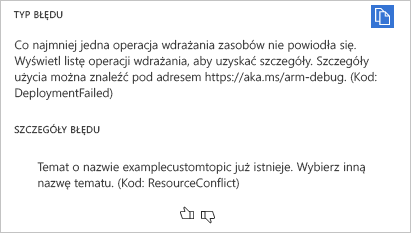
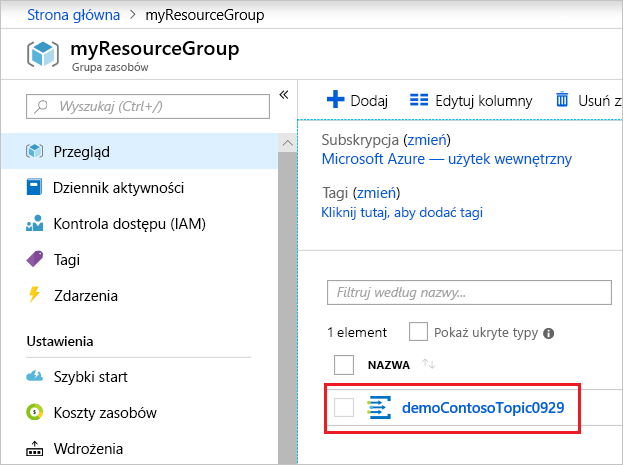

# <a name="quickstart-route-custom-events-to-web-endpoint-with-the-azure-portal-and-event-grid"></a>Szybki start: Kierowanie zdarzeń niestandardowych do internetowego punktu końcowego za pomocą witryny Azure Portal i usługi Event Grid

Azure Event Grid to usługa obsługi zdarzeń dla chmury. W tym artykule omówiono użycie witryny Azure Portal w celu utworzenia tematu niestandardowego, zasubskrybowania go i wyzwolenia zdarzenia pozwalającego na wyświetlenie wyniku. Zazwyczaj użytkownik wysyła zdarzenia do punktu końcowego, w którym następuje przetwarzanie danych zdarzenia i są wykonywane akcje. Jednak aby uprościć ten artykuł, zdarzenia zostaną wysłane do aplikacji sieci Web, która zbiera i wyświetla komunikaty.

Po zakończeniu przekonasz się, że dane zdarzenia zostały wysłane do aplikacji sieci Web.


[!INCLUDE [quickstarts-free-trial-note.md](../../includes/quickstarts-free-trial-note.md)]

[!INCLUDE [event-grid-register-provider-portal.md](../../includes/event-grid-register-provider-portal.md)]

## <a name="create-a-custom-topic"></a>Tworzenie tematu niestandardowego

Temat usługi Event Grid udostępnia zdefiniowany przez użytkownika punkt końcowy, w którym publikowane są zdarzenia. 

1. Zaloguj się w [portalu Azure](https://portal.azure.com/).

1. Aby utworzyć temat niestandardowy, wybierz pozycję **Utwórz zasób**. 

   

1. Wyszukaj pozycję *Temat usługi Event Grid* i wybierz ją z dostępnych opcji.

   

1. Wybierz pozycję **Utwórz**.

   

1. Podaj unikatową nazwę dla tematu niestandardowego. Nazwa tematu musi być unikatowa, ponieważ jest reprezentowana przez wpis DNS. Nie należy używać nazwy widocznej na obrazie. Zamiast tego utwórz własną nazwę — musi mieć od 3 do 50 znaków i może zawierać wyłącznie wartości a–z, A–Z, 0–9 i „-”. Podaj nazwę grupy zasobów. Wybierz pozycję **Utwórz**.

   

1. Po utworzeniu tematu niestandardowego zostanie wyświetlone powiadomienie z informacją o powodzeniu.

   

   Jeśli wdrożenie nie powiodło się, sprawdź, co było przyczyną błędu. Wybierz pozycję **Wdrożenie nie powiodło się**.

   

   Wybierz komunikat o błędzie.

   

   Na poniższej ilustracji przedstawiono wdrożenie, które zostało zakończone niepowodzeniem, ponieważ nazwa dla tematu niestandardowego jest już używana. Jeśli zostanie wyświetlony ten błąd, spróbuj ponownie wykonać wdrożenie z inną nazwą.

   

## <a name="create-a-message-endpoint"></a>Tworzenie punktu końcowego komunikatów

Przed subskrybowaniem tematu niestandardowego utwórzmy punkt końcowy dla komunikatu o zdarzeniach. Zazwyczaj w punkcie końcowym akcje są wykonywane na podstawie danych zdarzenia. Aby uprościć ten przewodnik Szybki Start, wdrożysz [wstępnie zbudowaną aplikację sieci Web](https://github.com/Azure-Samples/azure-event-grid-viewer), która będzie wyświetlać komunikaty o zdarzeniach. Wdrożone rozwiązanie zawiera plan usługi App Service, aplikację internetową usługi App Service i kod źródłowy z repozytorium GitHub.

1. Wybierz pozycję **Wdróż na platformie Azure** w celu wdrożenia rozwiązania w subskrypcji. W witrynie Azure Portal podaj wartości parametrów.

   <a href="https://portal.azure.com/#create/Microsoft.Template/uri/https%3A%2F%2Fraw.githubusercontent.com%2FAzure-Samples%2Fazure-event-grid-viewer%2Fmaster%2Fazuredeploy.json" target="_blank"></a>

1. Wdrożenie może potrwać kilka minut. Po pomyślnym wdrożeniu należy wyświetlić aplikację sieci Web i upewnić się, że jest uruchomiona. W przeglądarce sieci Web przejdź do: `https://<your-site-name>.azurewebsites.net`

1. Zobaczysz witrynę, w której nie opublikowano jeszcze żadnych zdarzeń.

   

## <a name="subscribe-to-custom-topic"></a>Subskrybowanie do tematu niestandardowego

Zasubskrybowanie tematu pozwala poinformować usługę Event Grid o tym, które zdarzenia chcesz śledzić i gdzie mają być one wysyłane.

1. Wybierz temat niestandardowy w portalu.

   

1. Wybierz pozycję **+ Subskrypcja zdarzeń**.

   

1. Jako typ punktu końcowego wybierz opcję **Webhook**. Podaj nazwę subskrypcji zdarzeń.

   

1. Wybierz pozycję **Wybierz punkt końcowy**. 

1. Dla punktu końcowego elementu webhook podaj adres URL aplikacji internetowej i dodaj element `api/updates` do adresu URL strony głównej. Wybierz pozycję **Potwierdź wybór**.

   

1. Gdy skończysz podawać wartości związane z subskrypcją zdarzeń, wybierz pozycję **Utwórz**.

Wyświetl aplikację sieci Web ponownie i zwróć uwagę, że zdarzenie sprawdzania poprawności subskrypcji zostało do niej wysłane. Wybierz ikonę oka, aby rozwinąć dane zdarzenia. Usługa Event Grid wysyła zdarzenie weryfikacji, aby w punkcie końcowym mogło nastąpić sprawdzenie, czy dane zdarzenia mają być odbierane. Aplikacja sieci Web zawiera kod do sprawdzania poprawności subskrypcji.


## <a name="send-an-event-to-your-topic"></a>Wysyłanie zdarzenia do tematu

Teraz wyzwólmy zdarzenie, aby zobaczyć, jak usługa Event Grid dystrybuuje komunikat do punktu końcowego. Możesz wysłać zdarzenie testowe do niestandardowego tematu za pomocą interfejsu wiersza polecenia platformy Azure lub programu PowerShell. Zwykle dane zdarzenia są wysyłane przez aplikację lub usługę platformy Azure.

W pierwszym przykładzie użyto interfejsu wiersza polecenia platformy Azure. Pobierany jest adres URL i klucz dla tematu niestandardowego oraz przykładowe dane zdarzenia. Użyj nazwy tematu niestandardowego dla wartości `<topic_name>`. Tworzy ona przykładowe dane zdarzenia. Element `data` danych JSON to ładunek zdarzenia. W tym polu można umieścić dowolną poprawnie sformułowaną zawartość JSON. Można też używać pola tematu do zaawansowanego routingu i filtrowania. CURL to narzędzie, które wysyła żądania HTTP.

```azurecli-interactive
endpoint=$(az eventgrid topic show --name <topic_name> -g myResourceGroup --query "endpoint" --output tsv)
key=$(az eventgrid topic key list --name <topic_name> -g myResourceGroup --query "key1" --output tsv)

event='[ {"id": "'"$RANDOM"'", "eventType": "recordInserted", "subject": "myapp/vehicles/motorcycles", "eventTime": "'`date +%Y-%m-%dT%H:%M:%S%z`'", "data":{ "make": "Ducati", "model": "Monster"},"dataVersion": "1.0"} ]'

curl -X POST -H "aeg-sas-key: $key" -d "$event" $endpoint
```

Drugi przykład obejmuje wykonanie podobnych kroków przy użyciu programu PowerShell.

```azurepowershell-interactive
$endpoint = (Get-AzureRmEventGridTopic -ResourceGroupName gridResourceGroup -Name <topic-name>).Endpoint
$keys = Get-AzureRmEventGridTopicKey -ResourceGroupName gridResourceGroup -Name <topic-name>

$eventID = Get-Random 99999

#Date format should be SortableDateTimePattern (ISO 8601)
$eventDate = Get-Date -Format s

#Construct body using Hashtable
$htbody = @{
    id= $eventID
    eventType="recordInserted"
    subject="myapp/vehicles/motorcycles"
    eventTime= $eventDate   
    data= @{
        make="Ducati"
        model="Monster"
    }
    dataVersion="1.0"
}

#Use ConvertTo-Json to convert event body from Hashtable to JSON Object
#Append square brackets to the converted JSON payload since they are expected in the event's JSON payload syntax
$body = "["+(ConvertTo-Json $htbody)+"]"

Invoke-WebRequest -Uri $endpoint -Method POST -Body $body -Headers @{"aeg-sas-key" = $keys.Key1}
```

Zdarzenie zostało wyzwolone, a usługa Event Grid wysłała komunikat do punktu końcowego skonfigurowanego podczas subskrybowania. Wyświetl aplikację sieci Web, aby wyświetlić właśnie wysłane zdarzenie.

```json
[{
  "id": "1807",
  "eventType": "recordInserted",
  "subject": "myapp/vehicles/motorcycles",
  "eventTime": "2017-08-10T21:03:07+00:00",
  "data": {
    "make": "Ducati",
    "model": "Monster"
  },
  "dataVersion": "1.0",
  "metadataVersion": "1",
  "topic": "/subscriptions/{subscription-id}/resourceGroups/{resource-group}/providers/Microsoft.EventGrid/topics/{topic}"
}]
```


## <a name="clean-up-resources"></a>Oczyszczanie zasobów

Jeśli zamierzasz kontynuować pracę z tym zdarzeniem, nie usuwaj zasobów utworzonych w tym artykule. W przeciwnym razie usuń zasoby utworzone w ramach tego artykułu.

Wybierz grupę zasobów, a następnie wybierz pozycję **Usuń grupę zasobów**.

## <a name="next-steps"></a>Kolejne kroki

Wiesz już, jak tworzyć tematy niestandardowe i subskrypcje zdarzeń. Dowiedz się więcej na temat tego, co może Ci ułatwić usługa Event Grid:

- [Event Grid — informacje](overview.md)
- [Kierowanie zdarzeń usługi Blob Storage do niestandardowego internetowego punktu końcowego](../storage/blobs/storage-blob-event-quickstart.md?toc=%2fazure%2fevent-grid%2ftoc.json)
- [Monitorowanie zmian maszyn wirtualnych za pomocą usług Azure Event Grid i Logic Apps](monitor-virtual-machine-changes-event-grid-logic-app.md)
- [Przesyłanie strumieniowe danych Big Data do magazynu danych](event-grid-event-hubs-integration.md)
