# <a name="create-and-route-custom-events-with-the-azure-portal-and-event-grid"></a>Tworzenie i kierowanie zdarzeń niestandardowych za pomocą witryny Azure Portal i usługi Event Grid

Azure Event Grid to usługa obsługi zdarzeń dla chmury. W tym artykule omówiono tworzenie tematu niestandardowego, subskrybowanie go i wyzwalanie zdarzenia w celu wyświetlenia wyniku za pomocą witryny Azure Portal. Wysyłasz zdarzenie do funkcji platformy Azure, która rejestruje dane zdarzenia. Po zakończeniu przekonasz się, że dane zdarzenia zostały wysłane do punktu końcowego i zarejestrowane.

[!INCLUDE [quickstarts-free-trial-note.md](../../includes/quickstarts-free-trial-note.md)]

## <a name="create-a-custom-topic"></a>Tworzenie tematu niestandardowego

Temat usługi Event Grid udostępnia zdefiniowany przez użytkownika punkt końcowy, w którym publikowane są zdarzenia. 

1. Zaloguj się do witryny [Azure Portal](https://portal.azure.com/).

1. Aby utworzyć temat niestandardowy, wybierz pozycję **Utwórz zasób**. 

   

1. Wyszukaj pozycję *Temat usługi Event Grid* i wybierz ją z dostępnych opcji.

   

1. Wybierz pozycję **Utwórz**.

   

1. Podaj unikatową nazwę dla tematu niestandardowego. Nazwa tematu musi być unikatowa, ponieważ jest reprezentowana przez wpis DNS. Nie należy używać nazwy użytej na obrazie. Zamiast tego utwórz własną nazwę. Wybierz jeden z [obsługiwanych regionów](overview.md). Podaj nazwę grupy zasobów. Wybierz pozycję **Utwórz**.

   

1. Po utworzeniu tematu niestandardowego zostanie wyświetlone powiadomienie z informacją o powodzeniu.

   

   Jeśli wdrożenie nie powiodło się, sprawdź, co było przyczyną błędu. Wybierz pozycję **Wdrożenie nie powiodło się**.

   

   Wybierz komunikat o błędzie.

   

   Na poniższej ilustracji przedstawiono wdrożenie, które zostało zakończone niepowodzeniem, ponieważ nazwa dla tematu niestandardowego jest już używana. Jeśli zostanie wyświetlony ten błąd, spróbuj ponownie wykonać wdrożenie z inną nazwą.

   

## <a name="create-an-azure-function"></a>Tworzenie funkcji platformy Azure

Przed zasubskrybowaniem tematu utwórzmy punkt końcowy dla komunikatów o zdarzeniach. W tym artykule używasz usługi Azure Functions do utworzenia aplikacji funkcji dla punktu końcowego.

1. Aby utworzyć funkcję, wybierz pozycję **Utwórz zasób**.

   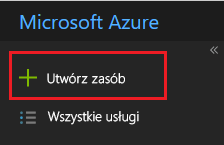

1. Wybierz pozycję **Obliczanie** i **Aplikacja funkcji**.

   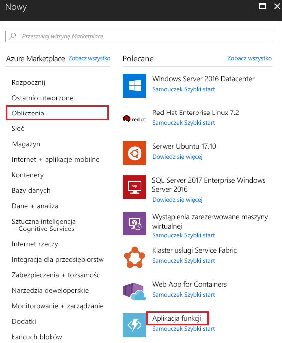

1. Podaj unikatową nazwę dla funkcji platformy Azure. Nie należy używać nazwy użytej na obrazie. Wybierz grupę zasobów utworzoną w ramach tego artykułu. Jako plan hostingu użyj **planu Zużycie**. Użyj sugerowanego nowego konta magazynu. Po podaniu wartości wybierz pozycję **Utwórz**.

   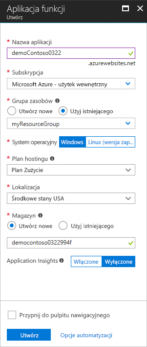

1. Po zakończeniu wdrożenia wybierz pozycję **Przejdź do zasobu**.

   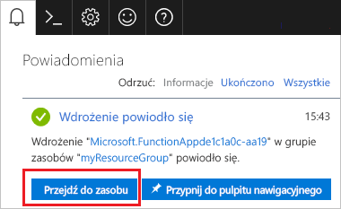

1. Obok pozycji **Funkcje** wybierz pozycję **+**.

   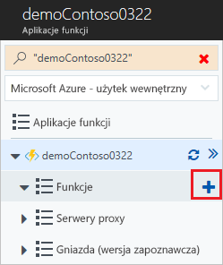

1. Z dostępnych opcji wybierz pozycję **Funkcja niestandardowa**.

   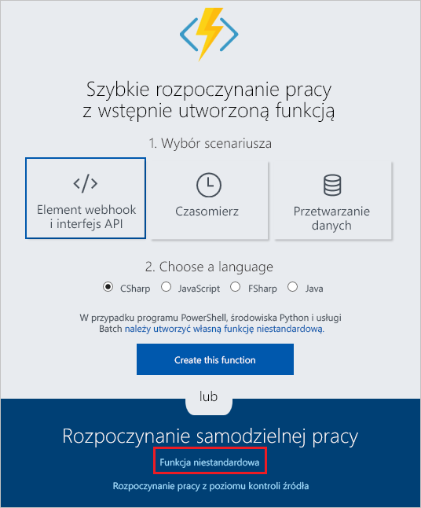

1. Przewiń w dół do pozycji **Wyzwalacz usługi Event Grid**. Wybierz pozycję **C#**.

   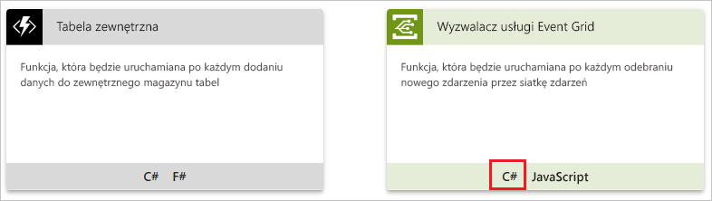

1. Zaakceptuj wartości domyślne, a następnie wybierz pozycję **Utwórz**.

   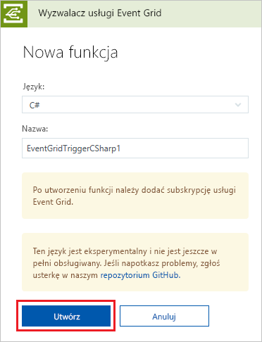

Twoja funkcja jest teraz gotowa do odbierania zdarzeń.

## <a name="subscribe-to-a-topic"></a>Subskrybowanie tematu

Subskrybowanie tematu ma poinformować usługę Event Grid o tym, które zdarzenia chcesz śledzić i gdzie mają być one wysyłane.

1. W funkcji platformy Azure wybierz pozycję **Dodaj subskrypcję usługi Event Grid**.

   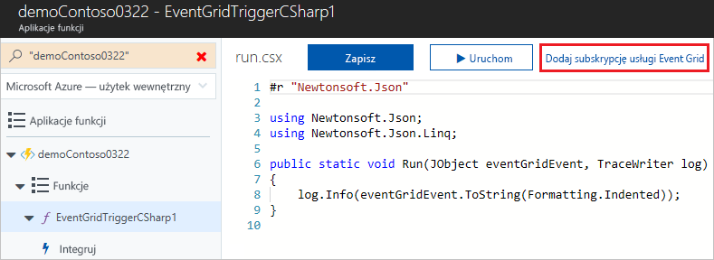

1. Podaj wartości dla subskrypcji. Jako typ tematu wybierz wartość **Tematy usługi Event Grid**. Dla subskrypcji i grupy zasobów wybierz grupę subskrypcję i grupę zasobów, w ramach której utworzono temat niestandardowy. Na przykład wybierz nazwę tematu niestandardowego. Punkt końcowy subskrybenta jest wstępnie wypełniany adresem URL tej funkcji.

   

1. Przed wyzwoleniem zdarzenia otwórz dzienniki funkcji w celu wyświetlenia danych zdarzenia podczas ich wysyłania. W dolnej części funkcji platformy Azure wybierz pozycję **Dzienniki**.

   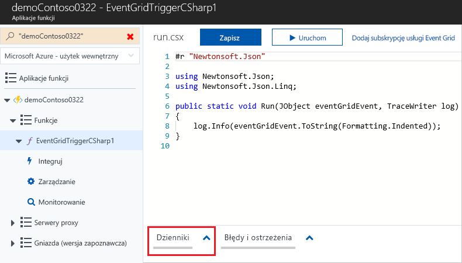

Teraz wyzwólmy zdarzenie, aby zobaczyć, jak usługa Event Grid dystrybuuje komunikat do punktu końcowego. Aby uprościć ten artykuł, użyliśmy usługi Cloud Shell do wysłania przykładowych danych zdarzenia do tematu niestandardowego. Zwykle dane zdarzenia są wysyłane przez aplikację lub usługę platformy Azure.

[!INCLUDE [cloud-shell-try-it.md](../../includes/cloud-shell-try-it.md)]

## <a name="send-an-event-to-your-topic"></a>Wysyłanie zdarzenia do tematu

Po pierwsze uzyskajmy adres URL i klucz dla tematu. Użyj nazwy tematu dla `<topic_name>`.

```azurecli-interactive
endpoint=$(az eventgrid topic show --name <topic_name> -g myResourceGroup --query "endpoint" --output tsv)
key=$(az eventgrid topic key list --name <topic_name> -g myResourceGroup --query "key1" --output tsv)
```

Poniższy przykład pobiera przykładowe dane zdarzenia:

```azurecli-interactive
body=$(eval echo "'$(curl https://raw.githubusercontent.com/Azure/azure-docs-json-samples/master/event-grid/customevent.json)'")
```

Aby wyświetlić pełne zdarzenie, użyj polecenia `echo "$body"`. Element `data` danych JSON to ładunek zdarzenia. W tym polu można umieścić dowolną poprawnie sformułowaną zawartość JSON. Można też używać pola tematu do zaawansowanego routingu i filtrowania.

CURL to narzędzie, które wysyła żądania HTTP. W tym artykule narzędzie CURL jest używane do wysyłania zdarzenia do tematu niestandardowego. 

```azurecli-interactive
curl -X POST -H "aeg-sas-key: $key" -d "$body" $endpoint
```

Zdarzenie zostało wyzwolone, a usługa Event Grid wysłała komunikat do punktu końcowego skonfigurowanego podczas subskrybowania. Sprawdź dzienniki, aby wyświetlić dane zdarzenia.

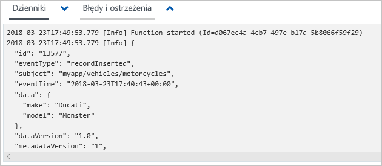

## <a name="clean-up-resources"></a>Oczyszczanie zasobów

Jeśli zamierzasz kontynuować pracę z tym zdarzeniem, nie usuwaj zasobów utworzonych w tym artykule. W przeciwnym razie usuń zasoby utworzone w ramach tego artykułu.

Wybierz grupę zasobów, a następnie wybierz pozycję **Usuń grupę zasobów**.

## <a name="next-steps"></a>Następne kroki

Wiesz już, jak tworzyć tematy niestandardowe i subskrypcje zdarzeń. Dowiedz się więcej na temat tego, co może Ci ułatwić usługa Event Grid:

- [Event Grid — informacje](overview.md)
- [Kierowanie zdarzeń usługi Blob Storage do niestandardowego internetowego punktu końcowego](../storage/blobs/storage-blob-event-quickstart.md?toc=%2fazure%2fevent-grid%2ftoc.json)
- [Monitorowanie zmian maszyn wirtualnych za pomocą usług Azure Event Grid i Logic Apps](monitor-virtual-machine-changes-event-grid-logic-app.md)
- [Przesyłanie strumieniowe danych Big Data do magazynu danych](event-grid-event-hubs-integration.md)
