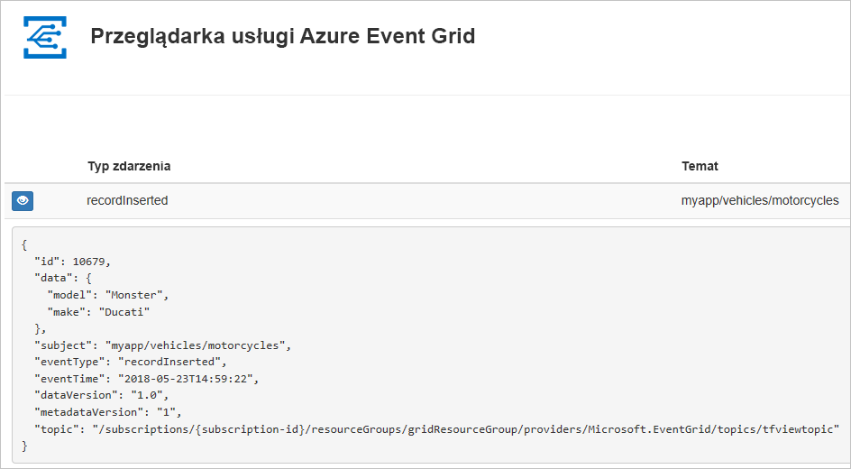
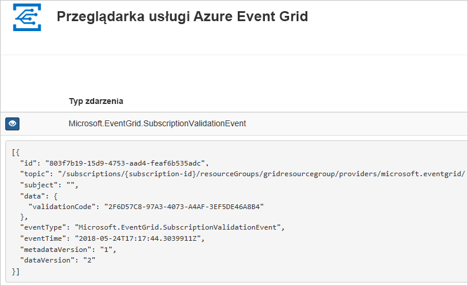

# <a name="quickstart-route-custom-events-to-web-endpoint-with-azure-cli-and-event-grid"></a>Szybki Start: kierowanie zdarzeń niestandardowych do punktu końcowego sieci Web przy użyciu interfejsu wiersza polecenia platformy Azure i Event Grid

Azure Event Grid to usługa obsługi zdarzeń dla chmury. W tym artykule omówiono tworzenie tematu niestandardowego, subskrybowanie go i wyzwalanie zdarzenia w celu wyświetlenia wyniku za pomocą interfejsu wiersza polecenia platformy Azure. Zazwyczaj użytkownik wysyła zdarzenia do punktu końcowego, w którym następuje przetwarzanie danych zdarzenia i są wykonywane akcje. Jednak aby uprościć ten artykuł, zdarzenia zostaną wysłane do aplikacji internetowej, która zbiera i wyświetla komunikaty.

Po zakończeniu przekonasz się, że dane zdarzenia zostały wysłane do aplikacji internetowej.



[!INCLUDE [quickstarts-free-trial-note.md](../../includes/quickstarts-free-trial-note.md)]

[!INCLUDE [cloud-shell-try-it.md](../../includes/cloud-shell-try-it.md)]

Jeśli zdecydujesz się zainstalować interfejs wiersza polecenia i korzystać z niego lokalnie, ten artykuł będzie wymagał interfejsu wiersza polecenia platformy Azure w najnowszej wersji (2.0.24 lub nowszej). Aby dowiedzieć się, jaka wersja jest używana, uruchom polecenie `az --version`. Jeśli konieczna będzie instalacja lub uaktualnienie, zobacz [Instalowanie interfejsu wiersza polecenia platformy Azure](/cli/azure/install-azure-cli).

Jeśli nie korzystasz z usługi Cloud Shell, musisz się najpierw zalogować za pomocą polecenia `az login`.

## <a name="create-a-resource-group"></a>Utwórz grupę zasobów

Tematy usługi Event Grid to zasoby platformy Azure i muszą być umieszczone w grupie zasobów platformy Azure. Grupa zasobów to kolekcja logiczna przeznaczona do wdrażania zasobów platformy Azure i zarządzania nimi.

Utwórz grupę zasobów za pomocą polecenia [az group create](/cli/azure/group#az-group-create). 

Poniższy przykład obejmuje tworzenie grupy zasobów o nazwie *gridResourceGroup* w lokalizacji *westus2*.

```azurecli-interactive
az group create --name gridResourceGroup --location westus2
```

[!INCLUDE [event-grid-register-provider-cli.md](../../includes/event-grid-register-provider-cli.md)]

## <a name="create-a-custom-topic"></a>Tworzenie tematu niestandardowego

Temat usługi Event Grid udostępnia zdefiniowany przez użytkownika punkt końcowy, w którym publikowane są zdarzenia. Poniższy przykład obejmuje tworzenie tematu niestandardowego w grupie zasobów. Zamień `<your-topic-name>` na unikatową nazwę tematu. Nazwa tematu niestandardowego musi być unikatowa, ponieważ stanowi część wpisu DNS. Ponadto musi mieć długość od 3 do 50 znaków i zawierać wyłącznie wartości a–z, A–Z, 0–9 i „-”.

```azurecli-interactive
topicname=<your-topic-name>

az eventgrid topic create --name $topicname -l westus2 -g gridResourceGroup
```

## <a name="create-a-message-endpoint"></a>Tworzenie punktu końcowego komunikatów

Przed subskrybowaniem tematu niestandardowego utwórzmy punkt końcowy dla komunikatu o zdarzeniach. Zazwyczaj w punkcie końcowym akcje są wykonywane na podstawie danych zdarzenia. Aby uprościć ten przewodnik Szybki Start, wdrożysz [wstępnie zbudowaną aplikację sieci Web](https://github.com/Azure-Samples/azure-event-grid-viewer), która będzie wyświetlać komunikaty o zdarzeniach. Wdrożone rozwiązanie zawiera plan usługi App Service, aplikację internetową usługi App Service i kod źródłowy z repozytorium GitHub.

Zastąp `<your-site-name>` unikatową nazwą aplikacji internetowej. Nazwa aplikacji internetowej musi być unikatowa, ponieważ stanowi część wpisu DNS.

```azurecli-interactive
sitename=<your-site-name>

az group deployment create \
  --resource-group gridResourceGroup \
  --template-uri "https://raw.githubusercontent.com/Azure-Samples/azure-event-grid-viewer/master/azuredeploy.json" \
  --parameters siteName=$sitename hostingPlanName=viewerhost
```

Wdrożenie może potrwać kilka minut. Po pomyślnym wdrożeniu należy wyświetlić aplikację sieci Web i upewnić się, że jest uruchomiona. W przeglądarce sieci Web przejdź do: `https://<your-site-name>.azurewebsites.net`

Powinna być widoczna witryna internetowa bez żadnych aktualnie wyświetlanych komunikatów.

## <a name="subscribe-to-a-custom-topic"></a>Subskrybowanie tematu niestandardowego

Zasubskrybowanie tematu pozwala poinformować usługę Event Grid o tym, które zdarzenia chcesz śledzić i gdzie mają być one wysyłane. Poniższy przykład ilustruje subskrybowanie utworzonego tematu niestandardowego i przekazanie adresu URL z aplikacji internetowej jako punktu końcowego dla powiadomień o zdarzeniach.

Punkt końcowy dla aplikacji internetowej musi zawierać sufiks `/api/updates/`.

```azurecli-interactive
endpoint=https://$sitename.azurewebsites.net/api/updates

az eventgrid event-subscription create \
  --source-resource-id "/subscriptions/{subscription-id}/resourceGroups/{resource-group}/providers/Microsoft.EventGrid/topics/$topicname" 
  --name demoViewerSub 
  --endpoint $endpoint
  
```

Wyświetl aplikację sieci Web ponownie i zwróć uwagę, że zdarzenie sprawdzania poprawności subskrypcji zostało do niej wysłane. Wybierz ikonę oka, aby rozwinąć dane zdarzenia. Usługa Event Grid wysyła zdarzenie weryfikacji, aby w punkcie końcowym mogło nastąpić sprawdzenie, czy dane zdarzenia mają być odbierane. Aplikacja internetowa zawiera kod do sprawdzania poprawności subskrypcji.



## <a name="send-an-event-to-your-custom-topic"></a>Wysyłanie zdarzenia do tematu niestandardowego

Wyzwólmy zdarzenie, aby zobaczyć, jak usługa Event Grid dystrybuuje komunikat do punktu końcowego. Po pierwsze uzyskajmy adres URL i klucz tematu niestandardowego.

```azurecli-interactive
endpoint=$(az eventgrid topic show --name $topicname -g gridResourceGroup --query "endpoint" --output tsv)
key=$(az eventgrid topic key list --name $topicname -g gridResourceGroup --query "key1" --output tsv)
```

Dla uproszczenia czynności opisanych w tym artykule do tematu niestandardowego zostaną wysłane przykładowe dane zdarzenia. Zwykle dane zdarzenia są wysyłane przez aplikację lub usługę platformy Azure. Poniższy przykład tworzy przykładowe dane zdarzenia:

```azurecli-interactive
event='[ {"id": "'"$RANDOM"'", "eventType": "recordInserted", "subject": "myapp/vehicles/motorcycles", "eventTime": "'`date +%Y-%m-%dT%H:%M:%S%z`'", "data":{ "make": "Ducati", "model": "Monster"},"dataVersion": "1.0"} ]'
```

Element `data` danych JSON to ładunek zdarzenia. W tym polu można umieścić dowolną poprawnie sformułowaną zawartość JSON. Można też używać pola tematu do zaawansowanego routingu i filtrowania.

CURL to narzędzie, które wysyła żądania HTTP. W tym artykule do wysłania zdarzenia do tematu używane jest narzędzie CURL. 

```azurecli-interactive
curl -X POST -H "aeg-sas-key: $key" -d "$event" $endpoint
```

Zdarzenie zostało wyzwolone, a usługa Event Grid wysłała komunikat do punktu końcowego skonfigurowanego podczas subskrybowania. Wyświetl aplikację sieci Web, aby wyświetlić właśnie wysłane zdarzenie.

```json
[{
  "id": "1807",
  "eventType": "recordInserted",
  "subject": "myapp/vehicles/motorcycles",
  "eventTime": "2017-08-10T21:03:07+00:00",
  "data": {
    "make": "Ducati",
    "model": "Monster"
  },
  "dataVersion": "1.0",
  "metadataVersion": "1",
  "topic": "/subscriptions/{subscription-id}/resourceGroups/{resource-group}/providers/Microsoft.EventGrid/topics/{topic}"
}]
```

## <a name="clean-up-resources"></a>Oczyszczanie zasobów
Jeśli zamierzasz kontynuować pracę z tym zdarzeniem lub aplikacją podglądu zdarzeń, nie usuwaj zasobów utworzonych w tym artykule. W przeciwnym razie użyj poniższego polecenia, aby usunąć zasoby utworzone w ramach tego artykułu.

```azurecli-interactive
az group delete --name gridResourceGroup
```

## <a name="next-steps"></a>Następne kroki

Wiesz już, jak tworzyć tematy i subskrypcje zdarzeń. Dowiedz się więcej na temat tego, co może Ci ułatwić usługa Event Grid:

- [Event Grid — informacje](overview.md)
- [Kierowanie zdarzeń usługi Blob Storage do niestandardowego internetowego punktu końcowego](../storage/blobs/storage-blob-event-quickstart.md?toc=%2fazure%2fevent-grid%2ftoc.json)
- [Monitorowanie zmian maszyn wirtualnych za pomocą usług Azure Event Grid i Logic Apps](monitor-virtual-machine-changes-event-grid-logic-app.md)
- [Przesyłanie strumieniowe danych Big Data do magazynu danych](event-grid-event-hubs-integration.md)
