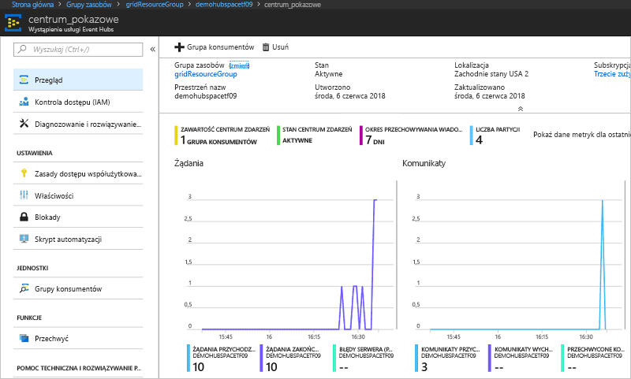

# <a name="quickstart-route-custom-events-to-azure-event-hubs-with-azure-cli-and-event-grid"></a>Szybki start: Kierowanie zdarzeń niestandardowych do usługi Azure Event Hubs za pomocą interfejsu wiersza polecenia platformy Azure i usługi Event Grid

Azure Event Grid to usługa obsługi zdarzeń dla chmury. Usługa Azure Event Hubs jest jedną z obsługiwanych procedur obsługi zdarzeń. W tym artykule omówiono tworzenie tematu niestandardowego, subskrybowanie go i wyzwalanie zdarzenia w celu wyświetlenia wyniku za pomocą interfejsu wiersza polecenia platformy Azure. Zdarzenia są wysyłane do centrum zdarzeń.

[!INCLUDE [quickstarts-free-trial-note.md](../../includes/quickstarts-free-trial-note.md)]

## <a name="create-a-resource-group"></a>Tworzenie grupy zasobów

Tematy usługi Event Grid to zasoby platformy Azure i muszą być umieszczone w grupie zasobów platformy Azure. Grupa zasobów to kolekcja logiczna przeznaczona do wdrażania zasobów platformy Azure i zarządzania nimi.

Utwórz grupę zasobów za pomocą polecenia [az group create](/cli/azure/group#az-group-create). 

Poniższy przykład obejmuje tworzenie grupy zasobów o nazwie *gridResourceGroup* w lokalizacji *westus2*.

```azurecli-interactive
az group create --name gridResourceGroup --location westus2
```

[!INCLUDE [event-grid-register-provider-cli.md](../../includes/event-grid-register-provider-cli.md)]

## <a name="create-a-custom-topic"></a>Tworzenie tematu niestandardowego

Temat usługi Event Grid udostępnia zdefiniowany przez użytkownika punkt końcowy, w którym publikowane są zdarzenia. Poniższy przykład obejmuje tworzenie tematu niestandardowego w grupie zasobów. Zamień nazwę `<your-topic-name>` na unikatową nazwę tematu niestandardowego. Nazwa tematu niestandardowego musi być unikatowa, ponieważ jest reprezentowana przez wpis DNS.

```azurecli-interactive
topicname=<your-topic-name>
az eventgrid topic create --name $topicname -l westus2 -g gridResourceGroup
```

## <a name="create-event-hub"></a>Tworzenie centrum zdarzeń

Przed subskrybowaniem tematu niestandardowego utwórzmy punkt końcowy dla komunikatu o zdarzeniach. Utworzysz centrum zdarzeń w celu zbierania zdarzeń.

```azurecli-interactive
namespace=<unique-namespace-name>
hubname=demohub

az eventhubs namespace create --name $namespace --resource-group gridResourceGroup
az eventhubs eventhub create --name $hubname --namespace-name $namespace --resource-group gridResourceGroup
```

## <a name="subscribe-to-a-custom-topic"></a>Subskrybowanie tematu niestandardowego

Subskrybowanie tematu usługi Event Grid informuje usługę Event Grid o tym, które zdarzenia chcesz śledzić. Poniższy przykład ilustruje subskrybowanie utworzonego tematu niestandardowego i przekazywanie identyfikatora zasobu do centrum zdarzeń dla punktu końcowego. Punkt końcowy ma następujący format:

`/subscriptions/<subscription-id>/resourceGroups/<resource-group-name>/providers/Microsoft.EventHub/namespaces/<namespace-name>/eventhubs/<hub-name>`

Poniższy skrypt pobiera identyfikator zasobu dla centrum zdarzeń i subskrybuje temat usługi Event Grid. Ustawia on typ punktu końcowego na `eventhub` i używa identyfikatora centrum dla punktu końcowego.

```azurecli-interactive
hubid=$(az eventhubs eventhub show --name $hubname --namespace-name $namespace --resource-group gridResourceGroup --query id --output tsv)

az eventgrid event-subscription create \
  --topic-name $topicname \
  -g gridResourceGroup \
  --name subtoeventhub \
  --endpoint-type eventhub \
  --endpoint $hubid
```

Konto używane do tworzenia subskrypcji zdarzeń musi mieć dostęp do zapisu w centrum zdarzeń.

## <a name="send-an-event-to-your-custom-topic"></a>Wysyłanie zdarzenia do tematu niestandardowego

Wyzwólmy zdarzenie, aby zobaczyć, jak usługa Event Grid dystrybuuje komunikat do punktu końcowego. Po pierwsze uzyskajmy adres URL i klucz tematu niestandardowego.

```azurecli-interactive
endpoint=$(az eventgrid topic show --name $topicname -g gridResourceGroup --query "endpoint" --output tsv)
key=$(az eventgrid topic key list --name $topicname -g gridResourceGroup --query "key1" --output tsv)
```

Dla uproszczenia czynności opisanych w tym artykule do tematu niestandardowego zostaną wysłane przykładowe dane zdarzenia. Zwykle dane zdarzenia są wysyłane przez aplikację lub usługę platformy Azure. CURL to narzędzie, które wysyła żądania HTTP. W tym artykule do wysłania zdarzenia do tematu niestandardowego jest używane narzędzie CURL.  W poniższym przykładzie są wysyłane trzy zdarzenia do tematu usługi Event Grid:

```azurecli-interactive
for i in 1 2 3
do
   event='[ {"id": "'"$RANDOM"'", "eventType": "recordInserted", "subject": "myapp/vehicles/motorcycles", "eventTime": "'`date +%Y-%m-%dT%H:%M:%S%z`'", "data":{ "make": "Ducati", "model": "Monster"},"dataVersion": "1.0"} ]'
   curl -X POST -H "aeg-sas-key: $key" -d "$event" $endpoint
done
```

Przejdź do centrum zdarzeń w portalu i zwróć uwagę, że usługa Event Grid wysłała te trzy zdarzenia do centrum zdarzeń.



Zazwyczaj jest tworzona aplikacja, która pobiera zdarzenia z centrum zdarzeń. Aby utworzyć aplikację, która odbiera komunikaty z centrum zdarzeń, zobacz:

* [Wprowadzenie do odbierania komunikatów za pomocą hosta procesora zdarzeń z biblioteki .NET Standard](../event-hubs/event-hubs-dotnet-standard-getstarted-receive-eph.md)
* [Odbieranie zdarzeń z usługi Azure Event Hubs za pomocą języka Java](../event-hubs/event-hubs-java-get-started-receive-eph.md)
* [Odbieranie zdarzeń z usługi Event Hubs za pomocą usługi Apache Storm](../event-hubs/event-hubs-storm-getstarted-receive.md)

## <a name="clean-up-resources"></a>Oczyszczanie zasobów
Jeśli zamierzasz kontynuować pracę z tym zdarzeniem, nie usuwaj zasobów utworzonych w tym artykule. W przeciwnym razie użyj poniższego polecenia, aby usunąć zasoby utworzone w ramach tego artykułu.

```azurecli-interactive
az group delete --name gridResourceGroup
```

## <a name="next-steps"></a>Kolejne kroki

Wiesz już, jak tworzyć tematy i subskrypcje zdarzeń. Dowiedz się więcej na temat tego, co może Ci ułatwić usługa Event Grid:

- [Event Grid — informacje](overview.md)
- [Kierowanie zdarzeń usługi Blob Storage do niestandardowego internetowego punktu końcowego](../storage/blobs/storage-blob-event-quickstart.md?toc=%2fazure%2fevent-grid%2ftoc.json)
- [Monitorowanie zmian maszyn wirtualnych za pomocą usług Azure Event Grid i Logic Apps](monitor-virtual-machine-changes-event-grid-logic-app.md)
- [Przesyłanie strumieniowe danych Big Data do magazynu danych](event-grid-event-hubs-integration.md)
