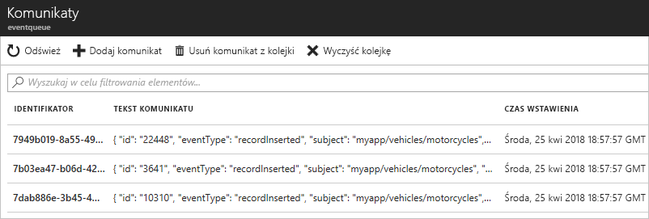

# <a name="quickstart-route-custom-events-to-azure-queue-storage-with-azure-cli-and-event-grid"></a>Szybki start: kierowanie zdarzeń niestandardowych do magazynu kolejki platformy Azure za pomocą interfejsu wiersza polecenia platformy Azure i siatki zdarzeń

Azure Event Grid to usługa obsługi zdarzeń dla chmury. Magazyn kolejek platformy Azure jest jedną z obsługiwanych procedur obsługi zdarzeń. W tym artykule omówiono tworzenie tematu niestandardowego, subskrybowanie go i wyzwalanie zdarzenia w celu wyświetlenia wyniku za pomocą interfejsu wiersza polecenia platformy Azure. Wyślesz zdarzenia do magazynu kolejek.

[!INCLUDE [quickstarts-free-trial-note.md](../../includes/quickstarts-free-trial-note.md)]

[!INCLUDE [cloud-shell-try-it.md](../../includes/cloud-shell-try-it.md)]

Jeśli używasz interfejsu wiersza polecenia platformy Azure lub modułu Azure PowerShell na komputerze lokalnym zamiast usługi Cloud Shell w witrynie Azure Portal, upewnij się, że masz następujące wersje wiersza polecenia platformy Azure i modułu Azure PowerShell. 

- Interfejs wiersza polecenia platformy Azure w wersji 2.0.56 lub nowszej. Aby uzyskać instrukcje na temat instalowania najnowszej wersji interfejsu wiersza polecenia platformy Azure, zobacz [Instalowanie interfejsu wiersza polecenia platformy Azure](/cli/azure/install-azure-cli). 
- Moduł Azure PowerShell w wersji 1.1.0 lub nowszej. Pobierz najnowszą wersję modułu Azure PowerShell na komputer z systemem Windows ze strony [Pliki do pobrania platformy Azure — narzędzia wiersza polecenia](https://azure.microsoft.com/downloads/). 

Ten artykuł zawiera polecenia umożliwiające korzystanie z wiersza polecenia platformy Azure. 

## <a name="create-a-resource-group"></a>Tworzenie grupy zasobów

Tematy usługi Event Grid to zasoby platformy Azure i muszą być umieszczone w grupie zasobów platformy Azure. Grupa zasobów to kolekcja logiczna przeznaczona do wdrażania zasobów platformy Azure i zarządzania nimi.

Utwórz grupę zasobów za pomocą polecenia [az group create](/cli/azure/group#az-group-create). 

Poniższy przykład obejmuje tworzenie grupy zasobów o nazwie *gridResourceGroup* w lokalizacji *westus2*.

```azurecli-interactive
az group create --name gridResourceGroup --location westus2
```

[!INCLUDE [event-grid-register-provider-cli.md](../../includes/event-grid-register-provider-cli.md)]

## <a name="create-a-custom-topic"></a>Tworzenie tematu niestandardowego

Temat usługi Event Grid udostępnia zdefiniowany przez użytkownika punkt końcowy, w którym publikowane są zdarzenia. Poniższy przykład obejmuje tworzenie tematu niestandardowego w grupie zasobów. Zamień nazwę `<topic_name>` na unikatową nazwę tematu niestandardowego. Nazwa tematu usługi Event Grid musi być unikatowa, ponieważ jest reprezentowana przez wpis DNS.

```azurecli-interactive
az eventgrid topic create --name <topic_name> -l westus2 -g gridResourceGroup
```

## <a name="create-queue-storage"></a>Tworzenie magazynu kolejek

Przed subskrybowaniem tematu niestandardowego utwórzmy punkt końcowy dla komunikatu o zdarzeniach. Utworzysz magazyn kolejek w celu zbierania zdarzeń.

```azurecli-interactive
storagename="<unique-storage-name>"
queuename="eventqueue"

az storage account create -n $storagename -g gridResourceGroup -l westus2 --sku Standard_LRS
az storage queue create --name $queuename --account-name $storagename
```

## <a name="subscribe-to-a-custom-topic"></a>Subskrybowanie tematu niestandardowego

Subskrybujesz temat niestandardowy, aby poinformować o tym, które zdarzenia chcesz śledzić. Poniższy przykład subskrybuje utworzony temat niestandardowy i przekazuje identyfikator zasobu magazynu kolejki dla punktu końcowego. Za pomocą interfejsu wiersza polecenia platformy Azure przekaż identyfikator magazynu kolejek jako punkt końcowy. Punkt końcowy ma następujący format:

`/subscriptions/<subscription-id>/resourcegroups/<resource-group-name>/providers/Microsoft.Storage/storageAccounts/<storage-name>/queueservices/default/queues/<queue-name>`

Poniższy skrypt pobiera identyfikator zasobu konta magazynu dla kolejki. Tworzy identyfikator magazynu kolejek i subskrybuje temat usługi Event Grid. Określa typ punktu końcowego na `storagequeue` i używa identyfikatora kolejki dla punktu końcowego.

```azurecli-interactive
storageid=$(az storage account show --name $storagename --resource-group gridResourceGroup --query id --output tsv)
queueid="$storageid/queueservices/default/queues/$queuename"
topicid=$(az eventgrid topic show --name <topic_name> -g gridResourceGroup --query id --output tsv)

az eventgrid event-subscription create \
  --source-resource-id $topicid \
  --name <event_subscription_name> \
  --endpoint-type storagequeue \
  --endpoint $queueid \
  --expiration-date "<yyyy-mm-dd>"
```

Konto używane do tworzenia subskrypcji zdarzeń musi mieć dostęp do zapisu w magazynie kolejek. Należy zauważyć, że ustawiono [datę wygaśnięcia](concepts.md#event-subscription-expiration) subskrypcji.

Jeśli korzystasz z interfejsu API REST do utworzenia subskrypcji, identyfikator konta magazynu i nazwa kolejki są przekazywane jako oddzielne parametry.

```json
"destination": {
  "endpointType": "storagequeue",
  "properties": {
    "queueName":"eventqueue",
    "resourceId": "/subscriptions/<subscription-id>/resourcegroups/<resource-group-name>/providers/Microsoft.Storage/storageAccounts/<storage-name>"
  }
  ...
```

## <a name="send-an-event-to-your-custom-topic"></a>Wysyłanie zdarzenia do tematu niestandardowego

Wyzwólmy zdarzenie, aby zobaczyć, jak usługa Event Grid dystrybuuje komunikat do punktu końcowego. Po pierwsze uzyskajmy adres URL i klucz tematu niestandardowego. Ponownie użyj nazwy tematu niestandardowego dla wartości `<topic_name>`.

```azurecli-interactive
endpoint=$(az eventgrid topic show --name <topic_name> -g gridResourceGroup --query "endpoint" --output tsv)
key=$(az eventgrid topic key list --name <topic_name> -g gridResourceGroup --query "key1" --output tsv)
```

Dla uproszczenia czynności opisanych w tym artykule do tematu niestandardowego zostaną wysłane przykładowe dane zdarzenia. Zwykle dane zdarzenia są wysyłane przez aplikację lub usługę platformy Azure. CURL to narzędzie, które wysyła żądania HTTP. W tym artykule do wysłania zdarzenia do tematu niestandardowego jest używane narzędzie CURL.  W poniższym przykładzie są wysyłane trzy zdarzenia do tematu usługi Event Grid:

```azurecli-interactive
for i in 1 2 3
do
   event='[ {"id": "'"$RANDOM"'", "eventType": "recordInserted", "subject": "myapp/vehicles/motorcycles", "eventTime": "'`date +%Y-%m-%dT%H:%M:%S%z`'", "data":{ "make": "Ducati", "model": "Monster"},"dataVersion": "1.0"} ]'
   curl -X POST -H "aeg-sas-key: $key" -d "$event" $endpoint
done
```

Przejdź do magazynu kolejek w portalu i zwróć uwagę, że usługa Event Grid wysłała te trzy zdarzenia do kolejki.




## <a name="clean-up-resources"></a>Oczyszczanie zasobów
Jeśli zamierzasz kontynuować pracę z tym zdarzeniem, nie usuwaj zasobów utworzonych w tym artykule. W przeciwnym razie użyj poniższego polecenia, aby usunąć zasoby utworzone w ramach tego artykułu.

```azurecli-interactive
az group delete --name gridResourceGroup
```

## <a name="next-steps"></a>Następne kroki

Wiesz już, jak tworzyć tematy i subskrypcje zdarzeń. Dowiedz się więcej na temat tego, co może Ci ułatwić usługa Event Grid:

- [Event Grid — informacje](overview.md)
- [Kierowanie zdarzeń usługi Blob Storage do niestandardowego internetowego punktu końcowego](../storage/blobs/storage-blob-event-quickstart.md?toc=%2fazure%2fevent-grid%2ftoc.json)
- [Monitorowanie zmian maszyn wirtualnych za pomocą usług Azure Event Grid i Logic Apps](monitor-virtual-machine-changes-event-grid-logic-app.md)
- [Przesyłanie strumieniowe danych Big Data do magazynu danych](event-grid-event-hubs-integration.md)
