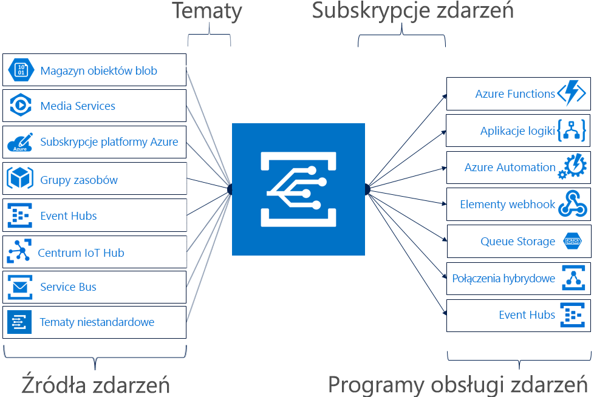

# Co to jest usługa Azure Event Grid?

Usługa Azure Event Grid umożliwia łatwe tworzenie aplikacji za pomocą architektur opartych na zdarzeniach. Wystarczy, że wybierzesz zasób platformy Azure, który chcesz zasubskrybować, i wskażesz procedurę obsługi zdarzeń lub punkt końcowy elementu WebHook, do którego ma zostać wysłane zdarzenie. Usługa Event Grid obsługuje zdarzenia pochodzące z usług platformy Azure, takich jak obiekty blob magazynu i grupy zasobów. Usługa Event Grid zapewnia również obsługę niestandardowych zdarzeń opartych na niestandardowych tematach. 

Filtry pozwalają kierować określone zdarzenia do różnych punktów końcowych i korzystać z multiemisji do wielu punktów końcowych, a także zapewniają niezawodne dostarczanie zdarzeń.

Obecnie usługa Azure Event Grid jest dostępna we wszystkich publicznych regionach. Nie jest jeszcze dostępna w chmurach Azure (Niemcy), Azure (Chiny) ani Azure Government.

Ten artykuł zawiera omówienie usługi Azure Event Grid. Aby rozpocząć pracę z usługą Event Grid, zobacz [Tworzenie i kierowanie zdarzeń niestandardowych za pomocą usługi Azure Event Grid](custom-event-quickstart.md). 

Poniżej przedstawiono połączenie źródeł i procedur obsługi w usłudze Event Grid. Ilustracja nie zawiera pełnej listy obsługiwanych integracji.

## Źródła zdarzeń

Aby uzyskać szczegółowe informacje o możliwościach poszczególnych źródeł oraz zapoznać się z pokrewnymi artykułami, zobacz [Źródła zdarzeń](event-sources.md). Aktualnie wysyłanie zdarzeń do usługi Event Grid jest obsługiwane w przypadku następujących usług platformy Azure:

* Subskrypcje platformy Azure (operacje zarządzania)
* Container Registry
* Tematy niestandardowe
* Event Hubs
* Usługa IoT Hub
* Media Services
* Grupy zasobów (operacje zarządzania)
* Service Bus
* Storage Blob
* Magazyn ogólnego przeznaczenia w wersji 2 (GPv2)
* Azure Maps

## Procedury obsługi zdarzeń

Aby uzyskać szczegółowe informacje o możliwościach poszczególnych procedur obsługi oraz zapoznać się z pokrewnymi artykułami, zobacz [Procedury obsługi zdarzeń](event-handlers.md). Aktualnie obsługa zdarzeń pochodzących z usługi Event Grid jest zapewniona w przypadku następujących usług platformy Azure: 

* Azure Automation
* Azure Functions
* Event Hubs
* Połączenia hybrydowe
* Logic Apps
* Microsoft Flow
* Queue Storage
* Elementy webhook

## Pojęcia

Oto pięć pojęć związanych z usługą Azure Event Grid, które ułatwiają rozpoczęcie pracy:

* **Zdarzenia** — co miało miejsce.
* **Źródła zdarzeń** — gdzie wystąpiło zdarzenie.
* **Tematy** — punkt końcowy, do którego wydawcy wysyłają zdarzenia.
* **Subskrypcje zdarzeń** — punkt końcowy lub wbudowany mechanizm przekierowywania zdarzeń, czasami do więcej niż jednej procedury obsługi. Subskrypcje są również używane przez procedury obsługi w celu inteligentnego filtrowania zdarzeń przychodzących.
* **Procedura obsługi zdarzeń** — aplikacja lub usługa reagująca na zdarzenie.

Aby uzyskać więcej informacji dotyczących tych pojęć, zobacz [Concepts in Azure Event Grid (Pojęcia używane w usłudze Azure Event Grid)](concepts.md).

## Możliwości

Oto główne funkcje usługi Azure Event Grid:

* **Prostota** — wystarczy wskazać element i go kliknąć, aby skierować zdarzenia z zasobu platformy Azure do dowolnej procedury obsługi zdarzeń lub punktu końcowego.
* **Zaawansowane filtrowanie** — filtrowanie zdarzeń według typu lub ścieżki publikowania gwarantuje, że do procedur obsługi trafiają tylko istotne zdarzenia.
* **Wielokierunkowość** — jedno zdarzenie może być subskrybowane przez kilka punktów końcowych, co pozwala wysyłać kopie zdarzenia do wszystkich potrzebnych miejsc.
* **Niezawodność** — 24-godzinne ponawianie z wykładniczym wycofywaniem gwarantuje dostarczanie zdarzeń.
* **Płatność za zdarzenia** — płacisz tylko za rzeczywiste użycie usługi Event Grid.
* **Wysoka przepływność** — usługa Event Grid jest przeznaczona do obsługi dużych obciążeń i milionów zdarzeń na sekundę.
* **Wbudowane zdarzenia** — wbudowane zdarzenia definiowane przez zasoby pozwalają szybko rozpocząć pracę.
* **Niestandardowe zdarzenia** — usługa Event Grid pozwala kierować i filtrować zdarzenia oraz niezawodnie dostarczać zdarzenia niestandardowe w aplikacji.

Porównanie usług Event Grid, Event Hubs i Service Bus można znaleźć w temacie [Choose between Azure services that deliver messages (Wybieranie usługi platformy Azure służącej do dostarczania komunikatów)](compare-messaging-services.md).

## Do czego można wykorzystać usługę Event Grid?

Usługa Azure Event Grid udostępnia kilka funkcji, które znacząco usprawniają pracę bezserwerową, automatyzację operacji oraz [integrację](https://azure.com/integration): 

### Architektury aplikacji bez użycia serwera

Usługa Event Grid łączy źródła danych i procedury obsługi zdarzeń. Usługi Event Grid można na przykład użyć, aby wyzwolić funkcję bezserwerową, która analizuje obrazy po dodaniu do kontenera magazynu obiektów blob. 

### Automatyzacja operacji

Usługa Event Grid umożliwia przyspieszenie automatyzacji i uproszczenie wymuszania zasad. Usługi Event Grid można na przykład użyć, aby powiadamiać usługę Azure Automation o utworzeniu maszyny wirtualnej lub bazy danych SQL. Te zdarzenia mogą zostać wykorzystane do automatycznego sprawdzania, czy konfiguracje usługi są zgodne, umieszczania metadanych w narzędziach do obsługi operacji, tagowania maszyn wirtualnych lub zachowywania elementów roboczych.

### Integracja aplikacji

Usługa Event Grid łączy aplikację z innymi usługami. Przykładowo możesz utworzyć temat niestandardowy, aby wysłać dane zdarzeń aplikacji do usługi Event Grid i wykorzystać niezawodne dostarczanie, zaawansowany routing i bezpośrednią integrację z platformą Azure. Możesz też użyć usług Event Grid i Logic Apps do przetwarzania danych w dowolnym miejscu, bez pisania kodu. 

## Ile kosztuje korzystanie z usługi Event Grid?

Usługa Azure Event Grid korzysta z modelu płatności za zdarzenia, w którym płaci się wyłącznie za użyte zasoby. Pierwsze 100 000 operacji w danym miesiącu jest bezpłatnych. Operacje są zdefiniowane jako ruch przychodzący zdarzenia, próby dostarczenia subskrypcji, wywołania zarządzania oraz filtrowanie według sufiksu tematu. Aby uzyskać więcej informacji, zobacz [stronę z cennikiem](https://azure.microsoft.com/pricing/details/event-grid/).

## Kolejne kroki

* [Kierowanie zdarzeń usługi Storage Blob](../storage/blobs/storage-blob-event-quickstart.md?toc=%2fazure%2fevent-grid%2ftoc.json)  
  Informacje na temat odpowiadania na zdarzenia usługi Storage Blob za pomocą usługi Event Grid.
* [Tworzyć i subskrybować zdarzenia niestandardowe](custom-event-quickstart.md)  
  Ten przewodnik Szybki start po usłudze Azure Event Grid pozwoli Ci szybko zacząć wysyłać własne zdarzenia do dowolnego punktu końcowego.
* [Przy użyciu aplikacji logiki jako program obsługi zdarzeń](monitor-virtual-machine-changes-event-grid-logic-app.md)  
  Samouczek dotyczący tworzenia aplikacji korzystającej z usługi Logic Apps w celu umożliwienia reagowania na zdarzenia wypychane przez usługę Event Grid.
* [Przesyłanie strumieniowe danych Big Data do magazynu danych](event-grid-event-hubs-integration.md)  
  Samouczek przedstawiający użycie usługi Azure Functions do strumieniowego przesyłania danych z usługi Event Hubs do usługi SQL Data Warehouse.
* [Dokumentacja interfejsu API REST siatki zdarzeń](/rest/api/eventgrid)  
  Zawiera informacje na temat zarządzania subskrypcjami zdarzeń, routingiem i filtrowaniem.
