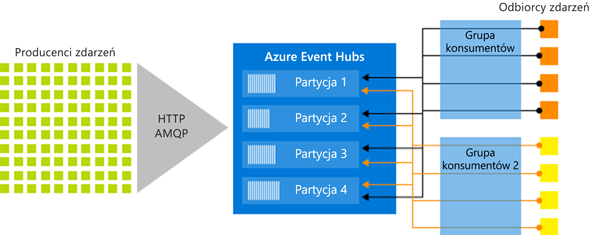

# Usługa Azure Event Hubs — platforma przesyłania strumieniowego danych big data i usługa pozyskiwania zdarzeń
Usługa Azure Event Hubs to platforma przesyłania strumieniowego danych big data i usługa pozyskiwania zdarzeń. Może odbierać i przetwarzać miliony zdarzeń na sekundę. Dane wysłane do centrum zdarzeń mogą zostać przekształcone i zmagazynowane przy użyciu dowolnego dostawcy analityki czasu rzeczywistego lub adapterów przetwarzania wsadowego/magazynowania.

Następujące scenariusze to niektóre z możliwych zastosowań usługi Event Hubs:

- Wykrywanie anomalii (oszustwa/wartości odstające)
- Rejestrowanie aplikacji
- Potoki analiz, na przykład w analizie strumienia kliknięć
- Tworzenie dynamicznych pulpitów nawigacyjnych
- Archiwizowanie danych
- Przetwarzanie transakcji
- Przetwarzanie dane telemetrycznych o użytkownikach
- Strumieniowe przesyłanie danych telemetrycznych z urządzenia 

## Dlaczego warto korzystać z usługi Event Hubs?

Dane mają wartość tylko wtedy, gdy można łatwo przetwarzać dane z różnych źródeł i formułować na ich podstawie aktualne wnioski. Usługa Event Hubs to rozproszona platforma do przetwarzania strumieniowego z małymi opóźnieniami, którą można bezproblemowo integrować z usługami danych i analiz na platformie Azure i poza nią w celu utworzenia pełnego potoku danych big data.

Usługa Event Hubs stanowi „drzwi wejściowe” dla potoku zdarzeń i jest często nazywana *systemem zbierania zdarzeń* w architekturach rozwiązań. System zbierania zdarzeń to składnik lub usługa, która znajduje się między wydawcami zdarzeń, a ich odbiorcami. Jego rolą jest oddzielenie procesu tworzenia strumienia zdarzeń od użycia tych zdarzeń. Usługa Event Hubs udostępnia ujednoliconą platformę przesyłania strumieniowego z buforem przechowywana czasowego, co umożliwia uniezależnienie wydawców i odbiorców zdarzeń. 

W poniższych sekcjach opisano najważniejsze funkcje usługi Azure Event Hubs: 

## W pełni zarządzana usługa PaaS 

Event Hubs to w pełni zarządzana usługa PaaS (Platform-as-a-Service), która wymaga niewielkich nakładów na konfigurację i zarządzanie, dzięki czemu możesz skoncentrować się na swoich rozwiązaniach biznesowych. [Usługa Event Hubs dla ekosystemów platformy Apache Kafka](event-hubs-for-kafka-ecosystem-overview.md) zapewnia środowisko platformy Kafka jako usługę bez konieczności konfigurowania i uruchamiania klastrów ani zarządzania nimi.

## Obsługa przetwarzania wsadowego w czasie rzeczywistym

Możesz pozyskiwać, buforować, przechowywać i przetwarzać strumień danych w czasie rzeczywistym, aby uzyskiwać praktyczne informacje. W usłudze Event Hubs jest używany [partycjonowany model odbiorców](event-hubs-features.md#partitions), umożliwiający wielu aplikacjom jednoczesne przetwarzanie strumienia danych, podczas gdy Ty kontrolujesz szybkość przetwarzania.

Funkcja [Capture](event-hubs-capture-overview.md) umożliwia przechwytywanie danych niemal w czasie rzeczywistym do usługi [Azure Blob Storage](https://azure.microsoft.com/services/storage/blobs/) lub [Azure Data Lake Storage](https://azure.microsoft.com/services/data-lake-store/)  na potrzeby przechowywania długoterminowego lub przetwarzania mikropartii. Jest to możliwe w ramach tego samego strumienia, który jest używany do analizy w czasie rzeczywistym. Przechwytywanie danych zdarzeń można szybko skonfigurować. Używanie go nie wiąże się z żadnymi kosztami administracyjnymi, a ponadto jest ono automatycznie skalowane za pomocą  [jednostek przepływności](event-hubs-features.md#throughput-units) usługi Event Hubs. Usługa Event Hubs pozwala Ci skoncentrować się na przetwarzaniu, a nie przechwytywaniu danych.

Usługę Azure Event Hubs można również zintegrować z usługą [Azure Functions](/azure/azure-functions/) w celu uzyskania architektury bezserwerowej.

## Skalowalność 

Korzystając z usługi Event Hubs, możesz zacząć od strumieni danych liczonych w megabajtach i rozwijać je do rozmiaru gigabajtów, a nawet terabajtów. Funkcja [automatycznego rozszerzania](event-hubs-auto-inflate.md) jest jedną z wielu dostępnych opcji skalowania liczby jednostek przepływności odpowiednio do potrzeb użycia. 

## Zaawansowany ekosystem

Usługa [Event Hubs dla ekosystemów platformy Apache Kafka](event-hubs-for-kafka-ecosystem-overview.md) umożliwia klientom i aplikacjom platformy [Apache Kafka (w wersji 1.0 lub nowszej)](https://kafka.apache.org/) komunikowanie się z usługą Event Hubs. Nie trzeba przy tym instalować i konfigurować własnych klastrów platformy Kafka ani zarządzać nimi.
 
Rozbudowany ekosystem dostępny za pomocą różnych [języków (.NET, Java, Python, Go, Node.js)](https://github.com/Azure/azure-event-hubs) umożliwia łatwe rozpoczęcie przetwarzania strumieni danych w usłudze Event Hubs. Wszystkie obsługiwane języki klienta zapewniają integrację niskiego poziomu. Ten ekosystem umożliwia również bezproblemową integrację z usługami platformy Azure, takimi jak Azure Stream Analytics i Azure Functions, umożliwiając w ten sposób tworzenie architektur bezserwerowych.

## Główne składniki architektury
Usługa Event Hubs zawiera następujące [kluczowe składniki](event-hubs-features.md):

- **Producenci zdarzeń**: wszelkie jednostki, które wysyłają dane do centrum zdarzeń. Wydawcy zdarzeń mogą publikować zdarzenia przy użyciu protokołu HTTPS, protokołu AMQP 1.0 lub platformy Apache Kafka (w wersji 1.0 lub nowszej).
- **Partycje**: każdy użytkownik odczytuje tylko określony podzestaw, czyli partycję, strumienia komunikatów.
- **Grupy odbiorców**: widok (stan, pozycja lub przesunięcie) całego centrum zdarzeń. Dzięki grupom konsumentów każda z aplikacji korzystających z danych może mieć osobny widok strumienia zdarzeń. Odczytują one strumienie niezależnie, we własnym tempie i z własnym przesunięciem.
- **Jednostki przepływności**: kupione wcześniej jednostki pojemności, które określają przepływność usługi Event Hubs.
- **Odbiorcy zdarzeń**: wszelkie jednostki, które odczytują dane zdarzenia z centrum zdarzeń. Wszyscy odbiorcy usługi Event Hubs łączą się za pomocą sesji protokołu AMQP 1.0. Usługa Event Hubs dostarcza zdarzenia za pośrednictwem sesji w miarę ich udostępniania. Wszyscy użytkownicy platformy Kafka nawiązują połączenia za pośrednictwem protokołu Kafka w wersji 1.0 lub nowszej.

Na poniższym rysunku przedstawiono architekturę przetwarzania strumienia usługi Event Hubs:

## Kolejne kroki

Aby rozpocząć korzystanie z usługi Event Hubs, zobacz **wysyłania i odbierania zdarzeń** samouczków: 

- [.NET Core](event-hubs-dotnet-standard-getstarted-send.md)
- [.NET Framework](event-hubs-dotnet-framework-getstarted-send.md)
- [Java](event-hubs-java-get-started-send.md)
- [Python](event-hubs-python-get-started-send.md)
- [Node.js](event-hubs-node-get-started-send.md)
- [Go](event-hubs-go-get-started-send.md)
- [C (tylko Wyślij)](event-hubs-c-getstarted-send.md)
- [Apache Storm (tylko pobieranie)](event-hubs-storm-getstarted-receive.md)

Więcej informacji na temat usługi Event Hubs zawierają następujące artykuły:

- [Event Hubs features overview (Omówienie funkcji usługi Event Hubs)](event-hubs-features.md)
- [Często zadawane pytania](event-hubs-faq.md).

