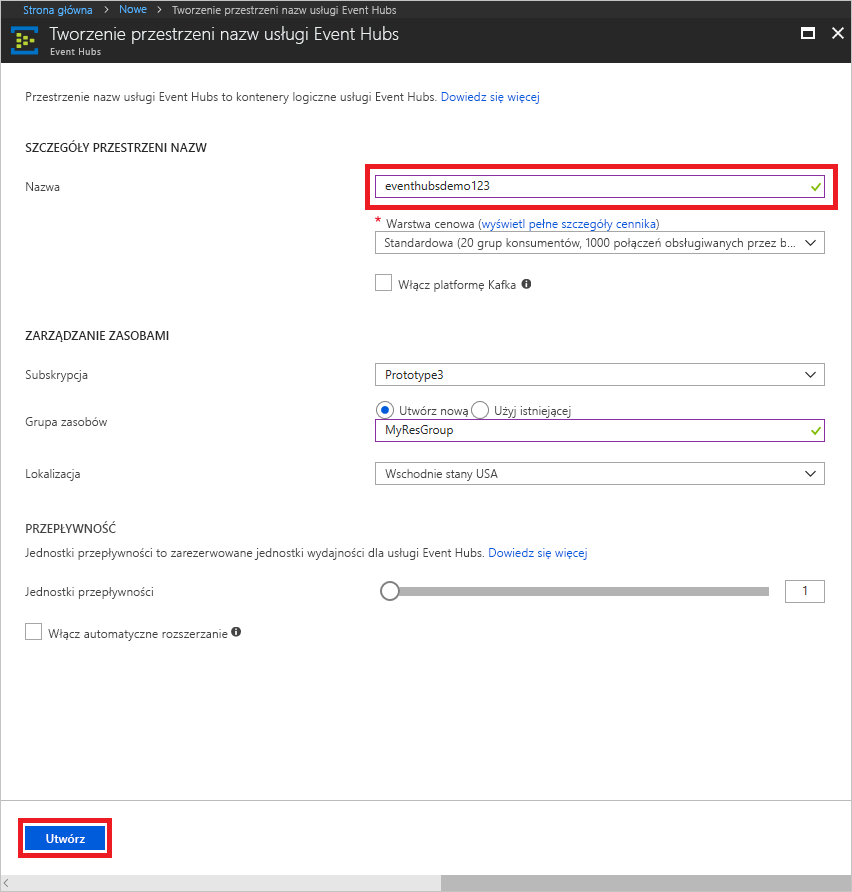
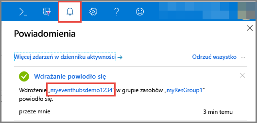
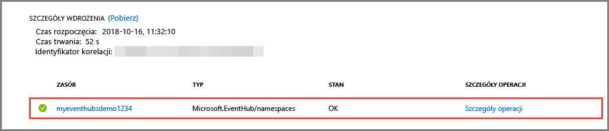
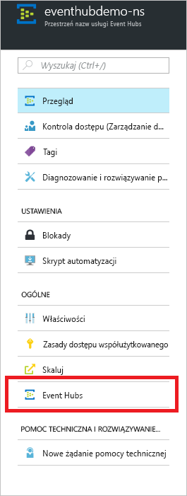

# Szybki start: tworzenie centrum zdarzeń przy użyciu witryny Azure Portal
Azure Event Hubs to platforma do pozyskiwania i strumieniowego przesyłania danych, która umożliwia odbieranie i przetwarzanie milionów zdarzeń na sekundę. Usługa Event Hubs pozwala przetwarzać i przechowywać zdarzenia, dane lub dane telemetryczne generowane przez rozproszone oprogramowanie i urządzenia. Dane wysłane do centrum zdarzeń mogą zostać przekształcone i zmagazynowane przy użyciu dowolnego dostawcy analityki czasu rzeczywistego lub adapterów przetwarzania wsadowego/magazynowania. Aby zapoznać się ze szczegółowym omówieniem usługi Event Hubs, zobacz [Omówienie usługi Event Hubs](event-hubs-about.md) i [Funkcje usługi Event Hubs](event-hubs-features.md).

W tym przewodniku Szybki start utworzysz centrum zdarzeń za pomocą witryny [Azure Portal](https://portal.azure.com).

## Wymagania wstępne

Aby ukończyć ten przewodnik Szybki start, upewnij się, że dysponujesz następującymi elementami:

- Subskrypcja platformy Azure. Jeśli nie masz subskrypcji, przed rozpoczęciem [utwórz bezpłatne konto](https://azure.microsoft.com/free/).
- [Program Visual Studio 2017 Update 3 (wersja 15.3, 26730.01)](https://www.visualstudio.com/vs) lub nowszy.
- [Zestaw .NET Standard SDK](https://www.microsoft.com/net/download/windows) w wersji 2.0 lub nowszej.

## Tworzenie grupy zasobów

Grupa zasobów to logiczna kolekcja zasobów platformy Azure. Wszystkie zasoby są wdrażane i zarządzane w ramach grupy zasobów. Aby utworzyć grupę zasobów, wykonaj następujące czynności:

1. Zaloguj się w witrynie [Azure Portal](https://portal.azure.com).
2. W lewym obszarze nawigacji kliknij pozycję **Grupy zasobów**. Następnie kliknij pozycję **Dodaj**.

   

2. Wpisz unikatową nazwę grupy zasobów. System natychmiast sprawdzi, czy nazwa jest dostępna w aktualnie wybranej subskrypcji platformy Azure.

3. W polu **Subskrypcja** kliknij nazwę subskrypcji platformy Azure, w której chcesz utworzyć grupę zasobów.

4. Wybierz lokalizację geograficzną dla grupy zasobów.

5. Kliknij pozycję **Utwórz**.

   

## Tworzenie przestrzeni nazw usługi Event Hubs

Przestrzeń nazw usługi Event Hubs udostępnia unikatowy kontener zakresu przywoływany przy użyciu jego w pełni kwalifikowanej nazwy domeny, w którym można utworzyć jedno lub wiele centrów zdarzeń. Aby utworzyć przestrzeń nazw w grupie zasobów przy użyciu portalu, wykonaj następujące akcje:

1. W witrynie Azure Portal kliknij pozycję **Utwórz zasób** w lewym górnym rogu ekranu.

2. Kliknij pozycję **Internet rzeczy**, a następnie kliknij pozycję **Event Hubs**.

3. W polu **Utwórz przestrzeń nazw** podaj nazwę przestrzeni nazw. System od razu sprawdza, czy nazwa jest dostępna.

   

4. Po upewnieniu się, że nazwa przestrzeni nazw jest dostępna, wybierz warstwę cenową (Podstawowa lub Standardowa). Ponadto wybierz subskrypcję platformy Azure, grupę zasobów i lokalizację, w której chcesz utworzyć zasób.
 
5. Kliknij pozycję **Utwórz**, aby utworzyć przestrzeń nazw. Może być konieczne odczekanie kilku minut, aby system przeprowadził pełną aprowizację zasobów.
6. Wybierz pozycję **Alerty**, a następnie wybierz **wdrożenie** o takiej samej nazwie jak nazwa przestrzeni nazw centrum zdarzeń. 

   
6. Z listy zasobów utworzonych w ramach wdrożenia wybierz przestrzeń nazw centrum zdarzeń. 

   
7. Na stronie **Przestrzeń nazw usługi Event Hubs** wybierz pozycję **Zasady dostępu współużytkowanego**, a następnie kliknij pozycję **RootManageSharedAccessKey**.
    
8. Kliknij przycisk kopiowania, aby skopiować parametry połączenia **RootManageSharedAccessKey** do schowka. Zapisz te parametry połączenia w lokalizacji tymczasowej, takiej jak Notatnik, do użycia później.
    
## Tworzenie centrum zdarzeń

Aby utworzyć centrum zdarzeń w przestrzeni nazw, wykonaj następujące akcje:

1. Na stronie Przestrzenie nazw usługi Event Hubs wybierz pozycję **Event Hubs**.
   
    

1. W górnej części okna kliknij pozycję **+ Centrum zdarzeń**.
   
    
1. Wpisz nazwę centrum zdarzeń, a następnie kliknij pozycję **Utwórz**.
   
    

Gratulacje! Za pomocą portalu utworzono przestrzeń nazw usługi Event Hubs i centrum zdarzeń w ramach tej przestrzeni nazw. 

## Następne kroki

W tym artykule utworzono grupę zasobów, przestrzeń nazw usługi Event Hubs i centrum zdarzeń. Szczegółowe instrukcje dotyczące wysyłania zdarzeń do centrum zdarzeń lub odbierania ich z niego znajdują się w następujących samouczkach:  

- **Wysyłanie zdarzeń do centrum zdarzeń**: [.NET Standard](event-hubs-dotnet-standard-getstarted-send.md), [.NET Framework](event-hubs-dotnet-framework-getstarted-send.md), [Java](event-hubs-java-get-started-send.md), [Python](event-hubs-python-get-started-send.md), [Node.js](event-hubs-node-get-started-send.md), [Go](event-hubs-go-get-started-send.md), [C](event-hubs-c-getstarted-send.md)
- **Odbieranie zdarzeń z centrum zdarzeń**: [.NET Standard](event-hubs-dotnet-standard-getstarted-receive-eph.md), [.NET Framework](event-hubs-dotnet-framework-getstarted-receive-eph.md), [Java](event-hubs-java-get-started-receive-eph.md), [Python](event-hubs-python-get-started-receive.md), [Node.js](event-hubs-node-get-started-receive.md), [Go](event-hubs-go-get-started-receive-eph.md), [Apache Storm](event-hubs-storm-getstarted-receive.md)

[Azure portal]: https://portal.azure.com/
[3]: ./media/event-hubs-quickstart-portal/sender1.png
[4]: ./media/event-hubs-quickstart-portal/receiver1.png
