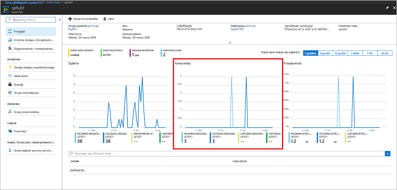

# <a name="quickstart-process-event-streams-using-azure-cli-and-java"></a>Szybki start: przetwarzanie strumieni zdarzeń przy użyciu interfejsu wiersza polecenia platformy Azure i języka Java

Azure Event Hubs to wysoce skalowalna platforma do strumieniowego przesyłania danych i usługa pozyskiwania danych, która umożliwia odbieranie i przetwarzanie milionów zdarzeń na sekundę. Ten przewodnik Szybki start przedstawia tworzenie zasobów usługi Event Hubs za pomocą interfejsu wiersza polecenia platformy Azure, a następnie wysyłanie zdarzeń do centrum zdarzeń i odbieranie stamtąd zdarzeń przy użyciu kodu Java.

Do wykonania kroków tego przewodnika Szybki start jest potrzebna subskrypcja platformy Azure. Jeśli nie masz subskrypcji, przed rozpoczęciem [utwórz bezpłatne konto][].

## <a name="prerequisites"></a>Wymagania wstępne

[!INCLUDE [cloud-shell-try-it.md](../../includes/cloud-shell-try-it.md)]

Jeśli zdecydujesz się zainstalować interfejs wiersza polecenia platformy Azure i korzystać z niego lokalnie, ten samouczek będzie wymagał interfejsu wiersza polecenia platformy Azure w wersji 2.0.4 lub nowszej. Uruchom polecenie `az --version`, aby sprawdzić wersję. Jeśli konieczna będzie instalacja lub uaktualnienie, zobacz [Instalowanie interfejsu wiersza polecenia platformy Azure 2.0]( /cli/azure/install-azure-cli).

## <a name="log-on-to-azure"></a>Logowanie do platformy Azure

Poniższe kroki nie są wymagane, jeśli uruchamiasz polecenia w usłudze Cloud Shell. Jeśli korzystasz z interfejsu wiersza polecenia lokalnie, wykonaj następujące kroki, aby zalogować się do platformy Azure i ustawić bieżącą subskrypcję:

Uruchom następujące polecenie, aby zalogować się do platformy Azure:

```azurecli-interactive
az login
```

Ustawianie kontekstu bieżącej subskrypcji. Zastąp wartość `MyAzureSub` nazwą subskrypcji platformy Azure, której chcesz użyć:

```azurecli-interactive
az account set --subscription MyAzureSub
``` 

## <a name="provision-resources"></a>Aprowizowanie zasobów

Uruchom następujące polecenia w celu aprowizowania zasobów usługi Event Hubs. Pamiętaj, aby zastąpić symbole zastępcze `myResourceGroup`, `namespaceName`, `eventHubName` i `storageAccountName` odpowiednimi wartościami:

```azurecli-interactive
# Create a resource group
az group create --name myResourceGroup --location eastus

# Create an Event Hubs namespace
az eventhubs namespace create --name namespaceName --resource-group myResourceGroup -l eastus2

# Create an event hub
az eventhubs eventhub create --name eventHubName --resource-group myResourceGroup --namespace-name namespaceName

# Create a general purpose standard storage account
az storage account create --name storageAccountName --resource-group myResourceGroup --location eastus2 --sku Standard_RAGRS --encryption blob

# List the storage account access keys
az storage account keys list --resource-group myResourceGroup --account-name storageAccountName

# Get namespace connection string
az eventhubs namespace authorization-rule keys list --resource-group myResourceGroup --namespace-name namespaceName --name RootManageSharedAccessKey
```

Skopiuj i wklej parametry połączenia do lokalizacji tymczasowej, takiej jak Notatnik, do użycia później.

## <a name="stream-into-event-hubs"></a>Przesyłanie strumieniowe do usługi Event Hubs

Następnym krokiem jest pobranie przykładowego kodu, który przesyła strumieniowo zdarzenia do centrum zdarzeń i odbiera te zdarzenia za pomocą hosta procesora zdarzeń. Najpierw wyślij komunikaty:

Sklonuj [repozytorium GitHub usługi Event Hubs](https://github.com/Azure/azure-event-hubs), uruchamiając następujące polecenie:

```bash
git clone https://github.com/Azure/azure-event-hubs.git
```

Przejdź do folderu aplikacji **SimpleSend**: `\azure-event-hubs\samples\Java\Basic\SimpleSend\src\main\java\com\microsoft\azure\eventhubs\samples\SimpleSend`. Otwórz plik SimpleSend.java i zastąp ciąg `"Your Event Hubs namaspace name"` nazwą przestrzeni nazw usługi Event Hubs uzyskaną w sekcji „Tworzenie przestrzeni nazw usługi Event Hubs” tego artykułu.

Zastąp ciąg `"Your event hub"` nazwą centrum zdarzeń utworzonego w tej przestrzeni nazw, a ciąg `"Your policy name"` nazwą zasad dostępu współdzielonego dla przestrzeni nazw. Jeśli nie utworzono nowych zasad, wartość domyślna to **RootManageSharedAccessKey**. 

Na końcu zastąp ciąg `"Your primary SAS key"` wartością klucza sygnatury dostępu współdzielonego dla zasad z poprzedniego kroku.

### <a name="build-the-application"></a>Kompilowanie aplikacji 

Przejdź z powrotem do folderu `\azure-event-hubs\samples\Java\Basic\SimpleSend` i uruchom następujące polecenie kompilacji:

```shell
mvn clean package -DskipTests
```

### <a name="receive"></a>Odbieranie

Teraz pobierz przykład dla hosta procesora zdarzeń, który umożliwia odebranie właśnie wysłanych komunikatów. Przejdź do folderu aplikacji **EventProcessorSample**: `\azure-event-hubs\samples\Java\Basic\EventProcessorSample\src\main\java\com\microsoft\azure\eventhubs\samples\eventprocessorsample`.

W pliku EventProcessorSample.java zastąp wartość `----EventHubsNamespaceName-----` nazwą przestrzeni nazw usługi Event Hubs uzyskaną w sekcji „Tworzenie przestrzeni nazw usługi Event Hubs” tego artykułu. 

Zastąp pozostałe wartości ciągu w tym pliku: zastąp ciąg `----EventHubName-----` nazwą centrum zdarzeń utworzonego w tej przestrzeni nazw, a ciąg `-----SharedAccessSignatureKeyName-----` nazwą zasad dostępu współdzielonego dla przestrzeni nazw. Jeśli nie utworzono nowych zasad, wartość domyślna to **RootManageSharedAccessKey**.

Zastąp ciąg `---SharedAccessSignatureKey----` wartością klucza sygnatury dostępu współdzielonego dla zasad z poprzedniego kroku, zastąp ciąg `----AzureStorageConnectionString----` parametrami połączenia dla utworzonego konta magazynu oraz zastąp ciąg `----StorageContainerName----` nazwą kontenera w ramach utworzonego konta magazynu. 

Na końcu zastąp ciąg `----HostNamePrefix----` nazwą konta magazynu.

### <a name="build-the-receiver"></a>Kompilowanie odbiornika 

Aby skompilować aplikację odbierającą, przejdź do folderu `\azure-event-hubs\samples\Java\Basic\EventProcessorSample` i uruchom następujące polecenie:

```shell
mvn clean package -DskipTests
```

### <a name="run-the-apps"></a>Uruchamianie aplikacji

Jeśli kompilacja została ukończona pomyślnie, wszystko jest gotowe do wysyłania i odbierania zdarzeń. Najpierw uruchom aplikację **SimpleSend** i zaobserwuj wysyłanie zdarzeń. Aby uruchomić program, przejdź do folderu `\azure-event-hubs\samples\Java\Basic\SimpleSend` i uruchom następujące polecenie:

```shell
java -jar ./target/simplesend-1.0.0-jar-with-dependencies.jar
```

Następnie uruchom aplikację **EventProcessorSample** i obserwuj odbieranie zdarzeń. Aby uruchomić program, przejdź do folderu `\azure-event-hubs\samples\Java\Basic\EventProcessorSample` i uruchom następujące polecenie:
   
```shell
java -jar ./target/eventprocessorsample-1.0.0-jar-with-dependencies.jar
```

Po uruchomieniu obu programów możesz przejść na stronę przeglądu witryny Azure Portal dla centrum zdarzeń, aby zobaczyć liczbę przychodzących i wychodzących komunikatów:



## <a name="clean-up-resources"></a>Oczyszczanie zasobów

Uruchom następujące polecenie, aby usunąć grupę zasobów, przestrzeń nazw, konto magazynu oraz wszystkie powiązane zasoby. Zastąp ciąg `myResourceGroup` nazwą utworzonej grupy zasobów.

```azurecli
az group delete --resource-group myResourceGroup
```

## <a name="understand-the-sample-code"></a>Omówienie przykładowego kodu

Ta sekcja zawiera więcej szczegółów na temat operacji wykonywanych przez przykładowy kod.

### <a name="send"></a>Wysyłanie

W pliku SimpleSend.java większość pracy odbywa się w metodzie main(). Najpierw kod używa wystąpienia klasy `ConnectionStringBuilder` do skonstruowania parametrów połączenia przy użyciu wartości zdefiniowanych przez użytkownika dla nazwy przestrzeni nazw, nazwy centrum zdarzeń, nazwy klucza sygnatury dostępu współdzielonego i samego klucza sygnatury dostępu współdzielonego:

```java
final ConnectionStringBuilder connStr = new ConnectionStringBuilder()
        .setNamespaceName("Your Event Hubs namespace name")
        .setEventHubName("Your event hub")
        .setSasKeyName("Your policy name")
        .setSasKey("Your primary SAS key");
```

Obiekt Java zawierający ładunek zdarzenia jest następnie konwertowany na format Json:

```java
final Gson gson = new GsonBuilder().create();

final PayloadEvent payload = new PayloadEvent(1);
byte[] payloadBytes = gson.toJson(payload).getBytes(Charset.defaultCharset());
EventData sendEvent = EventData.create(payloadBytes);  
```

Klient usługi Event Hubs jest tworzony w tym wierszu kodu:

```java
final EventHubClient ehClient = EventHubClient.createSync(connStr.toString(), executorService);
```

Blok try/finally wysyła jedno zdarzenie jako działanie okrężne do nieokreślonej partycji:

```java
try {
    for (int i = 0; i < 100; i++) {

        String payload = "Message " + Integer.toString(i);
        //PayloadEvent payload = new PayloadEvent(i);
        byte[] payloadBytes = gson.toJson(payload).getBytes(Charset.defaultCharset());
        EventData sendEvent = EventData.create(payloadBytes);

        // Send - not tied to any partition
        // Event Hubs service will round-robin the events across all EventHubs partitions.
        // This is the recommended & most reliable way to send to EventHubs.
        ehClient.sendSync(sendEvent);
    }

    System.out.println(Instant.now() + ": Send Complete...");
    System.in.read();
} finally {
    ehClient.closeSync();
    executorService.shutdown();
}
```

### <a name="receive"></a>Odbieranie 

Operacja odbierania odbywa się w pliku EventProcessorSample.java. Najpierw są deklarowane stałe na potrzeby przechowywania nazwy przestrzeni nazw usługi Event Hubs i innych poświadczeń:

```java
String consumerGroupName = "$Default";
String namespaceName = "----NamespaceName----";
String eventHubName = "----EventHubName----";
String sasKeyName = "----SharedAccessSignatureKeyName----";
String sasKey = "----SharedAccessSignatureKey----";
String storageConnectionString = "----AzureStorageConnectionString----";
String storageContainerName = "----StorageContainerName----";
String hostNamePrefix = "----HostNamePrefix----";
```

Podobnie jak w programie SimpleSend, kod następnie tworzy wystąpienie klasy ConnectionStringBuilder w celu skonstruowania parametrów połączenia:

```java
ConnectionStringBuilder eventHubConnectionString = new ConnectionStringBuilder()
    .setNamespaceName(namespaceName)
    .setEventHubName(eventHubName)
    .setSasKeyName(sasKeyName)
    .setSasKey(sasKey);
```

*Host procesora zdarzeń* jest klasą, która upraszcza odbieranie zdarzeń z centrów zdarzeń przez zarządzanie trwałymi punktami kontrolnymi i równoległymi odbiorami dotyczącymi tych centrów zdarzeń. Kod teraz tworzy wystąpienie klasy `EventProcessorHost`:

```java
EventProcessorHost host = new EventProcessorHost(
    EventProcessorHost.createHostName(hostNamePrefix),
    eventHubName,
    consumerGroupName,
    eventHubConnectionString.toString(),
    storageConnectionString,
    storageContainerName);
```

Po zadeklarowaniu kodu obsługi błędów aplikacja definiuje klasę `EventProcessor` będącą implementacją interfejsu `IEventProcessor`. Ta klasa przetwarza odebrane zdarzenia:

```java
public static class EventProcessor implements IEventProcessor
{
    private int checkpointBatchingCount = 0;
    ...
```

Metoda `onEvents()` jest wywoływana, gdy zdarzenia zostaną odebrane dla tej partycji centrum zdarzeń:

```java
@Override
public void onEvents(PartitionContext context, Iterable<EventData> events) throws Exception
{
    System.out.println("SAMPLE: Partition " + context.getPartitionId() + " got event batch");
    int eventCount = 0;
    for (EventData data : events)
    {
        try
        {
         System.out.println("SAMPLE (" + context.getPartitionId() + "," + data.getSystemProperties().getOffset() + "," +
                data.getSystemProperties().getSequenceNumber() + "): " + new String(data.getBytes(), "UTF8"));
             eventCount++;
                
         // Checkpointing persists the current position in the event stream for this partition and means that the next
         // time any host opens an event processor on this event hub+consumer group+partition combination, it will start
         // receiving at the event after this one. Checkpointing is usually not a fast operation, so there is a tradeoff
         // between checkpointing frequently (to minimize the number of events that will be reprocessed after a crash, or
         // if the partition lease is stolen) and checkpointing infrequently (to reduce the impact on event processing
         // performance). Checkpointing every five events is an arbitrary choice for this sample.
         this.checkpointBatchingCount++;
         if ((checkpointBatchingCount % 5) == 0)
         {
            System.out.println("SAMPLE: Partition " + context.getPartitionId() + " checkpointing at " +
                    data.getSystemProperties().getOffset() + "," + data.getSystemProperties().getSequenceNumber());
            // Checkpoints are created asynchronously. It is important to wait for the result of checkpointing
            // before exiting onEvents or before creating the next checkpoint, to detect errors and to ensure proper ordering.
            context.checkpoint(data).get();
         }
    }
        catch (Exception e)
        {
            System.out.println("Processing failed for an event: " + e.toString());
        }
    }
    System.out.println("SAMPLE: Partition " + context.getPartitionId() + " batch size was " + eventCount + " for host " + context.getOwner());
}
```

## <a name="next-steps"></a>Następne kroki

W tym artykule utworzono przestrzeń nazw usługi Event Hubs oraz inne zasoby wymagane do wysyłania zdarzeń do centrum zdarzeń i odbierania stamtąd zdarzeń. Aby dowiedzieć się więcej, przejdź do następującego samouczka:

> [!div class="nextstepaction"]
> [Wizualizowanie danych dotyczących anomalii w strumieniach danych usługi Event Hubs](event-hubs-tutorial-visualize-anomalies.md)

[utwórz bezpłatne konto]: https://azure.microsoft.com/free/?ref=microsoft.com&utm_source=microsoft.com&utm_medium=docs&utm_campaign=visualstudio
[Install Azure CLI 2.0]: /cli/azure/install-azure-cli
[az group create]: /cli/azure/group#az-group-create
[fully qualified domain name]: https://wikipedia.org/wiki/Fully_qualified_domain_name
