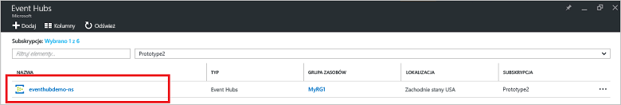
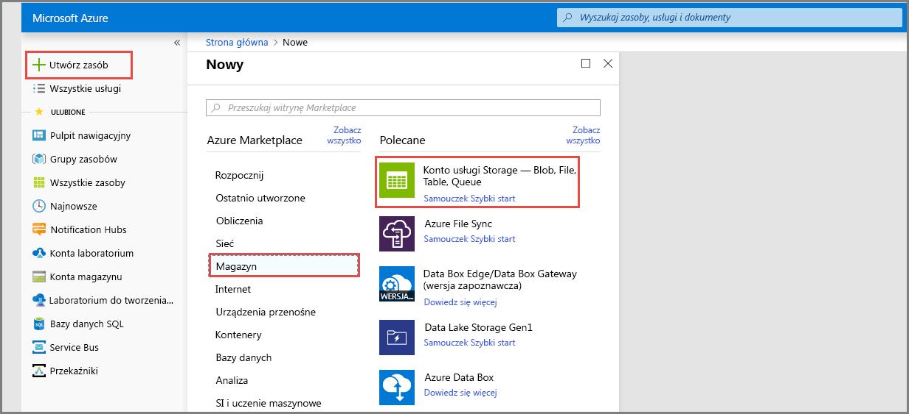
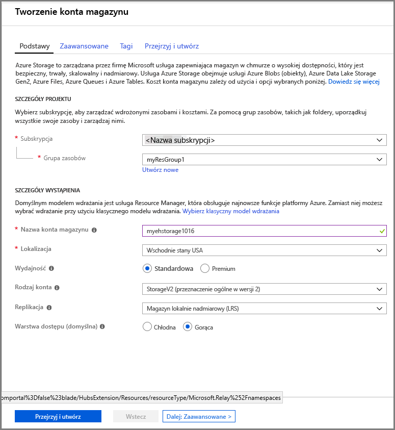
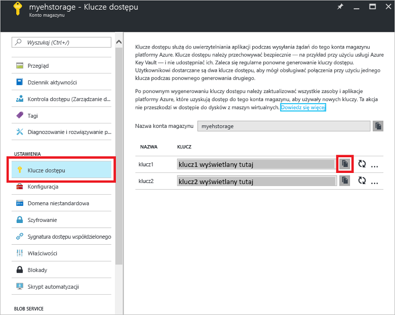

# Szybki start: tworzenie centrum zdarzeń przy użyciu witryny Azure Portal

Azure Event Hubs to wysoce skalowalna platforma do strumieniowego przesyłania danych i usługa pozyskiwania danych, która umożliwia odbieranie i przetwarzanie milionów zdarzeń na sekundę. Ten przewodnik Szybki start przedstawia tworzenie centrum zdarzeń za pomocą witryny [Azure Portal](https://portal.azure.com) oraz wysyłanie i odbieranie danych z centrum zdarzeń za pomocą zestawu .NET Standard SDK.

Do wykonania kroków tego przewodnika Szybki start jest potrzebna subskrypcja platformy Azure. Jeśli nie masz subskrypcji, przed rozpoczęciem [utwórz bezpłatne konto][].

## Wymagania wstępne

Aby ukończyć ten przewodnik Szybki start, upewnij się, że dysponujesz następującymi elementami:

- [Program Visual Studio 2017 Update 3 (wersja 15.3, 26730.01)](http://www.visualstudio.com/vs) lub nowszy.
- [Zestaw .NET Standard SDK](https://www.microsoft.com/net/download/windows) w wersji 2.0 lub nowszej.

## Tworzenie grupy zasobów

Grupa zasobów to logiczna kolekcja zasobów platformy Azure. Wszystkie zasoby są wdrażane i zarządzane w ramach grupy zasobów. Aby utworzyć grupę zasobów, wykonaj następujące czynności:

1. W lewym obszarze nawigacji kliknij pozycję **Grupy zasobów**. Następnie kliknij pozycję **Dodaj**.

   ![][1]

2. Wpisz unikatową nazwę grupy zasobów. System natychmiast sprawdzi, czy nazwa jest dostępna w aktualnie wybranej subskrypcji platformy Azure.

3. W polu **Subskrypcja** kliknij nazwę subskrypcji platformy Azure, w której chcesz utworzyć grupę zasobów.

4. Wybierz lokalizację geograficzną dla grupy zasobów.

5. Kliknij przycisk **Utwórz**.

   ![][2]

## Tworzenie przestrzeni nazw usługi Event Hubs

Przestrzeń nazw usługi Event Hubs udostępnia unikatowy kontener zakresu przywoływany przy użyciu jego w pełni kwalifikowanej nazwy domeny, w którym można utworzyć jedno lub wiele centrów zdarzeń. Aby utworzyć przestrzeń nazw w grupie zasobów przy użyciu portalu, wykonaj następujące czynności:

1. Zaloguj się do witryny [Azure Portal][], a następnie kliknij pozycję **Utwórz zasób** w lewym górnym rogu ekranu.

2. Kliknij pozycję **Internet rzeczy**, a następnie kliknij pozycję **Event Hubs**.

3. W polu **Utwórz przestrzeń nazw** podaj nazwę przestrzeni nazw. System od razu sprawdza, czy nazwa jest dostępna.

   

4. Po upewnieniu się, że nazwa przestrzeni nazw jest dostępna, wybierz warstwę cenową (Podstawowa lub Standardowa). Ponadto wybierz subskrypcję platformy Azure, grupę zasobów i lokalizację, w której chcesz utworzyć zasób.
 
5. Kliknij pozycję **Utwórz**, aby utworzyć przestrzeń nazw. Może być konieczne odczekanie kilku minut, aby system przeprowadził pełną aprowizację zasobów.

6. Na liście przestrzeni nazw w portalu kliknij nowo utworzoną przestrzeń nazw.

7. Kliknij pozycję **Zasady dostępu współdzielonego**, a następnie kliknij pozycję **RootManageSharedAccessKey**.
    
8. Kliknij przycisk kopiowania, aby skopiować parametry połączenia **RootManageSharedAccessKey** do schowka. Zapisz te parametry połączenia w lokalizacji tymczasowej, takiej jak Notatnik, do użycia później.
    
## Tworzenie centrum zdarzeń

Aby utworzyć centrum zdarzeń w przestrzeni nazw, wykonaj następujące czynności:

1. Na liście przestrzeni nazw usługi Event Hubs kliknij nowo utworzoną przestrzeń nazw.      
   
     

2. W oknie przestrzeni nazw kliknij pozycję **Event Hubs**.
   
    

1. Kliknij pozycję **+ Dodaj centrum zdarzeń** w górnej części okna.
   
    
1. Wpisz nazwę centrum zdarzeń, a następnie kliknij pozycję **Utwórz**.
   
    

Gratulacje! Za pomocą portalu utworzono przestrzeń nazw usługi Event Hubs i centrum zdarzeń w ramach tej przestrzeni nazw.

## Tworzenie konta magazynu dla hosta procesora zdarzeń

Host procesora zdarzeń to inteligentny agent, który upraszcza odbieranie zdarzeń z usługi Event Hubs przez zarządzanie trwałymi punktami kontrolnymi i równoległymi odbiorami. W przypadku obsługi punktów kontrolnych host procesora zdarzeń wymaga konta magazynu. Poniższy przykład pokazuje, jak utworzyć konto magazynu oraz uzyskać jego klucze na potrzeby dostępu:

1. Zaloguj się do witryny [Azure Portal][Azure Portal], a następnie kliknij pozycję **Nowy** w lewym górnym rogu ekranu.

2. Kliknij pozycję **Magazyn**, a następnie pozycję **Konto magazynu**.
   
    

3. W polu **Utwórz konto magazynu** wpisz nazwę konta magazynu. Wybierz subskrypcję platformy Azure, grupę zasobów i lokalizację, w której chcesz utworzyć zasób. Następnie kliknij pozycję **Utwórz**.
   
    

4. Na liście kont magazynu kliknij nowo utworzone konto.

5. W oknie konta magazynu kliknij pozycję **Klucze dostępu**. Skopiuj wartość **klucz1**, aby użyć jej później.
   
    

## Pobieranie i uruchamianie przykładów

Następnym krokiem jest uruchomienie przykładowego kodu, która wysyła zdarzenia do centrum zdarzeń i odbiera te zdarzenia za pomocą hosta procesora zdarzeń. 

Najpierw pobierz przykłady [SampleSender](https://github.com/Azure/azure-event-hubs/tree/master/samples/DotNet/Microsoft.Azure.EventHubs/SampleSender) i [SampleEphReceiver](https://github.com/Azure/azure-event-hubs/tree/master/samples/DotNet/Microsoft.Azure.EventHubs/SampleEphReceiver) z usługi GitHub lub sklonuj [repozytorium azure-event-hubs](https://github.com/Azure/azure-event-hubs).

### Nadawca

1. Otwórz program Visual Studio, w menu **Plik** kliknij pozycję **Otwórz**, a następnie kliknij pozycję **Projekt/rozwiązanie**.

2. Znajdź folder przykładu **SampleSender** pobranego wcześniej, a następnie kliknij dwukrotnie plik SampleSender.sln, aby załadować projekt do programu Visual Studio.

3. W Eksploratorze rozwiązań kliknij dwukrotnie plik Program.cs, aby otworzyć go w edytorze programu Visual Studio.

4. Zastąp wartość `EventHubConnectionString` parametrami połączenia uzyskanymi podczas tworzenia przestrzeni nazw.

5. Zastąp wartość `EventHubName` nazwą centrum zdarzeń utworzonego w tej przestrzeni nazw.

6. W menu **Kompilacja** kliknij pozycję **Kompiluj rozwiązanie**, aby upewnić się, że nie ma żadnych błędów.

### Odbiornik

1. Otwórz program Visual Studio, w menu **Plik** kliknij pozycję **Otwórz**, a następnie kliknij pozycję **Projekt/rozwiązanie**.

2. Znajdź folder przykładu **SampleEphReceiver** pobranego w kroku 1, a następnie kliknij dwukrotnie plik SampleEphReceiver.sln, aby załadować projekt do programu Visual Studio.

3. W Eksploratorze rozwiązań kliknij dwukrotnie plik Program.cs, aby otworzyć go w edytorze programu Visual Studio.

4. Zastąp następujące wartości zmiennych:
    1. `EventHubConnectionString`: zastąp parametrami połączenia uzyskanymi podczas tworzenia przestrzeni nazw.
    2. `EventHubName`: nazwa centrum zdarzeń utworzonego w tej przestrzeni nazw.
    3. `StorageContainerName`: nazwa kontenera magazynu. Nadaj mu unikatową nazwę. Kontener zostanie utworzony automatycznie podczas uruchamiania aplikacji.
    4. `StorageAccountName`: nazwa utworzonego konta magazynu.
    5. `StorageAccountKey`: klucz konta magazynu uzyskany z witryny Azure Portal.

5. W menu **Kompilacja** kliknij pozycję **Kompiluj rozwiązanie**, aby upewnić się, że nie ma żadnych błędów.

### Uruchamianie aplikacji

Najpierw uruchom aplikację **SampleSender** i obejrzyj wysyłanie 100 komunikatów. Naciśnij klawisz **Enter**, aby zakończyć program.

![][3]

Następnie uruchom aplikację **SampleEphReceiver** i obejrzyj odbieranie komunikatów do hosta procesora zdarzeń.

![][4]
 
## Oczyszczanie zasobów

W portalu można usunąć konto magazynu, przestrzeń nazw i centrum zdarzeń. 

1. W witrynie Azure Portal kliknij pozycję **Wszystkie zasoby** w okienku po lewej stronie. 
2. Kliknij konto magazynu lub przestrzeń nazw do usunięcia. Usunięcie przestrzeni nazw powoduje także usunięcie wszystkich centrów zdarzeń wewnątrz niej.
3. Na pasku menu w górnej części ekranu kliknij polecenie **Usuń**. Potwierdź usuwanie. 

## Następne kroki

W tym artykule utworzono przestrzeń nazw usługi Event Hubs oraz inne zasoby wymagane do wysyłania zdarzeń do centrum zdarzeń i odbierania stamtąd zdarzeń. Aby dowiedzieć się więcej, przejdź do następującego samouczka:

> [!div class="nextstepaction"]
> [Wizualizowanie danych dotyczących anomalii w strumieniach danych usługi Event Hubs](event-hubs-tutorial-visualize-anomalies.md)

[utwórz bezpłatne konto]: https://azure.microsoft.com/free/?ref=microsoft.com&utm_source=microsoft.com&utm_medium=docs&utm_campaign=visualstudio
[Azure Portal]: https://portal.azure.com/
[1]: ./media/event-hubs-quickstart-portal/resource-groups1.png
[2]: ./media/event-hubs-quickstart-portal/resource-groups2.png
[3]: ./media/event-hubs-quickstart-portal/sender1.png
[4]: ./media/event-hubs-quickstart-portal/receiver1.png
