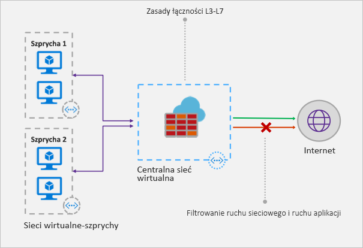

# Co to jest usługa Azure Firewall?

Azure Firewall to zarządzana, sieciowa usługa zabezpieczeń oparta na chmurze, która zabezpiecza zasoby usługi Azure Virtual Network. Jest to w pełni stanowa zapora oferowana jako usługa, z wbudowaną wysoką dostępnością i możliwością nieograniczonego skalowania w chmurze. 

Możesz centralnie tworzyć, wymuszać i rejestrować zasady łączności aplikacji i sieci w subskrypcjach i sieciach wirtualnych. Usługa Azure Firewall korzysta ze statycznego publicznego adresu IP dla zasobów sieci wirtualnej, co umożliwia zewnętrznym zaporom identyfikowanie ruchu pochodzącego z sieci wirtualnej.  Usługa jest w pełni zintegrowana z usługą Azure Monitor na potrzeby rejestrowania i analiz.

## Funkcje

Usługa Azure Firewall oferuje następujące funkcje:

### Wbudowana wysoka dostępność
Wysoka dostępność jest wbudowana, nie potrzeba więc żadnych dodatkowych modułów równoważenia obciążenia ani konfigurowania żadnych funkcji.

### Skalowalność w chmurze bez ograniczeń 
Usługa Azure Firewall umożliwia skalowanie bez ograniczeń, odpowiednio do zmieniających się przepływów ruchu sieciowego — nie trzeba więc dostosowywać budżetu do okresów szczytowego ruchu.

### Reguły filtrowania w pełni kwalifikowanych nazw domen aplikacji

Możesz ograniczyć wychodzący ruch protokołu HTTP/S do konkretnej listy w pełni kwalifikowanych nazw domen, również z użyciem symboli wieloznacznych. Ta funkcja nie wymaga kończenia żądań protokołu SSL.

### Reguły filtrowania ruchu sieciowego

Można centralnie tworzyć reguły filtrowania sieci (*zezwalania* lub *blokowania*) na podstawie źródłowego i docelowego adresu IP, portu i protokołu. Usługa Azure Firewall jest w pełni stanowa, więc możesz rozróżniać autentyczne pakiety w ramach różnych typów połączeń. Reguły są wymuszane i rejestrowane w wielu subskrypcjach i sieciach wirtualnych.

### Tagi w pełni kwalifikowanych nazw domen

Tagi w pełni kwalifikowanych nazw domen zezwalają na znany ruch sieciowy usługi Azure przez zaporę. Załóżmy na przykład, że chcesz zezwolić na ruch sieciowy z witryny Windows Update przez zaporę. Tworzysz regułę aplikacji i dołączasz tag „Windows Update”. Teraz ruch sieciowy z witryny Windows Update może przechodzić przez zaporę.

### Obsługa translacji adresów sieciowych źródła (SNAT) dla ruchu wychodzącego

Wszystkie adresy IP wychodzącego ruchu sieciowego są tłumaczone na publiczny adres IP usługi Azure Firewall (translacja adresów sieciowych źródła, SNAT). Możesz zidentyfikować ruch pochodzący z sieci wirtualnej do zdalnych internetowych miejsc docelowych i zezwalać na niego.

### Obsługa technologii DNAT dla ruchu przychodzącego

Ruch sieciowy przychodzący do publicznego adresu IP zapory jest przetwarzany przy użyciu technologii DNAT i filtrowany do prywatnych adresów IP w sieciach wirtualnych. 

### Rejestrowanie w usłudze Azure Monitor

Wszystkie zdarzenia są zintegrowane z usługą Azure Monitor, co umożliwia archiwizowanie dzienników na koncie magazynu, przesyłanie strumieniowe zdarzeń do centrum Event Hub lub wysyłanie ich do usługi Log Analytics.

## Znane problemy

W usłudze Azure Firewall występują następujące znane problemy:

|Problem  |Opis  |Środki zaradcze  |
|---------|---------|---------|
|Konflikt z funkcją Just in time (JIT) usługi Azure Security Center|W przypadku dostępu JIT do maszyny wirtualnej znajdującej się w podsieci z trasą zdefiniowaną przez użytkownika, która wskazuje usługę Azure Firewall jako bramę domyślną, funkcja JIT usługi Azure Security Center nie działa. Jest to rezultat asymetrycznego trasowania — pakiet przychodzi za pośrednictwem publicznego adresu IP maszyny wirtualnej (funkcja JIT umożliwiła dostęp), ale ścieżka powrotna biegnie przez zaporę, która odrzuca pakiet, ponieważ nie ustanowiono sesji w zaporze.|Aby wyeliminować ten problem, należy umieścić maszyny wirtualne z funkcją JIT w oddzielnej podsieci, w której nie ma zdefiniowanej przez użytkownika trasy do zapory.|
|Model typu gwiazda z globalną komunikacją równorzędną nie działa|Model typu gwiazda, w którym koncentrator i zapora są wdrożone w jednym regionie świadczenia usługi Azure, a szprychy, połączone z koncentratorem za pomocą globalnej wirtualnej sieci równorzędnej, w innym, nie jest obsługiwany.|Aby uzyskać więcej informacji, zobacz temat dotyczący [tworzenia, zmieniania lub usuwania wirtualnych sieci równorzędnych](https://docs.microsoft.com/azure/virtual-network/virtual-network-manage-peering#requirements-and-constraints)|
Reguły filtrowania dla protokołów innych niż TCP/UDP (na przykład ICMP) nie działają dla ruchu powiązanego z Internetem|Reguły filtrowania sieci dla protokołów innych niż TCP/UPD nie działają z funkcją SNAT i publicznym adresem IP. Protokoły inne niż TCP/UDP są obsługiwane między podsieciami szprych i sieciami wirtualnymi.|Usługa Azure Firewall korzysta ze standardowego modułu równoważenia obciążenia, [który obecnie nie obsługuje funkcji SNAT dla protokołów IP](https://docs.microsoft.com/azure/load-balancer/load-balancer-standard-overview#limitations). Firma Microsoft analizuje potencjalne opcje obsługi tego scenariusza w przyszłych wersjach.|
|Technologia DNAT nie działa w przypadku portu 80 i 22.|Pole Port docelowy w kolekcji reguł NAT nie może zawierać portu 80 lub 22.|Pracujemy nad jak najszybszym rozwiązaniem tego problemu. Do tego czasu można korzystać z dowolnego innego portu jako portu docelowego w regułach NAT. Port 80 lub 22 nadal może służyć jako port docelowy translacji (na przykład możesz mapować publiczny adres ip:81 na prywatny adres ip:80).|
|Brak obsługi protokołu ICMP w programie PowerShell i interfejsie wiersza polecenia|Program PowerShell i interfejs wiersza polecenia nie obsługują protokołu ICMP jako prawidłowego protokołu w regułach sieciowych.|Nadal można używać protokołu ICMP za pośrednictwem portalu i interfejsu API REST. Pracujemy nad dodaniem wkrótce obsługi protokołu ICMP w programie PowerShell i interfejsie wiersza polecenia.|
|Tagi FQDN wymagają ustawienia protokołu i portu|Reguły aplikacji z tagami FQDN wymagają definicji portu i protokołu.|Jako wartości portu i protokołu można użyć wartości **https**. Pracujemy nad tym, aby to pole było opcjonalne, gdy są używane tagi FQDN.|
|Przenoszenie zapory do innej grupy zasobów lub subskrypcji nie jest obsługiwane.|Przenoszenie zapory do innej grupy zasobów lub subskrypcji nie jest obsługiwane.|Obsługa tej funkcji jest w naszym harmonogramie działania. Aby przenieść zaporę do innej grupy zasobów lub subskrypcji, musisz usunąć bieżące wystąpienie i utworzyć je ponownie w nowej grupie zasobów lub subskrypcji.|

## Następne kroki

- [Samouczek: wdrażanie i konfigurowanie usługi Azure Firewall w witrynie Azure Portal](tutorial-firewall-deploy-portal.md)
- [Wdrażanie usługi Azure Firewall przy użyciu szablonu](deploy-template.md)
- [Tworzenie środowiska testowego usługi Azure Firewall](scripts/sample-create-firewall-test.md)

