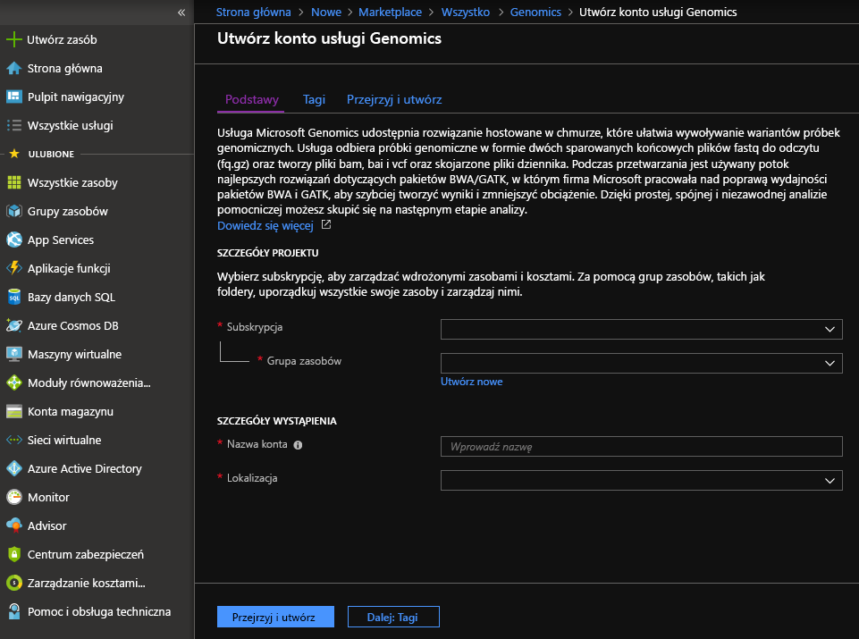

# <a name="quickstart-run-a-workflow-through-the-microsoft-genomics-service"></a>Szybki start: Uruchamianie przepływu za pośrednictwem usługi Microsoft Genomics

Ten poradnik Szybki start opisuje sposób ładowania danych wejściowych do usługi Azure Blob Storage oraz uruchamiania przepływu pracy za pośrednictwem usługi Microsoft Genomics. Microsoft Genomics to skalowalna, bezpieczna usługa umożliwiająca dodatkową analizę zapewniającą szybkie przetwarzanie genomów, począwszy od pierwotnych operacji odczytywania i tworzenia dopasowanych operacji odczytywania i wywołań odmian. 

Rozpocznij pracę przy użyciu kilku kroków: 
1.  Konfiguracja: utwórz konto usługi Microsoft Genomics za pośrednictwem witryny Azure Portal, a następnie zainstaluj klienta Microsoft Genomics Python w środowisku lokalnym. 
2.  Przekazywanie danych wejściowych: utwórz konto magazynu platformy Microsoft Azure za pośrednictwem witryny Azure Portal i przekaż pliki wejściowe. Pliki wejściowe powinny być sparowanymi odczytami końcowymi (pliki fastq lub bam).
3.  Uruchomienie: użyj interfejsu wiersza polecenia usługi Microsoft Genomics, aby uruchomić przepływy pracy za pośrednictwem usługi Microsoft Genomics. 

Aby uzyskać więcej informacji o usłudze Microsoft Genomics, zobacz [Co to jest Microsoft Genomics?](overview-what-is-genomics.md)

## <a name="set-up-create-a-microsoft-genomics-account-in-the-azure-portal"></a>Konfiguracja: tworzenie konta usługi Microsoft Genomics w witrynie Azure Portal

Aby utworzyć konto usługi Microsoft Genomics, przejdź do witryny [Azure Portal](https://portal.azure.com/#create/Microsoft.Genomics). Jeśli nie masz jeszcze subskrypcji platformy Azure, utwórz ją przed utworzeniem konta usługi Microsoft Genomics. 




Skonfiguruj konto usługi Genomics w sposób pokazany na wcześniejszej ilustracji, używając następujących informacji. 

 |**Ustawienie**          |  **Sugerowana wartość**  | **Opis pola** |
 |:-------------       |:-------------         |:----------            |
 |Subskrypcja         | Nazwa subskrypcji użytkownika|Jest to jednostka rozliczeniowa usług platformy Azure — aby uzyskać szczegółowe informacje o subskrypcji, zobacz [Subskrypcje](https://account.azure.com/Subscriptions) |      
 |Grupa zasobów       | MyResourceGroup       |  Grupy zasobów umożliwiają grupowanie wielu zasobów platformy Azure (konto magazynu, konto usługi Genomics itp.) w jednej grupie, co upraszcza zarządzanie. Aby uzyskać więcej informacji, zobacz [Grupy zasobów](https://docs.microsoft.com/azure/azure-resource-manager/resource-group-overview#resource-groups). Prawidłowe nazwy grup zasobów opisano w artykule [Reguły nazewnictwa](/azure/cloud-adoption-framework/ready/azure-best-practices/naming-and-tagging) |
 |Nazwa konta         | MyGenomicsAccount     |Wybierz unikatowy identyfikator konta. Aby uzyskać informacje o prawidłowych nazwach, zobacz [Reguły nazewnictwa](/azure/cloud-adoption-framework/ready/azure-best-practices/naming-and-tagging) |
 |Lokalizacja                   | Zachodnie stany USA 2                    |    Usługa jest dostępna w regionach: Zachodnie stany USA 2, Europa Zachodnia i Azja Południowo-Wschodnia |


Możesz kliknąć opcję Powiadomienia na górnym pasku menu, aby monitorować proces wdrażania.


## <a name="set-up-install-the-microsoft-genomics-python-client"></a>Konfiguracja: instalacja klienta Microsoft Genomics Python

Użytkownicy muszą zainstalować język Python oraz klienta Microsoft Genomics Python w środowisku lokalnym. 

### <a name="install-python"></a>Instalacja języka Python

Klient Microsoft Genomics Python jest zgodny z językiem Python w wersji 2.7. 12 lub nowszej wersji 2.7.xx. W chwili pisania tego dokumentu najnowszą wersją jest 2.7.15. Sugerowana wersja to 2.7.14. Pliki do pobrania możesz znaleźć [tutaj](https://www.python.org/downloads/). 

Uwaga: język Python 3.x nie jest zgodny z językiem Python 2.7.xx.  MSGen to aplikacja napisana w języku Python 2.7. Przy uruchamianiu aplikacji MSGen upewnij się, że w aktywnym środowisku jest używana wersja 2.7.xx języka Python. W przypadku używania aplikacji MSGen w środowisku języka Python w wersji 3.x mogą występować błędy.


### <a name="install-the-microsoft-genomics-client"></a>Instalacja klienta usługi Microsoft Genomics

Użyj modułu pip języka Python, aby zainstalować klienta usługi Microsoft Genomics `msgen`. W następujących instrukcjach założono, że język Python jest już zainstalowany w ścieżce systemowej. Jeśli masz problemy z nierozpoznaną instalacją modułu pip, musisz dodać język Python i podfolder skryptów do ścieżki systemowej.


```
pip install --upgrade --no-deps msgen
pip install msgen
```


Jeśli nie chcesz instalować `msgen` jako pliku binarnego obejmującego system i modyfikować systemowych pakietów języka Python, użyj flagi `–-user` z `pip`.
Jeśli używasz instalacji opartej na pakiecie lub pliku setup.py, zostaną zainstalowane wszystkie wymagane pakiety. W przeciwnym wypadku podstawowymi wymaganymi pakietami modułu msgen są 

 * [Azure-storage](https://pypi.python.org/pypi/azure-storage) 
 * [Requests](https://pypi.python.org/pypi/requests) 


Możesz zainstalować te pakiety przy użyciu modułu `pip`, procedury `easy_install` lub za pośrednictwem standardowych procedur `setup.py`. 


### <a name="test-the-microsoft-genomics-client"></a>Testowanie klienta usługi Microsoft Genomics
Aby przetestować klienta usługi Microsoft Genomics, pobierz plik konfiguracji z konta usługi Genomics. Przejdź do konta usługi Genomics, klikając pozycję **Wszystkie usługi** w lewym górnym rogu, filtrując i wybierając opcję konta usługi Genomics.


Wybierz utworzone konto usługi Genomics, przejdź do pozycji **Klucze dostępu** i pobierz plik konfiguracji.


Przetestuj działanie klienta Microsoft Genomics Python przy użyciu następującego polecenia:


```
msgen list -f “<full path where you saved the config file>”
```

## <a name="create-a-microsoft-azure-storage-account"></a>Utwórz konto Microsoft Azure Storage 
Usługa Microsoft Genomics oczekuje przechowywania danych wejściowych w formie blokowych obiektów blob na koncie magazynu platformy Azure. Usługa również zapisuje pliki wyjściowe jako blokowe obiekty blob w kontenerze określonym przez użytkownika na koncie magazynu platformy Azure. Pliki wejściowe i wyjściowe mogą znajdować się w różnych kontach magazynu.
Jeśli masz już dane na koncie magazynu platformy Azure, musisz tylko upewnić się, że znajdują się w tej samej lokalizacji co konto usługi Genomics. W przeciwnym wypadku podczas uruchamiania usługi Genomics zostaną naliczone opłaty za ruch wychodzący. Jeśli nie masz jeszcze konta usługi Microsoft Azure Storage, musisz utworzyć takie konto i przekazać swoje dane. [Tutaj](https://docs.microsoft.com/azure/storage/common/storage-create-storage-account) znajdziesz więcej informacji na temat konta usługi Azure Storage, w tym informacji dotyczących tego, czym jest konto magazynu i jakie usługi zapewnia. Aby utworzyć konto usługi Microsoft Azure Storage, przejdź do witryny [Azure Portal](https://portal.azure.com/#create/Microsoft.StorageAccount-ARM ).  


Skonfiguruj konto usługi Storage w sposób pokazany na wcześniejszej ilustracji, używając następujących informacji. Użyj większości standardowych opcji konta magazynu, określając tylko, że konto jest magazynem obiektów blob, a nie kontem ogólnego przeznaczenia. Magazyn obiektów blob może być 2–5 razy szybszy w przypadku pobierania i przekazywania.  Zalecany jest domyślny model wdrażania Azure Resource Manager.  


 |**Ustawienie**          |  **Sugerowana wartość**  | **Opis pola** |
 |:-------------------------       |:-------------         |:----------            |
 |Subskrypcja         | Twoja subskrypcja platformy Azure |Aby uzyskać szczegółowe informacje o subskrypcji, zobacz [Subskrypcje](https://account.azure.com/Subscriptions) |      
 |Grupa zasobów       | MyResourceGroup       |  Możesz wybrać tę samą grupę zasobów co w przypadku konta usługi Genomics. Prawidłowe nazwy grup zasobów opisano w artykule [Reguły nazewnictwa](/azure/cloud-adoption-framework/ready/azure-best-practices/naming-and-tagging) |
 |Nazwa konta magazynu         | MyStorageAccount     |Wybierz unikatowy identyfikator konta. Aby uzyskać informacje o prawidłowych nazwach, zobacz [Reguły nazewnictwa](/azure/cloud-adoption-framework/ready/azure-best-practices/naming-and-tagging) |
 |Lokalizacja                  | Zachodnie stany USA 2                  | Użyj tej samej lokalizacji co Twoje konto usługi Genomics, aby zredukować opłaty za ruch wychodzący i zmniejszyć opóźnienia.  | 
 |Wydajność                  | Standardowa                   | Wartość domyślna to Standardowa. Aby uzyskać więcej szczegółowych informacji o kontach magazynu w warstwie Standardowa i Premium, zobacz [Wprowadzenie do usługi Microsoft Azure Storage](https://docs.microsoft.com/azure/storage/common/storage-introduction)    |
 |Rodzaj konta       | Blob Storage       |  Magazyn obiektów blob może być 2–5 razy szybszy od konta ogólnego przeznaczenia w przypadku pobierania i przekazywania. |
 |Replikacja                  | Magazyn lokalnie nadmiarowy                  | Magazyn lokalnie nadmiarowy replikuje dane w centrum danych w regionie, w którym utworzono konto magazynu. Aby uzyskać więcej informacji, zobacz [Replikacja usługi Azure Storage](https://docs.microsoft.com/azure/storage/common/storage-redundancy)    |
 |Warstwa dostępu                  | Gorąca                   | Gorąca warstwa dostępu oznacza, że dostęp do obiektów na koncie magazynu będzie uzyskiwany częściej.    |


Następnie kliknij pozycję `Review + create`, aby utworzyć konto magazynu. Tak jak w przypadku tworzenia konta usługi Genomics możesz kliknąć pozycję Powiadomienia na górnym pasku menu, aby monitorować proces wdrażania. 


## <a name="upload-input-data-to-your-storage-account"></a>Przekazywanie danych wejściowych do konta magazynu

Usługa Microsoft Genomics oczekuje sparowanych odczytów końcowych jako plików wejściowych. Możesz przekazać własne dane lub eksplorować publicznie dostępne dane przykładowe. Jeśli chcesz użyć publicznie dostępnych danych przykładowych, są one hostowane tutaj:


[https://msgensampledata.blob.core.windows.net/small/chr21_1.fq.gz](https://msgensampledata.blob.core.windows.net/small/chr21_1.fq.gz)
[https://msgensampledata.blob.core.windows.net/small/chr21_2.fq.gz](https://msgensampledata.blob.core.windows.net/small/chr21_2.fq.gz)


Na koncie magazynu musisz utworzyć jeden kontener obiektów blob na dane wejściowe oraz drugi kontener obiektów blob na dane wyjściowe.  Przekaż dane wejściowe do kontenera wejściowych obiektów blob. Do tego celu można użyć różnych narzędzi, w tym [Eksplorator usługi Microsoft Azure Storage](https://azure.microsoft.com/features/storage-explorer/), [BlobPorter](https://github.com/Azure/blobporter)lub [AzCopy](https://docs.microsoft.com/azure/storage/common/storage-use-azcopy?toc=%2fazure%2fstorage%2fblobs%2ftoc.json). 


## <a name="run-a-workflow-through-the-microsoft-genomics-service-using-the-python-client"></a>Uruchamianie przepływu za pośrednictwem usługi Microsoft Genomics przy użyciu klienta języka Python 

Aby uruchomić przepływ pracy za pośrednictwem usługi Microsoft Genomics, edytuj plik config.txt, aby określić kontener danych wejściowych i wyjściowych.
Otwórz plik config.txt pobrany z konta usługi Genomics. Sekcje, które należy określić, to klucz subskrypcji oraz sześć elementów w dolnej części, nazwa konta magazynu, klucz i nazwa kontenera dla danych wejściowych i wyjściowych. Możesz znaleźć te informacje, przechodząc w portalu do sekcji **Klucze dostępu** konta magazynu lub bezpośrednio z poziomu Eksploratora usługi Azure Storage.  


Jeśli chcesz uruchomić GATK4, ustaw parametr `process_name` na `gatk4`.

Domyślnie usługa Genomics generuje pliki VCF. Jeśli wolisz otrzymywać dane wyjściowe w formacie gVCF zamiast VCF (równoważne opcji `-emitRefConfidence` w pakiecie GATK 3.x i `emit-ref-confidence` w pakiecie GATK 4.x), dodaj parametr `emit_ref_confidence` do swojego pliku `config.txt` i ustaw go na wartość `gvcf`, jak pokazano na ilustracji powyżej.  Aby wrócić do danych wyjściowych w formacie VCF, usuń ten parametr z pliku `config.txt` lub ustaw parametr `emit_ref_confidence` na wartość `none`. 

### <a name="submit-your-workflow-to-the-microsoft-genomics-service-the-microsoft-genomics-client"></a>Przesyłanie przepływu pracy do usługi Microsoft Genomics przy użyciu klienta usługi Microsoft Genomics

Użyj klienta Microsoft Genomics Python, aby przesłać przepływ pracy przy użyciu następującego polecenia:


```python
msgen submit -f [full path to your config file] -b1 [name of your first paired end read] -b2 [name of your second paired end read]
```


Możesz wyświetlić stan przepływów pracy przy użyciu następującego polecenia: 
```python
msgen list -f c:\temp\config.txt 
```


Po zakończeniu przepływu pracy możesz wyświetlić pliki wyjściowe na koncie usługi Azure Storage w skonfigurowanym kontenerze danych wyjściowych. 


## <a name="next-steps"></a>Następne kroki
W tym artykule przekazano przykładowe dane wejściowe do usługi Azure Storage oraz przesłano przepływ pracy do usługi Microsoft Genomics za pośrednictwem klienta `msgen` Python. Aby dowiedzieć się więcej o innych typach plików wejściowych, których można używać w usłudze Microsoft Genomics, zobacz następujące strony: [Sparowane pliki FASTQ](quickstart-input-pair-FASTQ.md) | [BAM](quickstart-input-BAM.md) | [Wiele plików FASTQ lub BAM](quickstart-input-multiple.md). Możesz też zapoznać się z tym samouczkiem przy użyciu [samouczka dotyczącego notesu platformy Azure](https://aka.ms/genomicsnotebook).
