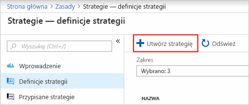
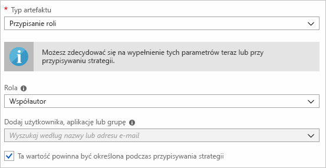
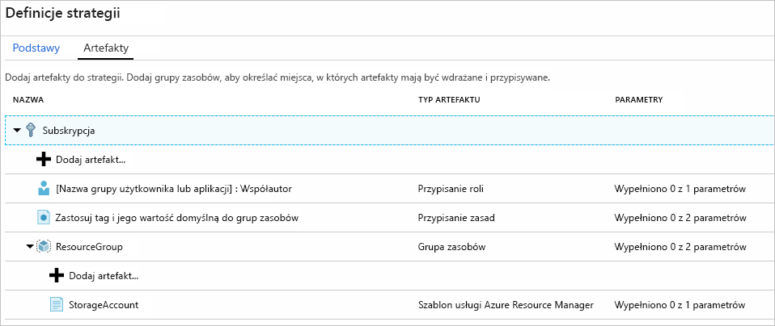
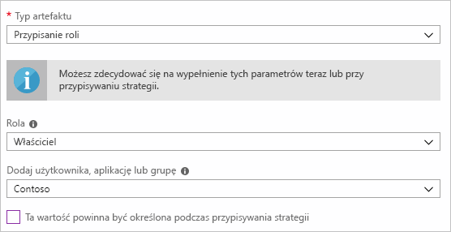
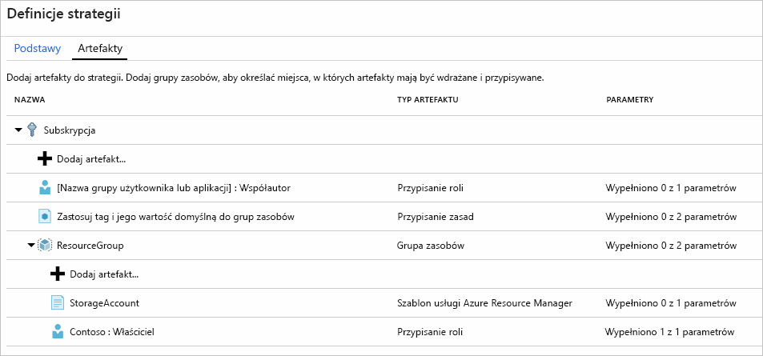
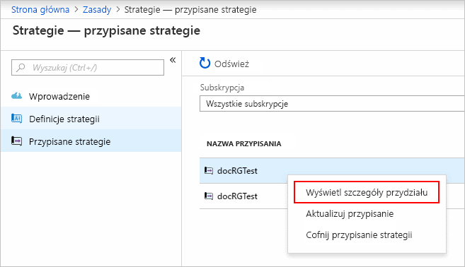

# <a name="quickstart-define-and-assign-a-blueprint-in-the-portal"></a>Szybki Start: Definiowanie i Przypisywanie planu w portalu

Gdy dowiesz się, jak tworzyć i przypisywać plany, możesz definiować typowe wzorce, aby opracowywać konfiguracje do wielokrotnego użytku i szybko wdrażane na podstawie Azure Resource Manager szablonów, zasad, zabezpieczeń i innych. W ramach tego samouczka nauczysz się korzystać z planów platformy Azure w celu wykonywania niektórych typowych zadań związanych z tworzeniem, publikowaniem i przypisywaniem strategii w organizacji. Te zadania obejmują:

> [!div class="checklist"]
> - Tworzenie nowej strategii i dodawanie różnych obsługiwanych artefaktów
> - Wprowadzanie zmian do istniejącej strategii, która wciąż znajduje się w stanie **Wersja robocza**
> - Oznaczanie strategii jako gotowej do przypisania za pomocą stanu **Opublikowano**
> - Przypisywanie strategii do istniejącej subskrypcji
> - Sprawdzanie stanu i postępu przypisanej strategii
> - Usuwanie strategii, która została przypisana do subskrypcji

Jeśli nie masz subskrypcji platformy Azure, przed rozpoczęciem utwórz [bezpłatne konto](https://azure.microsoft.com/free).

## <a name="create-a-blueprint"></a>Tworzenie strategii

Pierwszym krokiem podczas definiowania standardowego wzorca zgodności jest utworzenie strategii z dostępnych zasobów. W tym przykładzie Utwórz nowy plan o nazwie Moje **plany** , aby skonfigurować przypisania ról i zasad dla subskrypcji. Następnie Dodaj nową grupę zasobów i Utwórz szablon Menedżer zasobów i przypisanie roli dla nowej grupy zasobów.

1. W okienku po lewej stronie wybierz pozycję **Wszystkie usługi**. Wyszukaj i wybierz pozycję **Strategie**.

1. Wybierz pozycję **definicje** strategii ze strony po lewej stronie, a następnie wybierz przycisk **+ Utwórz plan** w górnej części strony.

   Lub wybierz pozycję **Utwórz** na stronie **wprowadzenie** , aby przejść bezpośrednio do tworzenia planu.

   

1. Podaj **nazwę** planu, taką jak moje **plany**. (Użyj maksymalnie 48 liter i cyfr, ale nie spacji ani znaków specjalnych). Dla tej pory pozostaw pustą wartość **Opis** planu.

1. W polu **Lokalizacja definicji** wybierz wielokropek po prawej stronie, wybierz [grupę zarządzania](../management-groups/overview.md) lub subskrypcję, w której chcesz zapisać plan, a następnie wybierz **pozycję Wybierz**.

1. Sprawdź, czy informacje są poprawne. Nie można później zmienić **nazwy** planu i **lokalizacji definicji** . Następnie wybierz pozycję **Dalej: artefakty** w dolnej części strony lub kartę **artefakty** w górnej części strony.

1. Dodaj przypisanie roli na poziomie subskrypcji:

   1. Wybierz pozycję **+ Dodaj wiersz artefaktu** w obszarze **subskrypcja**. Po prawej stronie przeglądarki zostanie otwarte okno **Dodawanie artefaktów** .

   1. Wybierz **przypisanie roli** dla **typu artefaktu**.

   1. W obszarze **rola**wybierz pozycję **współautor**. Pozostaw pole wyboru **Dodaj użytkownika, aplikację lub grupę** , które wskazuje parametr dynamiczny.

   1. Wybierz pozycję **Dodaj** , aby dodać ten artefakt do planu.

   

   > [!NOTE]
   > Większość artefaktów obsługuje parametry. Parametr, do którego przypisano wartość podczas tworzenia planu, jest *parametrem statycznym*. Jeśli parametr zostanie przypisany podczas przypisywania planu, jest to *parametr dynamiczny*. Aby uzyskać więcej informacji, zobacz [Parametry strategii](./concepts/parameters.md).

1. Dodaj przypisanie zasad na poziomie subskrypcji:

   1. Wybierz **+ Dodaj wiersz artefaktu** w obszarze artefaktu przypisania roli.

   1. Wybierz **przypisanie zasad** dla **typu artefaktu**.

   1. Zmień **Typ** na **wbudowany**. W polu **wyszukiwania**wpisz **tag**.

   1. Kliknij poza polem **Wyszukiwanie**, aby zastosować filtrowanie. Wybierz opcję **Dołącz tag i jej wartość domyślną do grup zasobów**.

   1. Wybierz pozycję **Dodaj** , aby dodać ten artefakt do planu.

1. Wybierz wiersz **znacznika Dołącz przypisanie zasad i jego wartość domyślną do grup zasobów**.

1. Okno, aby dostarczyć parametry artefaktu w ramach definicji planu otwiera się i umożliwia ustawienie parametrów dla wszystkich przypisań (parametry statyczne) na podstawie tego planu, zamiast podczas przypisywania (parametry dynamiczne). W tym przykładzie podczas przypisywania strategii są używane parametry dynamiczne, więc pozostaw wartości domyślne i wybierz pozycję **Anuluj**.

1. Dodaj grupę zasobów na poziomie subskrypcji:

   1. Wybierz pozycję **+ Dodaj wiersz artefaktu** w obszarze **subskrypcja**.

   1. Wybierz **grupę zasobów** dla **typu artefaktu**.

   1. Pozostaw pustą **nazwę wyświetlaną artefaktu**, **nazwę grupy zasobów**i pola **lokalizacji** pustej, ale upewnij się, że pole wyboru jest zaznaczone dla każdej właściwości parametru, aby uczynić je parametrami dynamicznymi.

   1. Wybierz pozycję **Dodaj** , aby dodać ten artefakt do planu.

1. Dodaj szablon do grupy zasobów:

   1. Wybierz **+ Dodaj wiersz artefaktu** w ramach wpisu grupy **zasobów** .

   1. Wybierz **szablon Azure Resource Manager** dla **typu artefaktu**, ustaw **nazwę wyświetlaną artefaktu** na **StorageAccount**i pozostaw pole **Opis** puste.

   1. Na karcie **Szablon** w polu edytora wklej poniższy szablon usługi Resource Manager.
      Po wklejeniu szablonu wybierz kartę **Parametry** i zwróć uwagę na to, że wykryto parametry szablonu **storageAccountType** i **Location** . Każdy parametr został automatycznie wykryty i wypełniony, ale skonfigurowany jako parametr dynamiczny.

      > [!IMPORTANT]
      > W przypadku importowania szablonu upewnij się, że plik ma tylko format JSON i nie zawiera kodu HTML. Gdy wskazujesz adres URL w serwisie GitHub, upewnij się, że wybrano opcję **RAW** , aby uzyskać czysty plik JSON, a nie ten, który został opakowany w formacie HTML do wyświetlania w serwisie GitHub. Jeśli zaimportowany szablon nie jest czystym plikiem JSON, wystąpi błąd.

      ```json
      {
          "$schema": "https://schema.management.azure.com/schemas/2015-01-01/deploymentTemplate.json#",
          "contentVersion": "1.0.0.0",
          "parameters": {
              "storageAccountType": {
                  "type": "string",
                  "defaultValue": "Standard_LRS",
                  "allowedValues": [
                      "Standard_LRS",
                      "Standard_GRS",
                      "Standard_ZRS",
                      "Premium_LRS"
                  ],
                  "metadata": {
                      "description": "Storage Account type"
                  }
              },
              "location": {
                  "type": "string",
                  "defaultValue": "[resourceGroup().location]",
                  "metadata": {
                      "description": "Location for all resources."
                  }
              }
          },
          "variables": {
              "storageAccountName": "[concat('store', uniquestring(resourceGroup().id))]"
          },
          "resources": [{
              "type": "Microsoft.Storage/storageAccounts",
              "name": "[variables('storageAccountName')]",
              "location": "[parameters('location')]",
              "apiVersion": "2018-07-01",
              "sku": {
                  "name": "[parameters('storageAccountType')]"
              },
              "kind": "StorageV2",
              "properties": {}
          }],
          "outputs": {
              "storageAccountName": {
                  "type": "string",
                  "value": "[variables('storageAccountName')]"
              }
          }
      }
      ```

   1. Wyczyść pole wyboru **storageAccountType** i pamiętaj, że lista rozwijana zawiera tylko wartości zawarte w szablonie Menedżer zasobów w obszarze **allowedValues**. Zaznacz pole, aby ponownie ustawić parametr dynamiczny.

   1. Wybierz pozycję **Dodaj** , aby dodać ten artefakt do planu.

   

1. Ukończona strategia powinna wyglądać podobnie do poniższej. Zwróć uwagę, że każdy artefakt ma **parametry _x_ out z _y_ wypełnione** w kolumnie **Parameters** . Parametry dynamiczne są ustawiane podczas każdego przydziału planu.

   

1. Po dodaniu wszystkich zaplanowanych artefaktów wybierz pozycję **Zapisz wersję roboczą** w dolnej części strony.

## <a name="edit-a-blueprint"></a>Edytowanie strategii

W obszarze [Utwórz plan](#create-a-blueprint)nie podano opisu lub Dodaj przypisanie roli do nowej grupy zasobów. Aby rozwiązać ten problem, wykonaj następujące czynności:

1. Wybierz pozycję **Definicje strategii** w lewej części strony.

1. Na liście planów kliknij prawym przyciskiem myszy wcześniej utworzoną, a następnie wybierz pozycję **Edytuj plan**.

1. W polu **Opis strategii** podaj informacje o strategii i artefaktach, które ją tworzą. W takim przypadku wprowadź coś takiego jak: **ten plan ustawia zasady tagów i przypisanie roli w ramach subskrypcji, tworzy grupy zasobów i wdraża szablon zasobu i przypisanie roli do tego zasobu.**

1. Wybierz pozycję **Dalej: artefakty** w dolnej części strony lub kartę **artefakty** w górnej części strony.

1. Dodaj przypisanie roli do grupy zasobów:

   1. Wybierz pozycję **+ Dodaj wiersz artefaktu** bezpośrednio pod wpisem grupy **zasobów** .

   1. Wybierz **przypisanie roli** dla **typu artefaktu**.

   1. W obszarze **rola**wybierz pozycję **właściciel**, a następnie wyczyść pole wyboru w obszarze **Dodawanie użytkownika, aplikacji lub grupy** .

   1. Wyszukaj i wybierz użytkownika, aplikację lub grupę do dodania. Ten artefakt używa parametru statycznego ustawionego tak samo w każdym przypisaniu tego planu.

   e. Wybierz pozycję **Dodaj** , aby dodać ten artefakt do planu.

   

1. Ukończona strategia powinna wyglądać podobnie do poniższej. Zwróć uwagę, że nowo dodane przypisanie roli pokazuje, że **wypełniono 1 z 1 parametrów**. Oznacza to, że jest to parametr statyczny.

   

1. Wybierz pozycję **Zapisz wersję roboczą** teraz, gdy została zaktualizowana.

## <a name="publish-a-blueprint"></a>Publikowanie strategii

Po dodaniu wszystkich zaplanowanych artefaktów do strategii czas na jej opublikowanie.
Opublikowanie sprawia, że plan jest dostępny do przypisania do subskrypcji.

1. Wybierz pozycję **Definicje strategii** w lewej części strony.

1. Na liście planów kliknij prawym przyciskiem myszy ten, który został wcześniej utworzony, a następnie wybierz pozycję **Publikuj plan**.

1. W otwartym okienku Podaj **wersję** (litery, cyfry i łączniki z maksymalną długością 20 znaków), taką jak **V1**. Opcjonalnie wprowadź tekst w polu **Zmień uwagi**, na przykład **najpierw Opublikuj**.

1. Wybierz pozycję **Publikuj** w dolnej części strony.

## <a name="assign-a-blueprint"></a>Przypisywanie strategii

Po opublikowaniu planu można go przypisać do subskrypcji. Przypisz utworzony plan do jednej z subskrypcji w hierarchii grupy zarządzania. Jeśli strategia została zapisana w subskrypcji, można ją przypisać tylko do tej subskrypcji.

1. Wybierz pozycję **Definicje strategii** w lewej części strony.

1. Na liście planów kliknij prawym przyciskiem myszy wcześniej utworzoną opcję (lub wybierz wielokropek) i wybierz pozycję **Przypisz plan**.

1. Na stronie **Przypisz plan** na liście rozwijanej **subskrypcja** wybierz subskrypcje, dla których chcesz wdrożyć ten plan.

   Jeśli w portalu [Azure Billing](../../billing/index.md) są dostępne obsługiwane oferty dotyczące wersji Enterprise, zostanie uaktywniony link **Utwórz nową** w obszarze **Subskrypcja**. Wykonaj następujące kroki:

   1. Wybierz link **Utwórz nową**, aby utworzyć nową subskrypcję, zamiast wybierać już istniejące.

   1. W polu **Nazwa wyświetlana** podaj nazwę dla nowej subskrypcji.

   1. Wybierz dostępną **ofertę** z listy rozwijanej.

   1. Użyj wielokropka, aby wybrać [grupę zarządzania](../management-groups/overview.md) , do której subskrypcja będzie podrzędna.

   1. Wybierz pozycję **Utwórz** w dolnej części strony.

   

   > [!IMPORTANT]
   > Nowa subskrypcja zostanie utworzona natychmiast po wybraniu opcji **Utwórz**.

   > [!NOTE]
   > Dla każdej wybranej subskrypcji zostanie utworzone przypisanie. Można wprowadzać zmiany w jednym przypisaniu subskrypcji w późniejszym czasie bez wymuszania zmian w pozostałej części wybranych subskrypcji.

1. Dla **nazwy przydziału**Podaj unikatową nazwę dla tego przypisania.

1. W obszarze **Lokalizacja**wybierz region, w którym ma zostać utworzona zarządzana tożsamość i obiekt wdrożenia subskrypcji. Usługa Azure Blueprint używa tej tożsamości zarządzanej do wdrażania wszystkich artefaktów w przypisanej strategii. Aby dowiedzieć się więcej, zobacz [Tożsamości zarządzane dla zasobów platformy Azure](../../active-directory/managed-identities-azure-resources/overview.md).

1. Pozostaw wybraną **wersję definicji** planu z listy rozwijanej wersje **opublikowanych** wersji w pozycji **V1** . (Domyślnie jest to ostatnio opublikowana wersja).

1. Dla opcji **Blokowanie przypisania** pozostaw wartość domyślną **Nie blokuj**. Aby uzyskać więcej informacji, zobacz temat [plany blokowania zasobów](./concepts/resource-locking.md).

   

1. W obszarze **zarządzana tożsamość**pozostaw domyślnie **przypisany system**.

1. Dla przypisania roli na poziomie subskrypcji **[Grupa użytkowników lub nazwa aplikacji]: Współautor** wyszukaj i wybierz użytkownika, aplikację lub grupę.

1. Dla przypisania zasad na poziomie subskrypcji ustaw wartość **nazwa tagu** na **CostCenter** , a **wartością tagu** na **ContosoIT**.

1. W przypadku obiektu **resources**Podaj **nazwę** **StorageAccount** i **lokalizację** **Wschodnie stany USA 2** z listy rozwijanej.

   > [!NOTE]
   > Dla każdego artefaktu dodanego w ramach grupy zasobów podczas definiowania planu, ten artefakt jest wcięty do dopasowania do grupy zasobów lub obiektu, w którym zostanie wdrożony.
   > Artefakty, które nie przyjmują parametrów lub nie mają parametrów, które mają być zdefiniowane podczas przypisywania, są wyświetlane tylko dla informacji kontekstowych.

1. Na **StorageAccount**szablonu Azure Resource Manager wybierz pozycję **Standard_GRS** dla parametru **storageAccountType** .

1. Zapoznaj się z polem informacji w dolnej części strony, a następnie wybierz pozycję **Przypisz**.

## <a name="track-deployment-of-a-blueprint"></a>Śledzenie wdrażania strategii

Po przypisaniu strategii do co najmniej jednej subskrypcji dzieją się dwie rzeczy:

- Plan zostanie dodany do strony **przypisane plany** dla każdej subskrypcji.
- Zostanie rozpoczęty proces wdrażania wszystkich artefaktów zdefiniowanych przez plan.

Teraz, gdy plan został przypisany do subskrypcji, sprawdź postęp wdrożenia:

1. Wybierz pozycję **Przypisane strategie** w lewej części strony.

1. Na liście planów kliknij prawym przyciskiem myszy wcześniej przypisane, a następnie wybierz pozycję **Wyświetl szczegóły przydziału**.

   

1. Na stronie **przypisanie** strategii Sprawdź, czy wszystkie artefakty zostały pomyślnie wdrożone i czy nie wystąpiły żadne błędy podczas wdrażania. Jeśli wystąpią błędy, zobacz tematy dotyczące [rozwiązywania problemów](./troubleshoot/general.md) , aby określić, co poszło źle.

## <a name="unassign-a-blueprint"></a>Cofanie przypisania strategii

Jeśli nie potrzebujesz już przypisania planu, usuń je z subskrypcji. Plan mógł zostać zastąpiony przez nowszy plan z zaktualizowanymi wzorcami, zasadami i projektami. Po usunięciu strategii artefakty przypisane w jej ramach są pozostawiane. Aby usunąć przypisanie strategii, wykonaj następujące kroki:

1. Wybierz pozycję **Przypisane strategie** w lewej części strony.

1. Na liście planów wybierz strategię, którą chcesz cofnąć przypisanie. Następnie wybierz przycisk **Cofnij przypisanie** planu w górnej części strony.

1. Przeczytaj komunikat z potwierdzeniem, a następnie wybierz przycisk **OK**.

## <a name="delete-a-blueprint"></a>Usuwanie strategii

1. Wybierz pozycję **Definicje strategii** w lewej części strony.

1. Kliknij prawym przyciskiem myszy plan, który chcesz usunąć, a następnie wybierz pozycję **Usuń plan**. Następnie wybierz pozycję **tak** w oknie dialogowym potwierdzenia.

> [!NOTE]
> Usunięcie planu w tej metodzie spowoduje również usunięcie wszystkich opublikowanych wersji wybranego planu.
> Aby usunąć pojedynczą wersję, Otwórz plan, wybierz kartę **opublikowane wersje** , wybierz wersję, którą chcesz usunąć, a następnie wybierz pozycję **Usuń tę wersję**. Nie można również usunąć planu, dopóki nie usunięto wszystkich przypisań planu tej definicji planu.

## <a name="next-steps"></a>Następne kroki

- Uzyskaj informacje na temat [cyklu życia strategii](./concepts/lifecycle.md).
- Dowiedz się, jak używać [parametrów statycznych i dynamicznych](./concepts/parameters.md).
- Dowiedz się, jak dostosować [kolejność sekwencjonowania strategii](./concepts/sequencing-order.md).
- Dowiedz się, jak używać [blokowania zasobów strategii](./concepts/resource-locking.md).
- Dowiedz się, jak [zaktualizować istniejące przypisania](./how-to/update-existing-assignments.md).
- Rozwiązywanie problemów podczas przypisywania strategii za pomocą [ogólnych procedur rozwiązywania problemów](./troubleshoot/general.md).