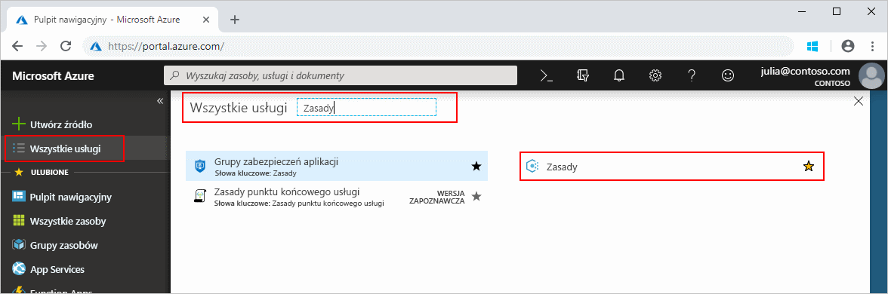
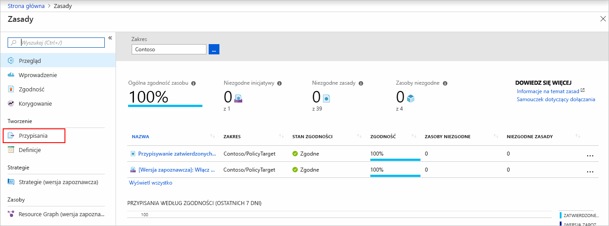
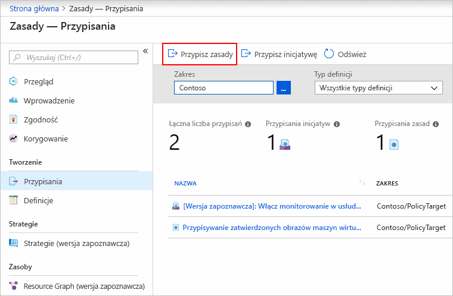
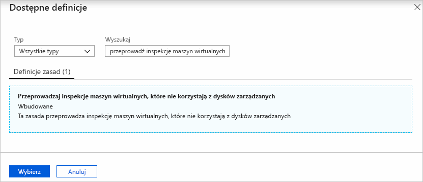
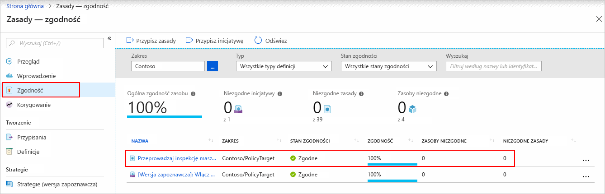
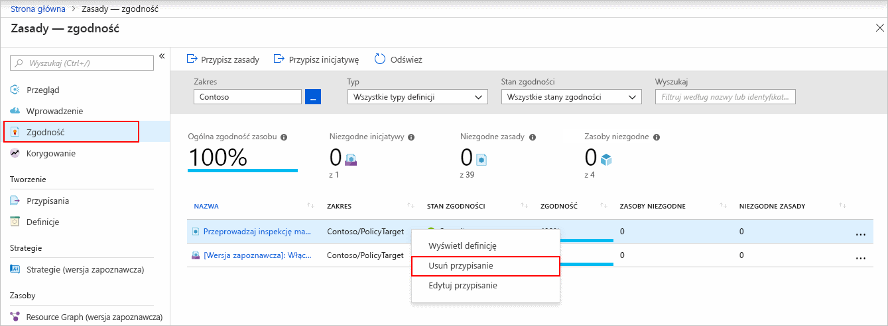

# Szybki Start: Tworzenie przypisania zasad w celu zidentyfikowania niezgodnych zasobów

Pierwszym krokiem do zrozumienia pojęcia zgodności na platformie Azure jest określenie obecnej sytuacji dotyczącej Twoich zasobów.
Ten przewodnik Szybki start przeprowadzi Cię przez proces tworzenia przypisania zasad w celu zidentyfikowania maszyn wirtualnych, które nie korzystają z dysków zarządzanych.

Po zakończeniu tego procesu pomyślnie zidentyfikujesz maszyny wirtualne, które nie korzystają z dysków zarządzanych. Są one *niezgodne* z przypisaniem zasad.

Jeśli nie masz subskrypcji platformy Azure, przed rozpoczęciem utwórz [bezpłatne](https://azure.microsoft.com/free/) konto.

## Tworzenie przypisania zasad

W tym przewodniku Szybki start utworzysz przypisanie zasad i przypiszesz definicję zasad *Audit VMs that do not use managed disks* (Przeprowadź inspekcję maszyn wirtualnych, które nie korzystają z dysków zarządzanych).

1. Uruchom usługę Azure Policy w witrynie Azure Portal, klikając opcję **Wszystkie usługi** i następnie wyszukując i wybierając opcję **Zasada**.

   

1. Wybierz pozycję **Przypisania** w lewej części strony usługi Azure Policy. Przypisanie to zasady, które zostały przypisane do określonego zakresu.

   

1. Wybierz pozycję **Przypisz zasady** w górnej części strony **Zasady — Przypisania**.

   

1. Na stronie **Przypisywanie zasad** wybierz **Zakres**, klikając wielokropek i wybierając grupę zarządzania lub subskrypcję. Opcjonalnie możesz wybrać grupę zasobów. Zakres określa, jakie zasoby lub grupy zasobów są wymuszane w ramach przypisania zasad. Następnie kliknij przycisk **Wybierz** w dolnej części strony **Zakres**.

   W tym przykładzie użyto subskrypcji **Contoso**. Twoja subskrypcja będzie inna.

1. Zasoby można wykluczyć na podstawie opcji **Zakres**. **Wykluczenia** są uruchamiane o jeden poziom niżej od poziomu opcji **Zakres**. Pole **Wykluczenia** jest opcjonalne, więc na razie można je pozostawić puste.

1. W polu **Definicja zasad** wybierz wielokropek, aby otworzyć listę dostępnych definicji. Usługa Azure Policy zawiera wbudowane definicje zasad, których możesz używać. Dostępnych jest wiele wbudowanych definicji, na przykład:

   - Enforce tag and its value (Wymuś tag i jego wartość)
   - Apply tag and its value (Zastosuj tag i jego wartość)
   - Require SQL Server Version 12.0 (Wymagaj programu SQL Server w wersji 12.0)

   Aby zapoznać się z częściową listą dostępnych wbudowanych zasad, zobacz [Azure Policy Samples](./samples/index.md).

1. Przeszukaj listę definicji zasad, aby znaleźć definicję *Audit VMs that do not use managed disks* (Przeprowadź inspekcję maszyn wirtualnych, które nie używają dysków zarządzanych). Kliknij te zasady, a następnie kliknij pozycję **Wybierz**.

   

1. W polu **Nazwa przypisania** jest automatycznie wpisywana nazwa wybranej zasady, ale można ją zmienić. W tym przykładzie pozostaw nazwę *Audit VMs that do not use managed disks* (Przeprowadź inspekcję maszyn wirtualnych, które nie używają dysków zarządzanych). Można również dodać opcjonalny **Opis**. Opis zawiera szczegóły dotyczące danego przypisania zasad.
   Pole **Przypisane przez** jest wypełniane automatycznie w zależności od tego, kto jest zalogowany. To pole jest opcjonalne, dzięki czemu można wprowadzić wartości niestandardowe.

1. Pozostaw pole **Utwórz tożsamość zarządzaną** niezaznaczone. To pole _należy_ zaznaczyć, gdy zasada lub inicjatywa obejmuje zasadę z efektem [deployIfNotExists](./concepts/effects.md#deployifnotexists). Ponieważ w przypadku zasad stosowanych na potrzeby tego przewodnika Szybki start tak nie jest, pozostaw to pole puste. Aby uzyskać więcej informacji, zobacz tematy dotyczące [tożsamości zarządzanych](../../active-directory/managed-identities-azure-resources/overview.md) i [sposobu działania zabezpieczeń w zakresie korygowania](./how-to/remediate-resources.md#how-remediation-security-works).

1. Kliknij przycisk **Przypisz**.

Teraz możesz zidentyfikować niezgodne zasoby, aby zrozumieć stan zgodności środowiska.

## Identyfikowanie niezgodnych zasobów

Wybierz pozycję **Zgodność** w lewej części strony. Znajdź utworzone przypisanie zasad **Audit VMs that do not use managed disks** (Przeprowadź inspekcję maszyn wirtualnych, które nie używają dysków zarządzanych).

Jeśli istnieją jakiekolwiek zasoby niezgodne z nowym przypisaniem, zostaną one wyświetlone w obszarze **Niezgodne zasoby**.

Jeśli warunek zostanie oceniony dla istniejących zasobów i okaże się prawdziwy, zasoby te zostaną oznaczone jako niezgodne z zasadami. W poniższej tabeli przedstawiono sposób, w jaki różne akcje dotyczące zasad wpływają na ocenę warunku na potrzeby wynikowego stanu zgodności. Chociaż nie widzisz logiki oceny w Azure Portal, zostaną wyświetlone wyniki stanu zgodności. Wynik stanu zgodności może być zgodny lub niezgodny.

| **Stan zasobu** | **Efekt** | **Ocena zasad** | **Stan zgodności** |
| --- | --- | --- | --- |
| Exists | Deny, Audit, Append\*, DeployIfNotExist\*, AuditIfNotExist\* | Prawda | Niezgodne |
| Exists | Deny, Audit, Append\*, DeployIfNotExist\*, AuditIfNotExist\* | False | Zgodne |
| Nowa | Audit, AuditIfNotExist\* | Prawda | Niezgodne |
| Nowa | Audit, AuditIfNotExist\* | False | Zgodne |

\* Efekty Append, DeployIfNotExist i AuditIfNotExist wymagają instrukcji IF z wartością TRUE.
Ponadto efekty wymagają, aby warunek istnienia miał wartość FALSE, aby być niezgodnymi. W przypadku wartości TRUE warunek IF wyzwala ocenę warunku istnienia dla powiązanych zasobów.

## Oczyszczanie zasobów

Aby usunąć utworzone przypisanie, wykonaj następujące kroki:

1. Wybierz pozycję **Zgodność** (lub **Przypisania**) w lewej części strony usługi Azure Policy i znajdź utworzone przypisanie zasad **Audit VMs that do not use managed disks** (Przeprowadź inspekcję maszyn wirtualnych, które nie używają dysków zarządzanych).

1. Kliknij prawym przyciskiem myszy przypisanie **Audit VMs that do not use managed disks** (Przeprowadź inspekcję maszyn wirtualnych, które nie używają dysków zarządzanych), a następnie wybierz pozycję **Usuń przypisanie**

   

## Następne kroki

W tym przewodniku Szybki start przypisano definicję zasad do zakresu i oceniono raport jego zgodności.
Definicja zasady zawiera sprawdzenie, czy wszystkie zasoby w ramach zakresu są zgodne, oraz określenie niezgodnych zasobów.

Aby dowiedzieć się więcej na temat przypisywania zasad w celu sprawdzenia zgodności nowych zasobów, przejdź do samouczka:

> [!div class="nextstepaction"]
> [Tworzenie zasad i zarządzanie nimi](./tutorials/create-and-manage.md)