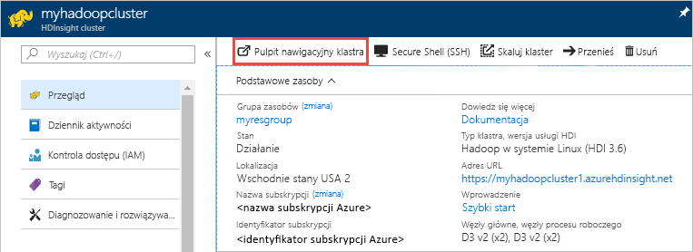
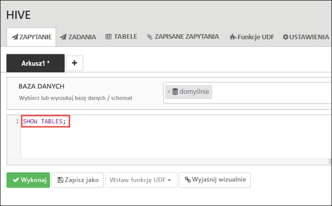
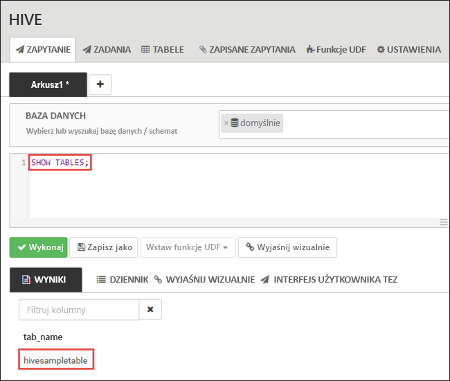
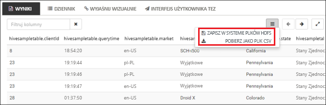
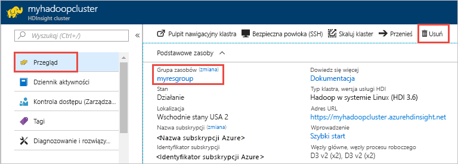

# <a name="quickstart-create-apache-hadoop-cluster-in-azure-hdinsight-using-azure-portal"></a>Szybki start: Tworzenie klastra Apache Hadoop w usłudze Azure HDInsight przy użyciu Azure Portal

W tym artykule dowiesz się, jak tworzyć klastry usługi [Apache Hadoop](https://hadoop.apache.org/) w usłudze HDInsight przy użyciu witryny Azure Portal, a następnie uruchamiać zadania usługi Apache Hive w usłudze HDInsight. Większość zadań usługi Hadoop to zadania wsadowe. Tworzysz klaster, uruchamiasz pewne zadania, a następnie usuwasz klaster. W tym artykule wykonasz wszystkie trzy zadania.

W tym przewodniku Szybki start użyjesz witryny Azure Portal do utworzenia klastra Hadoop w usłudze HDInsight. Klaster możesz utworzyć również przy użyciu [szablonu usługi Azure Resource Manager](apache-hadoop-linux-tutorial-get-started.md).

Obecnie usługa HDInsight obejmuje [siedem różnych typów klastrów](./apache-hadoop-introduction.md#cluster-types-in-hdinsight). Każdy typ klastra obsługuje inny zestaw składników. Wszystkie typy klastrów obsługują technologię Hive. Aby uzyskać listę składników obsługiwanych w usłudze HDInsight, zobacz artykuł [Nowości w wersjach klastra Hadoop dostarczanych z usługą HDInsight](../hdinsight-component-versioning.md).  

Jeśli nie masz subskrypcji platformy Azure, przed rozpoczęciem [utwórz bezpłatne konto](https://azure.microsoft.com/free/).

## <a name="create-an-apache-hadoop-cluster"></a>Tworzenie klastra Apache Hadoop

W tej sekcji utworzysz klaster usługi Hadoop w usłudze HDInsight przy użyciu witryny Azure Portal.

1. Zaloguj się w witrynie [Azure Portal](https://portal.azure.com).

1. W Azure Portal przejdź do obszaru Tworzenie usługi**HDInsight** **Analiza** >  **zasobów** > .

    

1. W obszarze**podstawy** **szybkiego tworzenia** > usługi **HDInsight** > wpisz lub wybierz następujące wartości:

    |Właściwość  |Opis  |
    |---------|---------|
    |Nazwa klastra   | Wprowadź nazwę klastra usługi Hadoop. Ponieważ wszystkie klastry w usłudze HDInsight używają tej samej przestrzeni nazw DNS, ta nazwa musi być unikatowa. Nazwa może składać się z maksymalnie 59 znaków, w tym liter, cyfr i łączników. Łącznik nie może być pierwszym ani ostatnim znakiem nazwy. |
    |Subscription    |  Wybierz swoją subskrypcję platformy Azure. |
    |Typ klastra     | Na razie pomiń tę właściwość. Podasz te dane wejściowe w następnym kroku tej procedury.|
    |Nazwa użytkownika i hasło logowania klastra    | Domyślna nazwa logowania to **admin**. Hasło musi składać się z co najmniej 10 znaków i musi zawierać co najmniej jedną cyfrę, jedną wielką i jedną małą literę oraz jeden znak inny niż alfanumeryczny (z wyjątkiem znaków ' " ` \). Upewnij się, że **nie zostało podane** typowe hasło, takie jak „Pass@word1”.|
    |Nazwa użytkownika protokołu SSH (Secure Shell) | Domyślna nazwa użytkownika to **sshuser**.  Możesz podać inną nazwę użytkownika protokołu SSH. |
    |Użyj hasła logowania do klastra dla protokołu SSH| Zaznacz to pole wyboru, aby użyć tego samego hasła dla użytkownika SSH, który został podany dla użytkownika logowania klastra.|
    |Resource group     | Utwórz grupę zasobów lub wybierz istniejącą grupę zasobów.  Grupa zasobów jest kontenerem składników platformy Azure.  W tym przypadku grupa zasobów zawiera klaster usługi HDInsight i zależne konto usługi Azure Storage. |
    |Location    | Wybierz lokalizację platformy Azure, w której chcesz utworzyć klaster.  Wybierz lokalizację znajdującą się blisko, aby zapewnić lepszą wydajność. |

    

1. Wybierz pozycję **Typ klastra** , aby otworzyć stronę **Konfiguracja klastra** , a następnie podaj następujące wartości:

    |Właściwość  |Opis  |
    |---------|---------|
    |Typ klastra     | Wybierz opcję **Hadoop** |
    |Version     | Wybierz pozycję **Hadoop 2.7.3 (HDI 3.6)**|

    

    Wybierz pozycję **Wybierz** , a następnie wybierz pozycję **dalej** , aby przejść do ustawień magazynu.

1. Na karcie **Magazyn** podaj następujące wartości:

    |Właściwość  |Opis  |
    |---------|---------|
    |Podstawowy typ magazynu    | W tym artykule wybierz pozycję Azure Storage, aby użyć Azure Storage Blob jako domyślnego konta magazynu. Możesz też użyć usługi Azure Data Lake Storage jako magazynu domyślnego. |
    |Metoda wybierania     |  Na potrzeby tego artykułu wybierz pozycję **Moje subskrypcje**, aby użyć konta magazynu ze swojej subskrypcji platformy Azure. Aby użyć konta magazynu z innych subskrypcji, wybierz pozycję **Klucz dostępu**, a następnie podaj klucz dostępu dla tego konta. |
    |Wybierz konto magazynu   | Wybierz pozycję **Wybierz konto magazynu** , aby wybrać istniejące konto magazynu, lub wybierz pozycję **Utwórz nowe**. Jeśli utworzysz nowe konto, nazwa musi mieć długość od 3 do 24 znaków i może zawierać tylko cyfry i małe litery.|

    Zaakceptuj wszystkie pozostałe wartości domyślne, a następnie wybierz pozycję **dalej** , aby przejść do strony Podsumowanie.

    

1. Na karcie **Podsumowanie** Sprawdź wartości wybrane w poprzednich krokach.

    

1. Wybierz pozycję **Utwórz**. Utworzenie klastra trwa około 20 minut.

1. Po utworzeniu klastra w witrynie Azure Portal zostanie wyświetlona strona przeglądu klastra.

        

    Każdy klaster zależy od [konta usługi Azure Storage](../hdinsight-hadoop-use-blob-storage.md) lub od [konta usługi Azure Data Lake](../hdinsight-hadoop-use-data-lake-store.md). Jest ono określane jako domyślne konto magazynu. Klaster usługi HDInsight i jego domyślne konto magazynu muszą znajdować się w tym samym regionie platformy Azure. Usunięcie klastrów nie powoduje usunięcia konta magazynu.

    > [!NOTE]  
    > Aby poznać inne metody tworzenia klastrów i zapoznać się z właściwościami używanymi w tym przewodniku Szybki Start, zobacz [Tworzenie klastrów usługi HDInsight](../hdinsight-hadoop-provision-linux-clusters.md).

## <a name="run-apache-hive-queries"></a>Uruchamianie zapytań technologii Apache Hive

[Apache Hive](hdinsight-use-hive.md) jest najbardziej popularnym składnikiem używanym w usłudze HDInsight Istnieje wiele sposobów uruchamiania zadań Hive w usłudze HDInsight. W tym przewodniku szybki start użyjesz widoku programu Hive Ambari z poziomu portalu. Aby poznać inne metody przesyłania zadań Hive, zobacz temat [Używanie Hive w usłudze HDInsight](hdinsight-use-hive.md).

1. Aby otworzyć narzędzie Ambari, na ekranie pokazanym na poprzednim zrzucie ekranu wybierz pozycję **Pulpit nawigacyjny klastra**.  Możesz również przejść do `https://ClusterName.azurehdinsight.net`lokalizacji, gdzie `ClusterName` to klaster utworzony w poprzedniej sekcji.

    

2. Wprowadź nazwę użytkownika Hadoop i hasło określone w podczas tworzenia klastra. Domyślna nazwa użytkownika to **admin**.

3. Otwórz widok **Hive View** pokazany na poniższym zrzucie ekranu:

    

4. Na karcie **QUERY** (ZAPYTANIE) wklej poniższe instrukcje HiveQL do arkusza:

    ```sql
    SHOW TABLES;
    ```

    

5. Wybierz pozycję **Wykonaj**. Poniżej karty **QUERY** (ZAPYTANIE) zostanie wyświetlona karta **RESULTS** (WYNIKI) z informacjami o zadaniu. 

    Po zakończeniu przetwarzania zapytania na karcie **QUERY** (ZAPYTANIE) są wyświetlane wyniki operacji. Powinna być widoczna jedna tabela o nazwie **hivesampletable**. Ta przykładowa tabela składnika Hive jest dostarczana z wszystkimi klastrami usługi HDInsight.

    

6. Powtórz kroki 4 i 5, aby uruchomić następujące zapytanie:

    ```sql
    SELECT * FROM hivesampletable;
    ```

7. Można także zapisać wyniki zapytania. Wybierz przycisk menu z prawej strony i określ, czy chcesz pobrać wyniki jako plik CSV, czy zapisać je na koncie magazynu skojarzonym z klastrem.

    

Po zakończeniu zadania Hive można [wyeksportować wyniki do bazy danych Azure SQL Database lub bazy danych programu SQL Server](apache-hadoop-use-sqoop-mac-linux.md), można także [wizualizować wyniki za pomocą programu Excel](apache-hadoop-connect-excel-power-query.md). Aby uzyskać więcej informacji o korzystaniu z programu Hive w usłudze HDInsight, zobacz artykuł [Używanie Apache Hive i HiveQL z usługą Apache Hadoop w usłudze HDInsight do analizy przykładowego pliku Apache log4j](hdinsight-use-hive.md).

## <a name="clean-up-resources"></a>Oczyszczanie zasobów

Po zakończeniu przewodnika Szybki Start możesz chcieć usunąć klaster. Dzięki usłudze HDInsight dane są przechowywane w usłudze Azure Storage, więc można bezpiecznie usunąć klaster, gdy nie jest używany. Opłaty za klaster usługi HDInsight są naliczane nawet wtedy, gdy nie jest używany. Ponieważ opłaty za klaster są wielokrotnie większe niż opłaty za magazyn, ze względów ekonomicznych warto usuwać klastry, gdy nie są używane.

> [!NOTE]  
> Jeśli masz *natychmiast* do następnego artykułu, aby dowiedzieć się, jak uruchamiać operacje ETL przy użyciu usługi Hadoop w usłudze HDInsight, możesz kontynuować działanie klastra. Jest to spowodowane tym, że w samouczku należy ponownie utworzyć klaster usługi Hadoop. Jeśli jednak nie przejdziesz od razu do następnego artykułu, musisz usunąć klaster teraz.

### <a name="to-delete-the-cluster-andor-the-default-storage-account"></a>Usuwanie klastra i/lub domyślnego konta magazynu

1. Wróć do karty przeglądarki, na której znajduje się witryna Azure Portal. Musisz mieć otwartą stronę omówienia klastra. Jeśli chcesz tylko usunąć klaster, zachowując domyślne konto magazynu, wybierz pozycję **Usuń**.

    

2. Jeśli chcesz usunąć klaster oraz domyślne konto magazynu, wybierz nazwę grupy zasobów (wyróżnioną na poprzednim zrzucie ekranu), aby otworzyć stronę grupy zasobów.

3. Wybierz pozycję **Usuń grupę zasobów**, aby usunąć grupę zasobów zawierającą klaster i domyślne konto magazynu. Uwaga: usunięcie grupy zasobów powoduje usunięcie konta magazynu. Jeśli chcesz zachować konta magazynu, wybierz opcję usunięcia tylko klastra.

## <a name="next-steps"></a>Następne kroki

W tym przewodniku szybki start przedstawiono, jak utworzyć klaster usługi HDInsight oparty na systemie Linux przy użyciu szablonu Menedżer zasobów i jak wykonywać podstawowe zapytania programu Hive. W następnym artykule dowiesz się, jak przeprowadzić operację wyodrębniania, transformacji i ładowania (ETL, extract, transform, and load) przy użyciu usługi Hadoop w usłudze HDInsight.

> [!div class="nextstepaction"]
>[Wyodrębnianie, przekształcanie i ładowanie danych przy użyciu interakcyjnych zapytań w usłudze HDInsight](../interactive-query/interactive-query-tutorial-analyze-flight-data.md)
