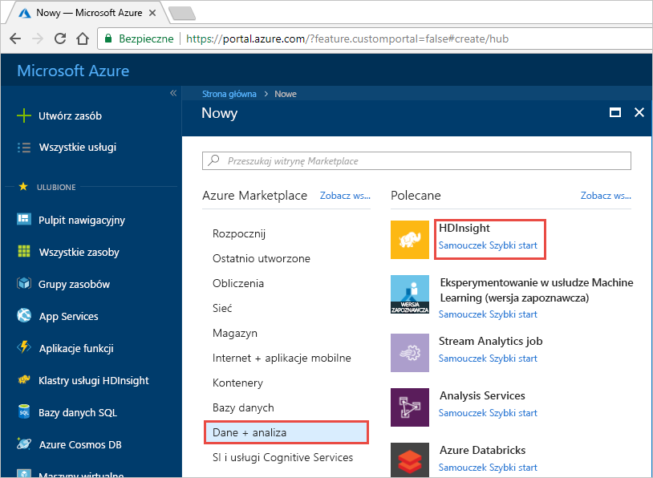
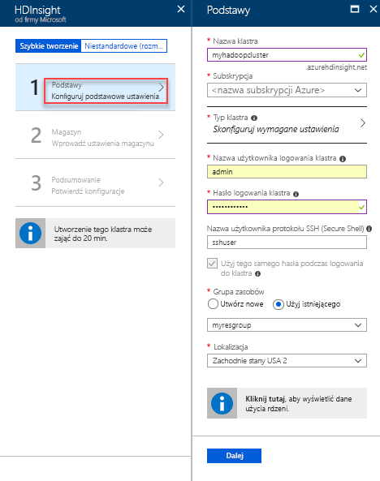
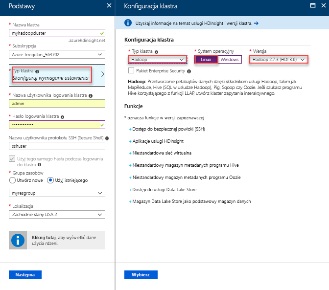
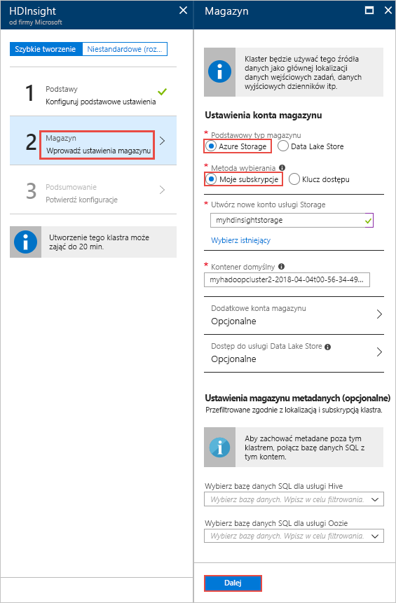
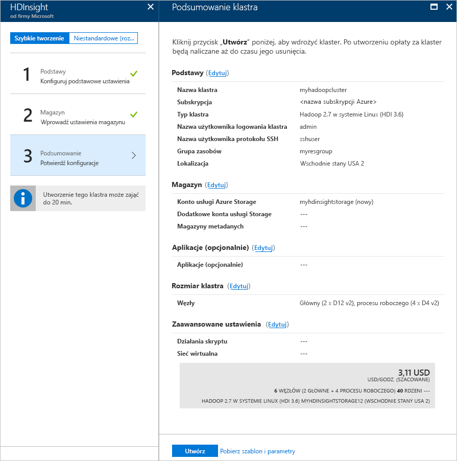

# Szybki start: Rozpoczynanie pracy z platformami Apache Hadoop i Apache Hive w usłudze Azure HDInsight przy użyciu witryny Azure Portal

W tym artykule dowiesz się, jak tworzyć klastry usługi [Apache Hadoop](https://hadoop.apache.org/) w usłudze HDInsight przy użyciu witryny Azure Portal, a następnie uruchamiać zadania usługi Apache Hive w usłudze HDInsight. Większość zadań usługi Hadoop to zadania wsadowe. Tworzysz klaster, uruchamiasz pewne zadania, a następnie usuwasz klaster. W tym artykule wykonasz wszystkie trzy zadania.

W tym przewodniku Szybki start użyjesz witryny Azure Portal do utworzenia klastra Hadoop w usłudze HDInsight. Klaster możesz utworzyć również przy użyciu [szablonu usługi Azure Resource Manager](apache-hadoop-linux-tutorial-get-started.md).

Obecnie usługa HDInsight obejmuje [siedem różnych typów klastrów](./apache-hadoop-introduction.md#cluster-types-in-hdinsight). Każdy typ klastra obsługuje inny zestaw składników. Wszystkie typy klastrów obsługują technologię Hive. Aby uzyskać listę składników obsługiwanych w usłudze HDInsight, zobacz artykuł [Nowości w wersjach klastra Hadoop dostarczanych z usługą HDInsight](../hdinsight-component-versioning.md).  

Jeśli nie masz subskrypcji platformy Azure, przed rozpoczęciem [utwórz bezpłatne konto](https://azure.microsoft.com/free/).

## Tworzenie klastra Apache Hadoop

W tej sekcji utworzysz klaster usługi Hadoop w usłudze HDInsight przy użyciu witryny Azure Portal. 

1. Zaloguj się w witrynie [Azure Portal](https://portal.azure.com).

1. W witrynie Azure Portal wybierz pozycje **Utwórz zasób** > **Dane i analiza** > **HDInsight**. 

    

2. W obszarze **HDInsight** > **Szybkie tworzenie** > **Podstawy** podaj wartości sugerowane na poniższym zrzucie ekranu:

    

    Wprowadź lub wybierz poniższe wartości:
    
    |Właściwość  |Opis  |
    |---------|---------|
    |**Nazwa klastra**     | Wprowadź nazwę klastra usługi Hadoop. Ponieważ wszystkie klastry w usłudze HDInsight używają tej samej przestrzeni nazw DNS, ta nazwa musi być unikatowa. Nazwa może składać się z maksymalnie 59 znaków, w tym liter, cyfr i łączników. Łącznik nie może być pierwszym ani ostatnim znakiem nazwy. |
    |**Subskrypcja**     |  Wybierz swoją subskrypcję platformy Azure. |
    |**Typ klastra**     | Na razie pomiń tę właściwość. Podasz te dane wejściowe w następnym kroku tej procedury.|
    |**Nazwa użytkownika i hasło logowania do klastra**     | Domyślna nazwa logowania to **admin**. Hasło musi składać się z co najmniej 10 znaków i musi zawierać co najmniej jedną cyfrę, jedną wielką i jedną małą literę oraz jeden znak inny niż alfanumeryczny (z wyjątkiem znaków ' " ` \). Upewnij się, że **nie zostało podane** typowe hasło, takie jak „Pass@word1”.|
    |**Nazwa użytkownika protokołu SSH** | Domyślna nazwa użytkownika to **sshuser**.  Możesz podać inną nazwę użytkownika protokołu SSH. |
    | **Użyj tego samego hasła podczas logowania do klastra** | Zaznacz to pole wyboru, aby używać tego samego hasła dla użytkownika protokołu SSH oraz użytkownika logowania do klastra.|
    |**Grupa zasobów**     | Utwórz grupę zasobów lub wybierz istniejącą grupę zasobów.  Grupa zasobów jest kontenerem składników platformy Azure.  W tym przypadku grupa zasobów zawiera klaster usługi HDInsight i zależne konto usługi Azure Storage. |
    |**Lokalizacja**     | Wybierz lokalizację platformy Azure, w której chcesz utworzyć klaster.  Wybierz lokalizację znajdującą się blisko, aby zapewnić lepszą wydajność. |
        
3. Wybierz **Typ klastra**, a następnie podaj dane wejściowe, jak pokazano na poniższym zrzucie ekranu:

    

    Wybierz poniższe wartości:
    
    |Właściwość  |Opis  |
    |---------|---------|
    |**Typ klastra**     | Wybierz opcję **Hadoop** |
    |**System operacyjny**     | Wybierz pozycję **Linux** |
    |**Wersja**     | Wybierz pozycję **Hadoop 2.7.3 (HDI 3.6)**|

    Kliknij przycisk **Wybierz**, a następnie kliknij przycisk **Dalej**.

4. Na karcie **Magazyn** podaj dane wejściowe, jak pokazano na poniższym zrzucie ekranu:

    

    Wybierz poniższe wartości:
    
    |Właściwość  |Opis  |
    |---------|---------|
    |**Podstawowy typ magazynu**     | Na potrzeby tego artykułu wybierz pozycję **Magazyn Azure**, aby użyć usługi Azure Storage Blob jako domyślnego konta magazynu. Możesz też użyć usługi Azure Data Lake Storage jako magazynu domyślnego. |
    |**Metoda wybierania**     |  Na potrzeby tego artykułu wybierz pozycję **Moje subskrypcje**, aby użyć konta magazynu ze swojej subskrypcji platformy Azure. Aby użyć konta magazynu z innych subskrypcji, wybierz pozycję **Klucz dostępu**, a następnie podaj klucz dostępu dla tego konta. |
    |**Tworzenie nowego konta magazynu**     | Podaj nazwę konta magazynu.|

    Zaakceptuj wszystkie pozostałe wartości domyślne, a następnie wybierz przycisk **Dalej**.

5. Na karcie **Podsumowanie** sprawdź wartości wybrane w poprzednich krokach.

    
      
4. Wybierz pozycję **Utwórz**. Na pulpicie nawigacyjnym portalu powinien zostać wyświetlony nowy kafelek zatytułowany **Przekazywanie wdrożenia dla usługi HDInsight**. Utworzenie klastra trwa około 20 minut.

    

4. Po utworzeniu klastra w witrynie Azure Portal zostanie wyświetlona strona przeglądu klastra.
   
        
    
    Każdy klaster zależy od [konta usługi Azure Storage](../hdinsight-hadoop-use-blob-storage.md) lub od [konta usługi Azure Data Lake](../hdinsight-hadoop-use-data-lake-store.md). Jest ono określane jako domyślne konto magazynu. Klaster usługi HDInsight i jego domyślne konto magazynu muszą znajdować się wspólnie w tym samym regionie Azure. Usunięcie klastrów nie powoduje usunięcia konta magazynu.

    > [!NOTE]  
    > Inne metody tworzenia klastrów i opis właściwości używanych w tym samouczku znajdziesz w artykule [Tworzenie klastrów usługi HDInsight](../hdinsight-hadoop-provision-linux-clusters.md).       

## Uruchamianie zapytań technologii Apache Hive

[Apache Hive](hdinsight-use-hive.md) jest najbardziej popularnym składnikiem używanym w usłudze HDInsight Istnieje wiele sposobów uruchamiania zadań Hive w usłudze HDInsight. W tym samouczku użyjesz widoku Hive narzędzia Ambari, korzystając z portalu. Aby poznać inne metody przesyłania zadań Hive, zobacz temat [Używanie Hive w usłudze HDInsight](hdinsight-use-hive.md).

1. Aby otworzyć narzędzie Ambari, na ekranie pokazanym na poprzednim zrzucie ekranu wybierz pozycję **Pulpit nawigacyjny klastra**.  Możesz także przejść pod adres **https://&lt;nazwa_klastra>.azurehdinsight.net**, gdzie &lt;nazwa_klastra> to klaster utworzony w poprzedniej sekcji.

    

2. Wprowadź nazwę użytkownika Hadoop i hasło określone w podczas tworzenia klastra. Domyślna nazwa użytkownika to **admin**.

3. Otwórz widok **Hive View** pokazany na poniższym zrzucie ekranu:
   
    

4. Na karcie **QUERY** (ZAPYTANIE) wklej poniższe instrukcje HiveQL do arkusza:
   
        SHOW TABLES;

         

5. Wybierz pozycję **Wykonaj**. Poniżej karty **QUERY** (ZAPYTANIE) zostanie wyświetlona karta **RESULTS** (WYNIKI) z informacjami o zadaniu. 
   
    Po zakończeniu przetwarzania zapytania na karcie **QUERY** (ZAPYTANIE) są prezentowane wyniki operacji. Powinna być widoczna jedna tabela o nazwie **hivesampletable**. Ta przykładowa tabela składnika Hive jest dostarczana z wszystkimi klastrami usługi HDInsight.
   
    

6. Powtórz kroki 4 i 5, aby uruchomić następujące zapytanie:
   
        SELECT * FROM hivesampletable;
   
7. Można także zapisać wyniki zapytania. Wybierz przycisk menu z prawej strony i określ, czy chcesz pobrać wyniki jako plik CSV, czy zapisać je na koncie magazynu skojarzonym z klastrem.

    

Po zakończeniu zadania Hive można [wyeksportować wyniki do bazy danych Azure SQL Database lub bazy danych programu SQL Server](apache-hadoop-use-sqoop-mac-linux.md), można także [wizualizować wyniki za pomocą programu Excel](apache-hadoop-connect-excel-power-query.md). Aby uzyskać więcej informacji o korzystaniu z programu Hive w usłudze HDInsight, zobacz artykuł [Używanie Apache Hive i HiveQL z usługą Apache Hadoop w usłudze HDInsight do analizy przykładowego pliku Apache log4j](hdinsight-use-hive.md).

## Rozwiązywanie problemów

W razie problemów podczas tworzenia klastrów usługi HDInsight zapoznaj się z [wymaganiami dotyczącymi kontroli dostępu](../hdinsight-hadoop-create-linux-clusters-portal.md).

## Oczyszczanie zasobów
Po ukończeniu korzystania z samouczka warto usunąć klaster. Dzięki usłudze HDInsight dane są przechowywane w usłudze Azure Storage, więc można bezpiecznie usunąć klaster, gdy nie jest używany. Opłaty za klaster usługi HDInsight są naliczane nawet wtedy, gdy nie jest używany. Ponieważ opłaty za klaster są wielokrotnie większe niż opłaty za magazyn, ze względów ekonomicznych warto usuwać klastry, gdy nie są używane. 

> [!NOTE]  
> Jeśli chcesz *natychmiast* przejść do następnego samouczka, aby dowiedzieć się, jak uruchomić operacje ETL przy użyciu usługi Hadoop w usłudze HDInsight, warto zachować działający klaster. Jest tak, ponieważ w tym samouczku trzeba ponownie utworzyć klaster Hadoop. Jeśli jednak nie chcesz od razu przechodzić do następnego samouczka, musisz teraz usunąć klaster.
> 
>  

**Usuwanie klastra i/lub domyślnego konta magazynu**

1. Wróć do karty przeglądarki, na której znajduje się witryna Azure Portal. Musisz mieć otwartą stronę omówienia klastra. Jeśli chcesz tylko usunąć klaster, zachowując domyślne konto magazynu, wybierz pozycję **Usuń**.

    

2. Jeśli chcesz usunąć klaster oraz domyślne konto magazynu, wybierz nazwę grupy zasobów (wyróżnioną na poprzednim zrzucie ekranu), aby otworzyć stronę grupy zasobów.

3. Wybierz pozycję **Usuń grupę zasobów**, aby usunąć grupę zasobów zawierającą klaster i domyślne konto magazynu. Uwaga: usunięcie grupy zasobów powoduje usunięcie konta magazynu. Jeśli chcesz zachować konta magazynu, wybierz opcję usunięcia tylko klastra.

## Następne kroki
Po przeczytaniu tego samouczka umiesz utworzyć oparty na systemie Linux klaster usługi HDInsight przy użyciu szablonu usługi Resource Manager oraz wykonywać podstawowe zapytania Hive. W następnym artykule dowiesz się, jak przeprowadzić operację wyodrębniania, transformacji i ładowania (ETL, extract, transform, and load) przy użyciu usługi Hadoop w usłudze HDInsight.

> [!div class="nextstepaction"]
>[Wyodrębnianie, przekształcanie i ładowanie danych przy użyciu usługi Apache Hive w usłudze HDInsight](../hdinsight-analyze-flight-delay-data-linux.md)

Jeśli chcesz już zacząć korzystać z własnych danych i dowiedzieć się więcej o sposobie przechowywania danych w usłudze HDInsight lub sposobie pobierania danych do usługi HDInsight, zobacz następujące artykuły:

* Aby uzyskać informacje o sposobie używania usługi Azure Storage przez usługę HDInsight, zobacz [Używanie usługi Azure Storage z usługą HDInsight](../hdinsight-hadoop-use-blob-storage.md).
* Aby uzyskać informacje na temat tworzenia klastra usługi HDInsight przy użyciu usługi Data Lake Storage, zobacz przewodnik [Szybki start: konfigurowanie klastrów w usłudze HDInsight](../../storage/data-lake-storage/quickstart-create-connect-hdi-cluster.md).
* Aby uzyskać informacje na temat przekazywania danych do usługi HDInsight, zobacz [Przekazywanie danych do usługi HDInsight](../hdinsight-upload-data.md).
* [Korzystanie z usługi Azure Data Lake Storage Gen2 w połączeniu z klastrami usługi Azure HDInsight](../hdinsight-hadoop-use-data-lake-storage-gen2.md)

Aby dowiedzieć się więcej na temat analizowania danych za pomocą usługi HDInsight, zobacz następujące artykuły:

* Aby dowiedzieć się więcej o korzystaniu z programu Hive z usługą HDInsight, w tym poznać sposoby wykonywania zapytań Hive z programu Visual Studio, zobacz artykuł [Korzystanie z programu Apache Hive z usługą HDInsight](hdinsight-use-hive.md).
* Aby dowiedzieć się więcej na temat języka Pig używanego do przekształcania danych, zobacz artykuł [Korzystanie z języka Pig z usługą HDInsight](hdinsight-use-pig.md).
* Aby dowiedzieć się więcej o MapReduce, czyli sposobie pisania programów przetwarzających dane w usłudze Hadoop, zobacz [Używanie MapReduce z usługą HDInsight](hdinsight-use-mapreduce.md).
* Aby dowiedzieć się więcej o używaniu narzędzi HDInsight Tools for Visual Studio do analizowania danych w usłudze HDInsight, zobacz [Wprowadzenie do używania narzędzi Visual Studio Hadoop dla usługi HDInsight](apache-hadoop-visual-studio-tools-get-started.md).

Jeśli chcesz dowiedzieć się więcej o tworzeniu klastra usługi HDInsight i zarządzaniu nim, zobacz następujące artykuły:

* Aby uzyskać więcej informacji na temat zarządzania opartym na systemie Linux klastrem usługi HDInsight, zobacz artykuł [Zarządzanie klastrami usługi HDInsight za pomocą narzędzia Apache Ambari](../hdinsight-hadoop-manage-ambari.md).
* Aby dowiedzieć się więcej na temat opcji, które można wybrać podczas tworzenia klastra usługi HDInsight, zobacz [Tworzenie klastra usługi HDInsight w systemie Linux przy użyciu niestandardowych opcji](../hdinsight-hadoop-provision-linux-clusters.md).

[1]: ../HDInsight/apache-hadoop-visual-studio-tools-get-started.md

[hdinsight-provision]: hdinsight-provision-linux-clusters.md
[hdinsight-upload-data]: hdinsight-upload-data.md
[hdinsight-use-hive]: hdinsight-use-hive.md
[hdinsight-use-pig]: hdinsight-use-pig.md

