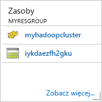
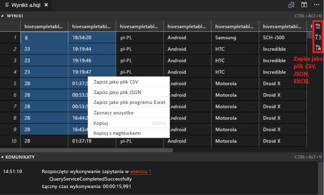
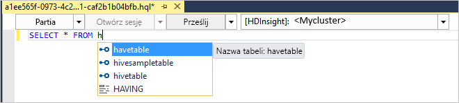
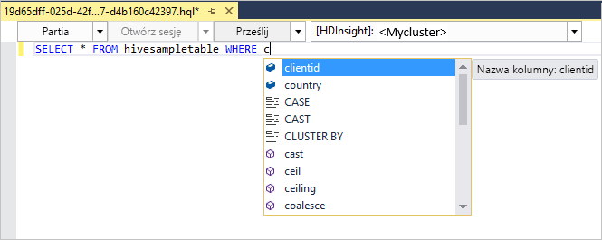
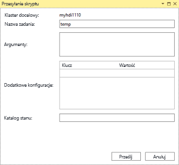
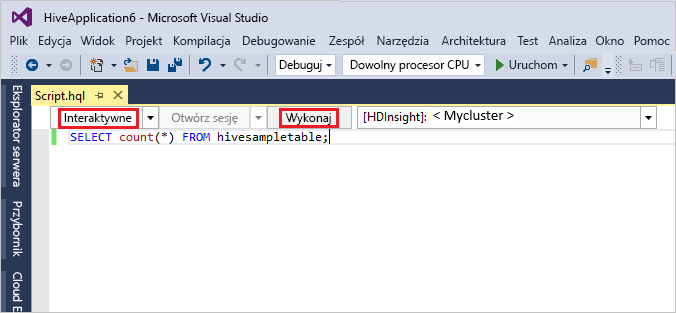
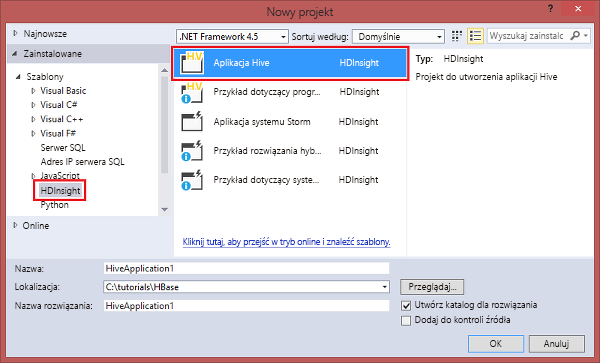

# <a name="quickstart-get-started-with-hadoop-and-hive-in-azure-hdinsight-using-resource-manager-template"></a>Szybki start: rozpoczynanie pracy z usługami Hadoop i Hive w usłudze Azure HDInsight przy użyciu szablonu usługi Resource Manager

W tym artykule dowiesz się, jak tworzyć klastry usługi [Hadoop](http://hadoop.apache.org/) w usłudze HDInsight przy użyciu szablonu usługi Resource Manager, a następnie uruchamiać zadania usługi Hive w usłudze HDInsight. Większość zadań usługi Hadoop to zadania wsadowe. Tworzysz klaster, uruchamiasz pewne zadania, a następnie usuwasz klaster. W tym artykule wykonasz wszystkie trzy zadania.

W tym przewodniku Szybki start użyjesz szablonu usługi Resource Manager do utworzenia klastra Hadoop w usłudze HDInsight. Klaster możesz również utworzyć w witrynie [Azure Portal](apache-hadoop-linux-create-cluster-get-started-portal.md).

Obecnie usługa HDInsight obejmuje [siedem różnych typów klastrów](./apache-hadoop-introduction.md#cluster-types-in-hdinsight). Każdy typ klastra obsługuje inny zestaw składników. Wszystkie typy klastrów obsługują technologię Hive. Aby uzyskać listę obsługiwanych składników w usłudze HDInsight, zobacz artykuł [Nowości w wersjach klastra Hadoop dostarczanych z usługą HDInsight](../hdinsight-component-versioning.md)  

Jeśli nie masz subskrypcji platformy Azure, przed rozpoczęciem [utwórz bezpłatne konto](https://azure.microsoft.com/free/).

<a name="create-cluster"></a>
## <a name="create-a-hadoop-cluster"></a>Tworzenie klastra usługi Hadoop

W tej sekcji utworzysz klaster Hadoop w usłudze HDInsight przy użyciu szablonu usługi Azure Resource Manager. Znajomość szablonów usługi Resource Manager nie jest wymagana do korzystania z tego artykułu. 

1. Kliknij poniższy przycisk **Wdróż na platformie Azure**, aby zalogować się do platformy Azure i otworzyć szablon usługi Resource Manager w witrynie Azure Portal. 
   
    <a href="https://portal.azure.com/#create/Microsoft.Template/uri/https%3A%2F%2Fraw.githubusercontent.com%2FAzure%2Fazure-quickstart-templates%2Fmaster%2F101-hdinsight-linux-ssh-password%2Fazuredeploy.json" target="_blank"></a>

2. Wprowadź lub wybierz wartości widoczne na poniższym zrzucie ekranu:

    > [!NOTE]
    > Te wartości muszą być unikatowe i zgodne z wytycznymi dotyczącymi nazewnictwa. Szablon nie wykonuje testów walidacyjnych. Jeśli okaże się, że podane wartości są już używane lub nie są zgodne z wytycznymi, po przesłaniu szablonu wystąpi błąd.       
    > 
    >
    
    

    Wprowadź lub wybierz poniższe wartości:
    
    |Właściwość  |Opis  |
    |---------|---------|
    |**Subskrypcja**     |  Wybierz swoją subskrypcję platformy Azure. |
    |**Grupa zasobów**     | Utwórz grupę zasobów lub wybierz istniejącą grupę zasobów.  Grupa zasobów jest kontenerem składników platformy Azure.  W tym przypadku grupa zasobów zawiera klaster usługi HDInsight i zależne konto usługi Azure Storage. |
    |**Lokalizacja**     | Wybierz lokalizację platformy Azure, w której chcesz utworzyć klaster.  Wybierz lokalizację znajdującą się blisko, aby zapewnić lepszą wydajność. |
    |**Typ klastra**     | Wybierz pozycję **hadoop**. |
    |**Nazwa klastra**     | Wprowadź nazwę klastra usługi Hadoop. Ponieważ wszystkie klastry w usłudze HDInsight używają tej samej przestrzeni nazw DNS, ta nazwa musi być unikatowa. Nazwa może składać się z maksymalnie 59 znaków, w tym liter, cyfr i łączników. Łącznik nie może być pierwszym ani ostatnim znakiem nazwy. |
    |**Nazwa użytkownika i hasło logowania do klastra**     | Domyślna nazwa logowania to **admin**. Hasło musi składać się z co najmniej 10 znaków i musi zawierać co najmniej jedną cyfrę, jedną wielką i jedną małą literę oraz jeden znak inny niż alfanumeryczny (z wyjątkiem znaków ' " ` \). Upewnij się, że **nie zostało podane** typowe hasło, takie jak „Pass@word1”.|
    |**Nazwa użytkownika i hasło protokołu SSH**     | Domyślna nazwa użytkownika to **sshuser**.  Nazwę użytkownika SSH można zmienić.  Hasło użytkownika SSH ma te same wymagania co hasło logowania klastra.|
       
    Niektóre właściwości zostały umieszczone w kodzie w szablonie.  Te wartości można skonfigurować z szablonu. Aby uzyskać więcej informacji o tych właściwościach, zobacz [Create Hadoop clusters in HDInsight](../hdinsight-hadoop-provision-linux-clusters.md) (Tworzenie klastrów platformy Hadoop w usłudze HDInsight).

3. Wybierz pozycję **Wyrażam zgodę na powyższe warunki i postanowienia** i pozycję **Przypnij do pulpitu nawigacyjnego**, a następnie wybierz przycisk **Kup**. Na pulpicie nawigacyjnym portalu powinien zostać wyświetlony nowy kafelek zatytułowany **Przekazywanie wdrożenia**. Utworzenie klastra trwa około 20 minut.

    

4. Po utworzeniu klastra napis na kafelku zmieni się na podaną nazwę grupy zasobów. Kafelek zawiera także nazwę klastra usługi HDInsight, utworzonego w grupie zasobów. 
   
    
    
5. Kafelek zawiera także nazwę magazynu domyślnego, skojarzonego z klastrem. Każdy klaster zależy od [konta usługi Azure Storage](../hdinsight-hadoop-use-blob-storage.md) lub od [konta usługi Azure Data Lake](../hdinsight-hadoop-use-data-lake-store.md). Jest ono określane jako domyślne konto magazynu. Klaster usługi HDInsight i jego domyślne konto magazynu muszą znajdować się wspólnie w tym samym regionie Azure. Usunięcie klastrów nie powoduje usunięcia konta magazynu.
    

> [!NOTE]
> Inne metody tworzenia klastrów i opis właściwości używanych w tym samouczku znajdziesz w artykule [Tworzenie klastrów usługi HDInsight](../hdinsight-hadoop-provision-linux-clusters.md).       
> 
>

## <a name="use-vscode-to-run-hive-queries"></a>Uruchamianie zapytań usługi Hive za pomocą programu VS Code

Aby uzyskać informacje dotyczące korzystania z narzędzi dla usługi HDInsight w programie VS Code, zobacz temat [Use Azure HDInsight Tools for Visual Studio Code](../hdinsight-for-vscode.md) (Użycie narzędzi dla usługi HDInsight Azure w programie Visual Studio Code).

### <a name="submit-interactive-hive-queries"></a>Przesyłanie interaktywnych zapytań Hive

Za pomocą narzędzi dla usługi HDInsight dla programu VS Code można przesłać interaktywne zapytania Hive do interaktywnych klastrów zapytań usługi HDInsight.

1. Utwórz nowy folder roboczy i nowy plik skryptu Hive, jeśli jeszcze ich nie masz.

2. Połącz się z kontem platformy Azure, a następnie skonfiguruj klaster domyślny, jeśli nie zostało to jeszcze zrobione.

3. Skopiuj i wklej następujący kod do pliku Hive, a następnie zapisz go.

    ```hiveql
    SELECT * FROM hivesampletable;
    ```
4. Kliknij prawym przyciskiem myszy edytor skryptów, a następnie wybierz pozycję **HDInsight: interakcyjny klaster Hive**, aby przesłać zapytanie. Narzędzia pozwalają również na przesyłanie bloku kodu zamiast całego pliku skryptu za pomocą menu kontekstowego. Wkrótce wyniki zapytań zostają wyświetlone w nowej tabeli.

   

    - Panel **WYNIKI**: cały wynik można zapisać jako plik w formacie CSV, JSON lub Excel w lokalnej ścieżce lub po prostu zaznaczyć wiele wierszy.

    - Panel **KOMUNIKATY**: po wybraniu numeru **wiersza** następuje przejście do pierwszego wiersza uruchomionego skryptu.

Uruchamianie interaktywnego zapytania zajmuje o wiele mniej czasu niż [uruchamianie zadania wsadowego Hive](#submit-hive-batch-scripts).

### <a name="submit-hive-batch-scripts"></a>Przesyłanie skryptów wsadowych Hive

1. Utwórz nowy folder roboczy i nowy plik skryptu Hive, jeśli jeszcze ich nie masz.

2. Połącz się z kontem platformy Azure, a następnie skonfiguruj klaster domyślny, jeśli nie zostało to jeszcze zrobione.

3. Skopiuj i wklej następujący kod do pliku Hive, a następnie zapisz go.

    ```hiveql
    SELECT * FROM hivesampletable;
    ```
4. Kliknij prawym przyciskiem myszy edytor skryptów, a następnie wybierz pozycję **HDInsight: partia Hive**, aby przesłać zadanie Hive. 

5. Wybierz klaster, do którego chcesz przesłać.  

    Po przesłaniu zadania Hive informacje o powodzeniu przesłania oraz identyfikator zadania zostają wyświetlone w panelu **DANE WYJŚCIOWE**. Zadanie Hive otwiera również **PRZEGLĄDARKĘ SIECI WEB**, w której są wyświetlane w czasie rzeczywistym dzienniki i stan zadań.

   

[Przesyłanie interaktywnych zapytań Hive](#submit-interactive-hive-queries) zajmuje dużo mniej czasu niż przesyłanie zadania wsadowego.

## <a name="use-visualstudio-to-run-hive-queries"></a>Korzystanie z programu VisualStudio do uruchamiania zapytań Hive

Aby uzyskać informacje dotyczące korzystania z narzędzi dla usługi HDInsight w programie Visual Studio, zobacz temat [Use Data Lake Tools for Visual Studio](./apache-hadoop-visual-studio-tools-get-started.md) (Użycie narzędzi dla usługi Data Lake w programie Visual Studio).

### <a name="run-hive-queries"></a>Uruchamianie zapytań Hive

Masz dwie opcje umożliwiające utworzenie i uruchomienie zapytań Hive:

* Tworzenie zapytań ad hoc
* Tworzenie aplikacji Hive

Aby utworzyć i uruchomić zapytania ad hoc:

1. W **Eksploratorze serwera** wybierz kolejno pozycje **Azure** > **Klastry usługi HDInsight**.

2. Kliknij prawym przyciskiem myszy klaster, w którym chcesz uruchomić zapytanie, a następnie wybierz przycisk **Napisz zapytanie Hive**.  

3. Wprowadź zapytania Hive. 

    Edytor Hive obsługuje funkcję IntelliSense. Narzędzia Data Lake Tools for Visual Studio obsługują ładowanie zdalnych metadanych podczas edycji skryptu Hive. Na przykład po wpisaniu **SELECT * FROM** funkcja IntelliSense wyświetla wszystkie sugerowane nazwy tabel. Po określeniu nazwy tabeli funkcja IntelliSense wyświetla nazwy kolumn. Narzędzia obsługują większość instrukcji DML programu Hive, podzapytań i wbudowanych sterowników UDF.
   
    
   
    
   
   > [!NOTE]
   > Funkcja IntelliSense zasugeruje tylko metadane klastra zaznaczonego na pasku narzędzi usługi HDInsight.
   > 
   
4. Wybierz pozycję **Prześlij** lub **Prześlij (zaawansowane)**. 
   
    

   W przypadku wybrania zaawansowanych opcji przesyłania należy skonfigurować dla skryptu wartości takie jak **Nazwa zadania**, **Argumenty**, **Dodatkowe konfiguracje** i **Katalog stanu**:

    

   Uruchamianie zapytań interaktywnych Hive

   * kliknij strzałkę w dół, aby wybrać opcję **interaktywne**. 
   
   * Kliknij przycisk **Execute** (Wykonaj).

   

Tworzenie i uruchamianie rozwiązania Hive:

1. W menu **Plik** wybierz polecenie **Nowy**, a następnie wybierz pozycję **Projekt**.
2. W lewym okienku wybierz opcję **HDInsight**. W środkowym okienku wybierz opcję **Aplikacja Hive**. Wprowadź właściwości, a następnie wybierz opcję **OK**.
   
    
3. W **Eksploratorze rozwiązań** kliknij dwukrotnie plik **Script.hql**, aby otworzyć skrypt.
4. Wprowadź zapytania Hive i prześlij je. (Zobacz kroki 3 i 4 powyżej)  


## <a name="run-hive-queries"></a>Uruchamianie zapytań Hive

[Apache Hive](hdinsight-use-hive.md) jest najbardziej popularnym składnikiem używanym w usłudze HDInsight Istnieje wiele sposobów uruchamiania zadań Hive w usłudze HDInsight. W tym samouczku użyjesz widoku Hive narzędzia Ambari, korzystając z portalu. Aby poznać inne metody przesyłania zadań Hive, zobacz temat [Używanie Hive w usłudze HDInsight](hdinsight-use-hive.md).

1. Aby otworzyć narzędzie Ambari, na ekranie pokazanym na poprzednim zrzucie ekranu wybierz pozycję **Pulpit nawigacyjny klastra**.  Możesz także przejść pod adres **https://&lt;nazwa_klastra>.azurehdinsight.net**, gdzie &lt;nazwa_klastra> to klaster utworzony w poprzedniej sekcji.

    

2. Wprowadź nazwę użytkownika Hadoop i hasło określone w podczas tworzenia klastra. Domyślna nazwa użytkownika to **admin**.

3. Otwórz widok **Hive View** pokazany na poniższym zrzucie ekranu:
   
    

4. Na karcie **QUERY** (ZAPYTANIE) wklej poniższe instrukcje HiveQL do arkusza:
   
        SHOW TABLES;

    
   
   > [!NOTE]
   > Średnik jest wymagany przez Hive.       
   > 
   > 

5. Wybierz pozycję **Wykonaj**. Poniżej karty **QUERY** (ZAPYTANIE) zostanie wyświetlona karta **RESULTS** (WYNIKI) z informacjami o zadaniu. 
   
    Po zakończeniu przetwarzania zapytania na karcie **QUERY** (ZAPYTANIE) są prezentowane wyniki operacji. Powinna być widoczna jedna tabela o nazwie **hivesampletable**. Ta przykładowa tabela składnika Hive jest dostarczana z wszystkimi klastrami usługi HDInsight.
   
    

6. Powtórz kroki 4 i 5, aby uruchomić następujące zapytanie:
   
        SELECT * FROM hivesampletable;
   
7. Można także zapisać wyniki zapytania. Wybierz przycisk menu z prawej strony i określ, czy chcesz pobrać wyniki jako plik CSV, czy zapisać je na koncie magazynu skojarzonym z klastrem.

    

Po zakończeniu zadania Hive można [wyeksportować wyniki do bazy danych Azure SQL lub bazy danych programu SQL Server](apache-hadoop-use-sqoop-mac-linux.md), można także [wizualizować wyniki za pomocą programu Excel](apache-hadoop-connect-excel-power-query.md). Aby uzyskać więcej informacji o korzystaniu z Hive w usłudze HDInsight, zobacz [Używanie Hive i HiveQL z usługą Hadoop w usłudze HDInsight do analizy przykładowego pliku Apache log4j](hdinsight-use-hive.md).

## <a name="troubleshoot"></a>Rozwiązywanie problemów

W razie problemów podczas tworzenia klastrów usługi HDInsight zapoznaj się z [wymaganiami dotyczącymi kontroli dostępu](../hdinsight-administer-use-portal-linux.md#create-clusters).

## <a name="clean-up-resources"></a>Oczyszczanie zasobów
Po ukończeniu korzystania z artykułu warto usunąć klaster. Dzięki usłudze HDInsight dane są przechowywane w usłudze Azure Storage, więc można bezpiecznie usunąć klaster, gdy nie jest używany. Opłaty za klaster usługi HDInsight są naliczane nawet wtedy, gdy nie jest używany. Ponieważ opłaty za klaster są wielokrotnie większe niż opłaty za magazyn, ze względów ekonomicznych warto usuwać klastry, gdy nie są używane. 

> [!NOTE]
> Jeśli chcesz *natychmiast* przejść do następnego samouczka, aby dowiedzieć się, jak uruchomić operacje ETL przy użyciu usługi Hadoop w usłudze HDInsight, warto zachować działający klaster. Jest to spowodowane tym, że w samouczku trzeba ponownie utworzyć klaster usługi Hadoop. Jeśli jednak nie chcesz od razu przechodzić do następnego samouczka, musisz teraz usunąć klaster.
> 
> 

**Usuwanie klastra i/lub domyślnego konta magazynu**

1. Wróć do karty przeglądarki, na której znajduje się witryna Azure Portal. Musisz mieć otwartą stronę omówienia klastra. Jeśli chcesz tylko usunąć klaster, zachowując domyślne konto magazynu, wybierz pozycję **Usuń**.

    

2. Jeśli chcesz usunąć klaster oraz domyślne konto magazynu, wybierz nazwę grupy zasobów (wyróżnioną na poprzednim zrzucie ekranu), aby otworzyć stronę grupy zasobów.

3. Wybierz pozycję **Usuń grupę zasobów**, aby usunąć grupę zasobów zawierającą klaster i domyślne konto magazynu. Uwaga: usunięcie grupy zasobów powoduje usunięcie konta magazynu. Jeśli chcesz zachować konta magazynu, wybierz opcję usunięcia tylko klastra.

## <a name="next-steps"></a>Następne kroki
Po przeczytaniu tego artykułu umiesz utworzyć oparty na systemie Linux klaster usługi HDInsight przy użyciu szablonu usługi Resource Manager oraz wykonywać podstawowe zapytania Hive. W następnym artykule dowiesz się, jak przeprowadzić operację wyodrębniania, transformacji i ładowania (ETL, extract, transform, and load) przy użyciu usługi Hadoop w usłudze HDInsight.

> [!div class="nextstepaction"]
>[Wyodrębnianie, transformacja i ładowanie danych przy użyciu usługi Apache Hive w usłudze HDInsight](../hdinsight-analyze-flight-delay-data-linux.md)

Jeśli chcesz już zacząć korzystać z własnych danych i dowiedzieć się więcej o sposobie przechowywania danych w usłudze HDInsight lub sposobie pobierania danych do usługi HDInsight, zobacz następujące artykuły:

* Aby uzyskać informacje o sposobie używania usługi Azure Storage przez usługę HDInsight, zobacz [Używanie usługi Azure Storage z usługą HDInsight](../hdinsight-hadoop-use-blob-storage.md).
* Aby uzyskać informacje na temat przekazywania danych do usługi HDInsight, zobacz [Przekazywanie danych do usługi HDInsight](../hdinsight-upload-data.md).

Aby dowiedzieć się więcej na temat analizowania danych za pomocą usługi HDInsight, zobacz następujące artykuły:

* Aby dowiedzieć się więcej o korzystaniu z programu Hive z usługą HDInsight, w tym poznać sposoby wykonywania zapytań Hive z programu Visual Studio, zobacz artykuł [Korzystanie z programu Hive z usługą HDInsight](hdinsight-use-hive.md).
* Aby dowiedzieć się więcej na temat języka Pig używanego do przekształcania danych, zobacz [Korzystanie z języka Pig z usługą HDInsight](hdinsight-use-pig.md).
* Aby dowiedzieć się więcej o MapReduce, czyli sposobie pisania programów przetwarzających dane w usłudze Hadoop, zobacz [Używanie MapReduce z usługą HDInsight](hdinsight-use-mapreduce.md).
* Aby dowiedzieć się więcej o używaniu narzędzi HDInsight Tools for Visual Studio do analizowania danych w usłudze HDInsight, zobacz [Wprowadzenie do używania narzędzi Visual Studio Hadoop dla usługi HDInsight](apache-hadoop-visual-studio-tools-get-started.md).
* Aby uzyskać informacje na temat korzystania z narzędzi dla usługi HDInsight w programie VS Code do analizowania danych w usłudze HDInsight, zobacz temat [Use Azure HDInsight Tools for Visual Studio Code](../hdinsight-for-vscode.md) (Korzystanie z narzędzi dla usługi Azure HDInsight w programie Visual Studio Code).


Jeśli chcesz dowiedzieć się więcej o tworzeniu klastra usługi HDInsight i zarządzaniu nim, zobacz następujące artykuły:

* Aby uzyskać więcej informacji na temat zarządzania opartym na systemie Linux klastrem usługi HDInsight, zobacz [Zarządzanie klastrami usługi HDInsight za pomocą narzędzia Ambari](../hdinsight-hadoop-manage-ambari.md).
* Aby dowiedzieć się więcej na temat opcji, które można wybrać podczas tworzenia klastra usługi HDInsight, zobacz [Tworzenie klastra usługi HDInsight w systemie Linux przy użyciu niestandardowych opcji](../hdinsight-hadoop-provision-linux-clusters.md).


[1]: ../HDInsight/apache-hadoop-visual-studio-tools-get-started.md

[hdinsight-provision]: hdinsight-provision-linux-clusters.md
[hdinsight-upload-data]: hdinsight-upload-data.md
[hdinsight-use-hive]: hdinsight-use-hive.md
[hdinsight-use-pig]: hdinsight-use-pig.md


