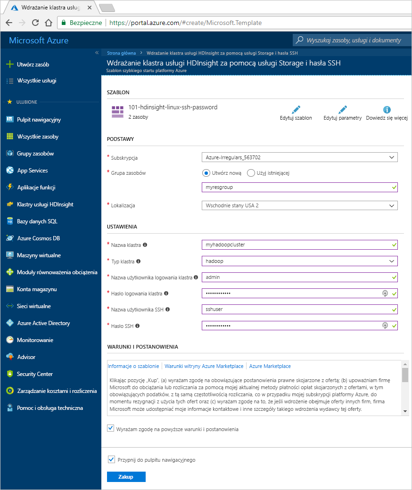

# Szybki Start: Tworzenie klastra Apache Hadoop w usłudze Azure HDInsight przy użyciu szablonu Menedżer zasobów

W tym przewodniku szybki start dowiesz się, jak utworzyć klaster Apache Hadoop w usłudze Azure HDInsight przy użyciu szablonu Menedżer zasobów.

Podobne szablony można wyświetlać w [szablonach szybkiego startu platformy Azure](https://azure.microsoft.com/resources/templates/?resourceType=Microsoft.Hdinsight&pageNumber=1&sort=Popular). Dokumentację szablonu można znaleźć [tutaj](https://docs.microsoft.com/azure/templates/microsoft.hdinsight/allversions).  Możesz również utworzyć klaster przy użyciu [Azure Portal](apache-hadoop-linux-create-cluster-get-started-portal.md).  

Obecnie usługa HDInsight obejmuje [siedem różnych typów klastrów](../hdinsight-overview.md#cluster-types-in-hdinsight). Każdy typ klastra obsługuje inny zestaw składników. Wszystkie typy klastrów obsługują technologię Hive. Aby uzyskać listę obsługiwanych składników w usłudze HDInsight, zobacz artykuł [Nowości w wersjach klastra Hadoop dostarczanych z usługą HDInsight](../hdinsight-component-versioning.md)  

Jeśli nie masz subskrypcji platformy Azure, przed rozpoczęciem [utwórz bezpłatne konto](https://azure.microsoft.com/free/).

## Tworzenie klastra usługi Hadoop

1. Wybierz przycisk **Wdróż na platformie Azure** poniżej, aby zalogować się do platformy Azure i otworzyć szablon Menedżer zasobów w Azure Portal.
   
    

2. Wprowadź lub wybierz poniższe wartości:

    |Właściwość  |Opis  |
    |---------|---------|
    |**Subskrypcja**     |  Wybierz swoją subskrypcję platformy Azure. |
    |**Grupa zasobów**     | Utwórz grupę zasobów lub wybierz istniejącą grupę zasobów.  Grupa zasobów jest kontenerem składników platformy Azure.  W tym przypadku grupa zasobów zawiera klaster usługi HDInsight i zależne konto usługi Azure Storage. |
    |**Lokalizacja**     | Wybierz lokalizację platformy Azure, w której chcesz utworzyć klaster.  Wybierz lokalizację znajdującą się blisko, aby zapewnić lepszą wydajność. |
    |**Nazwa klastra**     | Wprowadź nazwę klastra usługi Hadoop. Ponieważ wszystkie klastry w usłudze HDInsight używają tej samej przestrzeni nazw DNS, ta nazwa musi być unikatowa. Nazwa może zawierać tylko małe litery, cyfry i łączniki oraz musi zaczynać się literą.  Przed i za każdym łącznikiem musi znajdować się znak inny niż łącznik.  Nazwa musi również zawierać od 3 do 59 znaków. |
    |**Typ klastra**     | Wybierz pozycję **hadoop**. |
    |**Nazwa użytkownika i hasło logowania do klastra**     | Domyślna nazwa logowania to **admin**. Hasło musi składać się z co najmniej 10 znaków i musi zawierać co najmniej jedną cyfrę, jedną wielką i jedną małą literę oraz jeden znak inny niż alfanumeryczny (z wyjątkiem znaków "" "\). Upewnij się, że **nie zostało podane** typowe hasło, takie jak „Pass@word1”.|
    |**Nazwa użytkownika i hasło protokołu SSH**     | Domyślna nazwa użytkownika to **sshuser**.  Nazwę użytkownika SSH można zmienić.  Hasło użytkownika SSH ma te same wymagania co hasło logowania klastra.|

    Niektóre właściwości zostały umieszczone w kodzie w szablonie.  Te wartości można skonfigurować z szablonu. Aby uzyskać więcej informacji o tych właściwościach, zobacz artykuł [Create Hadoop clusters in HDInsight](../hdinsight-hadoop-provision-linux-clusters.md) (Tworzenie klastrów platformy Hadoop w usłudze HDInsight).

    > [!NOTE]  
    > Te wartości muszą być unikatowe i zgodne z wytycznymi dotyczącymi nazewnictwa. Szablon nie wykonuje testów walidacyjnych. Jeśli okaże się, że podane wartości są już używane lub nie są zgodne z wytycznymi, po przesłaniu szablonu wystąpi błąd.  

    

3. Zaznacz pozycję **Wyrażam zgodę na powyższe warunki i postanowienia**, a następnie kliknij przycisk **Kup**. Otrzymasz powiadomienie, że wdrożenie jest w toku.  Utworzenie klastra trwa około 20 minut.

4. Po utworzeniu klastra otrzymasz powiadomienie **Wdrażanie zakończyło się pomyślnie** z linkiem **Przejdź do grupy zasobów**.  Strona **Grupa zasobów** będzie zawierać listę nowego klastra usługi HDInsight oraz domyślny magazyn skojarzony z klastrem. Każdy klaster zależy od [konta usługi Azure Storage](../hdinsight-hadoop-use-blob-storage.md) lub od [konta usługi Azure Data Lake Storage](../hdinsight-hadoop-use-data-lake-store.md). Jest ono określane jako domyślne konto magazynu. Klaster usługi HDInsight i jego domyślne konto magazynu muszą znajdować się w tym samym regionie platformy Azure. Usunięcie klastrów nie powoduje usunięcia konta magazynu.

> [!NOTE]  
> Aby poznać inne metody tworzenia klastrów i zapoznać się z właściwościami używanymi w tym przewodniku Szybki Start, zobacz [Tworzenie klastrów usługi HDInsight](../hdinsight-hadoop-provision-linux-clusters.md).

## Oczyszczanie zasobów

Po zakończeniu przewodnika Szybki Start możesz chcieć usunąć klaster. Dzięki usłudze HDInsight dane są przechowywane w usłudze Azure Storage, więc można bezpiecznie usunąć klaster, gdy nie jest używany. Opłaty za klaster usługi HDInsight są naliczane nawet wtedy, gdy nie jest używany. Ponieważ opłaty za klaster są wielokrotnie większe niż opłaty za magazyn, ze względów ekonomicznych warto usuwać klastry, gdy nie są używane.

> [!NOTE]  
> Jeśli chcesz *natychmiast* przejść do następnego samouczka, aby dowiedzieć się, jak uruchomić operacje ETL przy użyciu usługi Hadoop w usłudze HDInsight, warto zachować działający klaster. Jest to spowodowane tym, że w samouczku należy ponownie utworzyć klaster usługi Hadoop. Jeśli jednak nie chcesz od razu przechodzić do następnego samouczka, musisz teraz usunąć klaster.

**Usuwanie klastra i/lub domyślnego konta magazynu**

1. Wróć do karty przeglądarki, na której znajduje się witryna Azure Portal. Musisz mieć otwartą stronę omówienia klastra. Jeśli chcesz tylko usunąć klaster, zachowując domyślne konto magazynu, wybierz pozycję **Usuń**.

    

2. Jeśli chcesz usunąć klaster oraz domyślne konto magazynu, wybierz nazwę grupy zasobów (wyróżnioną na poprzednim zrzucie ekranu), aby otworzyć stronę grupy zasobów.

3. Wybierz pozycję **Usuń grupę zasobów**, aby usunąć grupę zasobów zawierającą klaster i domyślne konto magazynu. Uwaga: usunięcie grupy zasobów powoduje usunięcie konta magazynu. Jeśli chcesz zachować konta magazynu, wybierz opcję usunięcia tylko klastra.

## Następne kroki

W tym przewodniku szybki start przedstawiono sposób tworzenia klastra Apache Hadoop w usłudze HDInsight przy użyciu szablonu Menedżer zasobów. W następnym artykule dowiesz się, jak przeprowadzić operację wyodrębniania, transformacji i ładowania (ETL, extract, transform, and load) przy użyciu usługi Hadoop w usłudze HDInsight.

> [!div class="nextstepaction"]
>[Wyodrębnianie, przekształcanie i ładowanie danych przy użyciu interakcyjnych zapytań w usłudze HDInsight](../interactive-query/interactive-query-tutorial-analyze-flight-data.md)