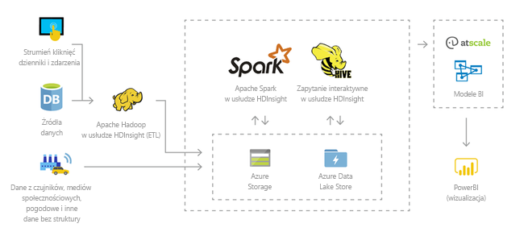
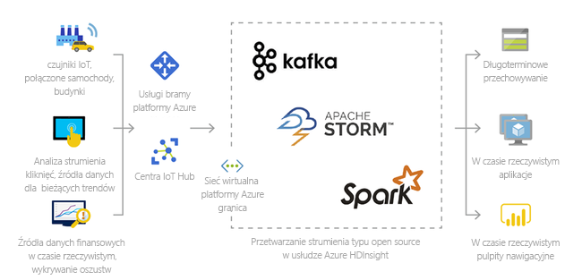
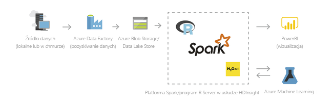
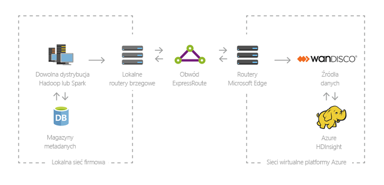

# Co to jest usługa Azure HDInsight?

Azure HDInsight to zarządzana usługa analizy typu open source w chmurze dla przedsiębiorstw. Można jej używać z platformami typu „open source”, takimi jak Hadoop, Apache Spark, Apache Hive, LLAP, Apache Kafka, Apache Storm, R i nie tylko.

## Co to jest usługa HDInsight oraz stos technologii Hadoop?

Usługa Azure HDInsight to dystrybucja w chmurze składników usługi Hadoop. Usługa Azure HDInsight ułatwia i przyspiesza przetwarzanie ogromnych ilości danych przy jednoczesnej minimalizacji kosztów. Można używać z nią najpopularniejszych platform typu „open source” takich jak Hadoop, Spark, Hive, LLAP, Kafka, Storm, R i nie tylko. Za pomocą tych platform można realizować rozmaite scenariusze związane z wyodrębnianiem, transformacją i ładowaniem danych, magazynowaniem danych, uczeniem maszynowym oraz Internetem rzeczy (IoT).

Aby wyświetlić dostępne składniki stosu technologii Hadoop w usłudze HDInsight, zobacz [składniki i wersje dostępne w usłudze HDInsight](./hdinsight-component-versioning.md). Aby dowiedzieć się więcej o platformie Hadoop w usłudze HDInsight, zobacz [stronę z opisem funkcji platformy Azure w usłudze HDInsight](https://azure.microsoft.com/services/hdinsight/).

## Co to są dane big data?

Dane big data są gromadzone szybciej, w większych ilościach i bardziej różnorodnych formatach niż kiedykolwiek wcześniej. Dzielą się one na historyczne (przechowywane) lub dostępne w czasie rzeczywistym (przesyłane strumieniowo ze źródła). Zobacz [Scenariusze użycia usługi HDInsight](#scenarios-for-using-hdinsight), aby zapoznać się z najpopularniejszymi przypadkami użycia danych big data.

## Dlaczego warto używać usługi Azure HDInsight?

W tej sekcji wymieniono możliwości usługi Azure HDInsight.

|Możliwość  |Opis  |
|---------|---------|
|Natywna usługa w chmurze     |     Usługa Azure HDInsight umożliwia tworzenie na platformie Azure klastrów zoptymalizowanych dla technologii [Hadoop](./hadoop/apache-hadoop-linux-tutorial-get-started.md),  [Spark](./spark/apache-spark-jupyter-spark-sql.md),  [zapytania interakcyjnego (LLAP)](./interactive-query/apache-interactive-query-get-started.md),  [Kafka](./kafka/apache-kafka-get-started.md),  [Storm](./storm/apache-storm-tutorial-get-started-linux.md),  [HBase](./hbase/apache-hbase-tutorial-get-started-linux.md) i  [usług ML](./r-server/r-server-overview.md). Usługa HDInsight zapewnia również kompleksową umowę dotyczącą poziomu usług dla wszystkich obciążeń produkcyjnych.  |
|Niskie koszty i skalowalność     | Usługa HDInsight umożliwia [skalowanie](./hdinsight-administer-use-portal-linux.md#scale-clusters)  obciążeń w górę lub w dół. Możesz obniżyć koszty, [tworząc klastry na żądanie](./hdinsight-hadoop-create-linux-clusters-adf.md)  and płacisz tylko za to, czego używasz. Możesz także tworzyć potoki danych w celu operacjonalizacji zadań. Oddzielenie obliczeń i magazynu zapewnia wyższą wydajność i elastyczność. |
|Bezpieczeństwo i zgodność    | Usługa HDInsight umożliwia ochronę zasobów danych przedsiębiorstwa przy użyciu usługi [Azure Virtual Network](./hdinsight-plan-virtual-network-deployment.md), [szyfrowania](./hdinsight-hadoop-create-linux-clusters-with-secure-transfer-storage.md) oraz integracji z usługą [Azure Active Directory](./domain-joined/hdinsight-security-overview.md). Usługa HDInsight spełnia również najpopularniejsze branżowe i rządowe [normy zgodności](https://azure.microsoft.com/overview/trusted-cloud).        |
|Monitorowanie    | Usługa Azure HDInsight jest zintegrowana z [dziennikami usługi Azure Monitor](./hdinsight-hadoop-oms-log-analytics-tutorial.md), zapewniając jeden interfejs, za pomocą którego można monitorować wszystkie swoje klastry.        |
|Globalna dostępność | Usługa HDInsight jest dostępna w większej liczbie  [regionów](https://azure.microsoft.com/regions/services/)  niż jakiekolwiek inne rozwiązanie do analizy danych big data. Usługa Azure HDInsight jest również dostępna w ramach chmur Azure Government, Azure (Chiny) i Azure (Niemcy), dzięki czemu odpowiada na potrzeby Twojego przedsiębiorstwa w najważniejszych obszarach suwerenności. |  
|Produktywność     |  Usługa Azure HDInsight umożliwia korzystanie z zaawansowanych narzędzi zapewniających produktywność w usłudze Hadoop i na platformie Spark w ramach preferowanego środowiska deweloperskiego. Może to być na przykład środowisko [Visual Studio](./hadoop/apache-hadoop-visual-studio-tools-get-started.md), [VSCode](./hdinsight-for-vscode.md), [Eclipse](./spark/apache-spark-eclipse-tool-plugin.md) oraz [IntelliJ](./spark/apache-spark-intellij-tool-plugin.md) w języku Scala, Python, R, Java i .NET. Analitycy danych mogą także współpracować przy użyciu popularnych notesów, takich jak [Jupyter](./spark/apache-spark-jupyter-notebook-kernels.md) i [Zeppelin](./spark/apache-spark-zeppelin-notebook.md).    |
|Rozszerzalność     |  Klastry usługi HDInsight można rozszerzać za pomocą zainstalowanych składników (Hue, Presto itp.), używając [akcji skryptów](./hdinsight-hadoop-customize-cluster-linux.md), [dodając węzły brzegowe](./hdinsight-apps-use-edge-node.md) lub [integrując je z innymi certyfikowanymi aplikacjami do przetwarzania danych big data](./hdinsight-apps-install-applications.md). Usługa HDInsight umożliwia bezproblemową integrację z najpopularniejszymi rozwiązaniami danych big data oraz wdrażanie za pomocą [jednego kliknięcia](https://azure.microsoft.com/services/hdinsight/partner-ecosystem/).|

## Scenariusze użycia usługi HDInsight

Usługa Azure HDInsight może być używana w wielu różnych scenariuszach związanych z przetwarzaniem danych big data. Dzielą się one na dane historyczne (już zebrane i przechowywane) oraz dostępne w czasie rzeczywistym (przesyłane strumieniowo bezpośrednio ze źródła). Scenariusze związane z przetwarzaniem takich danych można podzielić na następujące kategorie: 

### Przetwarzanie wsadowe (ETL)

Wyodrębnianie, transformacja, ładowanie (ETL, extraction, transformation, and loading) to proces wyodrębniania danych ze strukturą lub bez struktury z heterogenicznych źródeł danych. Dane te są następnie przekształcane do formatu strukturalnego i ładowane do magazynu danych. Przekształcone dane mogą być używane do analizy lub magazynowania danych.

### Magazynowanie danych

Przy użyciu usługi HDInsight można wykonywać interakcyjne zapytania w skali petabajtów względem danych ze strukturą lub bez struktury w dowolnym formacie. Można także tworzyć modele łączące je z narzędziami analizy biznesowej. Aby uzyskać więcej informacji, [przeczytaj tę historię klienta](https://customers.microsoft.com/story/milliman). 

### Internet rzeczy (IoT)

Przy użyciu usługi HDInsight można przetwarzać dane przesyłane strumieniowo, odbierane w czasie rzeczywistym z różnych urządzeń. Aby uzyskać więcej informacji, [przeczytaj ten wpis w blogu platformy Azure, w którym zapowiadana jest publiczna wersja zapoznawcza platformy Apache Kafka w usłudze HDInsight z funkcją Dyski zarządzane platformy Azure](https://azure.microsoft.com/blog/announcing-public-preview-of-apache-kafka-on-hdinsight-with-azure-managed-disks/).

 

### Nauka o danych

Przy użyciu usługi HDInsight można tworzyć aplikacje wyodrębniające z danych kluczowe informacje. Dodatkowo można zastosować usługę Azure Machine Learning, aby przewidywać przyszłe tendencje biznesowe. Aby uzyskać więcej informacji, [przeczytaj tę historię klienta](https://customers.microsoft.com/story/pros).

### Hybrydowe

Za pomocą usługi HDInsight możesz rozszerzyć istniejącą lokalną infrastrukturę przetwarzania danych big data na platformę Azure, aby korzystać z zaawansowanych funkcji analizy w chmurze.

## Typy klastrów w usłudze HDInsight

Usługa HDInsight zawiera określone typy klastrów i oferuje możliwości dostosowywania klastra, takie jak dodawanie składników, narzędzi i języków. W usłudze HDInsight dostępne są następujące typy klastrów:

|Typ klastra | Opis |
|---|---|
|[Apache Hadoop](https://hadoop.apache.org/)|platforma korzystająca z systemu HDFS, zarządzania zasobami YARN i prostego modelu programowania MapReduce do celów równoległego przetwarzania i analizowania danych partii.|
|[Apache Spark](https://spark.apache.org/)|platforma przetwarzania równoległego typu „open source”, która obsługuje przetwarzanie w pamięci umożliwiające zwiększenie wydajności aplikacji do analizy danych big data. Zobacz temat [Co to jest platforma Apache Spark w usłudze HDInsight?](./spark/apache-spark-overview.md)|
|[Apache HBase](https://hbase.apache.org/)|baza danych NoSQL oparta na platformie Hadoop, która zapewnia dostęp losowy i wysoki poziom spójności w przypadku dużych ilości nieustrukturyzowanych i częściowo ustrukturyzowanych danych — potencjalnie miliardów wierszy pomnożonych przez miliony kolumn. Zobacz temat [Co to jest usługa HBase w usłudze HDInsight?](./hbase/apache-hbase-overview.md)|
|[Usługi w usłudze ML](https://docs.microsoft.com/machine-learning-server/rebranding-microsoft-r-server)|serwer przeznaczony do hostowania równoległych, rozproszonych procesów języka R oraz zarządzania nimi. Umożliwia on analitykom danych, statystykom i programistom języka R dostęp na żądanie do skalowalnych, rozproszonych metod analizy w usłudze HDInsight. Zobacz [Omówienie usług ML w usłudze HDInsight](./r-server/r-server-overview.md).|
|[Apache Storm](https://storm.incubator.apache.org/)|rozproszony system obliczeniowy działający w czasie rzeczywistym do szybkiego przetwarzania dużych strumieni danych. Storm jest oferowany jako zarządzany klaster w usłudze HDInsight. Zobacz temat [Analyze real-time sensor data using Storm and Hadoop](/azure/hdinsight/storm/apache-storm-overview) (Analizowanie danych czujnika w czasie rzeczywistym przy użyciu platform Storm i Hadoop).|
|[Zapytanie interaktywne Apache](https://cwiki.apache.org/confluence/display/Hive/LLAP)|pamięć podręczna w pamięci do interaktywnego i szybszego wykonywania zapytań programu Hive. Zobacz temat [Use Interactive Query in HDInsight](./interactive-query/apache-interactive-query-get-started.md) (Używanie zapytań interakcyjnych w usłudze HDInsight).|
|[Apache Kafka](https://kafka.apache.org/)|platforma typu „open source”, która służy do tworzenia potoków danych przesyłanych strumieniowo i aplikacji do obsługi tych danych. Platforma Kafka obejmuje również funkcję kolejki komunikatów, która umożliwia publikowanie i subskrybowanie strumieni danych. Zobacz temat [Introduction to Apache Kafka on HDInsight](./kafka/apache-kafka-introduction.md) (Wprowadzenie do platformy Apache Kafka w usłudze HDInsight).|

## Składniki typu open source w usłudze HDInsight

Usługa Azure HDInsight umożliwia tworzenie klastrów przy użyciu platform typu „open source”, takich jak Hadoop, Spark, Hive, LLAP, Kafka, Storm, HBase i R. Klastry te zawierają domyślnie inne składniki typu „open source”, takie jak [Apache Ambari](https://github.com/apache/ambari/blob/trunk/ambari-server/docs/api/v1/index.md), [Avro](https://avro.apache.org/docs/current/spec.html), [Apache Hive](https://hive.apache.org), [HCatalog](https://cwiki.apache.org/confluence/display/Hive/HCatalog/), [Apache Mahout](https://mahout.apache.org/), [Apache Hadoop MapReduce](https://hadoop.apache.org/docs/current/hadoop-mapreduce-client/hadoop-mapreduce-client-core/MapReduceTutorial.html), [Apache Hadoop YARN](https://hadoop.apache.org/docs/current/hadoop-yarn/hadoop-yarn-site/YARN.html), [Apache Phoenix](https://phoenix.apache.org/), [Apache Pig](https://pig.apache.org/), [Apache Sqoop](https://sqoop.apache.org/), [Apache Tez](https://tez.apache.org/), [Apache Oozie](https://oozie.apache.org/) czy [Apache ZooKeeper](https://zookeeper.apache.org/).  

## Języki programowania w usłudze HDInsight

Klastry HDInsight, takie jak Spark, HBase, Kafka, Hadoop i inne, obsługują wiele języków programowania. Niektóre z nich nie są instalowane domyślnie. W przypadku bibliotek, modułów lub pakietów niezainstalowanych domyślnie [do instalacji składnika należy użyć akcji skryptu](./hdinsight-hadoop-script-actions-linux.md).

|Język programowania  |Informacje  |
|---------|---------|
|Domyślna obsługa języka programowania     | Domyślnie klastry usługi HDInsight obsługują języki:<ul><li>Java</li><li>Python</li><li>.NET</li><li>Go</li></ul>  |
|Języki maszyny wirtualnej Java (JVM)     | Wiele języków innych niż Java można uruchamiać za pomocą maszyny wirtualnej Java (JVM). Jednak do uruchomienia niektórych z tych języków mogą być potrzebne dodatkowe składniki zainstalowane w klastrze. W klastrach usługi HDInsight są obsługiwane następujące języki działające w oparciu o JVM: <ul><li>Clojure</li><li>Jython (Python dla platformy Java)</li><li>Scala</li></ul>     |
|Języki specyficzne dla platformy Hadoop     | Klastry HDInsight obsługują następujące języki specyficzne dla stosu technologii Hadoop: <ul><li>Pig Latin do zadań Pig</li><li>HiveQL do zadań Hive oraz SparkSQL</li></ul>        |

## Narzędzia programistyczne dla usługi HDInsight

Narzędzia programistyczne usługi HDInsight, takie jak IntelliJ, Eclipse, Visual Studio Code i Visual Studio, umożliwiają tworzenie i przesyłanie zapytań o dane i zadania usługi HDInsight, wykorzystując bezproblemową integrację z platformą Azure.

* [Zestaw narzędzi platformy Azure dla środowiska IntelliJ](https://docs.microsoft.com/azure/hdinsight/spark/apache-spark-intellij-tool-plugin)

* [Zestaw narzędzi platformy Azure dla środowiska Eclipse](https://docs.microsoft.com/azure/hdinsight/spark/apache-spark-eclipse-tool-plugin)

* [Narzędzia Azure HDInsight Tools dla programu VS Code](https://docs.microsoft.com/azure/hdinsight/hdinsight-for-vscode)

* [Narzędzia Azure Data Lake Tools for Visual Studio](https://docs.microsoft.com/azure/hdinsight/hadoop/apache-hadoop-visual-studio-tools-get-started)

## Analiza biznesowa w usłudze HDInsight

Znane narzędzia do analizy biznesowej (BI, business intelligence) pobierają, analizują i raportują dane zintegrowane z usługą HDInsight przy użyciu dodatku Power Query lub sterownika Microsoft Hive ODBC:

* [Apache Spark BI using data visualization tools with Azure HDInsight (Analiza biznesowa przy użyciu platformy Apache Spark i narzędzi do wizualizacji danych w usłudze Azure HDInsight)](./spark/apache-spark-use-bi-tools.md)

* [Visualize Apache Hive data with Microsoft Power BI in Azure HDInsight (Wizualizowanie danych programu Apache Hive przy użyciu usługi Microsoft Power BI w usłudze Azure HDInsight)](./hadoop/apache-hadoop-connect-hive-power-bi.md)

* [Visualize Interactive Query Hive data with Power BI in Azure HDInsight (Wizualizowanie danych programu Hive zapytania bezpośredniego przy użyciu usługi Power BI w usłudze Azure HDInsight)](./interactive-query/apache-hadoop-connect-hive-power-bi-directquery.md)

* [Łączenie programu Excel z usługą Apache Hadoop za pomocą funkcji Power Query](./hadoop/apache-hadoop-connect-excel-power-query.md) (wymaga systemu Windows)

* [Łączenie programu Excel z usługą Apache Hadoop przy użyciu sterownika Microsoft Hive ODBC](./hadoop/apache-hadoop-connect-excel-hive-odbc-driver.md) (wymaga systemu Windows)

* [Korzystanie z usług SQL Server Analysis Services za pomocą usługi HDInsight](https://docs.microsoft.com/previous-versions/msp-n-p/dn749857(v=pandp.10))

* [Korzystanie z usług SQL Server Reporting Services za pomocą usługi HDInsight](https://docs.microsoft.com/previous-versions/msp-n-p/dn749856(v=pandp.10))

## Następne kroki

* [Tworzenie klastra Apache Hadoop w usłudze HDInsight](./hadoop/apache-hadoop-linux-create-cluster-get-started-portal.md)
