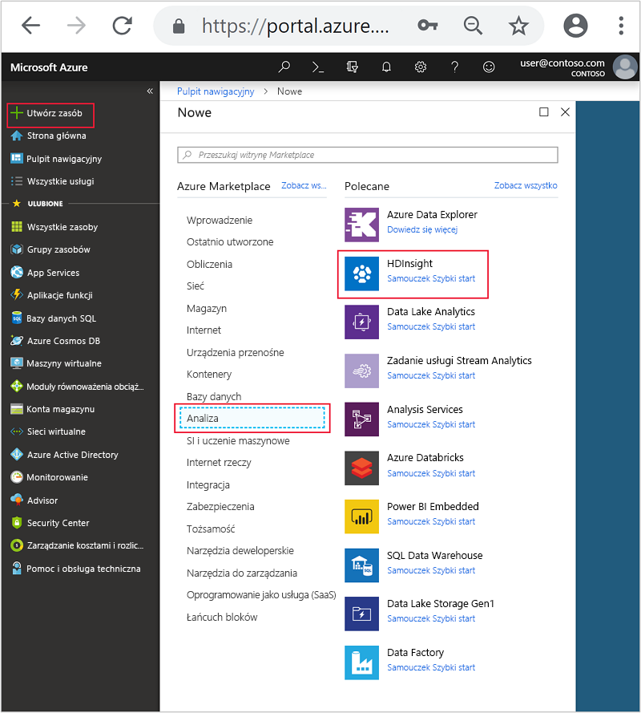
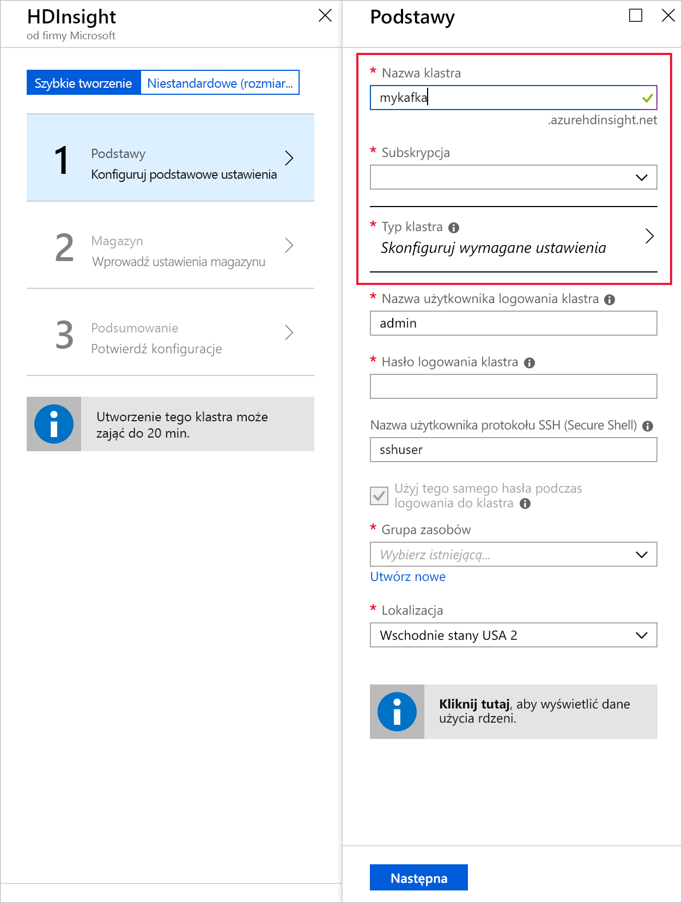
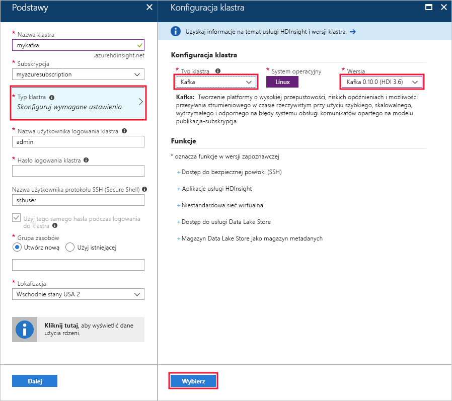
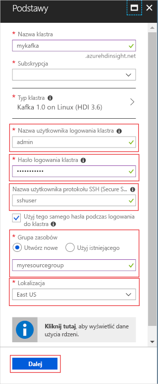
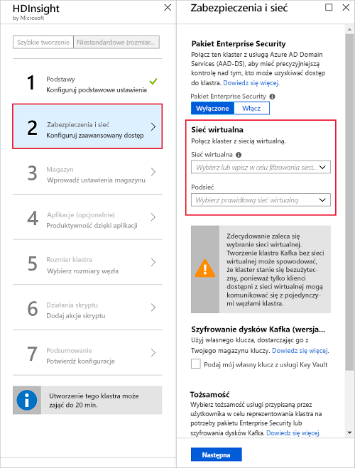
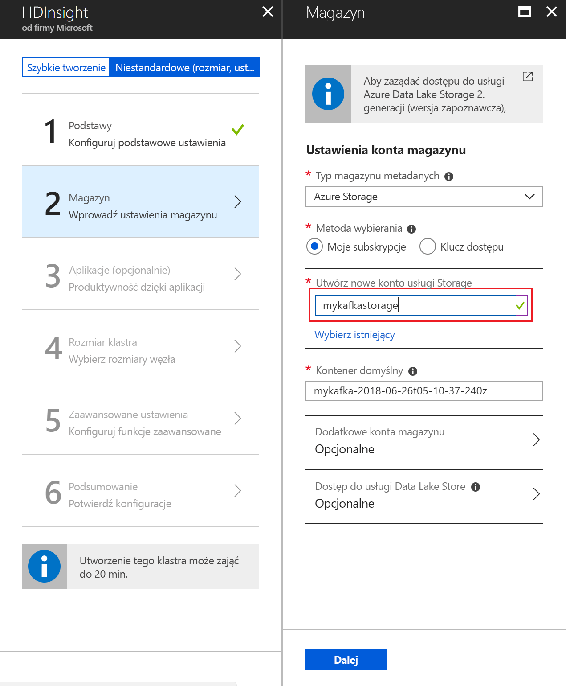
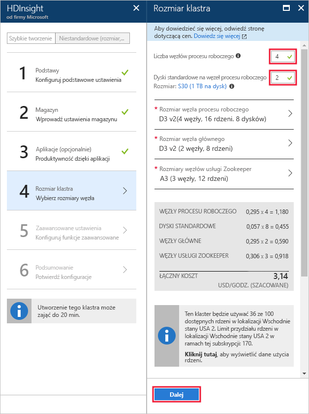
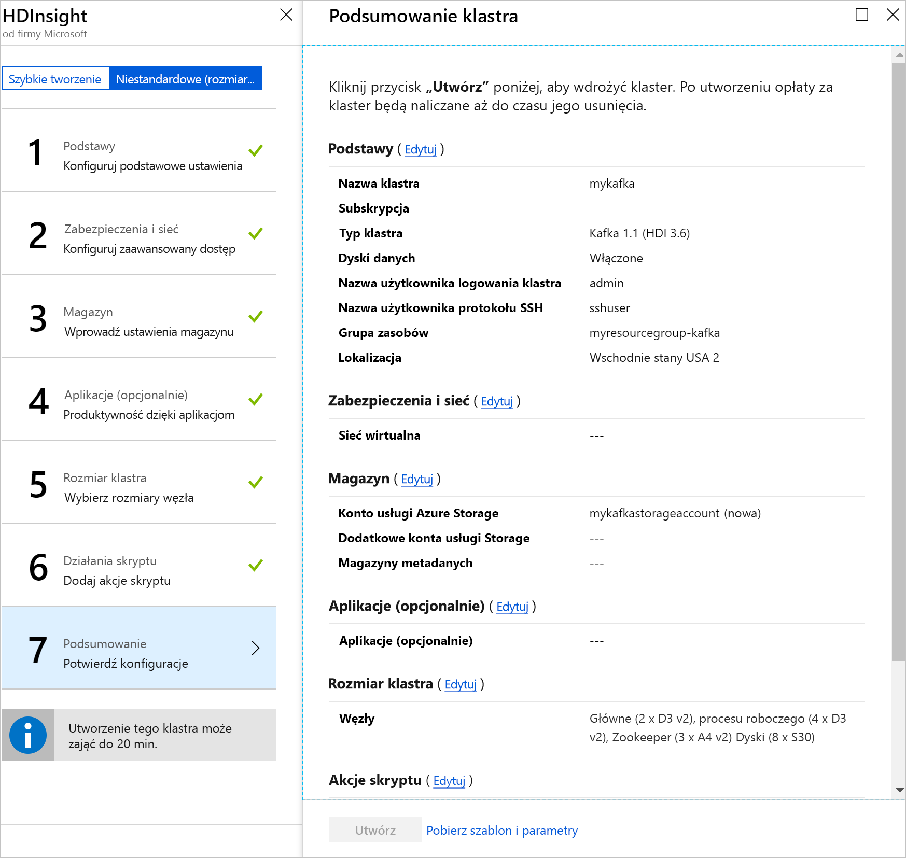

# <a name="quickstart-create-an-apache-kafka-on-hdinsight-cluster"></a>Szybki start: Tworzenie platformy Apache Kafka w klastrze usługi HDInsight

Apache Kafka to rozproszona platforma przesyłania strumieniowego typu open source. Jest ona często używana jako broker komunikatów, ponieważ oferuje funkcje podobne do kolejki komunikatów dotyczących publikowania i subskrybowania. 

W tym samouczku szybkiego startu dowiesz się, jak utworzyć [klaster platformy Apache Kafka](https://kafka.apache.org) przy użyciu witryny Azure Portal. Dowiesz się także, jak używać dołączonych narzędzi do wysyłania i odbierania komunikatów na platformie Apache Kafka.

[!INCLUDE [delete-cluster-warning](../../../includes/hdinsight-delete-cluster-warning.md)]

> [!IMPORTANT]  
> Dostęp do interfejsu API platformy Apache Kafka mogą uzyskać tylko zasoby będące w tej samej sieci wirtualnej. W tym przewodniku Szybki start uzyskasz dostęp do klastra bezpośrednio przy użyciu protokołu SSH. Aby do platformy Apache Kafka podłączyć inne usługi, sieci lub maszyny wirtualne, należy najpierw utworzyć sieć wirtualną, a następnie utworzyć zasoby w obrębie tej sieci.
>
> Aby uzyskać więcej informacji, zobacz dokument [Connect to Apache Kafka using a virtual network (Nawiązywanie połączenia z platformą Apache Kafka za pomocą sieci wirtualnej)](apache-kafka-connect-vpn-gateway.md).

## <a name="prerequisites"></a>Wymagania wstępne

* Subskrypcja platformy Azure. Jeśli nie masz subskrypcji platformy Azure, przed rozpoczęciem utwórz [bezpłatne konto](https://azure.microsoft.com/free/?WT.mc_id=A261C142F).

* Klient SSH. Aby uzyskać więcej informacji, zobacz [Łączenie się z usługą HDInsight (Apache Hadoop) przy użyciu protokołu SSH](../hdinsight-hadoop-linux-use-ssh-unix.md).

## <a name="create-an-apache-kafka-cluster"></a>Tworzenie klastra platformy Apache Kafka

Aby utworzyć klaster platformy Apache Kafka w usłudze HDInsight, wykonaj następujące czynności:

1. Zaloguj się w witrynie [Azure Portal](https://portal.azure.com).

2. W menu po lewej stronie przejdź do **+ Utwórz zasób** > **Analytics** > **HDInsight**.
   
    

3. W bloku **Podstawowe** wprowadź lub wybierz następujące informacje:

    | Ustawienie | Wartość |
    | --- | --- |
    | Nazwa klastra | Unikatowa nazwa klastra usługi HDInsight. |
    | Subskrypcja | Wybierz subskrypcję. |
    
   Wybierz pozycję __Typ klastra__, aby wyświetlić okno **Konfiguracja klastra**.
   
   

4. Z __konfiguracji klastra__, wybierz następujące wartości:

    | Ustawienie | Wartość |
    | --- | --- |
    | Typ klastra | Kafka |
    | Wersja | Kafka 1.1.0 (HDI 3.6) |

    Wybierz **wybierz** można zapisać ustawień typu klastra i powrócić do __podstawy__.

    

5. W bloku __Podstawowe__ wprowadź lub wybierz następujące informacje:

    | Ustawienie | Wartość |
    | --- | --- |
    | Nazwa użytkownika logowania klastra | Nazwa logowania używana podczas uzyskiwania dostępu do usług internetowych lub interfejsów API REST hostowanych w klastrze. Pozostaw wartość domyślną (administrator). |
    | Hasło logowania klastra | Hasło logowania używane podczas uzyskiwania dostępu do usług internetowych lub interfejsów API REST hostowanych w klastrze. |
    | Nazwa użytkownika protokołu SSH (Secure Shell) | Nazwa logowania używana podczas uzyskiwania dostępu do klastra za pośrednictwem protokołu SSH. Domyślnie hasło jest takie samo jak hasło logowania klastra. |
    | Grupa zasobów | Grupa zasobów, w której ma zostać utworzony klaster. |
    | Lokalizacja | Region świadczenia usługi Azure, w którym ma zostać utworzony klaster. |

    > [!TIP]  
    > Każdy region (lokalizacja) świadczenia usługi Azure udostępnia _domeny błędów_. Domena błędów to logiczna grupa bazowego sprzętu w centrum danych platformy Azure. Wszystkie domeny błędów korzystają ze wspólnego źródła zasilania i przełącznika sieciowego. Maszyny wirtualne i dyski zarządzane, które implementują węzły w klastrze usługi HDInsight są rozdzielone między te domeny błędów. Taka architektura ogranicza wpływ potencjalnych awarii sprzętu fizycznego.
    >
    > Aby zapewnić wysoką dostępność danych, wybierz region (lokalizację), który zawiera __trzy domeny błędów__. Aby uzyskać informacje dotyczące liczby domen błędów w regionie, zobacz dokument [Availability of Linux virtual machines (Dostępność maszyn wirtualnych z systemem Linux)](../../virtual-machines/windows/manage-availability.md#use-managed-disks-for-vms-in-an-availability-set).

   

    Wybierz __dalej__ Zakończ konfigurację podstawową.

6. Na potrzeby tego przewodnika Szybki start pozostaw domyślne ustawienia zabezpieczeń. Aby dowiedzieć się więcej o pakiecie Enterprise Security, odwiedź stronę [Configure a HDInsight cluster with Enterprise Security Package by using Azure Active Directory Domain Services (Konfigurowanie klastra usługi HDInsight z pakietem Enterprise Security przy użyciu usług Azure Active Directory Domain Services)](../domain-joined/apache-domain-joined-configure-using-azure-adds.md). Aby dowiedzieć się, jak używać własnego klucza do szyfrowania dysków Apache Kafka, odwiedź stronę [Bring your own key for Apache Kafka on Azure HDInsight (Używanie własnego klucza dla platformy Apache Kafka w usłudze Azure HDInsight)](apache-kafka-byok.md)

   Jeśli chcesz połączyć klaster z siecią wirtualną, wybierz sieć wirtualną z listy rozwijanej **Sieć wirtualna**.

   

7. W bloku **Magazyn** wybierz lub utwórz konto magazynu. Na potrzeby procedury w tym dokumencie pozostaw wartości domyślne w pozostałych polach. Zapisz konfigurację magazynu za pomocą przycisku __Dalej__. Aby uzyskać więcej informacji na temat korzystania z usługi Data Lake Storage Gen2, zobacz [Szybki start: Konfigurowanie klastrów w usłudze HDInsight](../../storage/data-lake-storage/quickstart-create-connect-hdi-cluster.md).

   

8. W bloku __Aplikacje (opcjonalnie)__ wybierz przycisk __Dalej__, aby kontynuować z ustawieniami domyślnymi.

9. W bloku __Rozmiar klastra__ wybierz przycisk __Dalej__, aby kontynuować z ustawieniami domyślnymi.

    > [!IMPORTANT]  
    > Aby zagwarantować dostępność platformy Apache Kafka w usłudze HDInsight, wpis __Liczba węzłów procesu roboczego__ musi być ustawiony na wartość 3 lub większą. Wartość domyślna to 4.
    
    > [!TIP]  
    > Wpis **liczba dysków na węzeł procesu roboczego** pozwala konfigurować skalowalność platformy Apache Kafka w usłudze HDInsight. Do przechowywania danych platforma Apache Kafka w usłudze HDInsight używa dysku lokalnego maszyn wirtualnych w klastrze. Ze względu na duże obciążenie we/wy platformy Apache Kafka używana jest funkcja [Dyski zarządzane platformy Azure](../../virtual-machines/windows/managed-disks-overview.md), która zapewnia wysoką przepływność i więcej miejsca do magazynowania w każdym węźle. Można wybrać typ dysku zarządzanego __Standardowy__ (HDD) lub __Premium__ (SSD). Typ dysku zależy od rozmiaru maszyny wirtualnej używanej przez węzły procesu roboczego (brokery platformy Apache Kafka). Dyski w warstwie Premium są używane automatycznie przez maszyny wirtualne serii DS i GS. Wszystkie pozostałe typy maszyn wirtualnych korzystają z dysków standardowych.

   

10. W bloku __Ustawienia zaawansowane__ wybierz przycisk __Dalej__, aby kontynuować z ustawieniami domyślnymi.

11. W bloku **Podsumowanie** przejrzyj konfigurację klastra. Zmień niepoprawne ustawienia przy użyciu linków __Edytuj__. Na koniec wybierz pozycję **Utwórz** do utworzenia klastra.
   
    
   
    > [!NOTE]
    > Tworzenie klastra może potrwać do 20 minut.

## <a name="connect-to-the-cluster"></a>Łączenie z klastrem

1. Aby nawiązać połączenie z podstawowym węzłem głównym klastra platformy Apache Kafka, użyj następującego polecenia. Zastąp wartość `sshuser` nazwą użytkownika protokołu SSH. Zastąp ciąg `mykafka` nazwą swojego klastra Apache Kafka.

    ```bash
    ssh sshuser@mykafka-ssh.azurehdinsight.net
    ```

2. Po pierwszym połączeniu z klastrem Twój klient SSH może wyświetlić ostrzeżenie, że nie można ustalić autentyczności hosta. Po wyświetleniu monitu wpisz wartość __yes__ i naciśnij klawisz __Enter__, aby dodać hosta do listy zaufanych serwerów klienta SSH.

3. Po wyświetleniu monitu wprowadź hasło użytkownika SSH.

    Po nawiązaniu połączenia zostanie wyświetlona informacja podobna do następującej:
    
    ```text
    Authorized uses only. All activity may be monitored and reported.
    Welcome to Ubuntu 16.04.4 LTS (GNU/Linux 4.13.0-1011-azure x86_64)
    
     * Documentation:  https://help.ubuntu.com
     * Management:     https://landscape.canonical.com
     * Support:        https://ubuntu.com/advantage
    
      Get cloud support with Ubuntu Advantage Cloud Guest:
        https://www.ubuntu.com/business/services/cloud
    
    83 packages can be updated.
    37 updates are security updates.


    Welcome to Apache Kafka on HDInsight.
    
    Last login: Thu Mar 29 13:25:27 2018 from 108.252.109.241
    ssuhuser@hn0-mykafk:~$
    ```

## <a id="getkafkainfo"></a>Pobierz informacje dotyczących hostów Apache Zookeeper i Broker

Podczas pracy z platformą Kafka musisz znać hosty *Apache Zookeeper* i *Broker*. Te hosty są używane z interfejsem API platformy Apache Kafka i wieloma narzędziami oferowanymi z platformą Kafka.

W tej sekcji uzyskasz informacje o hoście z interfejsu API REST Apache Ambari w klastrze.

1. Zainstaluj [jq](https://stedolan.github.io/jq/), wiersza polecenia procesora w formacie JSON. To narzędzie służy do analizowania dokumentów JSON i jest przydatne podczas analizowania informacji o hoście. Z otwartego połączenia SSH, wprowadź następujące polecenie, aby zainstalować `jq`:
   
    ```bash
    sudo apt -y install jq
    ```

2. Konfigurowanie zmiennych środowiskowych. Zastąp `PASSWORD` i `CLUSTERNAME` hasło logowania klastra i klastra odpowiednio nazwę, a następnie wpisz polecenie:

    ```bash
    export password='PASSWORD'
    export clusterNameA='CLUSTERNAME'
    ```

3. Wyodrębnij nazwy klastra poprawnie z uwzględnieniem wielkości liter. Rzeczywiste wielkość liter w wyrazie nazwy klastra mogą być inne, niż jest to oczekiwane, w zależności od sposobu utworzenia klastra. To polecenie uzyskać rzeczywiste wielkość liter w wyrazie, zapisz go w zmiennej i następnie poprawnie cased nazwę wyświetlaną i nazwę, którą podano wcześniej. Wprowadź następujące polecenie:

    ```bash
    export clusterName=$(curl -u admin:$password -sS -G "https://$clusterNameA.azurehdinsight.net/api/v1/clusters" | jq -r '.items[].Clusters.cluster_name')
    echo $clusterName, $clusterNameA
    ```

4. Aby ustawić zmienną środowiskową na informacje hosta Zookeeper, użyj następującego polecenia:
    
    ```bash
    export KAFKAZKHOSTS=`curl -sS -u admin:$password -G http://headnodehost:8080/api/v1/clusters/$clusterName/services/ZOOKEEPER/components/ZOOKEEPER_SERVER | jq -r '["\(.host_components[].HostRoles.host_name):2181"] | join(",")' | cut -d',' -f1,2`
    ```

    > [!TIP]  
    > To polecenie bezpośrednio wykonuje zapytanie dotyczące usługi Ambari w węźle głównym klastra. Można także przejść do narzędzia Ambari, przy użyciu adresu publicznego `https://$CLUSTERNAME.azurehdinsight.net:80/`. Niektóre konfiguracje sieci mogą uniemożliwić dostęp do adresu publicznego. Na przykład można użyć sieciowych grup zabezpieczeń, aby ograniczyć dostęp do usługi HDInsight w sieci wirtualnej.

    > [!NOTE]  
    > To polecenie pobiera wszystkie hosty Zookeeper, a następnie zwraca tylko dwie pierwsze pozycje. Taka nadmiarowość jest wymagana, jeśli jeden z hostów będzie nieosiągalny.

5. Aby sprawdzić, czy zmienna środowiskowa jest poprawnie ustawiona, użyj następującego polecenia:

    ```bash
    echo $KAFKAZKHOSTS
    ```

    To polecenie zwraca informacje podobne do następującego tekstu:

    `zk0-kafka.eahjefxxp1netdbyklgqj5y1ud.ex.internal.cloudapp.net:2181,zk2-kafka.eahjefxxp1netdbyklgqj5y1ud.ex.internal.cloudapp.net:2181`

6. Aby ustawić zmienną środowiskową na informacje hosta brokera platformy Apache Kafka, użyj następującego polecenia:

    ```bash
    export KAFKABROKERS=`curl -sS -u admin:$password -G http://headnodehost:8080/api/v1/clusters/$clusterName/services/KAFKA/components/KAFKA_BROKER | jq -r '["\(.host_components[].HostRoles.host_name):9092"] | join(",")' | cut -d',' -f1,2`
    ```

7. Aby sprawdzić, czy zmienna środowiskowa jest poprawnie ustawiona, użyj następującego polecenia:

    ```bash   
    echo $KAFKABROKERS
    ```

    To polecenie zwraca informacje podobne do następującego tekstu:
   
    `wn1-kafka.eahjefxxp1netdbyklgqj5y1ud.cx.internal.cloudapp.net:9092,wn0-kafka.eahjefxxp1netdbyklgqj5y1ud.cx.internal.cloudapp.net:9092`

## <a name="manage-apache-kafka-topics"></a>Zarządzanie tematami platformy Apache Kafka

Platforma Kafka przechowuje strumienie danych w *tematach*. Tematami można zarządzać za pomocą narzędzia `kafka-topics.sh`.

* **Aby utworzyć temat**, użyj następującego polecenia, korzystając z połączenia SSH:

    ```bash
    /usr/hdp/current/kafka-broker/bin/kafka-topics.sh --create --replication-factor 3 --partitions 8 --topic test --zookeeper $KAFKAZKHOSTS
    ```

    To polecenie umożliwia nawiązanie połączenia z hostem Zookeeper przy użyciu informacji o hoście przechowywanych w elemencie `$KAFKAZKHOSTS`. Następnie tworzy ono temat platformy Apache Kafka o nazwie **test**. 

    * Dane przechowywane w tym temacie są podzielone między osiem partycji.

    * Każda partycja jest replikowana w trzech węzłach procesu roboczego w klastrze.

        > [!IMPORTANT]  
        > Jeśli klaster został utworzony w regionie świadczenia usługi Azure, który udostępnia trzy domeny błędów, użyj współczynnika replikacji o wartości 3. W przeciwnym razie użyj współczynnika replikacji o wartości 4.
        
        W regionach z trzema domenami błędów współczynnik replikacji o wartości 3 umożliwia rozmieszczenie replik w różnych domenach błędów. W regionach z dwoma domenami błędów współczynnik replikacji o wartości cztery umożliwia równomierne rozmieszczenie replik między domenami.
        
        Aby uzyskać informacje dotyczące liczby domen błędów w regionie, zobacz dokument [Availability of Linux virtual machines (Dostępność maszyn wirtualnych z systemem Linux)](../../virtual-machines/windows/manage-availability.md#use-managed-disks-for-vms-in-an-availability-set).

        > [!IMPORTANT]  
        > Platforma Apache Kafka nie uwzględnia domen błędów platformy Azure. Utworzone repliki partycji tematów mogą nie zostać prawidłowo rozpowszechnione w celu zapewnienia wysokiej dostępności.

        Aby zapewnić wysoką dostępność, użyj [narzędzia do ponownego równoważenia partycji platformy Apache Kafka](https://github.com/hdinsight/hdinsight-kafka-tools). To narzędzie należy uruchomić, korzystając z połączenia SSH z węzłem głównym klastra platformy Apache Kafka.

        Aby zapewnić najwyższą dostępność danych na platformie Apache Kafka, należy stosować ponowne równoważenie replik partycji dla tematu, gdy:

        * Tworzysz nowy temat lub partycję

        * Skalujesz klaster w górę

* **Aby wyświetlić listę tematów**, użyj następującego polecenia:

    ```bash
    /usr/hdp/current/kafka-broker/bin/kafka-topics.sh --list --zookeeper $KAFKAZKHOSTS
    ```

    To polecenie wyświetla listę dostępnych tematów w klastrze platformy Apache Kafka.

* **Aby usunąć temat**, użyj następującego polecenia:

    ```bash
    /usr/hdp/current/kafka-broker/bin/kafka-topics.sh --delete --topic topicname --zookeeper $KAFKAZKHOSTS
    ```

    To polecenie usuwa temat o nazwie `topicname`.

    > [!WARNING]  
    > W przypadku usunięcia utworzonego wcześniej tematu `test` konieczne będzie jego ponowne utworzenie. Jest on używany w czynnościach opisanych w dalszej części tego dokumentu.

Aby uzyskać więcej informacji na temat poleceń dostępnych w narzędziu `kafka-topics.sh`, użyj następującego polecenia:

```bash
/usr/hdp/current/kafka-broker/bin/kafka-topics.sh
```

## <a name="produce-and-consume-records"></a>Tworzenie i używanie rekordów

Platforma Kafka przechowuje *rekordy* w tematach. Rekordy są tworzone przez *producentów* i używane przez *odbiorców*. Producenci i odbiorcy komunikują się z usługą *brokera platformy Kafka*. Każdy węzeł procesu roboczego w klastrze usługi HDInsight jest hostem brokera platformy Apache Kafka.

Poniżej przedstawiono procedurę zapisywania rekordów w utworzonym wcześniej temacie testowym i odczytywania ich za pomocą odbiorcy:

1. Aby zapisać rekordy w temacie, użyj narzędzia `kafka-console-producer.sh`, korzystając z połączenia SSH:
   
    ```bash
    /usr/hdp/current/kafka-broker/bin/kafka-console-producer.sh --broker-list $KAFKABROKERS --topic test
    ```
   
    Po wykonaniu tego polecenia przejdziesz do pustego wiersza.

2. Wprowadź wiadomość tekstową do pustego wiersza, a następnie naciśnij klawisz Enter. Wprowadź w ten sposób kilka wiadomości, a następnie użyj kombinacji klawiszy **Ctrl + C**, aby powrócić do normalnego monitu. Każdy wiersz jest wysyłany do tematu platformy Apache Kafka jako oddzielny rekord.

3. Aby odczytać rekordy z tematu, użyj narzędzia `kafka-console-consumer.sh`, korzystając z połączenia SSH:
   
    ```bash
    /usr/hdp/current/kafka-broker/bin/kafka-console-consumer.sh --bootstrap-server $KAFKABROKERS --topic test --from-beginning
    ```
   
    To polecenie umożliwia pobranie rekordów z tematu i ich wyświetlenie. Polecenie `--from-beginning` informuje odbiorcę, aby rozpocząć od początku strumienia w celu pobrania wszystkich rekordów.

    > [!NOTE]
    > Jeśli korzystasz ze starszej wersji platformy Kafka, zastąp element `--bootstrap-server $KAFKABROKERS` elementem `--zookeeper $KAFKAZKHOSTS`.

4. Użyj klawiszy __Ctrl+C__, aby zatrzymać odbiorcę.

Producentów i odbiorców można również utworzyć programowo. Przykład korzystania z tego interfejsu API znajduje się w dokumencie [Apache Kafka Producer and Consumer API with HDInsight](apache-kafka-producer-consumer-api.md) (Interfejs API producenta i odbiorcy platformy Apache Kafka w usłudze HDInsight).

## <a name="clean-up-resources"></a>Oczyszczanie zasobów

Aby wyczyścić zasoby utworzone w tym samouczku szybkiego startu, możesz usunąć grupę zasobów. Usunięcie grupy zasobów powoduje również usunięcie skojarzonego klastra usługi HDInsight i wszystkich innych zasobów skojarzonych z tą grupą zasobów.

Aby usunąć grupę zasobów za pomocą witryny Azure Portal:

1. W witrynie Azure Portal rozwiń menu po lewej stronie, aby otworzyć menu usług, a następnie wybierz pozycję __Grupy zasobów__, aby wyświetlić listę grup zasobów.
2. Znajdź grupę zasobów do usunięcia, a następnie kliknij prawym przyciskiem myszy przycisk __Więcej (...)__ po prawej stronie listy.
3. Wybierz pozycję __Usuń grupę zasobów__ i potwierdź.

> [!WARNING]  
> Naliczanie opłat rozpoczyna się w momencie utworzenia klastra usługi HDInsight i kończy się wraz z jego usunięciem. Opłaty są naliczane za minutę, więc jeśli klaster nie jest używany, należy go usunąć.
> 
> Usunięcie platformy Apache Kafka w klastrze usługi HDInsight powoduje usunięcie wszystkich danych przechowywanych na platformie Kafka.

## <a name="next-steps"></a>Kolejne kroki

> [!div class="nextstepaction"]
> [Używanie systemu Apache Spark z platformą Apache Kafka](../hdinsight-apache-kafka-spark-structured-streaming.md)
