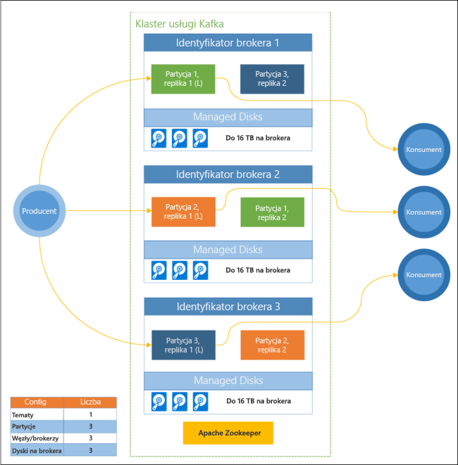

# Co to jest platforma Apache Kafka w usłudze HDInsight?

[Apache Kafka](https://kafka.apache.org) to rozproszona platforma przesyłania strumieniowego typu „open source”, która umożliwia tworzenie aplikacji i potoków danych przesyłania strumieniowego w czasie rzeczywistym. Ponadto platforma Kafka oferuje funkcję brokera komunikatów, która działa podobnie do kolejki komunikatów. Pozwala ona publikować i subskrybować w nazwanych strumieniach danych. 

Cechy charakterystyczne platformy Kafka w usłudze HDInsight są następujące:

* Jest to usługa zarządzana zapewniająca uproszczony proces konfiguracji. W wyniku powstaje konfiguracja przetestowana i obsługiwana przez firmę Microsoft.

* Firma Microsoft gwarantuje 99,9% czasu sprawnego działania platformy Kafka zgodnie z Umową dotyczącą poziomu usług (SLA). Aby uzyskać więcej informacji, zobacz dokument [HDInsight — umowa SLA](https://azure.microsoft.com/support/legal/sla/hdinsight/v1_0/).

* Jako magazynu zapasowego platforma Kafka używa usługi Azure Managed Disks. Usługa Managed Disks zapewnia do 16 TB pamięci masowej dla każdego brokera platformy Kafka. Aby uzyskać informacje dotyczące konfigurowania usługi Managed Disks na platformie Kafka w usłudze HDInsight, zobacz artykuł [Increase scalability of Kafka on HDInsight](apache-kafka-scalability.md) (Zwiększanie skalowalności platformy Kafka w usłudze HDInsight).

    Aby uzyskać więcej informacji o usłudze Managed Disks, zobacz artykuł [Azure Managed Disks](../../virtual-machines/windows/managed-disks-overview.md).

* Platforma Kafka została zaprojektowana jako jednowymiarowy widok regału. Platforma Azure rozdziela ten regał na dwa wymiary — domeny aktualizacji (UD) i domeny błędów (FD). Firma Microsoft udostępnia narzędzia, za pomocą których można ponownie zrównoważyć partycje i repliki platformy Kafka między domenami aktualizacji i błędów. 

    Aby uzyskać więcej informacji, zobacz [High availability with Kafka on HDInsight](apache-kafka-high-availability.md) (Wysoka dostępność na platformie Kafka w usłudze HDInsight).

* Usługa HDInsight umożliwia zmianę liczby węzłów procesu roboczego (które hostują brokera platformy Kafka) po utworzeniu klastra. Skalowanie może być przeprowadzane w witrynie Azure Portal, w programie Azure PowerShell i w innych interfejsach zarządzania platformy Azure. W przypadku platformy Kafka po wykonaniu operacji skalowania należy przeprowadzić ponowne równoważenie replik partycji. Ponowne równoważenie partycji na platformie Kafka umożliwia skorzystanie z nowej liczby węzłów procesu roboczego.

    Aby uzyskać więcej informacji, zobacz [High availability with Kafka on HDInsight](apache-kafka-high-availability.md) (Wysoka dostępność na platformie Kafka w usłudze HDInsight).

* Do monitorowania platformy Kafka w usłudze HDInsight można użyć usługi Azure Log Analytics. Usługa Log Analytics wydobywa informacje dotyczące maszyn wirtualnych, takie jak metryki dysków i kart sieciowych oraz metryki JMX z platformy Kafka.

    Aby uzyskać więcej informacji, zobacz [Analyze logs for Kafka on HDInsight](apache-kafka-log-analytics-operations-management.md) (Analizowanie dzienników na potrzeby platformy Kafka w usłudze HDInsight).

### Architektura platformy Kafka w usłudze HDInsight

Poniższy diagram przedstawia typową konfigurację platformy Kafka korzystającą z grup konsumentów, partycjonowania i replikacji w celu zapewnienia równoległego odczytu zdarzeń przy zachowaniu odporności na uszkodzenia:

Usługa Apache ZooKeeper zarządza stanem klastra platformy Kafka. Usługę Zookeeper zaprojektowano pod kątem obsługi jednoczesnych, odpornych transakcji o małych opóźnieniach. 

Platforma Kafka przechowuje rekordy (dane) w **tematach**. Rekordy są tworzone przez **producentów** i używane przez **odbiorców**. Producenci wysyłają rekordy do **brokerów** platformy Kafka. Każdy węzeł procesu roboczego w klastrze usługi HDInsight jest brokerem platformy Kafka. 

Tematy dzielą rekordy między brokerami. Podczas korzystania z rekordów można użyć maksymalnie jednego odbiorcy na jedną partycję, aby osiągnąć równoległe przetwarzanie danych.

Dzięki replikacji zapewniono duplikowanie partycji w węzłach, co gwarantuje ochronę przed awariami węzła (brokera). Partycja wiodąca jest oznaczona symbolem *(L)* na diagramie. Ruch producenta jest kierowany do partycji wiodącej w każdym węźle przy użyciu stanu zarządzanego przez usługę ZooKeeper.

## Dlaczego warto używać platformy Kafka w usłudze HDInsight?

Poniżej przedstawiono typowe zadania i wzorce, które mogą być wykonywane przy użyciu platformy Kafka w usłudze HDInsight:

* **Replikowanie danych platformy Kafka**: platforma Kafka udostępnia narzędzie MirrorMaker, które replikuje dane między klastrami Kafka.

    Aby uzyskać informacje na temat używania narzędzia MirrorMaker, zobacz [Replicate Kafka topics with Kafka on HDInsight](apache-kafka-mirroring.md) (Replikowanie tematów platformy Kafka na platformie Kafka w usłudze HDInsight).

* **Wzorzec przesyłania komunikatów dotyczących publikowania i subskrybowania**: platforma Kafka udostępnia interfejs API producenta do publikowania rekordów w temacie platformy Kafka. Interfejs API klienta jest używany podczas subskrybowania tematu.

    Aby uzyskać więcej informacji, zobacz [Start with Kafka on HDInsight](apache-kafka-get-started.md) (Rozpoczynanie pracy z platformą Kafka w usłudze HDInsight).

* **Przetwarzanie strumienia**: platforma Kafka jest często używana z systemem Apache Storm lub platformą Spark na potrzeby przetwarzania strumienia w czasie rzeczywistym. Na platformie Kafka 0.10.0.0 (usługa HDInsight w wersji 3.5 i 3.6) wprowadzono interfejs API przesyłania strumieniowego, który umożliwia tworzenie rozwiązań do transmisji strumieniowej bez konieczności stosowania rozwiązań Storm i Spark.

    Aby uzyskać więcej informacji, zobacz [Start with Kafka on HDInsight](apache-kafka-get-started.md) (Rozpoczynanie pracy z platformą Kafka w usłudze HDInsight).

* **Skalowanie w poziomie**: platforma Kafka dzieli strumienie na partycje w różnych węzłach klastra usługi HDInsight. Procesy klientów mogą być kojarzone z poszczególnymi partycjami, aby umożliwić równoważenie obciążenia podczas korzystania z rekordów.

    Aby uzyskać więcej informacji, zobacz [Start with Kafka on HDInsight](apache-kafka-get-started.md) (Rozpoczynanie pracy z platformą Kafka w usłudze HDInsight).

* **Dostarczanie w określonej kolejności**: rekordy na każdej partycji są przechowywane w strumieniu w tej samej kolejności, w której zostały odebrane. Skojarzenie jednego procesu klienta z jedną partycją pozwala zagwarantować, że rekordy są przetwarzane we właściwej kolejności.

    Aby uzyskać więcej informacji, zobacz [Start with Kafka on HDInsight](apache-kafka-get-started.md) (Rozpoczynanie pracy z platformą Kafka w usłudze HDInsight).

## Przypadki zastosowań

* **Komunikaty**: platforma Kafka obsługuje wzorzec przesyłania komunikatów dotyczących publikowania i subskrybowania, dlatego jest często używana jako broker komunikatów.

* **Śledzenie działań**: platforma Kafka rejestruje rekordy w określonej kolejności, dlatego może służyć do śledzenia i ponownego tworzenia działań. Mogą to być na przykład działania użytkownika w witrynie sieci Web lub aplikacji.

* **Agregacja**: przetwarzanie strumienia pozwala agregować informacje z różnych strumieni w celu łączenia i centralizowania informacji w formie danych operacyjnych.

* **Przekształcanie**: przetwarzanie strumienia umożliwia łączenie i urozmaicanie danych z wielu tematów wejściowych w formie tematów wyjściowych.

## Następne kroki

Aby dowiedzieć się, jak korzystać z platformy Apache Kafka w usłudze HDInsight, użyj następujących linków:

* [Szybki Start: tworzenie platformy Kafka w usłudze HDInsight](apache-kafka-get-started.md)

* [Samouczek: używanie platformy Apache Spark z platformą Kafka w usłudze HDInsight](../hdinsight-apache-spark-with-kafka.md)

* [Samouczek: używanie systemu Apache Storm z platformą Kafka w usłudze HDInsight](../hdinsight-apache-storm-with-kafka.md)
