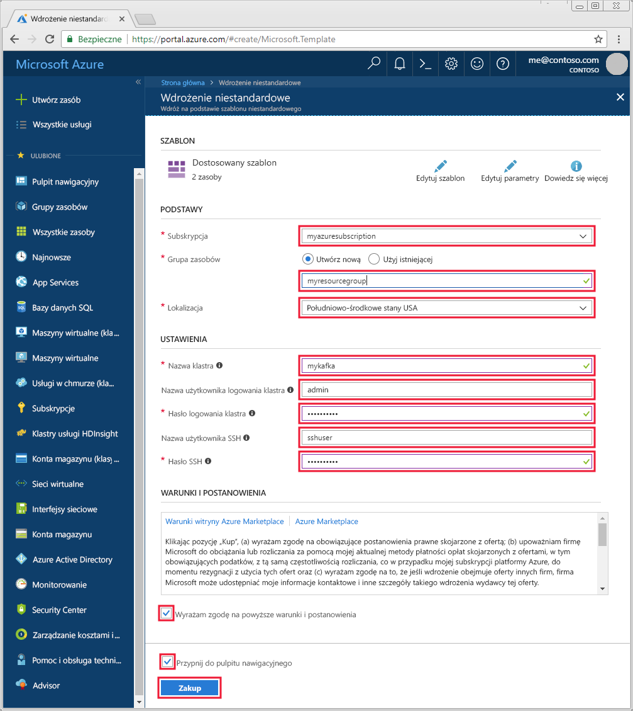

# <a name="quickstart-create-apache-kafka-cluster-in-azure-hdinsight-using-resource-manager-template"></a>Szybki Start: Tworzenie klastra Apache Kafka w usłudze Azure HDInsight przy użyciu szablonu Menedżer zasobów

[Apache Kafka](https://kafka.apache.org/) to rozproszona platforma przesyłania strumieniowego typu open source. Jest ona często używana jako broker komunikatów, ponieważ oferuje funkcje podobne do kolejki komunikatów dotyczących publikowania i subskrybowania. 

W tym przewodniku Szybki start dowiesz się, jak utworzyć klaster platformy [Apache Kafka](https://kafka.apache.org) przy użyciu szablonu usługi Azure Resource Manager. Dowiesz się także, jak używać dołączonych narzędzi do wysyłania i odbierania komunikatów na platformie Kafka. Podobne szablony można wyświetlać w [szablonach szybkiego startu platformy Azure](https://azure.microsoft.com/resources/templates/?resourceType=Microsoft.Hdinsight&pageNumber=1&sort=Popular). Dokumentację szablonu można znaleźć [tutaj](https://docs.microsoft.com/azure/templates/microsoft.hdinsight/allversions).

[!INCLUDE [delete-cluster-warning](../../../includes/hdinsight-delete-cluster-warning.md)]

Dostęp do interfejsu API platformy Kafka mogą uzyskać tylko zasoby będące w tej samej sieci wirtualnej. W tym przewodniku Szybki start uzyskasz dostęp do klastra bezpośrednio przy użyciu protokołu SSH. Aby do platformy Kafka podłączyć inne usługi, sieci lub maszyny wirtualne, należy najpierw utworzyć sieć wirtualną, a następnie utworzyć zasoby w obrębie tej sieci. Aby uzyskać więcej informacji, zobacz dokument [Connect to Apache Kafka using a virtual network (Nawiązywanie połączenia z platformą Apache Kafka za pomocą sieci wirtualnej)](apache-kafka-connect-vpn-gateway.md).

Jeśli nie masz subskrypcji platformy Azure, przed rozpoczęciem utwórz [bezpłatne konto](https://azure.microsoft.com/free/?WT.mc_id=A261C142F).

## <a name="prerequisites"></a>Wymagania wstępne

Klient SSH. Aby uzyskać więcej informacji, zobacz [Łączenie się z usługą HDInsight (Apache Hadoop) przy użyciu protokołu SSH](../hdinsight-hadoop-linux-use-ssh-unix.md).

## <a name="create-an-apache-kafka-cluster"></a>Tworzenie klastra platformy Apache Kafka

1. Kliknij poniższy obraz, aby otworzyć szablon w usłudze Azure Portal.

    <a href="https://portal.azure.com/#create/Microsoft.Template/uri/https%3A%2F%2Fraw.githubusercontent.com%2FAzure-Samples%2Fhdinsight-kafka-java-get-started%2Fmaster%2Fazuredeploy.json" target="_blank"></a>

2. Aby utworzyć klaster platformy Kafka, użyj następujących wartości:

    | Właściwość | Wartość |
    | --- | --- |
    | Subskrypcja | Swoją subskrypcję platformy Azure. |
    | Grupa zasobów | Grupa zasobów, w której jest tworzony klaster. |
    | Lokalizacja | Region świadczenia usługi Azure, w którym jest tworzony klaster. |
    | Nazwa klastra | Nazwa klastra Kafka. |
    | Nazwa użytkownika logowania klastra | Nazwa konta używana do logowania w usługach opartych na protokole HTTPS hostowanych w klastrze. |
    | Hasło logowania klastra | Hasło dla nazwy użytkownika logowania. |
    | Nazwa użytkownika SSH | Nazwa użytkownika SSH. To konto może uzyskać dostęp do klastra przy użyciu protokołu SSH. |
    | Hasło SSH | Hasło użytkownika SSH. |

    

3. Wybierz pozycję **Wyrażam zgodę na powyższe warunki i postanowienia** i pozycję **Przypnij do pulpitu nawigacyjnego**, a następnie kliknij przycisk **Kup**. Tworzenie klastra może potrwać do 20 minut.

## <a name="connect-to-the-cluster"></a>Łączenie z klastrem

1. Aby nawiązać połączenie z podstawowym węzłem głównym klastra platformy Kafka, użyj następującego polecenia. Zastąp wartość `sshuser` nazwą użytkownika protokołu SSH. Zastąp wartość `mykafka` nazwą klastra platformy Kafka

    ```bash
    ssh sshuser@mykafka-ssh.azurehdinsight.net
    ```

2. Po pierwszym połączeniu z klastrem Twój klient SSH może wyświetlić ostrzeżenie, że nie można ustalić autentyczności hosta. Po wyświetleniu monitu wpisz wartość __yes__ i naciśnij klawisz __Enter__, aby dodać hosta do listy zaufanych serwerów klienta SSH.

3. Po wyświetleniu monitu wprowadź hasło użytkownika SSH.

    Po nawiązaniu połączenia zostanie wyświetlona informacja podobna do następującej:
    
    ```output
    Authorized uses only. All activity may be monitored and reported.
    Welcome to Ubuntu 16.04.4 LTS (GNU/Linux 4.13.0-1011-azure x86_64)
    
     * Documentation:  https://help.ubuntu.com
     * Management:     https://landscape.canonical.com
     * Support:        https://ubuntu.com/advantage
    
      Get cloud support with Ubuntu Advantage Cloud Guest:
        https://www.ubuntu.com/business/services/cloud
    
    83 packages can be updated.
    37 updates are security updates.
    
    
    Welcome to Kafka on HDInsight.
    
    Last login: Thu Mar 29 13:25:27 2018 from 108.252.109.241
    ```

## <a id="getkafkainfo"></a>Pobierz informacje dotyczących hostów Apache Zookeeper i Broker

Podczas pracy z platformą Kafka musisz znać hosty *Apache Zookeeper* i *Broker*. Te hosty są używane z interfejsem API platformy Kafka i wieloma narzędziami oferowanymi z platformą Kafka.

W tej sekcji uzyskasz informacje o hoście z interfejsu API REST Ambari w klastrze.

1. Z poziomu połączenia SSH z klastrem zainstaluj narzędzie `jq` za pomocą poniższego polecenia. To narzędzie służy do analizowania dokumentów JSON i jest przydatne podczas pobierania informacji o hoście:
   
    ```bash
    sudo apt -y install jq
    ```

2. Aby ustawić zmienną środowiskową na nazwę klastra, użyj następującego polecenia:

    ```bash
    read -p "Enter the Kafka on HDInsight cluster name: " CLUSTERNAME
    ```

    Po wyświetleniu monitu wprowadź nazwę klastra platformy Kafka.

3. Aby ustawić zmienną środowiskową z informacjami o hoście dozorcy, użyj poniższego polecenia. Polecenie pobiera wszystkie hosty dozorcy, a następnie zwraca tylko pierwsze dwa wpisy. Taka nadmiarowość jest wymagana, jeśli jeden z hostów będzie nieosiągalny.

    ```bash
    export KAFKAZKHOSTS=`curl -sS -u admin -G https://$CLUSTERNAME.azurehdinsight.net/api/v1/clusters/$CLUSTERNAME/services/ZOOKEEPER/components/ZOOKEEPER_SERVER | jq -r '["\(.host_components[].HostRoles.host_name):2181"] | join(",")' | cut -d',' -f1,2`
    ```

    Po wyświetleniu monitu wprowadź hasło dla konta logowania klastra (nie dla konta SSH).

4. Aby sprawdzić, czy zmienna środowiskowa jest poprawnie ustawiona, użyj następującego polecenia:

    ```bash
     echo '$KAFKAZKHOSTS='$KAFKAZKHOSTS
    ```

    To polecenie zwraca informacje podobne do następującego tekstu:

    `zk0-kafka.eahjefxxp1netdbyklgqj5y1ud.ex.internal.cloudapp.net:2181,zk2-kafka.eahjefxxp1netdbyklgqj5y1ud.ex.internal.cloudapp.net:2181`

5. Aby ustawić zmienną środowiskową na informacje hosta brokera platformy Kafka, użyj następującego polecenia:

    ```bash
    export KAFKABROKERS=`curl -sS -u admin -G https://$CLUSTERNAME.azurehdinsight.net/api/v1/clusters/$CLUSTERNAME/services/KAFKA/components/KAFKA_BROKER | jq -r '["\(.host_components[].HostRoles.host_name):9092"] | join(",")' | cut -d',' -f1,2`
    ```

    Po wyświetleniu monitu wprowadź hasło dla konta logowania klastra (nie dla konta SSH).

6. Aby sprawdzić, czy zmienna środowiskowa jest poprawnie ustawiona, użyj następującego polecenia:

    ```bash   
    echo '$KAFKABROKERS='$KAFKABROKERS
    ```

    To polecenie zwraca informacje podobne do następującego tekstu:
   
    `wn1-kafka.eahjefxxp1netdbyklgqj5y1ud.cx.internal.cloudapp.net:9092,wn0-kafka.eahjefxxp1netdbyklgqj5y1ud.cx.internal.cloudapp.net:9092`

## <a name="manage-apache-kafka-topics"></a>Zarządzanie tematami platformy Apache Kafka

Platforma Kafka przechowuje strumienie danych w *tematach*. Tematami można zarządzać za pomocą narzędzia `kafka-topics.sh`.

* **Aby utworzyć temat**, użyj następującego polecenia, korzystając z połączenia SSH:

    ```bash
    /usr/hdp/current/kafka-broker/bin/kafka-topics.sh --create --replication-factor 3 --partitions 8 --topic test --zookeeper $KAFKAZKHOSTS
    ```

    To polecenie umożliwia nawiązanie połączenia z hostem Zookeeper przy użyciu informacji o hoście przechowywanych w elemencie `$KAFKAZKHOSTS`. Następnie tworzy ono temat platformy Kafka o nazwie **test**. 

    * Dane przechowywane w tym temacie są podzielone między osiem partycji.

    * Każda partycja jest replikowana w trzech węzłach procesu roboczego w klastrze.

        Jeśli klaster został utworzony w regionie świadczenia usługi Azure, który udostępnia trzy domeny błędów, użyj współczynnika replikacji o wartości 3. W przeciwnym razie użyj współczynnika replikacji o wartości 4.
        
        W regionach z trzema domenami błędów współczynnik replikacji o wartości 3 umożliwia rozmieszczenie replik w różnych domenach błędów. W regionach z dwoma domenami błędów współczynnik replikacji o wartości cztery umożliwia równomierne rozmieszczenie replik między domenami.
        
        Aby uzyskać informacje dotyczące liczby domen błędów w regionie, zobacz dokument [Availability of Linux virtual machines (Dostępność maszyn wirtualnych z systemem Linux)](../../virtual-machines/windows/manage-availability.md#use-managed-disks-for-vms-in-an-availability-set).

        Platforma Kafka nie uwzględnia domen błędów platformy Azure. Utworzone repliki partycji tematów mogą nie zostać prawidłowo rozpowszechnione w celu zapewnienia wysokiej dostępności.

        Aby zapewnić wysoką dostępność, użyj [narzędzia do ponownego równoważenia partycji platformy Apache Kafka](https://github.com/hdinsight/hdinsight-kafka-tools). To narzędzie należy uruchomić, korzystając z połączenia SSH z węzłem głównym klastra platformy Kafka.

        Aby zapewnić najwyższą dostępność danych na platformie Kafka, należy stosować ponowne równoważenie replik partycji dla tematu, gdy:

        * Tworzysz nowy temat lub partycję

        * Skalujesz klaster w górę

* **Aby wyświetlić listę tematów**, użyj następującego polecenia:

    ```bash
    /usr/hdp/current/kafka-broker/bin/kafka-topics.sh --list --zookeeper $KAFKAZKHOSTS
    ```

    To polecenie wyświetla listę dostępnych tematów w klastrze platformy Kafka.

* **Aby usunąć temat**, użyj następującego polecenia:

    ```bash
    /usr/hdp/current/kafka-broker/bin/kafka-topics.sh --delete --topic topicname --zookeeper $KAFKAZKHOSTS
    ```

    To polecenie usuwa temat o nazwie `topicname`.

    > [!WARNING]  
    > W przypadku usunięcia utworzonego wcześniej tematu `test` konieczne będzie jego ponowne utworzenie. Jest on używany w czynnościach opisanych w dalszej części tego dokumentu.

Aby uzyskać więcej informacji na temat poleceń dostępnych w narzędziu `kafka-topics.sh`, użyj następującego polecenia:

```bash
/usr/hdp/current/kafka-broker/bin/kafka-topics.sh
```

## <a name="produce-and-consume-records"></a>Tworzenie i używanie rekordów

Platforma Kafka przechowuje *rekordy* w tematach. Rekordy są tworzone przez *producentów* i używane przez *odbiorców*. Producenci i odbiorcy komunikują się z usługą *brokera platformy Kafka*. Każdy węzeł procesu roboczego w klastrze usługi HDInsight jest hostem brokera platformy Kafka.

Poniżej przedstawiono procedurę zapisywania rekordów w utworzonym wcześniej temacie testowym i odczytywania ich za pomocą odbiorcy:

1. Aby zapisać rekordy w temacie, użyj narzędzia `kafka-console-producer.sh`, korzystając z połączenia SSH:
   
    ```bash
    /usr/hdp/current/kafka-broker/bin/kafka-console-producer.sh --broker-list $KAFKABROKERS --topic test
    ```
   
    Po wykonaniu tego polecenia przejdziesz do pustego wiersza.

2. Wprowadź wiadomość tekstową do pustego wiersza, a następnie naciśnij klawisz Enter. Wprowadź w ten sposób kilka wiadomości, a następnie użyj kombinacji klawiszy **Ctrl + C**, aby powrócić do normalnego monitu. Każdy wiersz jest wysyłany do tematu platformy Kafka jako oddzielny rekord.

3. Aby odczytać rekordy z tematu, użyj narzędzia `kafka-console-consumer.sh`, korzystając z połączenia SSH:
   
    ```bash
    /usr/hdp/current/kafka-broker/bin/kafka-console-consumer.sh --bootstrap-server $KAFKABROKERS --topic test --from-beginning
    ```
   
    To polecenie umożliwia pobranie rekordów z tematu i ich wyświetlenie. Polecenie `--from-beginning` informuje odbiorcę, aby rozpocząć od początku strumienia w celu pobrania wszystkich rekordów.

    Jeśli korzystasz ze starszej wersji platformy Kafka, zastąp element `--bootstrap-server $KAFKABROKERS` elementem `--zookeeper $KAFKAZKHOSTS`.

4. Użyj klawiszy __Ctrl+C__, aby zatrzymać odbiorcę.

Producentów i odbiorców można również utworzyć programowo. Przykład korzystania z tego interfejsu API znajduje się w dokumencie [Apache Kafka Producer and Consumer API with HDInsight](apache-kafka-producer-consumer-api.md) (Interfejs API producenta i odbiorcy platformy Apache Kafka w usłudze HDInsight).

## <a name="clean-up-resources"></a>Oczyszczanie zasobów

Jeśli chcesz oczyścić zasoby utworzone w tym przewodniku Szybki start, możesz usunąć grupę zasobów. Usunięcie grupy zasobów powoduje również usunięcie skojarzonego klastra usługi HDInsight i wszystkich innych zasobów skojarzonych z tą grupą zasobów.

Aby usunąć grupę zasobów za pomocą witryny Azure Portal:

1. W witrynie Azure Portal rozwiń menu po lewej stronie, aby otworzyć menu usług, a następnie wybierz pozycję __Grupy zasobów__, aby wyświetlić listę grup zasobów.
2. Znajdź grupę zasobów do usunięcia, a następnie kliknij prawym przyciskiem myszy przycisk __Więcej (...)__ po prawej stronie listy.
3. Wybierz pozycję __Usuń grupę zasobów__ i potwierdź.

> [!WARNING]  
> Naliczanie opłat rozpoczyna się w momencie utworzenia klastra usługi HDInsight i kończy się wraz z jego usunięciem. Opłaty są naliczane za minutę, więc jeśli klaster nie jest używany, należy go usunąć.
> 
> Usunięcie platformy Kafka w klastrze usługi HDInsight powoduje usunięcie wszystkich danych przechowywanych na platformie Kafka.

## <a name="next-steps"></a>Następne kroki

> [!div class="nextstepaction"]
> [Używanie systemu Apache Spark z platformą Apache Kafka](../hdinsight-apache-kafka-spark-structured-streaming.md)