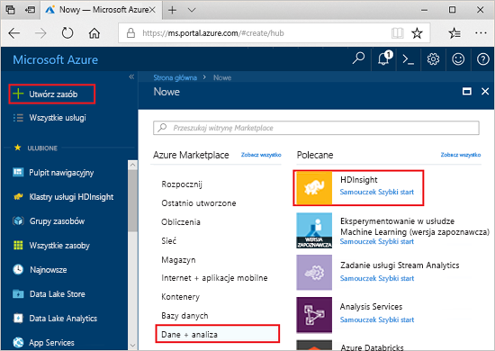

# <a name="quickstart-create-apache-spark-cluster-in-azure-hdinsight-using-azure-portal"></a>Szybki Start: Tworzenie klastra Apache Spark w usłudze Azure HDInsight przy użyciu Azure Portal

W tym przewodniku szybki start użyjesz Azure Portal, aby utworzyć klaster Apache Spark w usłudze Azure HDInsight. Następnie utworzysz Notes Jupyter i użyjesz go do uruchamiania zapytań Spark SQL w odniesieniu do tabel Apache Hive. Azure HDInsight jest zarządzaną usługą analityczną typu „open source” o szerokim zakresie, z przeznaczeniem dla przedsiębiorstw. Platforma Apache Spark dla usługi HDInsight umożliwia szybkie analizowanie danych i przetwarzanie klastrów przy użyciu przetwarzania w pamięci. Notes Jupyter umożliwia korzystanie z danych, łączenie kodu z tekstem z promocji i przeprowadzeniem prostych wizualizacji.

[Przegląd: Apache Spark w usłudze Azure HDInsight](apache-spark-overview.md) | [Apache Spark](https://spark.apache.org/) | [Apache Hive](https://hive.apache.org/) [ | Jupyter Notebook](https://jupyter.org/)

## <a name="prerequisites"></a>Wymagania wstępne

- Konto platformy Azure z aktywną subskrypcją. [Utwórz konto bezpłatnie](https://azure.microsoft.com/free/?ref=microsoft.com&utm_source=microsoft.com&utm_medium=docs&utm_campaign=visualstudio).

## <a name="create-an-apache-spark-cluster-in-hdinsight"></a>Tworzenie klastra Apache Spark w usłudze HDInsight

Użyj Azure Portal, aby utworzyć klaster usługi HDInsight, który korzysta z obiektów BLOB w usłudze Azure Storage jako magazynu klastra. Aby uzyskać więcej informacji na temat korzystania z usługi Data Lake Storage 2. generacji, zobacz [Szybki start: konfigurowanie klastrów w usłudze HDInsight](../../storage/data-lake-storage/quickstart-create-connect-hdi-cluster.md).

> [!IMPORTANT]  
> Opłaty za klastry usługi HDInsight są naliczane proporcjonalnie za minutę, niezależnie od ich użycia. Pamiętaj o usunięciu klastra po zakończeniu korzystania z niego. Aby uzyskać więcej informacji, zobacz sekcję [Czyszczenie zasobów](#clean-up-resources) w tym artykule.

1. W witrynie Azure Portal wybierz polecenie **Utwórz zasób**.

    

1. Na stronie **Nowy** wybierz pozycję **Analytics** > **HDInsight**.

    

1. W obszarze **Podstawy** podaj następujące wartości:

    |Właściwość  |Opis  |
    |---------|---------|
    |Subskrypcja  | Z listy rozwijanej wybierz subskrypcję platformy Azure używaną dla tego klastra. Subskrypcja użyta w tym przewodniku szybki start to **Azure**. |
    |Grupa zasobów | Określ, czy chcesz utworzyć nową grupę zasobów, czy użyć istniejącej grupy. Grupa zasobów to kontener, który zawiera powiązane zasoby dla rozwiązania platformy Azure. Nazwa grupy zasobów używana w tym przewodniku szybki start to grupa **zasobów**. |
    |Nazwa klastra | Nadaj nazwę klastrowi usługi HDInsight. Nazwa klastra używana w tym przewodniku szybki start to **myspark2019**.|
    |Lokalizacja   | Wybierz lokalizację dla grupy zasobów. Szablon używa tej lokalizacji do tworzenia klastra oraz na potrzeby domyślnego magazynu klastra. Lokalizacja używana w tym przewodniku szybki start to **Wschodnie stany USA**. |
    |Typ klastra| Wybierz pozycję **Spark** jako typ klastra.|
    |Wersja klastra|Po wybraniu typu klastra pole zostanie automatycznie wypełnione przy użyciu domyślnej wersji.|
    |Nazwa użytkownika logowania klastra| Wprowadź nazwę użytkownika logowania klastra.  Nazwa domyślna to *admin*. To konto jest używane do logowania się do notesu Jupyter w dalszej części przewodnika Szybki Start. |
    |Hasło logowania klastra| Wprowadź hasło logowania klastra. |
    |Nazwa użytkownika protokołu SSH (Secure Shell)| Wprowadź nazwę użytkownika protokołu SSH. Nazwą użytkownika protokołu SSH używaną w tym przewodniku Szybki start jest **sshuser**. Domyślnie to konto współdzieli hasło z kontem *Nazwa użytkownika logowania klastra*. |

    

    Wybierz pozycję **Dalej: > magazynu >** , aby przejść do strony **Magazyn** .

1. W obszarze **Magazyn** podaj następujące wartości:

    |Właściwość  |Opis  |
    |---------|---------|
    |Podstawowy typ magazynu|Użyj wartości domyślnej **usługi Azure Storage**.|
    |Metoda wyboru|Użyj wartości domyślnej **Wybierz z listy**.|
    |Konto magazynu podstawowego|Użyj automatycznie wypełnionej wartości.|
    |Kontener|Użyj automatycznie wypełnionej wartości.|

    

    Wybierz pozycję **Recenzja + Utwórz** , aby kontynuować.

1. W obszarze **Recenzja + tworzenie**wybierz pozycję **Utwórz**. Utworzenie klastra trwa około 20 minut. Przed przejściem do następnej sesji należy utworzyć klaster.

Jeśli wystąpi problem z tworzeniem klastrów usługi HDInsight, może to oznaczać, że nie masz odpowiednich uprawnień, aby to zrobić. Aby uzyskać więcej informacji, zobacz [Wymagania dotyczące kontroli dostępu](../hdinsight-hadoop-create-linux-clusters-portal.md).

## <a name="create-a-jupyter-notebook"></a>Tworzenie notesu Jupyter

Jupyter Notebook to interakcyjne środowisko notesu, które obsługuje różne języki programowania. Notes pozwala na interakcję z danymi, łączenie kodu z tekstem markdown i wykonywanie prostych wizualizacji.

1. Otwórz [portal Azure](https://portal.azure.com).

1. Wybierz pozycję **Klastry usługi HDInsight**, a następnie wybierz utworzony klaster.

    

1. W portalu wybierz pozycję **Pulpity nawigacyjne klastra**, a następnie pozycję **Notes Jupyter**. Jeśli zostanie wyświetlony monit, wprowadź poświadczenia logowania dla klastra.

   

1. Aby utworzyć notes, wybierz pozycję **Nowy** > **PySpark**.

   

   Zostanie utworzony i otwarty nowy notes o nazwie Untitled (Untitled.pynb).

## <a name="run-apache-spark-sql-statements"></a>Uruchamianie Apache Spark instrukcji SQL

SQL (Structured Query Language) to najczęściej używany język służący do definiowania danych i wykonywania zapytań na tych danych. Rozwiązanie Spark SQL stanowi rozszerzenie platformy Apache Spark służące do przetwarzania danych strukturalnych za pomocą dobrze znanej składni języka SQL.

1. Sprawdź, czy jądro jest gotowe. Gotowość jądra jest sygnalizowana pustym okręgiem obok nazwy jądra w notesie. Pełne kółko oznacza, że jądro jest zajęte.

    

    Podczas pierwszego uruchamiania notesu jądro wykonuje pewne zadania w tle. Poczekaj, aż jądro będzie gotowe.

1. Wklej następujący kod do pustej komórki, a następnie naciśnij klawisze **SHIFT + ENTER**, aby go uruchomić. Polecenie wyświetla listę tabel Hive w klastrze:

    ```PySpark
    %%sql
    SHOW TABLES
    ```

    W przypadku korzystania z Jupyter Notebook z klastrem usługi HDInsight uzyskasz wstępnie ustawioną `sqlContext`, której można użyć do uruchamiania zapytań Hive przy użyciu platformy Spark SQL. Wyrażenie `%%sql` informuje notes Jupyter o konieczności użycia ustawienia wstępnego `sqlContext` do uruchomienia zapytania programu Hive. Zapytanie pobiera pierwszych 10 wierszy z tabeli programu Hive (**hivesampletable**), która jest dostępna domyślnie na wszystkich klastrach usługi HDInsight. Uzyskanie wyników zajmuje około 30 sekund. Dane wyjściowe wyglądają następująco:

    

    Podczas każdego uruchomienia zapytania w programie Jupyter w tytule okna przeglądarki internetowej wyświetlany jest stan **(Busy)** (Zajęty) wraz z tytułem notesu. Widoczne jest także pełne kółko obok tekstu **PySpark** w prawym górnym rogu.

1. Uruchom inne zapytanie, aby wyświetlić dane z tabeli `hivesampletable`.

    ```PySpark
    %%sql
    SELECT * FROM hivesampletable LIMIT 10
    ```

    Ekran zostanie odświeżony w celu wyświetlenia wyników zapytania.

    

1. W menu **File** (Plik) w notesie wybierz pozycję **Close and Halt** (Zamknij i zatrzymaj). Zamknięcie notesu spowoduje zwolnienie zasobów klastra.

## <a name="clean-up-resources"></a>Oczyszczanie zasobów

Usługa HDInsight zapisuje Twoje dane w usłudze Azure Storage lub Azure Data Lake Storage, więc możesz bezpiecznie usunąć klaster, gdy nie jest używany. Opłaty za klaster usługi HDInsight są naliczane nawet wtedy, gdy nie jest używany. Ponieważ opłaty za klaster są wielokrotnie większe niż opłaty za magazyn, ze względów ekonomicznych warto usuwać klastry, gdy nie są używane. Jeśli planujesz natychmiastowe rozpoczęcie pracy z samouczkiem z listy [Następne kroki](#next-steps), warto zachować klaster.

Przejdź z powrotem do witryny Azure Portal, a następnie wybierz pozycję **Usuń**.


Dodatkowo możesz wybrać nazwę grupy zasobów, aby otworzyć stronę grupy zasobów, a następnie wybrać pozycję **Usuń grupę zasobów**. Usuwając grupę zasobów, należy usunąć zarówno klaster usługi HDInsight, jak i domyślne konto magazynu.

## <a name="next-steps"></a>Następne kroki

W tym przewodniku szybki start przedstawiono sposób tworzenia klastra Apache Spark w usłudze HDInsight i uruchamiania podstawowego zapytania Spark SQL. Przejdź do następnego samouczka, aby dowiedzieć się, jak uruchamiać interakcyjne zapytania dotyczące przykładowych danych za pomocą klastra usługi HDInsight.

> [!div class="nextstepaction"]
> [Uruchamianie interakcyjnych zapytań na platformie Apache Spark](./apache-spark-load-data-run-query.md)
