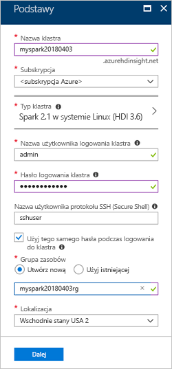
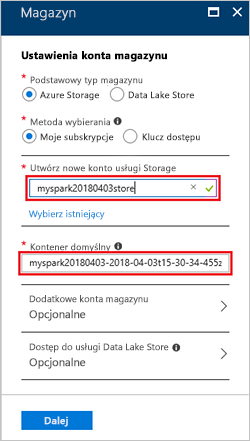
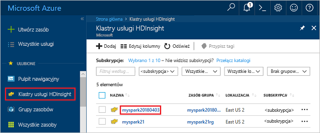
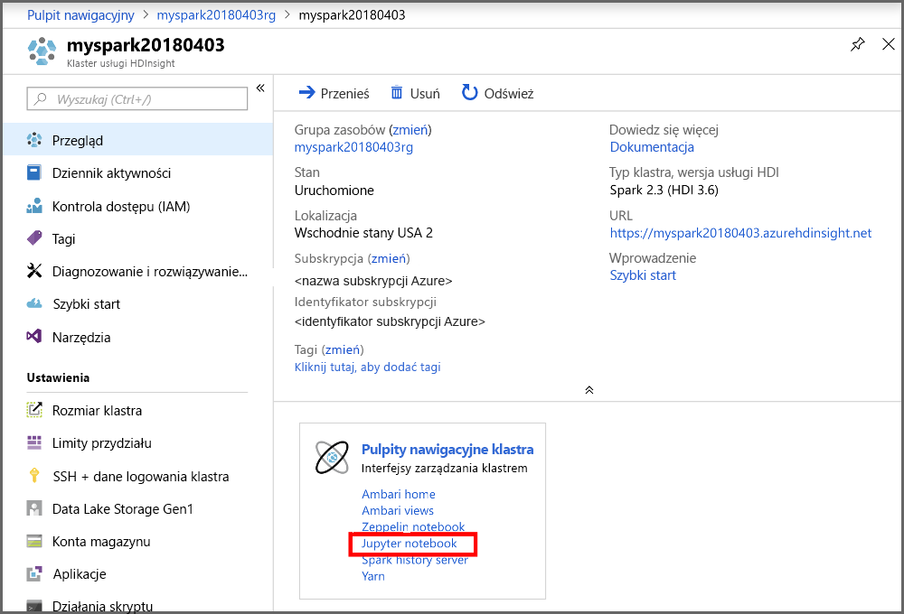
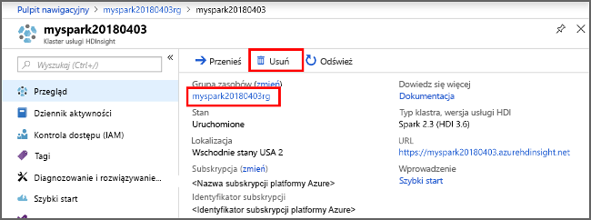

# <a name="quickstart-create-apache-spark-cluster-in-azure-hdinsight-using-azure-portal"></a>Szybki start: Tworzenie klastra Apache Spark w usłudze Azure HDInsight przy użyciu Azure Portal

Dowiedz się, jak utworzyć klaster Apache Spark w usłudze Azure HDInsight, a następnie uruchamiać zapytania Spark SQL dla tabel programu Hive. Platforma Apache Spark umożliwia szybką analizę danych i używanie klastrów obliczeniowych korzystających z funkcji przetwarzania w pamięci. Aby uzyskać informacje na temat platformy Apache Spark w usłudze HDInsight, zobacz [Omówienie: platforma Apache Spark w usłudze Azure HDInsight](apache-spark-overview.md).

W tym przewodniku Szybki start użyjesz witryny Azure Portal do utworzenia klastra Spark w usłudze HDInsight. Klaster używa usług Azure Storage Blob jako magazynu klastra. Aby uzyskać więcej informacji na temat korzystania z usługi Data Lake Storage Gen2, zobacz [Szybki start: konfigurowanie klastrów w usłudze HDInsight](../../storage/data-lake-storage/quickstart-create-connect-hdi-cluster.md).

> [!IMPORTANT]  
> Opłaty za klastry usługi HDInsight są naliczane proporcjonalnie za minutę, niezależnie od ich użycia. Pamiętaj o usunięciu klastra po zakończeniu korzystania z niego. Aby uzyskać więcej informacji, zobacz sekcję [Czyszczenie zasobów](#clean-up-resources) w tym artykule.

Jeśli nie masz subskrypcji platformy Azure, przed rozpoczęciem [utwórz bezpłatne konto](https://azure.microsoft.com/free/).

## <a name="create-an-hdinsight-spark-cluster"></a>Tworzenie klastra Spark w usłudze HDInsight

1. W witrynie Azure Portal wybierz kolejno pozycje **Utwórz zasób** > **Analiza** > **HDInsight**.

    ![Azure Portal utworzyć]usługi HDInsight(./media/apache-spark-jupyter-spark-sql-use-portal/azure-portal-create-hdinsight-spark-cluster.png "dla zasobu na Azure Portal")

2. W obszarze **Podstawy** podaj następujące wartości:

    |Właściwość  |Opis  |
    |---------|---------|
    |**Nazwa klastra**     | Podaj nazwę klastra Spark w usłudze HDInsight. Nazwą klastra używaną w tym przewodniku Szybki start jest **myspark20180403**.|
    |**Subskrypcja**     | Z listy rozwijanej wybierz subskrypcję platformy Azure używaną dla tego klastra. Subskrypcją używaną na potrzeby tego przewodnika Szybki start jest **&lt;subskrypcja platformy Azure**. |
    |**Typ klastra**| Rozwiń pozycję, a następnie wybierz opcję **Spark** jako typ klastra i określ wersję klastra Spark. <br/>  |
    |**Nazwa użytkownika logowania klastra**| Wprowadź nazwę użytkownika logowania klastra.  Nazwa domyślna to *admin*. To konto służy do logowania do notesu Jupyter w dalszej części przewodnika Szybki start. |
    |**Hasło logowania klastra**| Wprowadź hasło logowania klastra. |
    |**Nazwa użytkownika protokołu SSH (Secure Shell)**| Wprowadź nazwę użytkownika protokołu SSH. Nazwą użytkownika protokołu SSH używaną w tym przewodniku Szybki start jest **sshuser**. Domyślnie to konto współdzieli hasło z kontem *Nazwa użytkownika logowania klastra*. |
    |**Grupa zasobów**     | Określ, czy chcesz utworzyć nową grupę zasobów, czy użyć istniejącej grupy. Grupa zasobów to kontener, który zawiera powiązane zasoby dla rozwiązania platformy Azure. Nazwą grupy zasobów używaną w tym przewodniku Szybki start jest **myspark20180403rg**. |
    |**Lokalizacja**     | Wybierz lokalizację dla grupy zasobów. Szablon używa tej lokalizacji do tworzenia klastra oraz na potrzeby domyślnego magazynu klastra. Lokalizacja używana w tym przewodniku Szybki start to **Wschodnie stany USA 2**. |

    

    Wybierz przycisk **Dalej**, aby przejść do strony **Magazyn**.

3. W obszarze **Magazyn** podaj następujące wartości:

   - **Wybierz konto magazynu**: wybierz pozycję **Utwórz nowy**, a następnie podaj nazwę nowego konta magazynu. Nazwą konta magazynu używaną w tym przewodniku Szybki start jest **myspark20180403store**.

     

     > [!NOTE]  
     > Na zrzucie ekranu jest widoczna pozycja **Wybierz istniejący**. Link przełącza między opcjami **Utwórz nowy** i **Wybierz istniejący**.

     **Domyślny kontener** ma domyślną nazwę.  Jeśli chcesz, możesz zmienić nazwę.

     Wybierz przycisk **Dalej**, aby przejść do strony **Podsumowanie**.

4. Na stronie **Podsumowanie** wybierz pozycję **Utwórz**. Utworzenie klastra trwa około 20 minut. Przed przejściem do następnej sesji należy utworzyć klaster.

Problemy podczas tworzenia klastrów usługi HDInsight mogą świadczyć o braku odpowiednich uprawnień. Aby uzyskać więcej informacji, zobacz [Wymagania dotyczące kontroli dostępu](../hdinsight-hadoop-create-linux-clusters-portal.md).

## <a name="create-a-jupyter-notebook"></a>Tworzenie notesu Jupyter

Jupyter Notebook to interakcyjne środowisko notesu, które obsługuje różne języki programowania. Notes pozwala na interakcję z danymi, łączenie kodu z tekstem markdown i wykonywanie prostych wizualizacji.

1. Otwórz [portal Azure](https://portal.azure.com).
2. Wybierz pozycję **Klastry usługi HDInsight**, a następnie wybierz utworzony klaster.

    

3. W portalu wybierz pozycję **Pulpity nawigacyjne klastra**, a następnie pozycję **Notes Jupyter**. Jeśli zostanie wyświetlony monit, wprowadź poświadczenia logowania dla klastra.

   

4. Aby utworzyć notes, wybierz pozycję **Nowy** > **PySpark**. 

   

   Zostanie utworzony i otwarty nowy notes o nazwie Untitled (Untitled.pynb).

## <a name="run-spark-sql-statements"></a>Uruchamianie instrukcji Spark SQL

SQL (Structured Query Language) to najczęściej używany język służący do definiowania danych i wykonywania zapytań na tych danych. Rozwiązanie Spark SQL stanowi rozszerzenie platformy Apache Spark służące do przetwarzania danych strukturalnych za pomocą dobrze znanej składni języka SQL.

1. Sprawdź, czy jądro jest gotowe. Gotowość jądra jest sygnalizowana pustym okręgiem obok nazwy jądra w notesie. Pełne kółko oznacza, że jądro jest zajęte.

    Zapytanie  usługi HDInsight Spark1 w usłudze HDInsight Spark1

    Podczas pierwszego uruchamiania notesu jądro wykonuje pewne zadania w tle. Poczekaj, aż jądro będzie gotowe.

1. Wklej następujący kod do pustej komórki, a następnie naciśnij klawisze **SHIFT + ENTER**, aby go uruchomić. Polecenie wyświetla listę tabel Hive w klastrze:

    ```PySpark
    %%sql
    SHOW TABLES
    ```

    Gdy używasz notesu Jupyter na potrzeby klastra platformy HDInsight Spark, możesz pobrać ustawienie wstępne `sqlContext` służące do uruchamiania zapytań programu Hive przy użyciu modułu Spark SQL. Wyrażenie `%%sql` informuje notes Jupyter o konieczności użycia ustawienia wstępnego `sqlContext` do uruchomienia zapytania programu Hive. Zapytanie pobiera pierwszych 10 wierszy z tabeli programu Hive (**hivesampletable**), która jest dostępna domyślnie na wszystkich klastrach usługi HDInsight. Uzyskanie wyników zajmuje około 30 sekund. Dane wyjściowe wyglądają następująco:

    Zapytanie  usługi HDInsight Spark2 w usłudze HDInsight Spark2

    Podczas każdego uruchomienia zapytania w programie Jupyter w tytule okna przeglądarki internetowej wyświetlany jest stan **(Busy)** (Zajęty) wraz z tytułem notesu. Widoczne jest także pełne kółko obok tekstu **PySpark** w prawym górnym rogu.

1. Uruchom inne zapytanie, aby wyświetlić dane z tabeli `hivesampletable`.

    ```PySpark
    %%sql
    SELECT * FROM hivesampletable LIMIT 10
    ```

    Ekran zostanie odświeżony w celu wyświetlenia wyników zapytania.

    

1. W menu **File** (Plik) w notesie wybierz pozycję **Close and Halt** (Zamknij i zatrzymaj). Zamknięcie notesu spowoduje zwolnienie zasobów klastra.

## <a name="clean-up-resources"></a>Oczyszczanie zasobów

Usługa HDInsight zapisuje Twoje dane w usłudze Azure Storage lub Azure Data Lake Storage, więc możesz bezpiecznie usunąć klaster, gdy nie jest używany. Opłaty za klaster usługi HDInsight są naliczane nawet wtedy, gdy nie jest używany. Ponieważ opłaty za klaster są wielokrotnie większe niż opłaty za magazyn, ze względów ekonomicznych warto usuwać klastry, gdy nie są używane. Jeśli planujesz natychmiastowe rozpoczęcie pracy z samouczkiem z listy [Następne kroki](#next-steps), warto zachować klaster.

Przejdź z powrotem do witryny Azure Portal, a następnie wybierz pozycję **Usuń**.



Dodatkowo możesz wybrać nazwę grupy zasobów, aby otworzyć stronę grupy zasobów, a następnie wybrać pozycję **Usuń grupę zasobów**. Usunięcie grupy zasobów powoduje usunięcie zarówno klastra Spark w usłudze HDInsight, jak i domyślnego konta magazynu.

## <a name="next-steps"></a>Następne kroki

W tym przewodniku Szybki start omówiono sposób tworzenia klastra Spark w usłudze HDInsight i uruchamiania podstawowego zapytania Spark SQL. Przejdź do następnego samouczka, aby dowiedzieć się, jak uruchamiać interakcyjne zapytania dotyczące przykładowych danych za pomocą klastra Spark w usłudze HDInsight.

> [!div class="nextstepaction"]
>[Uruchamianie interakcyjnych zapytań na platformie Apache Spark](./apache-spark-load-data-run-query.md)
