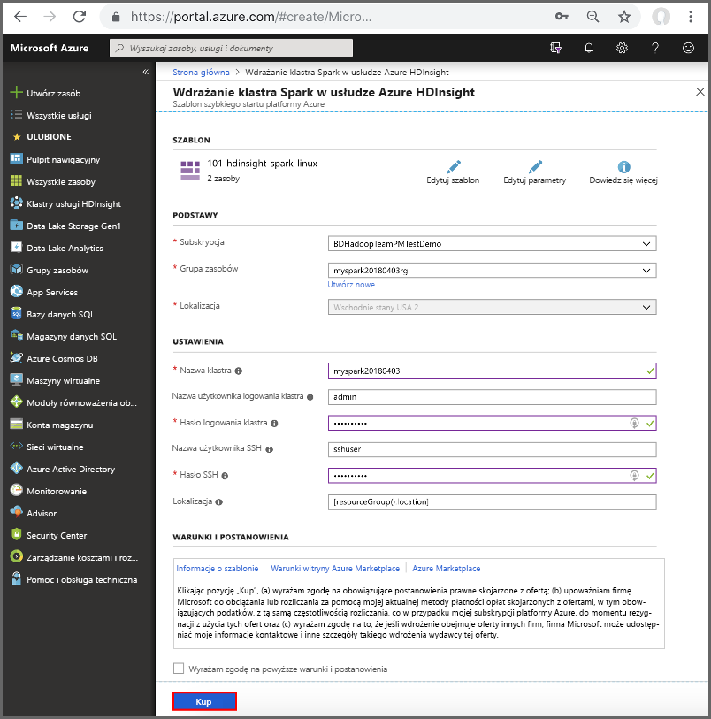

# <a name="quickstart-create-apache-spark-cluster-in-azure-hdinsight-using-resource-manager-template"></a>Szybki Start: Tworzenie klastra Apache Spark w usłudze Azure HDInsight przy użyciu szablonu Menedżer zasobów

W tym przewodniku szybki start utworzysz Klaster Apache Spark w usłudze Azure HDInsight przy użyciu szablonu Azure Resource Manager. Następnie utworzysz Notes Jupyter i użyjesz go do uruchamiania zapytań Spark SQL w odniesieniu do tabel Apache Hive. Azure HDInsight jest zarządzaną usługą analityczną typu „open source” o szerokim zakresie, z przeznaczeniem dla przedsiębiorstw. Platforma Apache Spark dla usługi HDInsight umożliwia szybkie analizowanie danych i przetwarzanie klastrów przy użyciu przetwarzania w pamięci. Notes Jupyter umożliwia korzystanie z danych, łączenie kodu z tekstem z promocji i przeprowadzeniem prostych wizualizacji.

[Przegląd: Apache Spark w usłudze Azure HDInsight](apache-spark-overview.md) | [Apache Spark](https://spark.apache.org/) | [Apache Hive](https://hive.apache.org/) | [Jupyter Notebook](https://jupyter.org/) | [szablonów szybkiego startu platformy Azure](https://azure.microsoft.com/resources/templates/?resourceType=Microsoft.Hdinsight&pageNumber=1&sort=Popular)

Jeśli nie masz subskrypcji platformy Azure, przed rozpoczęciem utwórz [bezpłatne konto](https://azure.microsoft.com/free/?WT.mc_id=A261C142F).

## <a name="create-an-apache-spark-cluster"></a>Tworzenie klastra platformy Apache Spark

Utwórz klaster Apache Spark w usłudze HDInsight przy użyciu szablonu Azure Resource Manager. Szablon można znaleźć w usłudze [GitHub](https://azure.microsoft.com/resources/templates/101-hdinsight-spark-linux/). Aby zapoznać się ze składnią języka JSON i właściwościami klastra, zobacz [Microsoft.HDInsight/clusters](/azure/templates/microsoft.hdinsight/clusters).

Klaster używa usług Azure Storage Blob jako magazynu klastra. Aby uzyskać więcej informacji na temat korzystania z usługi Data Lake Storage 2. generacji, zobacz [Szybki start: konfigurowanie klastrów w usłudze HDInsight](../../storage/data-lake-storage/quickstart-create-connect-hdi-cluster.md).

> [!IMPORTANT]  
> Opłaty za klastry usługi HDInsight są naliczane proporcjonalnie za minutę, niezależnie od ich użycia. Pamiętaj o usunięciu klastra po zakończeniu korzystania z niego. Aby uzyskać więcej informacji, zobacz sekcję [Czyszczenie zasobów](#clean-up-resources) w tym artykule.

1. Wybierz następujący link, aby otworzyć szablon w witrynie Azure Portal na nowej karcie przeglądarki:

    <a href="https://portal.azure.com/#create/Microsoft.Template/uri/https%3A%2F%2Fraw.githubusercontent.com%2FAzure%2Fazure-quickstart-templates%2Fmaster%2F101-hdinsight-spark-linux%2Fazuredeploy.json" target="_blank">Wdrażanie na platformie Azure</a>

2. Wprowadź następujące wartości:

    | Właściwość | Wartość |
    |---|---|
    |Subskrypcja|Wybierz subskrypcję platformy Azure, za pomocą której utworzono ten klaster. |
    | Grupa zasobów|Utwórz grupę zasobów lub wybierz istniejącą grupę. Grupa zasobów służy do zarządzania zasobami platformy Azure na potrzeby projektów. Nową nazwą grupy zasobów używaną w tym przewodniku Szybki start jest **myspark20180403rg**.|
    | Lokalizacja|Wybierz lokalizację dla grupy zasobów. Szablon używa tej lokalizacji do tworzenia klastra i domyślnego magazynu klastra. Lokalizacja używana w tym przewodniku Szybki start to **Wschodnie stany USA 2**.|
    | NazwaKlastra|Wprowadź nazwę klastra, który chcesz utworzyć. Nazwą nowego klastra używaną w tym przewodniku Szybki start jest **myspark20180403**.|
    | Nazwa logowania i hasło klastra|Domyślna nazwa logowania to admin. Wybierz hasło dla logowania do klastra. Nazwą logowania używaną w tym przewodniku Szybki start jest **admin**.|
    | Nazwa użytkownika i hasło SSH|Wybierz hasło dla użytkownika SSH. Nazwą użytkownika protokołu SSH używaną w tym przewodniku Szybki start jest **sshuser**.|

    

3. Zaznacz pozycję **Wyrażam zgodę na powyższe warunki i postanowienia**, a następnie kliknij przycisk **Kup**. Zostanie wyświetlony nowy kafelek zatytułowany **Wdrażanie szablonu wdrożenia**. Utworzenie klastra trwa około 20 minut. Przed przejściem do następnej sesji należy utworzyć klaster.

Jeśli wystąpi problem z tworzeniem klastrów usługi HDInsight, może to oznaczać, że nie masz odpowiednich uprawnień, aby to zrobić. Aby uzyskać więcej informacji, zobacz [Wymagania dotyczące kontroli dostępu](../hdinsight-hadoop-customize-cluster-linux.md#access-control).

## <a name="install-intellijeclipse-for-spark-applications"></a>Zainstaluj IntelliJ/zaćmienie dla aplikacji platformy Spark

Wtyczka Azure Toolkit for IntelliJ/zaćmienie umożliwia tworzenie aplikacji platformy Spark utworzonych w [Scala](https://www.scala-lang.org/), a następnie przesyłanie ich do klastra usługi Azure HDInsight bezpośrednio z poziomu zintegrowanego środowiska projektowego IntelliJ/zaćmienie (IDE). Aby uzyskać więcej informacji, zobacz tematy [Use IntelliJ to author/submit Spark application](./apache-spark-intellij-tool-plugin.md) (Używanie środowiska IntelliJ do tworzenia/przesyłania aplikacji Spark) i [Use Eclipse to author/submit Spark application](./apache-spark-eclipse-tool-plugin.md) (Używanie środowiska Eclipse do tworzenia/przesyłania aplikacji Spark).

## <a name="install-vscode-for-pysparkhive-applications"></a>Instalowanie programu vscode dla aplikacji PySpark/Hive

Dowiedz się, jak za pomocą zestawu narzędzi Azure HDInsight Tools for Visual Studio Code (VSCode) tworzyć i przesyłać zadania wsadowe programu Hive, interaktywne zapytania programu Hive, partię PySpark oraz skrypty interaktywne PySpark. Zestaw narzędzi Azure HDInsight Tools można zainstalować na platformach obsługiwanych przez program VSCode. Są to systemy Windows, Linux i macOS. Aby uzyskać więcej informacji, zobacz temat [Use VSCode to author/submit PySpark application](../hdinsight-for-vscode.md) (Używanie programu VSCode do tworzenia/przesyłania aplikacji PySpark).

## <a name="create-a-jupyter-notebook"></a>Tworzenie notesu Jupyter

[Jupyter Notebook](https://jupyter.org/) to interakcyjne środowisko notesu, które obsługuje różne języki programowania. Notes pozwala na posługiwanie się danymi, łączenie kodu z tekstem z promocji i wykonywanie prostych wizualizacji.

1. Otwórz [portal Azure](https://portal.azure.com).

2. Wybierz pozycję **Klastry usługi HDInsight**, a następnie wybierz utworzony klaster.

    

3. W portalu w sekcji **pulpity nawigacyjne klastra** wybierz pozycję **Jupyter Notebook**. Jeśli zostanie wyświetlony monit, wprowadź poświadczenia logowania dla klastra.

   

4. Aby utworzyć notes, wybierz pozycję **Nowy** > **PySpark**.

   

   Zostanie utworzony i otwarty nowy notes o nazwie Untitled (Untitled.pynb).

## <a name="run-apache-spark-sql-statements"></a>Uruchamianie Apache Spark instrukcji SQL

SQL (Structured Query Language) to najczęściej używany język służący do przekształcania danych i wykonywania zapytań na tych danych. Rozwiązanie Spark SQL stanowi rozszerzenie platformy Apache Spark służące do przetwarzania danych strukturalnych za pomocą dobrze znanej składni języka SQL.

1. Sprawdź, czy jądro jest gotowe. Gotowość jądra jest sygnalizowana pustym okręgiem obok nazwy jądra w notesie. Pełne kółko oznacza, że jądro jest zajęte.

    

    Podczas pierwszego uruchamiania notesu jądro wykonuje pewne zadania w tle. Poczekaj, aż jądro będzie gotowe.

1. Wklej następujący kod do pustej komórki, a następnie naciśnij klawisze **SHIFT + ENTER**, aby go uruchomić. Polecenie wyświetla listę tabel Hive w klastrze:

    ```sql
    %%sql
    SHOW TABLES
    ```

    Gdy używasz Jupyter Notebook z klastrem usługi HDInsight, uzyskasz wstępnie ustawioną sesję `spark`, której można użyć do uruchamiania zapytań Hive przy użyciu platformy Spark SQL. Wyrażenie `%%sql` informuje aplikację Jupyter Notebook o konieczności użycia sesji wstępnej `spark` do uruchomienia zapytania programu Hive. Zapytanie pobiera pierwszych 10 wierszy z tabeli programu Hive (**hivesampletable**), która jest dostępna domyślnie na wszystkich klastrach usługi HDInsight. Podczas pierwszego przesyłania zapytania Jupyter utworzy aplikację Spark dla notesu. Utworzenie jej zajmuje około 30 sekund. Gdy aplikacja platformy Spark będzie gotowa, zapytanie jest wykonywane w około sekundzie i tworzy wyniki. Dane wyjściowe wyglądają następująco:

    

    Podczas każdego uruchomienia zapytania w programie Jupyter w tytule okna przeglądarki internetowej wyświetlany jest stan **(Busy)** (Zajęty) wraz z tytułem notesu. Widoczne jest także pełne kółko obok tekstu **PySpark** w prawym górnym rogu.

1. Uruchom inne zapytanie, aby wyświetlić dane z tabeli `hivesampletable`.

    ```sql
    %%sql
    SELECT * FROM hivesampletable LIMIT 10
    ```

    Ekran zostanie odświeżony w celu wyświetlenia wyników zapytania.

    

1. W menu **File** (Plik) w notesie wybierz pozycję **Close and Halt** (Zamknij i zatrzymaj). Zamykanie notesu zwalnia zasoby klastra, w tym aplikacje Spark.

## <a name="clean-up-resources"></a>Oczyszczanie zasobów

Usługa HDInsight zapisuje dane i notesy Jupyter w usłudze Azure Storage lub Azure Data Lake Storage, dzięki czemu można bezpiecznie usunąć klaster, gdy nie jest używany. Opłata jest naliczana również za klaster usługi HDInsight, nawet wtedy, gdy nie jest używana. Ze względu na to, że opłaty za klaster są dużo razy większe niż opłaty za magazyn, sprawia to, że należy usunąć klastry, gdy nie są używane. Jeśli planujesz natychmiastowe rozpoczęcie pracy z samouczkiem z listy [Następne kroki](#next-steps), warto zachować klaster.

Przejdź z powrotem do witryny Azure Portal, a następnie wybierz pozycję **Usuń**.


Dodatkowo możesz wybrać nazwę grupy zasobów, aby otworzyć stronę grupy zasobów, a następnie wybrać pozycję **Usuń grupę zasobów**. Usuwając grupę zasobów, należy usunąć zarówno klaster usługi HDInsight, jak i domyślne konto magazynu.

## <a name="next-steps"></a>Następne kroki

W tym przewodniku szybki start przedstawiono sposób tworzenia klastra Apache Spark w usłudze HDInsight i uruchamiania podstawowego zapytania Spark SQL. Przejdź do następnego samouczka, aby dowiedzieć się, jak uruchamiać interakcyjne zapytania dotyczące przykładowych danych za pomocą klastra usługi HDInsight.

> [!div class="nextstepaction"]
> [Uruchamianie interakcyjnych zapytań na platformie Apache Spark](./apache-spark-load-data-run-query.md)
