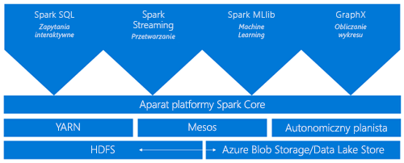
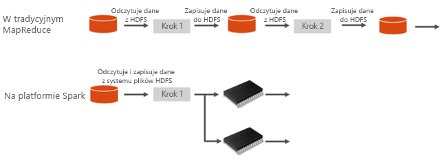
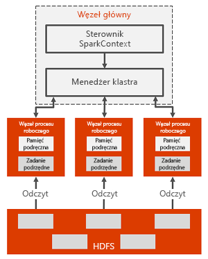

# Co to jest platforma Apache Spark w usłudze Azure HDInsight

Apache Spark jest platformą przetwarzania równoległego, która obsługuje przetwarzanie w pamięci w celu zwiększania wydajności aplikacji do analizy danych big data. Platforma Apache Spark w usłudze Azure HDInsight to implementacja firmy Microsoft usługi Apache Spark w chmurze. Usługa HDInsight ułatwia tworzenie i konfigurowanie klastra Spark na platformie Azure. Klastry Spark w usłudze HDInsight są zgodne z usługą Azure Storage i usługą Azure Data Lake Storage. Pozwala to wykorzystywać klastry HDInsight Spark do przetwarzania danych przechowywanych na platformie Azure. Aby uzyskać informacje na temat wersji i składników, zobacz [Wersje i składniki usługi Apache Hadoop w usłudze Azure HDInsight](../hdinsight-component-versioning.md).

## Co to jest platforma Apache Spark?

Platforma Spark udostępnia typom pierwotnym możliwość używania klastrów obliczeniowych korzystających z funkcji przetwarzania w pamięci. Zadanie platformy Spark może ładować dane do pamięci, buforować je i wielokrotnie przesyłać do nich zapytania. Przetwarzanie w pamięci jest znacznie szybsze niż w przypadku aplikacji opartych na operacjach dyskowych, takich jak usługa Hadoop, która udostępnia dane za pomocą rozproszonego systemu plików usługi Hadoop (HDFS). Platforma Spark obsługuje również integrację z językiem programowania Scala, co pozwala manipulować rozproszonymi zestawami danych jak kolekcjami lokalnymi. Nie ma potrzeby, aby wszystkie elementy były obejmowane strukturami operacji mapowania i redukcji.

Klastry Spark w usłudze HDInsight oferują w pełni zarządzaną usługę Spark. Poniżej przedstawiono korzyści związane z utworzeniem klastra Spark w usłudze HDInsight.

| Cecha | Opis |
| --- | --- |
| Łatwość tworzenia |Nowy klaster Spark w usłudze HDInsight można utworzyć w kilka minut przy użyciu witryny Azure Portal, programu Azure PowerShell lub zestawu .NET SDK usługi HDInsight. Zobacz [Wprowadzenie do klastra Apache Spark w usłudze HDInsight](apache-spark-jupyter-spark-sql-use-portal.md). |
| Łatwość obsługi |Klaster Spark w usłudze HDInsight zawiera notesy Jupyter i Apache Zeppelin. Można ich używać do interakcyjnego przetwarzania danych i wizualizacji.|
| Interfejsy API REST |Klastry Spark w usłudze HDInsight obejmują [Apache Livy](https://github.com/cloudera/hue/tree/master/apps/spark/java#welcome-to-livy-the-rest-spark-server), czyli serwer zadań Spark oparty na interfejsie API REST do zdalnego przesyłania i monitorowania zadań. Zobacz [Przesyłanie zadań zdalnych do klastra usługi HDInsight Spark przy użyciu interfejsu API REST platformy Apache Spark](apache-spark-livy-rest-interface.md).|
| Obsługa usługi Azure Data Lake Storage | Klastry Spark w usłudze HDInsight mogą korzystać z usługi Azure Data Lake Storage zarówno w formie magazynu podstawowego, jak i dodatkowego. Aby uzyskać więcej informacji o usłudze Data Lake Storage, zobacz temat [Przegląd usługi Azure Data Lake Storage](../../data-lake-store/data-lake-store-overview.md). |
| Integracja z usługami Azure |Klaster Spark w usłudze HDInsight zawiera łącznik usługi Azure Event Hubs. Aplikacje do przesyłania strumieniowego można tworzyć nie tylko za pomocą oprogramowania [Apache Kafka](https://kafka.apache.org/), które jest już dostępne w ramach platformy Spark, ale także przy użyciu usługi Event Hubs. |
| Obsługa narzędzia ML Server | Narzędzie ML Server jest obsługiwane w usłudze HDInsight przy użyciu typu klastra **Usługi ML**. Możesz skonfigurować klaster usług ML, aby uruchamiać rozproszone obliczenia R z szybkością zapewnianą przez klaster Spark. Aby uzyskać więcej informacji, zobacz temat [Wprowadzenie do narzędzia ML Server w usłudze HDInsight](../r-server/r-server-get-started.md). |
| Integracja ze zintegrowanymi środowiskami projektowymi innych firm | Usługa HDInsight zapewnia kilka wtyczek IDE, które są przydatne do tworzenia i przesyłania aplikacji do klastra Spark w usłudze HDInsight. Aby uzyskać więcej informacji, zobacz [Korzystanie z zestawu narzędzi Azure Toolkit for IntelliJ IDEA](apache-spark-intellij-tool-plugin.md), [Korzystanie z narzędzi usługi HDInsight dla programu VSCode](../hdinsight-for-vscode.md) i [Korzystanie z zestawu narzędzi Azure Toolkit for Eclipse](apache-spark-eclipse-tool-plugin.md).|
| Zapytania jednoczesne |Klastry Spark w usłudze HDInsight obsługują zapytania jednoczesne. Dzięki temu wiele zapytań od jednego użytkownika lub wiele zapytań od różnych użytkowników i aplikacji może współdzielić te same zasoby klastra. |
| Buforowanie na dyskach SSD |Istnieje możliwość buforowania danych w pamięci lub na dyskach SSD podłączonych do węzłów klastra. Buforowanie w pamięci zapewnia najlepszą wydajność zapytań, ale może być kosztowne. Buforowanie na dyskach SSD stanowi doskonałe rozwiązanie umożliwiające poprawę wydajności zapytań bez konieczności tworzenia klastra o rozmiarze obejmującym cały zestaw danych w pamięci. |
| Integracja z narzędziami do analizy biznesowej |Klastry Spark w usłudze HDInsight zawierają łączniki dla narzędzi do analizy biznesowej danych, takich jak [Power BI](https://www.powerbi.com/). |
| Wstępnie załadowane biblioteki Anaconda |Klastry Spark w usłudze HDInsight są dostarczane z wstępnie zainstalowanymi bibliotekami Anaconda. Platforma [Anaconda](https://docs.continuum.io/anaconda/) dostarcza prawie 200 bibliotek do uczenia maszynowego, analizy danych, wizualizacji itp. |
| Skalowalność | Usługa HDInsight umożliwia zmianę liczby węzłów klastra. Ponadto klastry Spark można porzucić bez utraty danych, ponieważ wszystkie dane są przechowywane w usłudze Azure Storage lub Data Lake Storage. |
| Umowa SLA |Oferta klastrów Spark w usłudze HDInsight obejmuje całodobową pomoc techniczną oraz umowę SLA gwarantującą 99,9% czasu działania. |

Klastry Apache Spark w usłudze HDInsight obejmują następujące składniki, które są domyślnie dostępne w klastrach.

* [Spark Core](https://spark.apache.org/docs/latest/). Obejmuje takie składniki, jak Spark Core, Spark SQL, interfejsy API przesyłania strumieniowego Spark, GraphX oraz MLlib.
* [Anaconda](https://docs.continuum.io/anaconda/)
* [Apache Livy](https://github.com/cloudera/hue/tree/master/apps/spark/java#welcome-to-livy-the-rest-spark-server)
* [Notes Jupyter](https://jupyter.org)
* [Notes Apache Zeppelin](http://zeppelin-project.org/)

Klastry Spark w usłudze HDInsight obejmują też [sterownik ODBC](https://go.microsoft.com/fwlink/?LinkId=616229) zapewniający łączność z klastrami Spark w usłudze HDInsight z poziomu narzędzi do analizy biznesowej, takich jak Microsoft Power BI.

## Architektura klastra Spark

Składniki platformy Spark najłatwiej zrozumieć, zapoznając się za sposobem działania platformy Spark w klastrach usługi HDInsight.

Aplikacje Spark są uruchamiane jako niezależne zestawy procesów w klastrze, koordynowane przez obiekt SparkContext w programie głównym (nazywanym programem sterującym).

Obiekt SparkContext może łączyć się z kilkoma typami menedżerów klastrów, które dokonują alokacji zasobów pomiędzy aplikacje. Te menedżery klastrów to [Apache Mesos](https://mesos.apache.org/), [Apache Hadoop YARN](https://hadoop.apache.org/docs/current/hadoop-yarn/hadoop-yarn-site/YARN.html) lub menedżer klastra Spark. W usłudze HDInsight platforma Spark korzysta z menedżera klastra YARN. Po nawiązaniu połączenia platforma Spark uzyskuje funkcje wykonawcze w węzłach procesu roboczego w klastrze, które są procesami odpowiedzialnymi za uruchamianie obliczeń i przechowywanie danych aplikacji. Następnie platforma Spark wysyła kod aplikacji (zdefiniowany przez pliki JAR lub Python przekazywane do obiektu SparkContext) do funkcji wykonawczych. Na koniec obiekt SparkContext wysyła do funkcji wykonawczych zadania do uruchomienia.

Obiekt SparkContext obsługuje funkcję main użytkownika i wykonuje różne operacje równoległe w węzłach procesu roboczego. Następnie pobiera wyniki operacji. Węzły procesu roboczego odczytują i zapisują dane, korzystając z rozproszonego systemu plików usługi Hadoop. Węzły procesu roboczego przesyłają również przekształcone dane do pamięci podręcznej w postaci odpornych rozproszonych zestawów danych (Resilient Distributed Datasets, RDDs).

Obiekt SparkContext łączy się z usługą nadrzędną platformy Spark i konwertuje aplikację na graf skierowany (DAG) zawierający poszczególne zadania, które są uruchamiane w procesie wykonawczym w węzłach procesu roboczego. Poszczególne aplikacje uzyskują własne procesy wykonawcze, które istnieją przez cały czas działania aplikacji i pozwalają uruchamiać zadania w wielu wątkach.

## Przypadki zastosowań platformy Spark w usłudze HDInsight

Klastry Spark w usłudze HDInsight umożliwiają realizację następujących głównych scenariuszy:

- Interakcyjna analiza danych i analiza biznesowa

    Klaster Apache Spark w usłudze HDInsight przechowuje dane w usłudze Azure Storage lub Azure Data Lake Storage. Eksperci biznesowi i osoby podejmujące kluczowe decyzje mogą analizować i tworzyć raporty na podstawie danych oraz korzystać z usługi Microsoft Power BI w celu sporządzania interakcyjnych raportów na podstawie analizowanych danych. Analitycy mogą rozpocząć pracę od danych o częściowej strukturze lub bez struktury w magazynie klastra, zdefiniować schemat danych za pomocą notesów, a następnie skompilować modele danych przy użyciu usługi Microsoft Power BI. Klastry Spark w usłudze HDInsight obsługują również wiele narzędzi do analizy biznesowej innych firm, takich jak Tableau, dzięki czemu platforma Spark ułatwia pracę analityków danych, ekspertów biznesowych i osób podejmujących kluczowe decyzje.

    [Samouczek: wizualizowanie danych platformy Spark przy użyciu usługi Power BI](apache-spark-use-bi-tools.md)
- Spark Machine Learning

    Platforma Apache Spark jest dostarczana z biblioteką [MLlib](https://spark.apache.org/mllib/) do uczenia maszynowego opartą na platformie Spark, której można używać z klastra Spark w usłudze HDInsight. Klaster Spark w usłudze HDInsight obejmuje również platformę Anaconda — dystrybucję oprogramowania Python z szeregiem różnych pakietów do uczenia maszynowego. W połączeniu z wbudowaną obsługą notesów Jupyter i Zeppelin platforma zapewnia środowisko do tworzenia aplikacji do uczenia maszynowego.

    [Samouczek: przewidywanie temperatur w budynkach z użyciem danych HVAC](apache-spark-ipython-notebook-machine-learning.md)  
    [Samouczek: przewidywanie wyników inspekcji żywności](apache-spark-machine-learning-mllib-ipython.md)    
- Przesyłanie strumieniowe i analiza danych w czasie rzeczywistym na platformie Spark

    Klastry Spark w usłudze HDInsight zapewniają szeroką obsługę tworzenia rozwiązań do analizy w czasie rzeczywistym. Platforma Spark jest już wyposażona w łączniki do przyjmowania danych z wielu źródeł, takich jak Kafka, Flume, Twitter, ZeroMQ lub gniazda TCP, a ponadto platforma Spark w usłudze HDInsight oferuje wysokiej klasy obsługę pobierania danych z usługi Azure Event Hubs. Event Hubs to najczęściej używana usługa kolejkowania na platformie Azure. Wbudowana obsługa usługi Event Hubs sprawia, że klastry Spark w usłudze HDInsight stanowią idealną platformę do tworzenia potoku analizy w czasie rzeczywistym.

## Od czego zacząć?

Aby dowiedzieć się więcej na temat platformy Apache Spark w usłudze HDInsight, możesz zapoznać się z następującymi artykułami:

- [Szybki start: Tworzenie klastra Apache Spark w usłudze HDInsight i uruchamianie interakcyjnych zapytań przy użyciu oprogramowania Jupyter](./apache-spark-jupyter-spark-sql-use-portal.md)
- [Samouczek: Uruchamianie zadania platformy Apache Spark przy użyciu oprogramowania Jupyter](./apache-spark-load-data-run-query.md)
- [Samouczek: Analizowanie danych przy użyciu narzędzi do analizy biznesowej](./apache-spark-use-bi-tools.md)
- [Samouczek: Uczenie maszynowe przy użyciu platformy Apache Spark](./apache-spark-ipython-notebook-machine-learning.md)
- [Samouczek: Tworzenie aplikacji Scala Maven w środowisku IntelliJ](./apache-spark-create-standalone-application.md)

## Następne kroki

W tym omówieniu uzyskasz podstawową wiedzę na temat platformy Apache Spark w usłudze Azure HDInsight. Przejdź do następnego artykułu, aby dowiedzieć się, jak utworzyć klaster HDInsight Spark i uruchamiać niektóre zapytania Spark SQL:

- [Tworzenie klastra platformy Apache Spark w usłudze HDInsight](./apache-spark-jupyter-spark-sql-use-portal.md)
