# Szybki start: testowanie rozwiązania opartego na chmurze do zarządzania przemysłowymi urządzeniami IoT

Ten przewodnik Szybki start przedstawia sposób wdrażania akceleratora rozwiązań usługi Azure IoT połączonej fabryki w celu uruchomienia opartej na chmurze symulacji monitorowania przemysłowych urządzeń IoT i zarządzania nimi. Podczas wdrażania akceleratora rozwiązań połączonej fabryki jest on wstępnie wypełniany symulowanymi zasobami, które umożliwiają wykonanie kroków opisanych w typowym przemysłowym scenariuszu IoT. Z rozwiązaniem jest połączonych kilka symulowanych fabryk, które raportują wartości danych potrzebne do obliczenia ogólnej wydajności sprzętu (OEE, Overall Equipment Efficiency) oraz kluczowych wskaźników wydajności (KPI, Key Performance Indicator). Ten przewodnik Szybki start pokazuje, jak wykonywać następujące zadania za pomocą pulpitu nawigacyjnego rozwiązania:

* Monitorowanie fabryki, linii produkcyjnych, ogólnej wydajności sprzętu stacji i wartości kluczowych wskaźników wydajności.
* Analizowanie danych telemetrycznych generowanych przez te urządzenia.
* Reagowanie na alarmy.

Do wykonania kroków tego przewodnika Szybki start jest potrzebna aktywna subskrypcja platformy Azure.

Jeśli nie masz subskrypcji platformy Azure, przed rozpoczęciem utwórz [bezpłatne konto](https://azure.microsoft.com/free/?WT.mc_id=A261C142F).

## Wdrażanie rozwiązania

W przypadku wdrażania akceleratora rozwiązań w ramach subskrypcji platformy Azure musisz ustawić niektóre opcje konfiguracji.

Przejdź do witryny [Akceleratory rozwiązań IoT platformy Microsoft Azure](https://www.azureiotsolutions.com) i zaloguj się przy użyciu poświadczeń konta platformy Azure.

Kliknij kafelek **Połączona fabryka**. Na stronie **Połączona fabryka** kliknij pozycję **Wypróbuj teraz**:

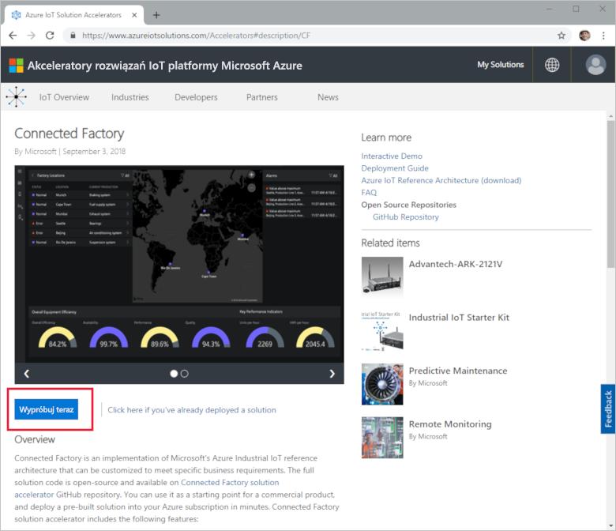

Na stronie **Tworzenie rozwiązania połączonej fabryki** w polu **Nazwa rozwiązania** wpisz unikatową nazwę dla swojego akceleratora rozwiązań połączonej fabryki. Jest to nazwa grupy zasobów platformy Azure, która zawiera wszystkie zasoby akceleratora rozwiązań. W tym przewodniku Szybki start jest używana nazwa **MyDemoConnectedFactory**.

W polach **Subskrypcja** i **Region** wybierz wartości, których chcesz użyć do wdrożenia akceleratora rozwiązania. Zwykle jest wybierany region znajdujący się najbliżej. W tym przewodniku Szybki start używamy subskrypcji **Visual Studio Enterprise** i regionu **Wschodnie stany USA**. Musisz być [użytkownikiem lub administratorem globalnym](iot-accelerators-permissions.md) w ramach subskrypcji.

Kliknij pozycję **Utwórz**, aby rozpocząć wdrażanie. Ten proces trwa co najmniej pięć minut:

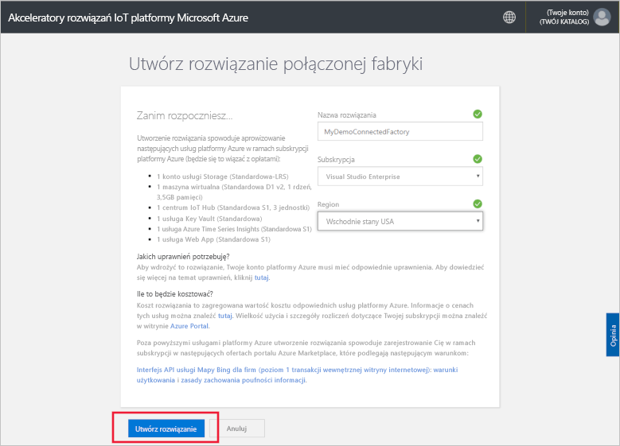

## Logowanie się do rozwiązania

Po zakończeniu wdrożenia w Twojej subskrypcji platformy Azure na kafelku rozwiązania zostanie wyświetlony zielony znacznik wyboru i tekst **Gotowe**. Teraz możesz zalogować się do pulpitu nawigacyjnego akceleratora rozwiązań połączonej fabryki.

Na stronie **Aprowizowane rozwiązania** kliknij nowy akcelerator rozwiązań połączonej fabryki:

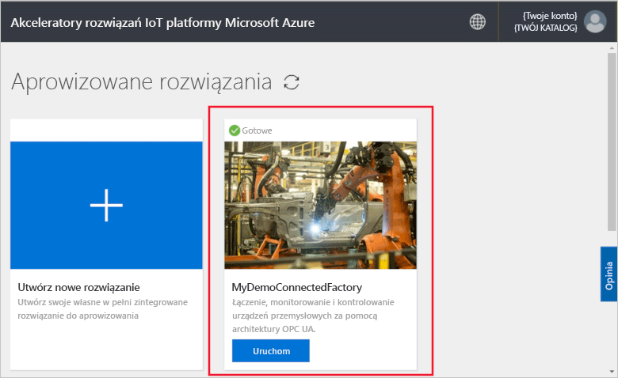

Na wyświetlonej stronie możesz przejrzeć informacje o akceleratorze rozwiązań połączonej fabryki. Wybierz pozycję **Przejdź do własnego akceleratora rozwiązań**, aby wyświetlić akcelerator rozwiązań połączonej fabryki:

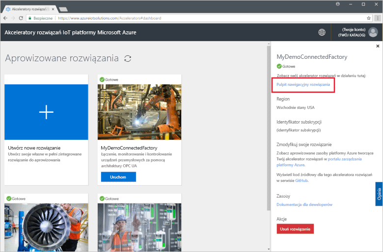

Kliknij pozycję **Zaakceptuj**, aby zaakceptować żądanie uprawnień. W przeglądarce zostanie wyświetlony pulpit nawigacyjny rozwiązania połączonej fabryki. Pokazuje on zestaw symulowanych fabryk, linii produkcyjnych i stacji.

## Wyświetlanie pulpitu nawigacyjnego

Widok domyślny to *pulpit nawigacyjny*. Korzystając z menu znajdującego się w lewej części strony, można przejść do innych obszarów portalu:

[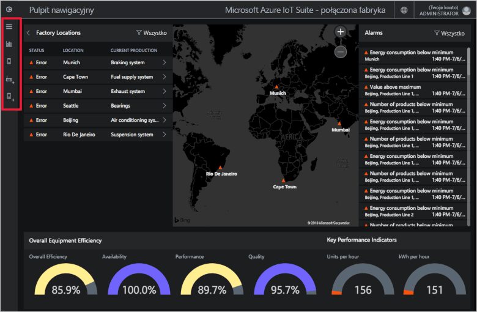](./media/quickstart-connected-factory-deploy/dashboard-expanded.png#lightbox)

Pulpit nawigacyjny umożliwia zarządzanie przemysłowymi urządzeniami IoT. Połączona fabryka używa hierarchii, aby pokazać globalną konfigurację fabryki. Najwyższym poziomem w hierarchii jest przedsiębiorstwo, który zawiera co najmniej jedną fabrykę. Każda fabryka zawiera linie produkcyjne, a każda linia produkcyjna składa się ze stacji. Na każdym poziomie można wyświetlać ogólną wydajność sprzętu oraz kluczowe wskaźniki wydajności, publikować nowe węzły na potrzeby telemetrii i reagować na alarmy.

Na pulpicie nawigacyjnym są widoczne następujące informacje:

## Ogólna wydajność sprzętu

Panel **Ogólna wydajność sprzętu** pokazuje wartości ogólnej wydajności sprzętu dla całego przedsiębiorstwa lub wyświetlanej fabryki/linii produkcyjnej/stacji. Ta wartość jest agregowana od widoku stacji do poziomu przedsiębiorstwa. Dane ogólnej wydajności sprzętu i jej składowe elementy można dokładniej analizować.

[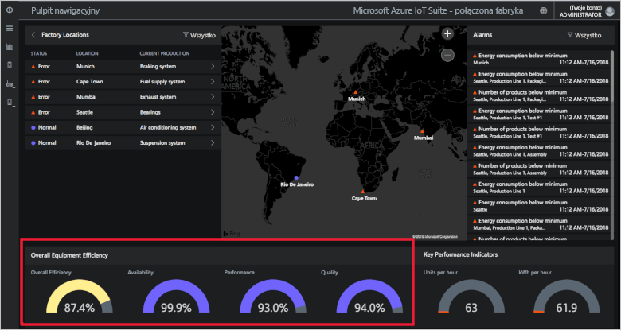](./media/quickstart-connected-factory-deploy/oee-expanded.png#lightbox)

Ogólna wydajność sprzętu pozwala ocenić wydajność procesu produkcyjnego przy użyciu parametrów operacyjnych powiązanych z produkcją. Ogólna wydajność sprzętu to standardowy pomiar branżowy obliczany przez pomnożenie współczynników dostępności, wydajności i jakości: OEE = dostępność x wydajność x jakość.

Ogólną wydajność sprzętu możesz dokładniej analizować na dowolnym poziomie w danych hierarchii. Kliknij wskaźnik procentowy ogólnej wydajności sprzętu, dostępności, wydajności lub jakości. Zostanie wyświetlony panel kontekstowy z wizualizacjami przedstawiającymi dane w różnych skalach czasu:

[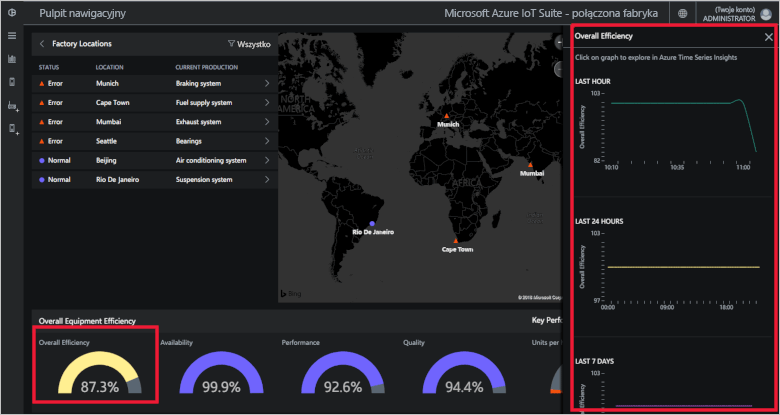](./media/quickstart-connected-factory-deploy/oeedetail-expanded.png#lightbox)

Kliknięcie wykresu umożliwia dalszą analizę danych.

### Kluczowe wskaźniki wydajności

Panel **Kluczowe wskaźniki wydajności** wyświetla liczbę wytworzonych produktów na godzinę i ilość energii (kWh) zużytej przez całe przedsiębiorstwo lub przeglądaną fabrykę/linię produkcyjną/stację. Te wartości są agregowane od widoku stacji do poziomu przedsiębiorstwa.

[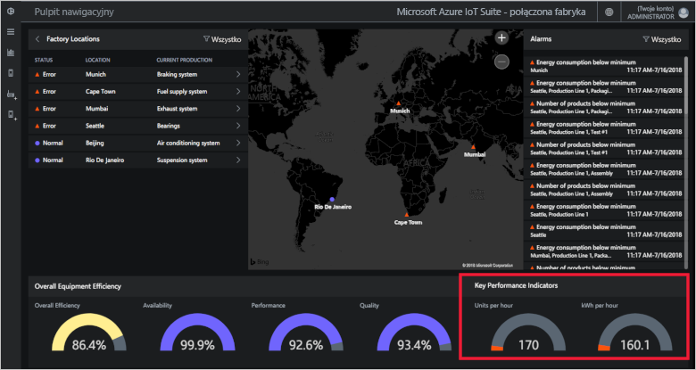](./media/quickstart-connected-factory-deploy/kpis-expanded.png#lightbox)

Kluczowe wskaźniki wydajności możesz dokładniej analizować na dowolnym poziomie w danych hierarchii. Kliknij wskaźnik procentowy ogólnej wydajności sprzętu, dostępności, wydajności lub jakości. Zostanie wyświetlony panel kontekstowy z wizualizacjami przedstawiającymi dane w różnych skalach czasu:

Kliknięcie wykresu umożliwia dalszą analizę danych.

### Lokalizacje fabryk

Panel **Lokalizacje fabryk**, który przedstawia stan, lokalizację i bieżącą konfigurację produkcji w rozwiązaniu. Przy pierwszym uruchomieniu akceleratora rozwiązań pulpit nawigacyjny przedstawia symulowany zestaw fabryk. Każda symulacja linii produkcyjnej składa się z trzech prawdziwych serwerów OPC UA, które uruchamiają symulowane zadania i udostępniają dane. Aby uzyskać więcej informacji na temat architektury OPC UA, zobacz [Połączona fabryka — często zadawane pytania](iot-accelerators-faq-cf.md):

[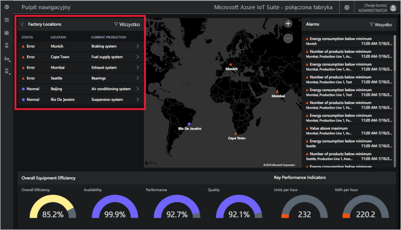](./media/quickstart-connected-factory-deploy/factorylocations-expanded.png#lightbox)

Po hierarchii rozwiązania można nawigować oraz wyświetlać wartości ogólnej wydajności sprzętu i kluczowych wskaźników wydajności na każdym poziomie:

1. Na panelu **Lokalizacje fabryk** kliknij pozycję **Mumbaj**. Zostaną wyświetlone linie produkcyjne w tej lokalizacji.

1. Kliknij pozycję **Linia produkcyjna 1**. Zostaną wyświetlone stacje na tej linii produkcyjnej.

1. Kliknij pozycję **Pakowanie**. Zostaną wyświetlone węzły OPC UA opublikowane przez tę stację.

1. Kliknij węzeł **EnergyConsumption**. Zostaną wyświetlone wykresy przedstawiające tę wartość w różnych skalach czasu. Kliknięcie wykresu umożliwia dalszą analizę danych.

[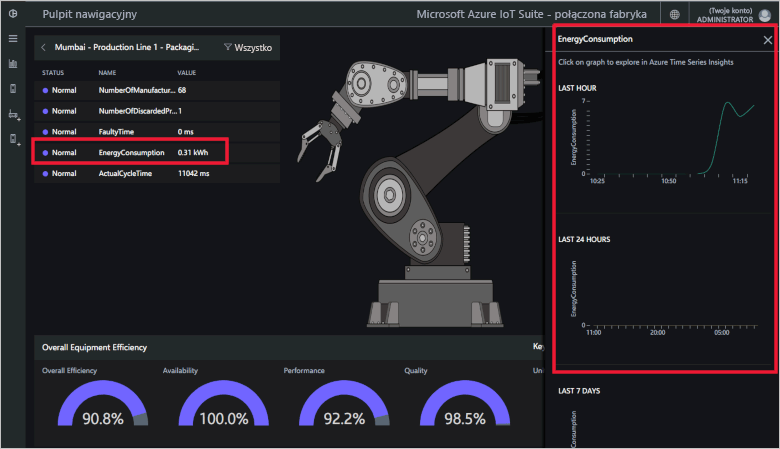](./media/quickstart-connected-factory-deploy/explorelocations-expanded.png#lightbox)

### Mapa

Jeśli Twoja subskrypcja ma dostęp do [interfejsu API usługi Mapy Bing](iot-accelerators-faq-cf.md), na mapie *Fabryki* są wyświetlane lokalizacje geograficzne i stan wszystkich fabryk w rozwiązaniu. Aby przejść do szczegółów lokalizacji, kliknij lokalizacje wyświetlane na mapie.

[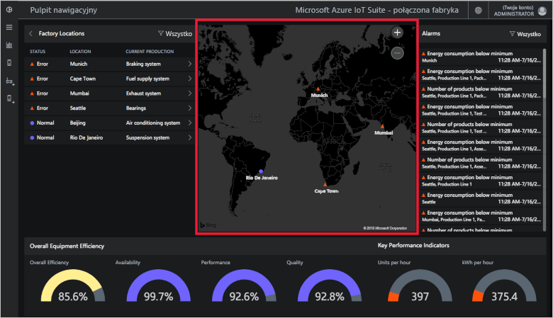](./media/quickstart-connected-factory-deploy/map-expanded.png#lightbox)

### Alarmy

Na panelu **Alarmy** są wyświetlane alarmy generowane wtedy, gdy zgłoszona wartość lub obliczona wartość ogólnej wydajności sprzętu bądź kluczowego wskaźnika wydajności przekroczy wartość progową. Na tym panelu pojawiają się alarmy dotyczące każdego poziomu hierarchii: od poziomu stacji do przedsiębiorstwa. Każdy alarm zawiera opis, datę, godzinę, lokalizację i liczbę wystąpień:

[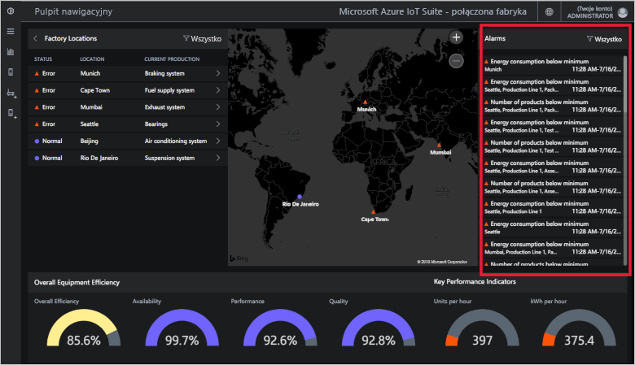](./media/quickstart-connected-factory-deploy/alarms-expanded.png#lightbox)

Dane, które spowodowały wystąpienie alarmu, można analizować z poziomu pulpitu nawigacyjnego. Jeśli jesteś administratorem, możesz wykonywać domyślne akcje związane z alarmami, takie jak:

* Zamknięcie alarmu.
* Potwierdzenie alarmu.

Kliknij jeden z alarmów, z listy rozwijanej **Wybierz akcję** wybierz pozycję **Potwierdź alert**, a następnie kliknij przycisk **Zastosuj**:

[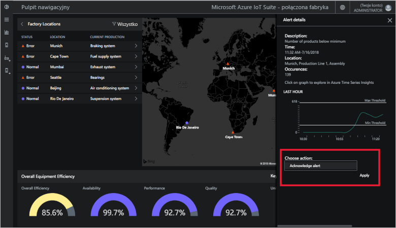](./media/quickstart-connected-factory-deploy/acknowledge-expanded.png#lightbox)

Aby dalej analizować dane alarmów, kliknij wykres na panelu alarmów.

Te alarmy są generowane na podstawie reguł określonych w pliku konfiguracyjnym w akceleratorze rozwiązania. Te reguły mogą generować alarmy, gdy wartości ogólnej wydajności sprzętu lub kluczowego wskaźnika wydajności bądź wartości węzła OPC UA Przejdź powyżej wartości progowej. Możesz ustawić wartość tego progu.

## Oczyszczanie zasobów

Jeśli planujesz dalsze działanie, akcelerator rozwiązań połączonej fabryki powinien pozostać wdrożony.

Jeśli akcelerator rozwiązań nie jest już potrzebny, usuń go na stronie [Aprowizowane rozwiązania](https://www.azureiotsolutions.com/Accelerators#dashboard), wybierając go, a następnie klikając przycisk **Usuń rozwiązanie**:

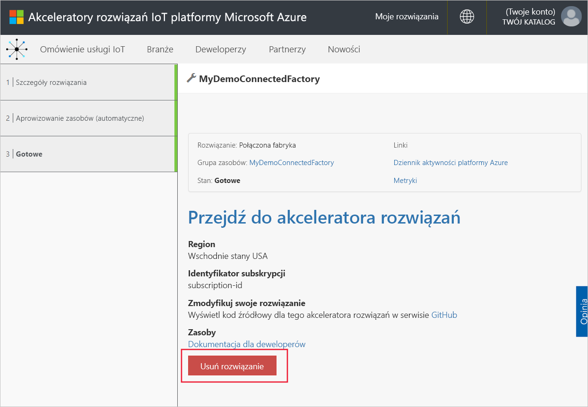

## Kolejne kroki

W tym przewodniku Szybki start wdrożono akcelerator rozwiązań połączonej fabryki oraz przedstawiono sposób nawigowania po fabrykach, liniach produkcyjnych i stacjach. Pokazano także sposób wyświetlania wartości ogólnej wydajności sprzętu i kluczowych wskaźników wydajności na dowolnym poziomie w hierarchii oraz sposób reagowania na alarmy.

Aby dowiedzieć się, jak używać innych funkcji pulpitu nawigacyjnego w celu zarządzania przemysłowymi urządzeniami IoT, przejdź do następującego przewodnika:

> [!div class="nextstepaction"]
> [Pulpit nawigacyjny połączonej fabryki](iot-accelerators-connected-factory-dashboard.md)