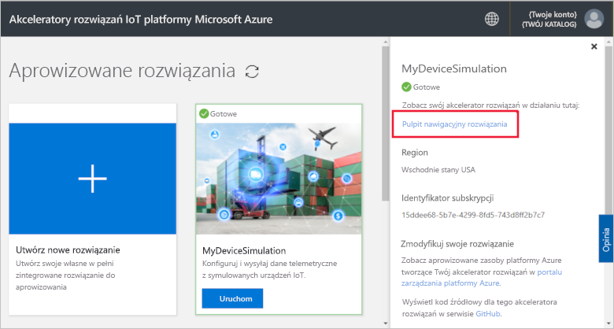
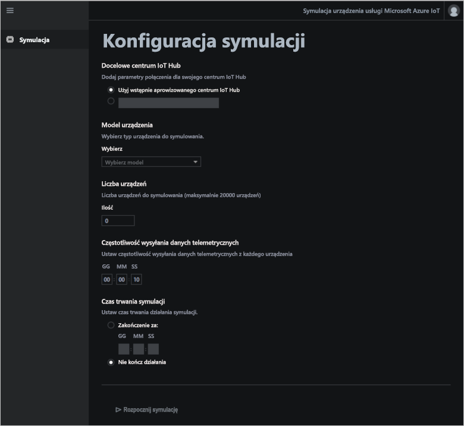
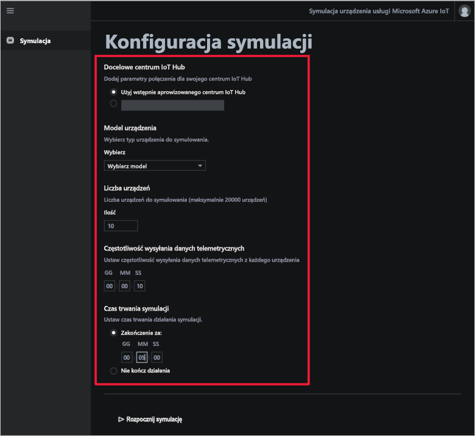
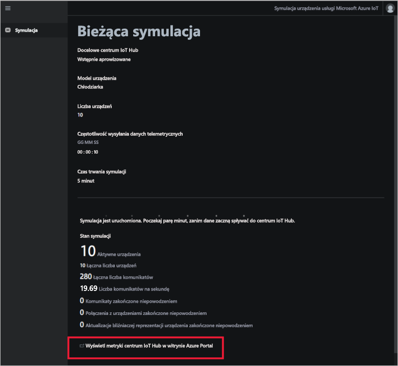

# Szybki start: wdrażanie i uruchamianie rozwiązania do symulacji urządzenia opartego na chmurze

W tym przewodniku Szybki start pokazano, w jaki sposób wdrożyć akcelerator rozwiązania do symulacji urządzenia usługi Azure IoT w celu przetestowania rozwiązania IoT. Po wdrożeniu akceleratora rozwiązania należy użyć strony **Symulacja**, aby utworzyć i uruchomić symulację.

## Wymagania wstępne

Do wykonania kroków tego przewodnika Szybki start jest potrzebna aktywna subskrypcja platformy Azure.

Jeśli nie masz subskrypcji platformy Azure, przed rozpoczęciem utwórz [bezpłatne konto](https://azure.microsoft.com/free/?WT.mc_id=A261C142F).

## Wdrażanie rozwiązania

W przypadku wdrażania akceleratora rozwiązania w ramach subskrypcji platformy Azure musisz ustawić niektóre opcje konfiguracji.

Zaloguj się do witryny [azureiotsolutions.com](https://www.azureiotsolutions.com/Accelerators) przy użyciu poświadczeń konta platformy Azure.

Kliknij przycisk **Wypróbuj teraz**  na kafelku **Symulacja urządzenia**.

Na stronie **Tworzenie rozwiązania Symulacja urządzenia** wpisz unikatową **nazwę rozwiązania**. Zanotuj nazwę rozwiązania — jest to nazwa grupy zasobów platformy Azure, która zawiera wszystkie zasoby rozwiązania.

W polach **Subskrypcja** i **Region** wybierz wartości, których chcesz użyć do wdrożenia akceleratora rozwiązania. Zwykle jest wybierany region znajdujący się najbliżej. Musisz być [użytkownikiem lub administratorem globalnym](iot-accelerators-permissions.md) w ramach subskrypcji.

Zaznacz pole, aby wdrożyć centrum IoT Hub, które będzie używane z rozwiązaniem do symulacji urządzeń. Zawsze możesz później zmienić centrum IoT Hub używane w symulacji.

Kliknij przycisk **Utwórz rozwiązanie**, aby rozpocząć aprowizację rozwiązania. Ten proces trwa co najmniej pięć minut:

## Logowanie się do rozwiązania

Po zakończeniu procesu aprowizacji możesz zalogować się na pulpicie nawigacyjnym akceleratora rozwiązania do symulacji urządzenia.

Na stronie **Aprowizowane rozwiązania** kliknij nowy akcelerator rozwiązania do symulacji urządzenia:

Możesz przejrzeć informacje o akceleratorze rozwiązania do symulacji urządzenia w wyświetlonym panelu. Wybierz pozycję **Pulpit nawigacyjny rozwiązania**, aby wyświetlić akcelerator rozwiązania do symulacji urządzenia:

Kliknij pozycję **Zaakceptuj**, aby zaakceptować żądanie uprawnień. W przeglądarce zostanie wyświetlony pulpit nawigacyjny rozwiązania do symulacji urządzenia:

[Pulpit nawigacyjny rozwiązania](./media/quickstart-device-simulation-deploy/solutiondashboard-expanded.png#lightbox)

## Konfigurowanie symulacji

Pulpit nawigacyjny umożliwia skonfigurowanie i uruchomienie symulacji. Użyj wartości z poniższej tabeli, aby skonfigurować symulację:

| Ustawienie             | Wartość                       |
| ------------------- | --------------------------- |
| Docelowa usługa IoT Hub      | Użyj dostarczonej wstępnie usługi IoT Hub |
| Model urządzenia        | Chiller                     |
| Liczba urządzeń   | 10                          |
| Częstotliwość telemetrii | 10 sekund                  |
| Czas trwania symulacji | 5 minut                   |

## Uruchamianie symulacji

Kliknij pozycję **Rozpocznij symulację**. Symulacja będzie działała przez wybrany czas. Możesz w dowolnym momencie zatrzymać symulację, klikając pozycję **Zatrzymaj symulację**. Symulacja przedstawia statystyki dotyczące bieżącego uruchomienia. Kliknij pozycję **Wyświetl metryki usługi IoT Hub w witrynie Azure Portal**, aby zapoznać się z metrykami zgłoszonymi przez centrum IoT Hub:

Możesz uruchomić tylko jedną symulację jednocześnie z jednego aprowizowanego wystąpienia akceleratora rozwiązania.

## Oczyszczanie zasobów

Jeśli planujesz dalsze działanie, akcelerator rozwiązania do symulacji urządzenia powinien pozostać wdrożony.

Jeśli akcelerator rozwiązania nie jest już potrzebny, usuń go na stronie [Aprowizowane rozwiązania](https://www.azureiotsolutions.com/Accelerators#dashboard):

## Następne kroki

W tym przewodniku Szybki start wdrożono akcelerator rozwiązania do symulacji urządzenia i uruchomiono symulację urządzenia IoT.

Aby dowiedzieć się, jak używać już istniejącego centrum IoT Hub w symulacji, zapoznaj się z instrukcjami:

> [!div class="nextstepaction"]
> [Use an existing IoT hub with the Device Simulation solution accelerator (Używanie istniejącego centrum IoT Hub z akceleratorem rozwiązania do symulacji urządzenia)](iot-accelerators-device-simulation-choose-hub.md)