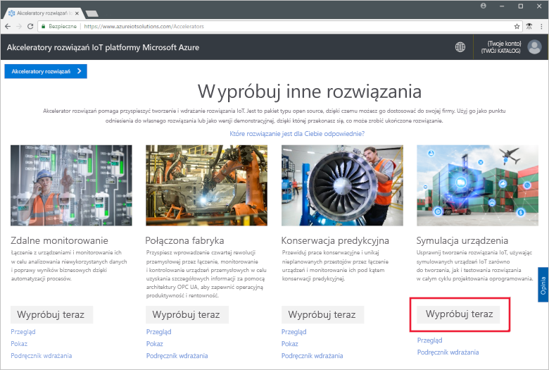
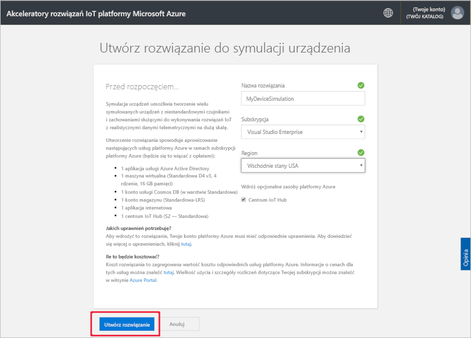
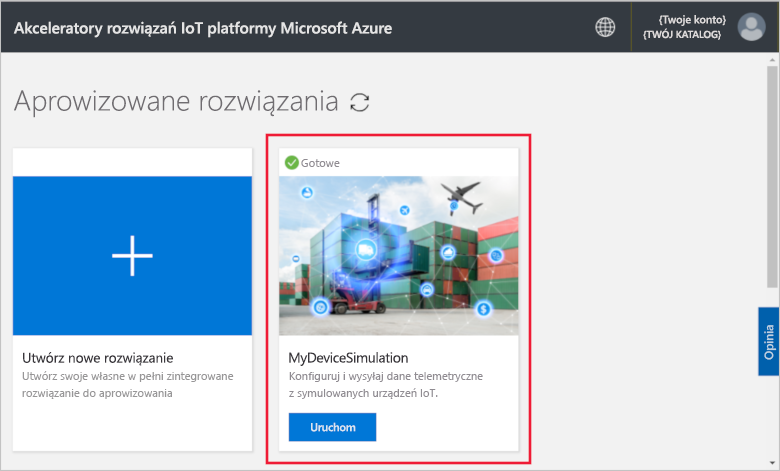
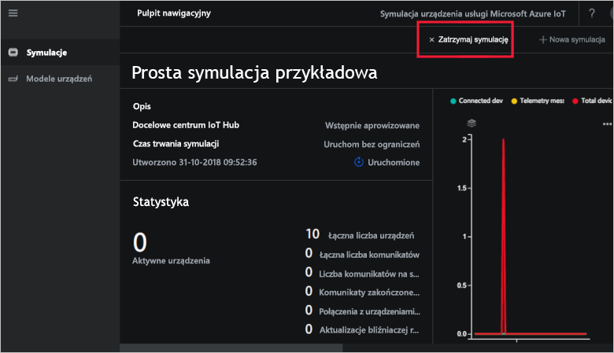
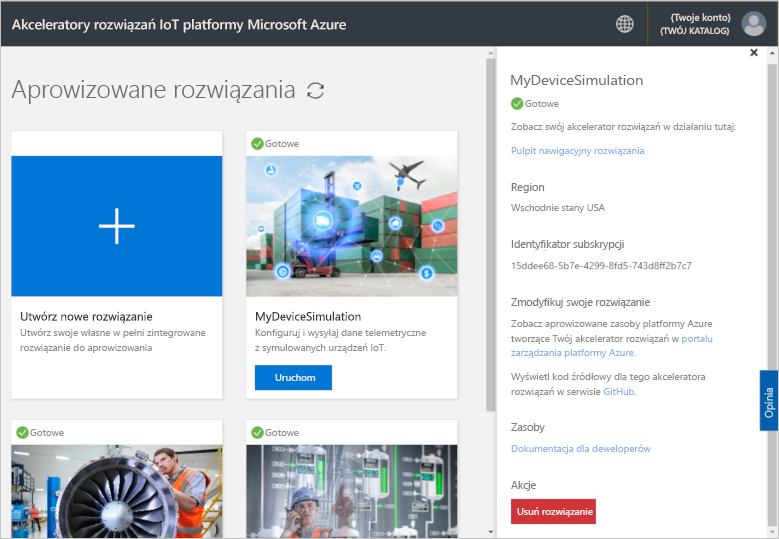

# Szybki start: wdrażanie i uruchamianie symulacji urządzenia usługi IoT na platformie Azure

W tym przewodniku Szybki start przedstawiono sposób wdrażania symulacji urządzenia usługi Azure IoT w celu przetestowania rozwiązania usługi IoT. Po wdrożeniu akceleratora rozwiązań możesz uruchomić przykładową symulację, aby rozpocząć pracę.

Do wykonania kroków tego przewodnika Szybki start jest potrzebna aktywna subskrypcja platformy Azure.

Jeśli nie masz subskrypcji platformy Azure, utwórz [bezpłatne konto](https://azure.microsoft.com/free/?WT.mc_id=A261C142F) przed rozpoczęciem.

## Wdrażanie symulacji urządzenia

W przypadku wdrażania symulacji urządzenia w ramach subskrypcji platformy Azure musisz ustawić niektóre opcje konfiguracji.

Zaloguj się do witryny [azureiotsolutions.com](https://www.azureiotsolutions.com/Accelerators) przy użyciu poświadczeń konta platformy Azure.

Kliknij kafelek **Symulacja urządzenia**:

Kliknij pozycję **Wypróbuj teraz** na stronie opisu symulacji urządzenia:

Na stronie **Tworzenie rozwiązania Symulacja urządzenia** wpisz unikatową **nazwę rozwiązania**.

W polach **Subskrypcja** i **Region** wybierz wartości, których chcesz użyć do wdrożenia akceleratora rozwiązania. Zwykle jest wybierany region znajdujący się najbliżej. Musisz być [użytkownikiem lub administratorem globalnym](iot-accelerators-permissions.md) w ramach subskrypcji.

Zaznacz pole, aby wdrożyć centrum IoT Hub, które będzie używane z rozwiązaniem do symulacji urządzeń. Zawsze możesz później zmienić centrum IoT Hub używane w symulacji.

Kliknij przycisk **Utwórz**, aby rozpocząć aprowizowanie rozwiązania. Ten proces trwa co najmniej pięć minut:

## Logowanie się do rozwiązania

Po zakończeniu procesu aprowizacji możesz zalogować się do wystąpienia symulacji urządzenia, klikając przycisk **Uruchom**:

Kliknij pozycję **Zaakceptuj**, aby zaakceptować żądanie uprawnień. W przeglądarce zostanie wyświetlony pulpit nawigacyjny rozwiązania do symulacji urządzenia.

Po pierwszym otwarciu zostanie wyświetlony pulpit nawigacyjny symulacji urządzenia z przewodnikiem **Wprowadzenie**. Kliknij pierwszy kafelek, aby otworzyć przykładową symulację. Jeśli zamkniesz przewodnik **Wprowadzenie**, możesz otworzyć **prostą przykładową symulację** na pulpicie nawigacyjnym, klikając jej kafelek:

## Przykładowa symulacja

Ponieważ jest to symulacja przykładowa, nie można jej edytować. Symulacja jest konfigurowana z następującymi ustawieniami:

| Ustawienie             | Wartość                       |
| ------------------- | --------------------------- |
| Docelowa usługa IoT Hub      | Użyj dostarczonej wstępnie usługi IoT Hub |
| Model urządzenia        | Ciężarówka                       |
| Liczba urządzeń   | 10                          |
| Częstotliwość telemetrii | 10 sekund                  |
| Czas trwania symulacji | Uruchamianie bez ograniczeń            |

## Uruchamianie symulacji

Kliknij pozycję **Rozpocznij symulację**. Symulacja będzie uruchamiana bez ograniczeń zgodnie z konfiguracją. Możesz w dowolnym momencie zatrzymać symulację, klikając pozycję **Zatrzymaj symulację**. Symulacja przedstawia statystyki dotyczące bieżącego uruchomienia.

Z poziomu wystąpienia symulacji urządzenia w danym momencie można uruchomić tylko jedną symulację urządzenia.

## Oczyszczanie zasobów

Jeśli planujesz dalsze działanie, symulacja urządzenia powinna pozostać wdrożona.

Jeśli symulacja urządzenia nie jest już potrzebna, usuń ją na stronie [Aprowizowane rozwiązania](https://www.azureiotsolutions.com/Accelerators#dashboard), klikając jej kafelek, a następnie klikając pozycję **Usuń rozwiązanie**:

## Następne kroki

W tym przewodniku Szybki start wdrożono symulację urządzenia i uruchomiono przykładową symulację urządzenia usługi IoT.

> [!div class="nextstepaction"]
> [Utwórz symulację z co najmniej jednym typem urządzenia](iot-accelerators-device-simulation-create-simulation.md)