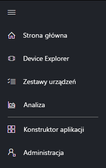
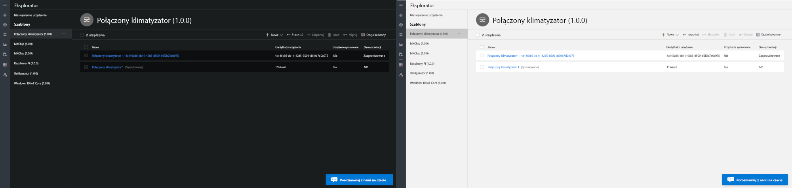
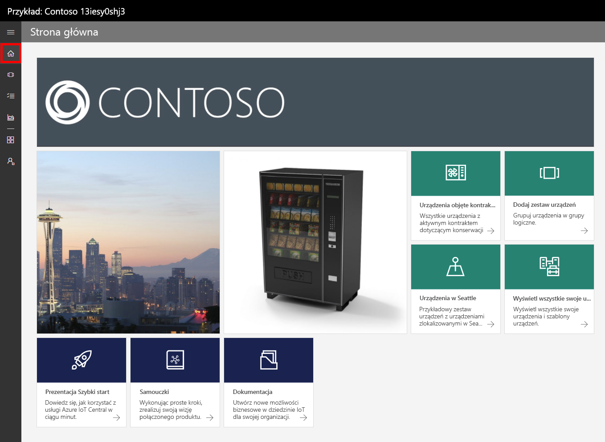
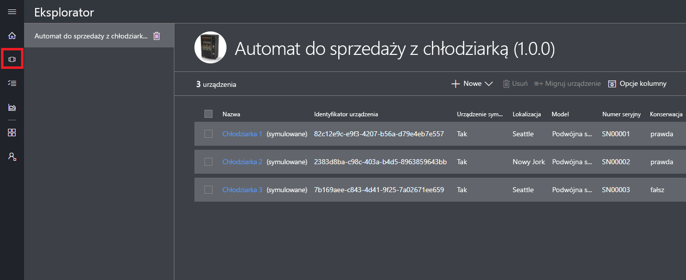
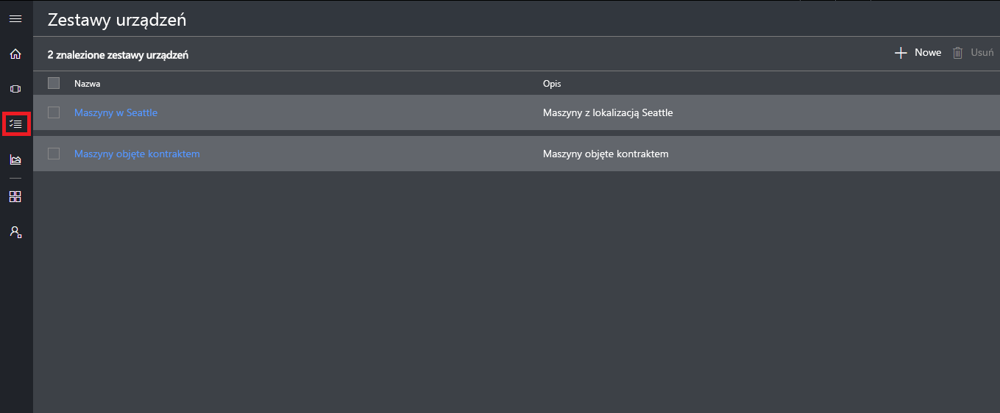
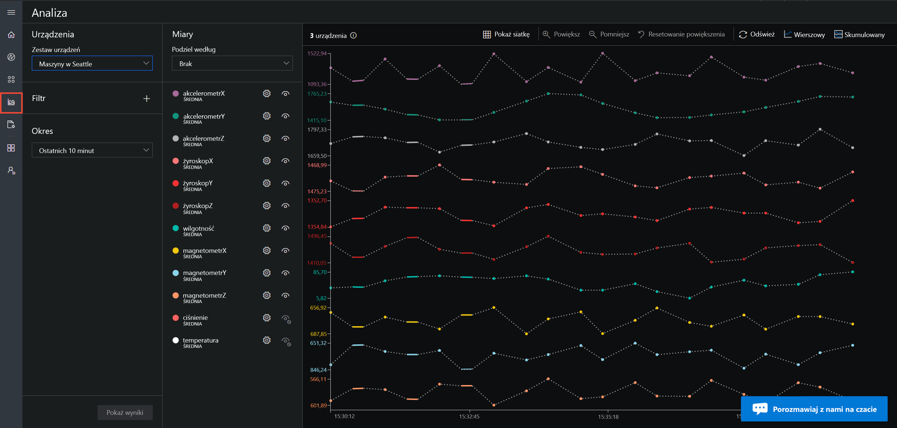
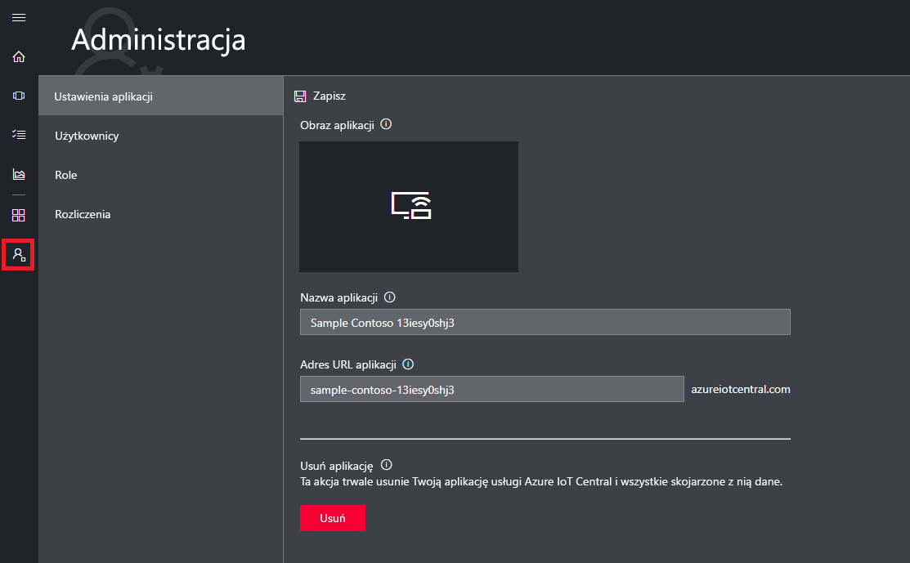

# Przewodnik po interfejsie użytkownika usługi Azure IoT Central

[!INCLUDE [iot-central-original-pnp](../../includes/iot-central-original-pnp-note.md)]

W tym artykule przedstawiono wprowadzenie do interfejsu użytkownika usługi Microsoft Azure IoT Central. Interfejs użytkownika umożliwia tworzenie i używanie rozwiązania usługi Azure IoT Central oraz jego połączonych urządzeń, a także zarządzanie nimi.

_Konstruktor_ używa interfejsu użytkownika usługi Azure IoT Central, aby zdefiniować rozwiązanie usługi Azure IoT Central. Interfejs użytkownika umożliwia wykonywanie następujących zadań:

- Definiowanie typów urządzeń łączących się z rozwiązaniem
- Konfigurowanie reguł i akcji dla urządzeń
- Dostosowywanie interfejsu użytkownika dla _operatora_ używającego rozwiązania

_Operator_ używa interfejsu użytkownika usługi Azure IoT Central, aby zarządzać rozwiązaniem usługi Azure IoT Central. Interfejs użytkownika umożliwia wykonywanie następujących zadań:

- Monitorowanie urządzeń
- Konfigurowanie urządzeń
- Rozwiązywanie i korygowanie problemów z urządzeniami
- Aprowizacja nowych urządzeń.

## Używanie lewego menu nawigacji

Użyj menu nawigacji po lewej stronie, aby uzyskać dostęp do różnych obszarów aplikacji. Można rozwinąć lub zwinąć pasek nawigacyjny, wybierając **<** lub: **>**

:::row:::
  :::column span="":::
      
  :::column-end:::
  :::column span="2":::
     **Pulpit nawigacyjny** wyświetla pulpit nawigacyjny aplikacji. Jako Konstruktor możesz dostosować pulpit nawigacyjny dla operatorów. Użytkownicy mogą również tworzyć własne pulpity nawigacyjne.
    
     **Device Explorer** przedstawia symulowane i rzeczywiste urządzenia skojarzone z każdym szablonem urządzenia w aplikacji. Operator używa narzędzia **Device Explorer**, aby zarządzać połączonymi urządzeniami.
    
     **Zestawy urządzeń** umożliwiają wyświetlanie i tworzenie zestawów urządzeń. Operator może tworzyć zestawy urządzeń w formie logicznych zbiorów urządzeń określonych w zapytaniu.
    
     **Analiza** przedstawia analizę pochodzącą od danych telemetrycznych urządzeń dla urządzeń i zestawów urządzeń. Operator może tworzyć widoki niestandardowe na podstawie danych urządzenia w celu uzyskania szczegółowych informacji z aplikacji.
    
     **Zadania** umożliwiają zbiorcze zarządzanie urządzeniami przez tworzenie i uruchamianie zadań w celu przeprowadzania aktualizacji w odpowiedniej skali.
    
     **Szablony urządzeń** pokazują narzędzia, których Konstruktor używa do tworzenia szablonów urządzeń i zarządzania nimi.
    
     **Ciągły eksport danych** umożliwia administratorowi skonfigurowanie ciągłego eksportowania do innych usług platformy Azure, takich jak magazyn i kolejki.
    
     **Administracja** pokazuje strony administrowania aplikacjami, na których administrator może zarządzać ustawieniami, użytkownikami i rolami aplikacji.
   :::column-end:::
:::row-end:::

## Wyszukiwanie, pomoc i pomoc techniczna

Górne menu jest wyświetlane na każdej stronie:

- Aby wyszukać szablony urządzeń i urządzenia, wprowadź wartość **wyszukiwania** .
- Aby zmienić język lub motyw interfejsu użytkownika, wybierz ikonę **Ustawienia** .
- Aby wylogować się z aplikacji, wybierz ikonę **konta** .
- Aby uzyskać pomoc i pomoc techniczną, wybierz pozycję rozwijaną **Pomoc**, aby uzyskać listę zasobów. W przypadku wersji próbnej, zasoby pomocy technicznej obejmują dostęp do [rozmowy na żywo](howto-show-hide-chat.md).

Możesz wybrać jasny lub ciemny motyw interfejsu użytkownika:

> [!NOTE]
> Opcja wyboru między jasnym i ciemnym motywem nie jest dostępna, jeśli administrator skonfigurował niestandardowy motyw dla aplikacji.

## Pulpit nawigacyjny

* Pulpit nawigacyjny to pierwsza strona wyświetlana podczas logowania do aplikacji IoT Central platformy Azure. Jako Konstruktor możesz dostosować pulpit nawigacyjny aplikacji dla innych użytkowników, dodając kafelki. Więcej informacji można znaleźć w samouczku [Customize the Azure IoT Central operator's view (Dostosowywanie widoku operatora usługi Azure IoT Central)](tutorial-customize-operator.md).

* Jako operator można tworzyć spersonalizowane pulpity nawigacyjne i przełączać się między nimi a domyślnym pulpitem nawigacyjnym. Aby dowiedzieć się więcej, zobacz artykuł [Tworzenie osobistych pulpitów nawigacyjnych i zarządzanie nimi](howto-personalize-dashboard.md) .

## Device Explorer

Na stronie eksploratora są wyświetlane _urządzenia_ w aplikacji usługi Azure IoT Central pogrupowane według _szablonu urządzeń_.

* Szablon urządzenia definiuje typ urządzenia, który może łączyć się z aplikacją. Aby dowiedzieć się więcej, zobacz [Define a new device type in your Azure IoT Central application (Definiowanie nowego typu urządzenia w aplikacji usługi Azure IoT Central)](tutorial-define-device-type.md).
* Urządzenie reprezentuje rzeczywiste lub symulowane urządzenie w aplikacji. Aby dowiedzieć się więcej, zobacz [Add a new device to your Azure IoT Central application (Dodawanie nowego urządzenia do aplikacji usługi Azure IoT Central)](tutorial-add-device.md).

## Zestawy urządzeń

Na stronie _Zestawy urządzeń_ są wyświetlane zestawy urządzeń utworzone przez konstruktora. Zestaw urządzeń to zbiór pokrewnych urządzeń. Konstruktor definiuje zapytanie, aby zidentyfikować urządzenia w zestawie urządzeń. Zestawy urządzeń są używane podczas dostosowywania analizy w aplikacji. Aby dowiedzieć się więcej, zobacz artykuł [Use device sets in your Azure IoT Central application (Używanie zestawów urządzeń w aplikacji usługi Azure IoT Central)](howto-use-device-sets.md).

## Analiza

Strona analizy przedstawia wykresy, które ułatwiają zrozumienie zachowania urządzeń połączonych z aplikacją. Operator używa tej strony do monitorowania i badania problemów z połączonymi urządzeniami. Konstruktor może zdefiniować wykresy wyświetlane na tej stronie. Aby dowiedzieć się więcej, zobacz artykuł [Create custom analytics for your Azure IoT Central application (Tworzenie niestandardowej analizy dla aplikacji usługi Azure IoT Central)](howto-use-device-sets.md).

## Zadania

Strona zadania umożliwia uruchamianie zbiorczych operacji zarządzania urządzeniami na urządzeniach. Konstruktor używa tej strony do aktualizowania właściwości urządzeń, ustawień i poleceń. Aby dowiedzieć się więcej, zobacz artykuł [Uruchamianie zadania](howto-run-a-job.md).

## Szablony urządzeń

Na stronie szablonów urządzeń konstruktor tworzy szablony urządzeń w aplikacji i zarządza nimi. Szablon urządzenia określa charakterystykę urządzenia, taką jak:

- Pomiary danych telemetrycznych, stanowych i zdarzeń.
- Ustawienia i właściwości.
- Polecenia.
- Reguły oparte na zdarzeniach lub wartościach telemetrii.

Aby dowiedzieć się więcej, zobacz samouczek [Define a new device type in your Azure IoT Central application (Definiowanie nowego typu urządzenia w aplikacji usługi Azure IoT Central)](tutorial-define-device-type.md).

## Ciągły eksport danych

Na stronie Eksport danych ciągłych administrator definiuje sposób przesyłania strumieniowego danych, takich jak dane telemetryczne z aplikacji. Inne usługi mogą zapisywać wyeksportowane dane lub poddawać je analizie. Aby dowiedzieć się więcej, zobacz artykuł [Eksportowanie danych do usługi Azure IoT Central](howto-export-data.md).

## Administracja

Strona Administracja zawiera linki do narzędzi używanych przez administratora, takich jak definiowanie użytkowników i ról w aplikacji oraz dostosowywanie interfejsu użytkownika. Aby dowiedzieć się więcej, zobacz artykuł [Administer your Azure IoT Central application (Administrowanie aplikacją usługi Azure IoT Central)](howto-administer.md).

## Następne kroki

Po zapoznaniu się z omówieniem usługi Azure IoT Central i układem interfejsu użytkownika następnym sugerowanym krokiem jest wykonanie przewodnika Szybki start [Create an Azure IoT Central application (Tworzenie aplikacji usługi Azure IoT Central)](quick-deploy-iot-central.md).
