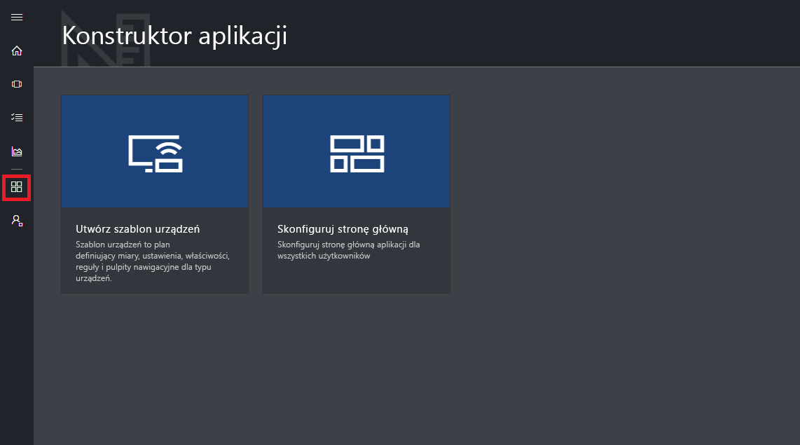

# Przewodnik po interfejsie użytkownika usługi Azure IoT Central

W tym artykule przedstawiono wprowadzenie do interfejsu użytkownika usługi Microsoft Azure IoT Central. Interfejs użytkownika umożliwia tworzenie i używanie rozwiązania usługi Azure IoT Central oraz jego połączonych urządzeń, a także zarządzanie nimi.

_Konstruktor_ używa interfejsu użytkownika usługi Azure IoT Central, aby zdefiniować rozwiązanie usługi Azure IoT Central. Interfejs użytkownika umożliwia wykonywanie następujących zadań:

- Definiowanie typów urządzeń łączących się z rozwiązaniem
- Konfigurowanie reguł i akcji dla urządzeń
- Dostosowywanie interfejsu użytkownika dla _operatora_ używającego rozwiązania

_Operator_ używa interfejsu użytkownika usługi Azure IoT Central, aby zarządzać rozwiązaniem usługi Azure IoT Central. Interfejs użytkownika umożliwia wykonywanie następujących zadań:

- Monitorowanie urządzeń
- Konfigurowanie urządzeń
- Rozwiązywanie i korygowanie problemów z urządzeniami
- Aprowizacja nowych urządzeń.

[!INCLUDE [iot-central-experimental-note](../../includes/iot-central-experimental-note.md)]

## Używanie lewego menu nawigacji

Lewe menu nawigacji umożliwia uzyskiwanie dostępu do różnych obszarów aplikacji:

| Menu | Opis |
| ---- | ----------- |
|  | <ul><li>Przycisk **Strona główna** umożliwia wyświetlenie strony głównej aplikacji. Konstruktor może dostosować tę stronę główną dla operatorów.</li><li>Przycisk **Device Explorer** umożliwia wyświetlenie szablonów urządzeń zdefiniowanych w aplikacji oraz symulowanych i rzeczywistych urządzeń skojarzonych z poszczególnymi szablonami urządzeń. Operator używa narzędzia **Device Explorer**, aby zarządzać połączonymi urządzeniami.</li><li>Przycisk **Zestawy urządzeń** umożliwia wyświetlenie i tworzenie zestawów urządzeń. Operator może tworzyć zestawy urządzeń w formie logicznych zbiorów urządzeń określonych w zapytaniu.</li><li>Przycisk **Analiza** umożliwia wyświetlenie analiz na podstawie danych telemetrycznych urządzeń i zestawów urządzeń. Operator może tworzyć widoki niestandardowe na podstawie danych urządzenia w celu uzyskania szczegółowych informacji z aplikacji.</li><li>Przycisk **Zadania** umożliwia zbiorcze zarządzanie urządzeniami przez tworzenie i uruchamianie zadań przeprowadzających aktualizacje w dużej skali.</li><li>Przycisk **Konstruktor aplikacji** umożliwia wyświetlenie narzędzi używanych przez konstruktora, takich jak **Utwórz szablon urządzenia**.</li><li>Przycisk **Administracja** umożliwia wyświetlenie stron administracyjnych aplikacji, na których administrator może zarządzać użytkownikami, rolami i ustawieniami aplikacji.</li></ul> |

## Wyszukiwanie, pomoc i pomoc techniczna

Górne menu jest wyświetlane na każdej stronie:

- Aby wyszukać szablony urządzeń i urządzenia, wybierz ikonę **Wyszukiwanie**.
- Aby uzyskać pomoc i pomoc techniczną, wybierz pozycję rozwijaną **Pomoc**, aby uzyskać listę zasobów.
- Aby kontrolować samouczki, zmienić motyw interfejsu użytkownika lub wylogować się z aplikacji, wybierz ikonę **Konto**.

Możesz wybrać jasny lub ciemny motyw interfejsu użytkownika:

## Strona główna

Strona główna jest pierwszą stroną widoczną po zalogowaniu się do aplikacji usługi Azure IoT Central. Konstruktor może dostosować stronę główną dla innych użytkowników aplikacji przez dodanie kafelków. Więcej informacji można znaleźć w samouczku [Customize the Azure IoT Central operator's view (Dostosowywanie widoku operatora usługi Azure IoT Central)](tutorial-customize-operator.md).

## Device Explorer

Na stronie eksploratora są wyświetlane _szablony urządzeń_ i _urządzenia_ w aplikacji usługi Azure IoT Central.

* Szablon urządzenia definiuje typ urządzenia, który może łączyć się z aplikacją. Aby dowiedzieć się więcej, zobacz [Define a new device type in your Azure IoT Central application (Definiowanie nowego typu urządzenia w aplikacji usługi Azure IoT Central)](tutorial-define-device-type.md).
* Urządzenie reprezentuje rzeczywiste lub symulowane urządzenie w aplikacji. Aby dowiedzieć się więcej, zobacz [Add a new device to your Azure IoT Central application (Dodawanie nowego urządzenia do aplikacji usługi Azure IoT Central)](tutorial-add-device.md).

## Zestawy urządzeń

Na stronie _Zestawy urządzeń_ są wyświetlane zestawy urządzeń utworzone przez konstruktora. Zestaw urządzeń to zbiór pokrewnych urządzeń. Konstruktor definiuje zapytanie, aby zidentyfikować urządzenia w zestawie urządzeń. Zestawy urządzeń są używane podczas dostosowywania analizy w aplikacji. Aby dowiedzieć się więcej, zobacz artykuł [Use device sets in your Azure IoT Central application (Używanie zestawów urządzeń w aplikacji usługi Azure IoT Central)](howto-use-device-sets.md).

## Analiza

Strona analizy przedstawia wykresy, które ułatwiają zrozumienie zachowania urządzeń połączonych z aplikacją. Operator używa tej strony do monitorowania i badania problemów z połączonymi urządzeniami. Konstruktor może zdefiniować wykresy wyświetlane na tej stronie. Aby dowiedzieć się więcej, zobacz artykuł [Create custom analytics for your Azure IoT Central application (Tworzenie niestandardowej analizy dla aplikacji usługi Azure IoT Central)](howto-create-analytics.md).

## Stanowiska

Strona zadań umożliwia wykonywanie zbiorczych operacji zarządzania urządzeniami na Twoich urządzeniach. Konstruktor używa tej strony do aktualizowania właściwości urządzeń, ustawień i poleceń. Aby dowiedzieć się więcej, zobacz artykuł [Uruchamianie zadania](howto-run-a-job.md).

## Konstruktor aplikacji

Strona konstruktora aplikacji zawiera linki do narzędzi używanych przez konstruktora do tworzenia aplikacji usługi Azure IoT Central, takich jak tworzenie szablonów urządzeń oraz konfigurowanie strony głównej. Aby dowiedzieć się więcej, zobacz samouczek [Define a new device type in your Azure IoT Central application (Definiowanie nowego typu urządzenia w aplikacji usługi Azure IoT Central)](tutorial-define-device-type.md).

## Administracja

Strona administracji zawiera linki do narzędzi używanych przez administratora, takich jak definiowanie użytkowników i ról w aplikacji. Aby dowiedzieć się więcej, zobacz artykuł [Administer your Azure IoT Central application (Administrowanie aplikacją usługi Azure IoT Central)](howto-administer.md).

## Następne kroki

Po zapoznaniu się z omówieniem usługi Azure IoT Central i układem interfejsu użytkownika następnym sugerowanym krokiem jest wykonanie przewodnika Szybki start [Create an Azure IoT Central application (Tworzenie aplikacji usługi Azure IoT Central)](quick-deploy-iot-central.md).