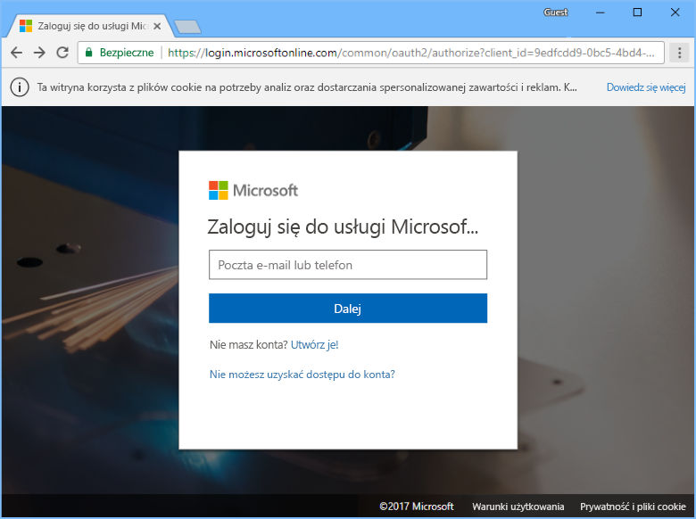
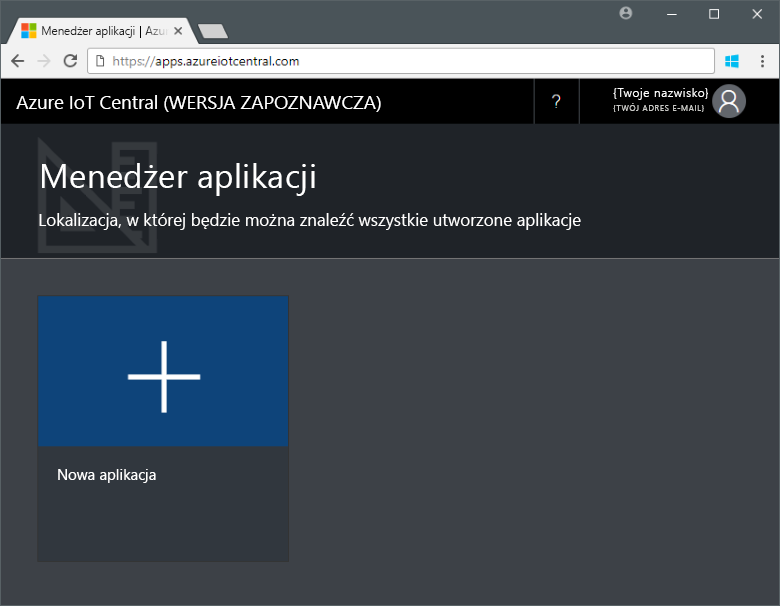
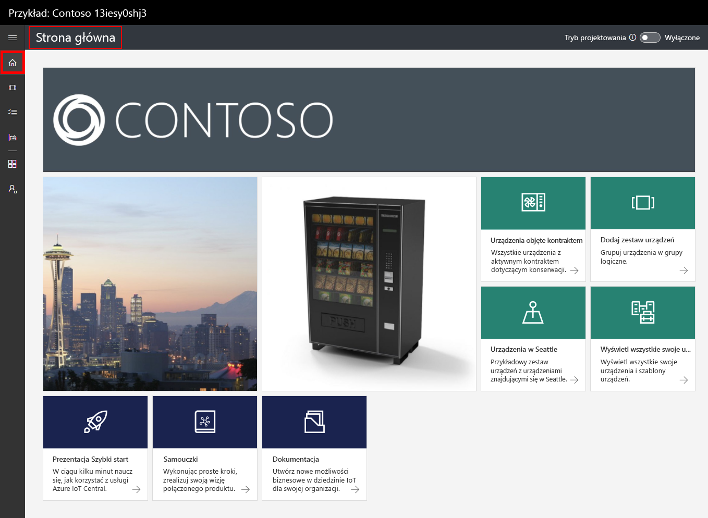
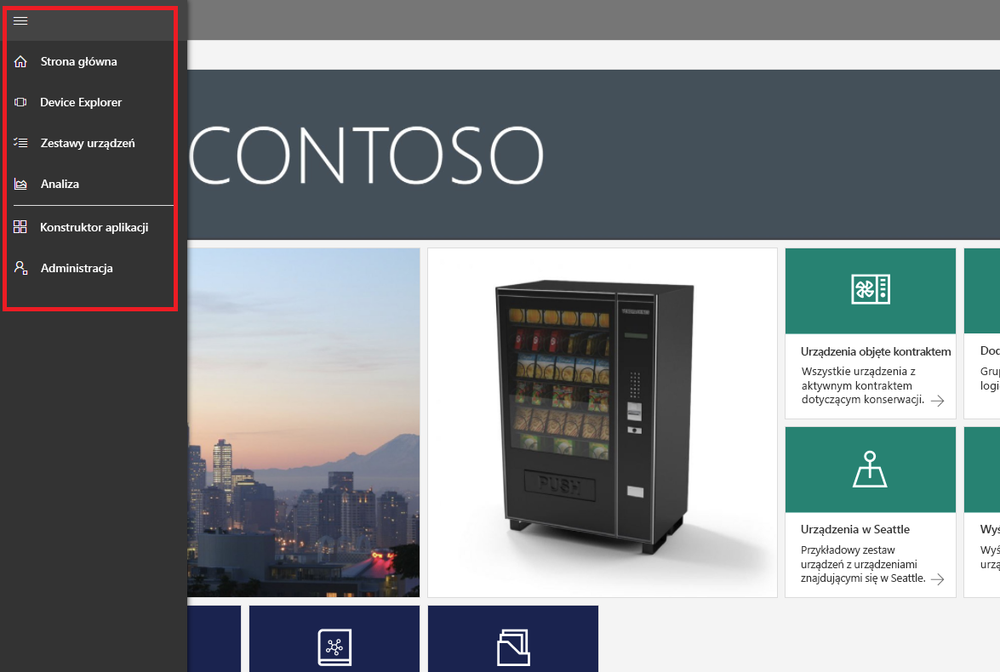
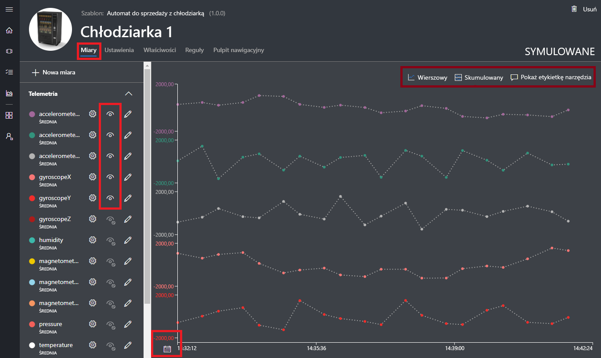
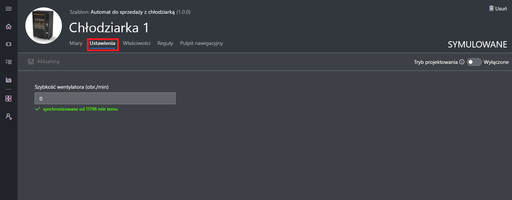
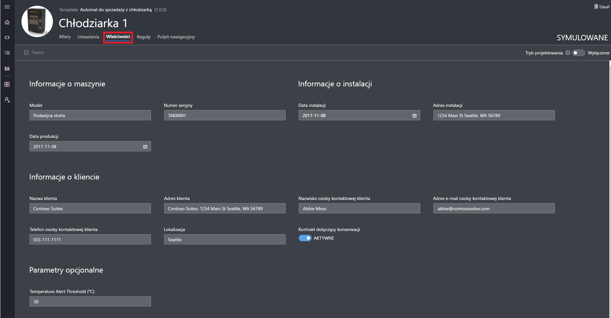
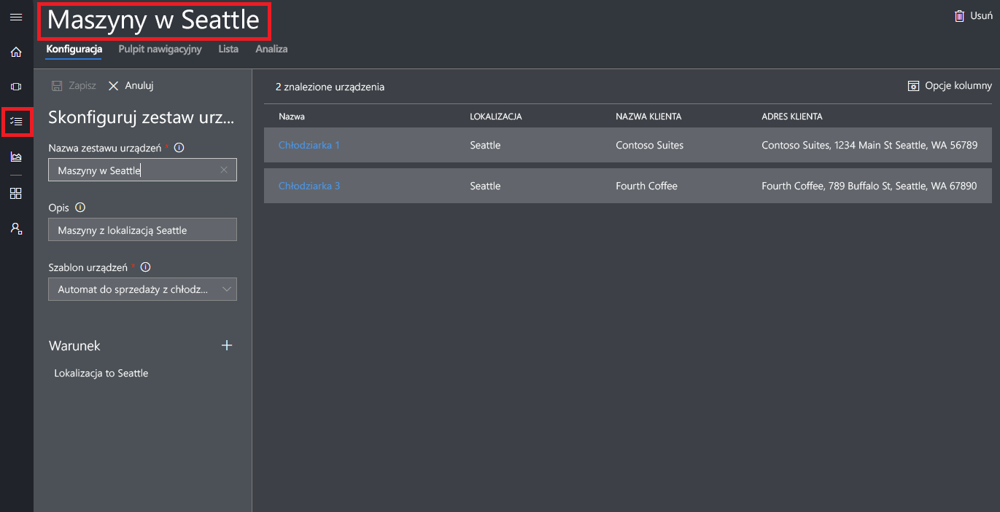
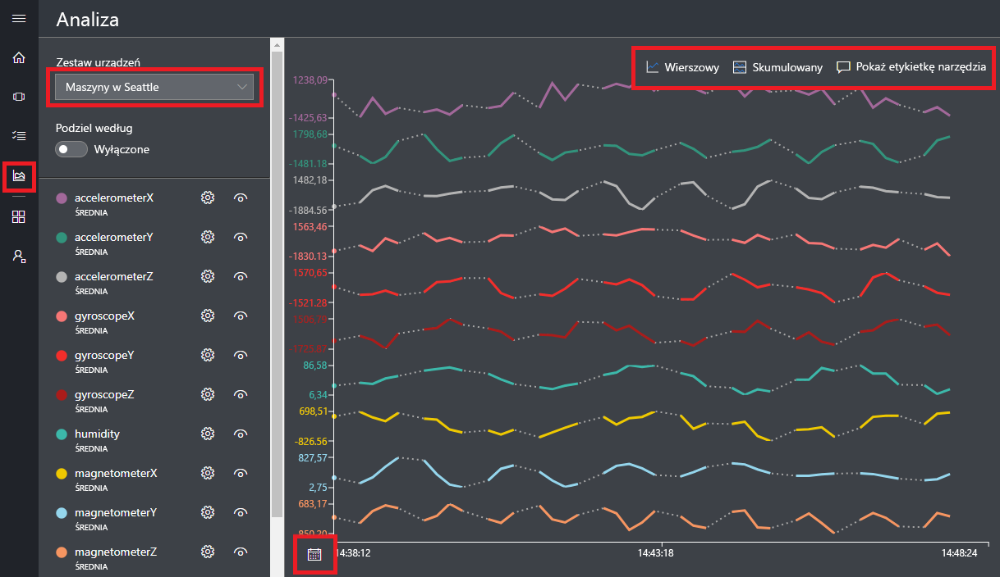

# Tworzenie aplikacji usługi Azure IoT Central

Jako _konstruktor_ użyjesz interfejsu użytkownika usługi Azure IoT Central w celu zdefiniowania aplikacji usługi Microsoft Azure IoT Central. W tym przewodniku szybkiego startu przedstawiono sposób wykonywania następujących czynności:

- Tworzenie aplikacji usługi Azure IoT Central zawierającej przykładowy _szablon urządzenia_ i symulowane _urządzenia_.
- Wyświetlenie funkcji szablonu urządzenia **Chłodniczy automat do sprzedaży** w aplikacji.
- Wyświetlenie danych telemetrycznych i analitycznych z symulowanych urządzeń **Chłodziarka**.

W tym przewodniku Szybki start wyświetlisz symulowane urządzenie **Chłodziarka** z szablonu urządzenia. Urządzenie symulowane:

* Wysyła do aplikacji dane telemetryczne, takie jak temperatura i ciśnienie.
* Raportuje do aplikacji wartości właściwości urządzenia, takie jak alert o ruchu.
* Obsługuje ustawienia urządzeń, takie jak szybkość wentylatora, które można ustawić w aplikacji.

Aby umożliwić przetestowanie aplikacji przed podłączeniem rzeczywistego urządzenia, usługa Azure IoT Central generuje symulowane urządzenie na podstawie szablonu urządzenia podczas jego tworzenia.

## Tworzenie aplikacji

Aby ukończyć ten przewodnik Szybki start, musisz utworzyć aplikację usługi Azure IoT Central na podstawie szablonu aplikacji **Przykład Contoso**.

Przejdź na stronę [Menedżer aplikacji](https://aka.ms/iotcentral) usługi Azure IoT Central. Następnie podaj adres e-mail i hasło umożliwiające dostęp do subskrypcji platformy Azure:

Aby rozpocząć tworzenie nowej aplikacji usługi Azure IoT Central, wybierz pozycję **Nowa aplikacja**:

Aby utworzyć nową aplikację usługi Azure IoT Central:

1. Wybierz plan płatności **Bezpłatna wersja próbna aplikacji**.
1. Wybierz przyjazną nazwę aplikacji, na przykład **Contoso IoT**. Usługa Azure IoT Central wygeneruje unikatowy prefiks adresu URL. Ten prefiks adresu URL możesz zmienić na łatwiejszy do zapamiętania.
1. Wybierz szablon aplikacji **Przykład Contoso**.
1. Następnie wybierz pozycję **Utwórz**.

## Nawigowanie do aplikacji

Gdy aplikacja będzie gotowa, zostanie wyświetlona jej **Strona główna**. W prawym górnym rogu ekranu znajduje się przełącznik _Tryb projektowania_ umożliwiający edycję Strony głównej. Adresem URL aplikacji jest adres URL określony w poprzednim kroku:

_Lewe menu nawigacji_ umożliwia uzyskiwanie dostępu do różnych obszarów nowej aplikacji usługi Azure IoT Central:

Aby w aplikacji wyświetlić szablony urządzeń i urządzenia, wybierz pozycję **Device Explorer** w menu nawigacji po lewej stronie. Przykładowa aplikacja zawiera szablon urządzenia **Chłodniczy automat do sprzedaży**. Na podstawie tego szablonu urządzenia utworzono już trzy urządzenia symulowane:

## Wyświetlanie szablonu urządzenia i urządzeń

Wykonaj następujące kroki, aby wyświetlić urządzenie chłodnicze, które zostało utworzone na podstawie szablonu urządzenia **Chłodniczy automat do sprzedaży**. Szablon urządzenia definiuje następujące elementy:

* _Miary_, takie jak dane telemetryczne temperatury, wysyłane z urządzenia.
* _Ustawienia_, takie jak szybkość wentylatora, które umożliwiają sterowanie urządzeniem.
* _Właściwości_, takie jak numer seryjny, w których przechowuje się informacje o urządzeniu.
* [Reguły](howto-create-telemetry-rules.md) umożliwiające zautomatyzowanie akcji na podstawie zachowania urządzenia.
* Możliwy do dostosowania _pulpit nawigacyjny_ wyświetlający informacje o urządzeniu.

Na podstawie szablonu urządzenia można tworzyć zarówno symulowane, jak i rzeczywiste urządzenia.

### Miary

Poniżej przedstawiono stronę **Miary** dla urządzenia **Chłodziarka 1**. Widać na niej listę pomiarów wysłanych z symulowanego urządzenia. Na tej stronie wyświetlany jest również możliwy do dostosowania wykres widocznych pomiarów:

Możesz przełączyć widoczność poszczególnych elementów i dostosować wykres. Bieżący wykres przedstawia dane telemetryczne z symulowanego urządzenia. Jeśli masz odpowiednie uprawnienia, możesz dodać nowe miary do szablonu urządzenia.

> [!NOTE]
> Może okazać się konieczne odczekanie kilku chwil, zanim dane symulowanego urządzenia pojawią się na wykresie.

### Ustawienia

Wybierz pozycję **Ustawienia**. Na stronie **Ustawienia** możesz sterować urządzeniem. Na przykład możesz zaktualizować szybkość wentylatora chłodziarki:

Ustawienie będzie pokazywane jako **zsynchronizowane**, kiedy urządzenie potwierdzi zmianę.

### Właściwości

Wybierz pozycję **Właściwości**. Na stronie **Właściwości** możesz wykonywać następujące czynności:

* Przechowywać informacje o urządzeniu, na przykład nazwę klienta.
* Wyświetlać wartości właściwości zgłaszane przez urządzenie, na przykład alert o ruchu.

### Pulpit nawigacyjny

Wybierz pozycję **Pulpit nawigacyjny**. Pulpit nawigacyjny to możliwy do dostosowania widok informacji o urządzeniu, takich jak miary, właściwości i wskaźniki KPI:

## Wyświetlanie analiz

W poprzedniej sekcji pokazano sposób wyświetlania informacji dotyczących poszczególnych urządzeń. Aby wyświetlić skonsolidowane informacje z wielu urządzeń, można użyć [zestawów urządzeń](howto-use-device-sets.md) i [analiz](howto-create-analytics.md).

Zestaw urządzeń używa zapytania, aby dynamicznie wybrać zbiór urządzeń, które spełniają jakieś kryterium. Na przykład zestaw urządzeń **Automaty w Seattle** wybiera chłodziarki znajdujące się w Seattle. Aby wyświetlić zestaw urządzeń **Automaty w Seattle**, w menu nawigacji po lewej stronie wybierz pozycję **Zestawy urządzeń**, a następnie wybierz zestaw **Automaty w Seattle**:

Dane analityczne urządzeń znajdujących się w zestawie urządzeń można wyświetlić na stronie **Analiza**:

## Następne kroki

W tym przewodniku Szybki start utworzono wstępnie wypełnioną aplikację usługi Azure IoT Central, która zawiera szablon urządzenia **Chłodniczy automat do sprzedaży** oraz symulowane urządzenie. Zobacz [Define a new device template in your application](tutorial-define-device-type.md) (Definiowanie nowego szablonu urządzenia w aplikacji), aby dowiedzieć się więcej (jako konstruktor) na temat definiowania własnych szablonów urządzeń.
